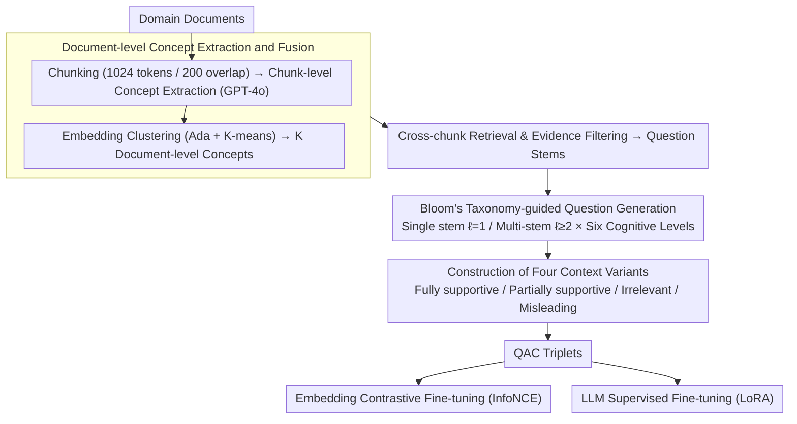

# Domain-Specific Data Generation Framework for RAG Adaptation

**Conference**: ACL 2026  
**arXiv**: [2510.11217](https://arxiv.org/abs/2510.11217)  
**Code**: None  
**Area**: Information Retrieval / RAG  
**Keywords**: RAG Adaptation, Data Generation, Domain-Specific, Embedding Fine-tuning, Bloom's Taxonomy

## TL;DR

This paper proposes RAGen, a scalable and modular data generation framework. By performing document-level concept extraction, multi-chunk evidence assembly, and Bloom's taxonomy-guided question generation, RAGen automatically synthesizes domain-specific QAC (Question-Answer-Context) data. It supports contrastive fine-tuning for embedding models and supervised fine-tuning for LLMs, significantly outperforming AutoRAG and LlamaIndex baselines across three domain datasets.

## Background & Motivation

**Background**: Retrieval-Augmented Generation (RAG) has become the mainstream solution for integrating LLMs into domain-specific workflows by providing contextual information through external retrieval. However, directly applying general RAG pipelines to new domains often results in suboptimal performance.

**Limitations of Prior Work**: (1) General retrievers and generators are not aligned with domain-specific terminology and data distributions; (2) RAG adaptation requires high-quality domain-specific training data, which is expensive to annotate manually; (3) Existing data generation methods (e.g., AutoRAG, LlamaIndex) rely on a single-chunk question generation paradigm—generating questions from a single text chunk—resulting in superficial, localized questions lacking cross-concept reasoning; (4) Methods like RAFT optimize for single components and are tightly coupled with specific training paradigms.

**Key Challenge**: The critical bottleneck for RAG adaptation is not the model architecture or training objectives, but the upstream data supply—specifically, the lack of high-quality, cross-concept, multi-level cognitive domain-specific training data.

**Goal**: Design a data-centric framework to automatically generate high-quality QAC datasets from raw documents for multi-component RAG adaptation (Embedding models + LLMs).

**Key Insight**: Start from document-level concepts (rather than single chunks), assemble cross-chunk evidence to form "question stems," and use Bloom's taxonomy to guide the generation of questions at different cognitive levels, finally pairing them with carefully constructed positive, negative, and misleading contexts.

**Core Idea**: High-quality RAG training data should be cross-concept, cross-chunk, and multi-level in cognition, rather than mechanically generated shallow QA pairs from single text chunks.

## Method

### Overall Architecture

RAGen decomposes the process of "creating high-quality RAG training data from raw documents" into three sequential stages: first, distilling cross-chunk document-level concepts from domain documents; second, retrieving and filtering evidence across chunks around each concept to assemble "question stems"; and finally, using Bloom's taxonomy to guide the generation of multi-level cognitive questions based on these stems, pairing each question with four context variants of differing support levels. The pipeline takes raw domain documents as input, produces concepts and evidence as intermediate products, and outputs QAC triplets ready for embedding contrastive fine-tuning and LLM supervised fine-tuning.

### Key Designs

**1. Document-level Concept Extraction and Fusion: Aggregating Local Chunk Concepts into Global Anchors**

Generating questions directly from individual text chunks restricts the content to limited scopes, making it inherently shallow. RAGen first partitions documents into chunks of 1024 tokens with 200-token overlaps, extracts chunk-level concepts using ChatGPT-4o, and then vectorizes these concepts using OpenAI Ada embeddings. K-means clustering is applied to fuse these into $K$ document-level concepts, with the concepts closest to the centroids serving as representatives. These resulting concepts are no longer tied to specific chunks but act as cross-chunk high-level semantic themes, providing global anchors for "cross-chunk question generation."

**2. Bloom's Taxonomy-guided Question Generation: Elevating Cognitive Levels**

Questions generated by single-chunk methods mostly stay at low-level cognitive stages like Memory and Understanding, lacking cross-concept reasoning. RAGen explicitly uses the six levels of the Revised Bloom's Taxonomy (Remember → Understand → Apply → Analyze → Evaluate → Create) as constraints for question types. It supports two input granularities: single stem ($\ell=1$) using evidence from one concept, and multi-stem combination ($\ell \geq 2$) feeding combined evidence from multiple concepts to force cross-concept questions. To handle the combinatorial explosion of multi-stems, a truncation limit is set. These constraints and combinations significantly increase the proportion of deep questions involving analysis, evaluation, and creation.

**3. Construction of Four Context Variants: Hardening Negative Samples**

Using randomly sampled chunks as negative samples results in a loose discriminative boundary for the retriever. RAGen pairs each QA pair with four types of context: Fully Supportive (evidence that directly answers the question), Partially Supportive (incomplete information requiring cross-evidence reasoning), Irrelevant (same domain but unrelated content), and Misleading (thematically related but semantically insufficient to support the answer, similar to distractors in reading comprehension). The misleading contexts leverage the idea of distractors to create difficult negative cases at the semantic level, training retrievers to be more robust and sensitive to semantic nuances.

### Loss & Training

Embedding fine-tuning utilizes the InfoNCE contrastive loss with a learning rate of 1e-5, 3 epochs, temperature $\tau=0.02$, and 2 negative samples per pair. LLM fine-tuning employs LoRA for supervised fine-tuning (Qwen2.5-1.5B/3B) with a learning rate of 1e-5, 5 epochs, and a 10% validation split. Both are implemented on 4×RTX 3090.

## Key Experimental Results

### Main Results

**Embedding Model Retrieval Performance (BGE-large-v1.5, Average over 3 Domains)**

| Training Data | R@1 | R@5 | R@10 | MRR@10 |
|---------|-----|-----|------|--------|
| Vanilla (No Fine-tuning) | 0.153 | 0.411 | 0.534 | 0.263 |
| AutoRAG | 0.190 | 0.517 | 0.655 | 0.330 |
| LlamaIndex | 0.204 | 0.539 | 0.671 | 0.346 |
| **RAGen** | **0.333** | **0.716** | **0.828** | **0.497** |

### Ablation Study

**LLM Fine-tuning Performance (Qwen2.5-1.5B, ROUGE-L)**

| Domain | AutoRAG | LlamaIndex | RAGen |
|------|---------|------------|-------|
| PPFS | 0.288 | 0.329 | **0.396** |
| TradePolicy | 0.278 | 0.270 | **0.391** |
| BusinessAI | 0.270 | 0.269 | **0.339** |

**Distribution of Cognitive Levels Comparison**

| Method | Remember+Understand (Low) | Analyze+Evaluate+Create (High) |
|------|-----------------|---------------------|
| LlamaIndex | ~70% | ~15% |
| AutoRAG | ~65% | ~20% |
| RAGen | ~30% | ~50% |

### Key Findings

- RAGen significantly outperforms baselines in embedding retrieval—R@1 is approximately 63% higher than LlamaIndex (0.333 vs. 0.204), proving the superiority of cross-concept data generation.
- RAGen consistently achieves the highest ROUGE-L in LLM fine-tuning (+20-40% relative gain), suggesting data quality is equally critical for the generation component.
- Questions generated by RAGen exhibit higher cognitive levels—high-level questions (Analyze/Evaluate/Create) account for 50%, compared to 15-20% for baselines.
- The inclusion of misleading contexts significantly improves retrieval robustness compared to using only random negative samples.
- Multi-stem combinations ($\ell \geq 2$) generate cross-concept questions requiring deeper reasoning, which is the core source of RAGen's data quality advantage.

## Highlights & Insights

- A data-centric approach to RAG adaptation—improving performance maximally by optimizing training data rather than model architecture.
- Bloom's taxonomy-guided question generation is a transferable methodology applicable to any educational or evaluative data generation scenario.
- The design of four context variants (especially misleading contexts) draws inspiration from distractors in reading comprehension tasks.

## Limitations & Future Work

- Concept extraction and question generation rely on ChatGPT-4o, which is costly and limited by the model's inherent capabilities.
- Validation was performed on only three relatively small-scale domain datasets; widespread testing in large-scale industrial scenarios is missing.
- Direct comparison with end-to-end RAG adaptation methods like RAFT is not included.
- Cross-document reasoning (concept combinations from different documents for $\ell \geq 2$) has not been fully explored.

## Related Work & Insights

- **vs RAFT**: RAFT focuses on distractor-aware fine-tuning for generators, whereas RAGen provides a general data generation framework supporting multi-component adaptation.
- **vs AutoRAG/LlamaIndex**: These methods are based on a single-chunk generation paradigm; RAGen's cross-concept multi-stem design represents a fundamental Shift.
- **vs RAGEval/RAGAS**: These frameworks are used for evaluating RAG systems, while RAGen is explicitly oriented toward generating training data for RAG adaptation.

## Rating

- Novelty: ⭐⭐⭐⭐ The data generation paradigm using document-level concepts, Bloom's taxonomy, and multi-stem combinations is both novel and practical.
- Experimental Thoroughness: ⭐⭐⭐⭐ Covered three domains, three embedding models, and two LLMs with thorough ablations, though the scale is limited.
- Writing Quality: ⭐⭐⭐⭐ The methodology is described clearly and systematically with intuitive illustrations.
- Value: ⭐⭐⭐⭐ Provides a practical data generation solution for domain adaptation in RAG.

<!-- RELATED:START -->

## Related Papers

- [\[ACL 2025\] On Synthetic Data Strategies for Domain-Specific Generative Retrieval](../../ACL2025/information_retrieval/on_synthetic_data_strategies_for_domain-specific_generative_retrieval.md)
- [\[ACL 2026\] More Than Efficiency: Embedding Compression Improves Domain Adaptation in Dense Retrieval](more_than_efficiency_embedding_compression_improves_domain_adaptation_in_dense_r.md)
- [\[ACL 2026\] UnIte: Uncertainty-based Iterative Document Sampling for Domain Adaptation in Information Retrieval](unite_uncertainty-based_iterative_document_sampling_for_domain_adaptation_in_inf.md)
- [\[ACL 2025\] RAGEval: Scenario Specific RAG Evaluation Dataset Generation Framework](../../ACL2025/information_retrieval/rageval_scenario_specific_rag_evaluation_dataset_generation_framework.md)
- [\[ACL 2026\] Feedback Adaptation for Retrieval-Augmented Generation](feedback_adaptation_for_retrieval-augmented_generation.md)

<!-- RELATED:END -->
