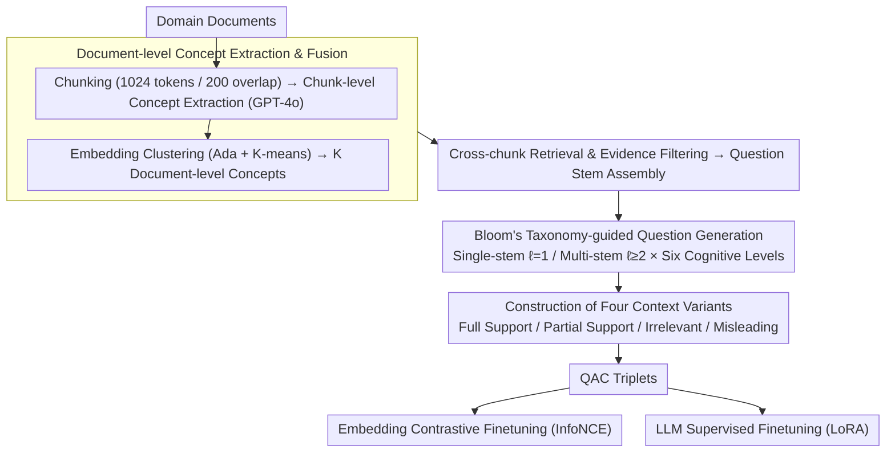

# Domain-Specific Data Generation Framework for RAG Adaptation

**Conference**: ACL 2026  
**arXiv**: [2510.11217](https://arxiv.org/abs/2510.11217)  
**Code**: None  
**Area**: Information Retrieval / RAG  
**Keywords**: RAG Adaptation, Data Generation, Domain-Specific, Embedding Finetuning, Bloom's Taxonomy

## TL;DR

This paper proposes RAGen, a scalable modular data generation framework that automatically synthesizes domain-specific QAC (Question-Answer-Context) data through document-level concept extraction, multi-chunk evidence assembly, and Bloom's Taxonomy-guided question generation. It supports contrastive finetuning of embedding models and supervised finetuning of LLMs, significantly outperforming AutoRAG and LlamaIndex baselines across three domain datasets.

## Background & Motivation

**Background**: RAG (Retrieval-Augmented Generation) has become the mainstream solution for integrating LLMs into domain-specific workflows by providing contextual information through external retrieval. However, direct application of general-purpose RAG pipelines to new domains often results in poor performance.

**Limitations of Prior Work**: (1) General retrievers and generators are not aligned with domain-specific terminology and data distributions; (2) RAG adaptation requires high-quality domain-specific training data, which is costly to manually label; (3) Existing data generation methods (AutoRAG, LlamaIndex) are based on a single-chunk question generation paradigm—generating questions from a single text chunk—leading to shallow, localized questions lacking cross-concept reasoning; (4) Methods like RAFT optimize for single components and are tightly coupled with specific training paradigms.

**Key Challenge**: The critical bottleneck for RAG adaptation is not model architecture or training objectives, but upstream data supply—specifically the lack of high-quality, cross-concept, multi-cognitive level domain-specific training data.

**Goal**: Design a data-centric framework to automatically generate high-quality QAC datasets from raw documents for multi-component RAG adaptation (embeddings + LLMs).

**Key Insight**: Start from document-level concepts (rather than single chunks), assemble cross-chunk evidence to form "question stems," use Bloom’s Taxonomy to guide the generation of questions at different cognitive levels, and finally pair them with carefully constructed positive, negative, and misleading contexts.

**Core Idea**: High-quality RAG training data should be cross-concept, cross-chunk, and multi-cognitive level—rather than shallow QA pairs mechanically generated from single text chunks.

## Method

### Overall Architecture

RAGen decomposes the process of "creating high-quality RAG training data from raw documents" into three serial stages: first, refining cross-chunk document-level concepts from domain documents; second, retrieving and filtering evidence across chunks around each concept to assemble "question stems"; and third, using Bloom's Taxonomy to guide the generation of multi-cognitive level questions based on these stems, pairing each question with four context variants. The input to the pipeline is a collection of domain documents; the intermediate products are concepts and evidence; and the outputs are QAC (Question-Answer-Context) triplets ready for embedding contrastive finetuning and LLM supervised finetuning.

### Key Designs

**1. Document-level Concept Extraction & Fusion: Aggregating Local Chunk Concepts into Global Anchors**

Generating questions directly from a single text chunk locks the question into a small segment of content, making it inherently shallow. RAGen first chunks documents into 1024 tokens with 200-token overlaps, uses ChatGPT-4o to extract chunk-level concepts, and then uses OpenAI Ada embeddings to vectorize and K-means cluster these concepts into $K$ document-level concepts. The concept closest to each cluster center is chosen as representative. These concepts no longer belong to a single chunk but represent cross-chunk high-level semantic themes, providing global anchors for subsequent cross-chunk question generation.

**2. Bloom's Taxonomy-guided Question Generation: Elevating Cognitive Levels**

Questions generated by single-chunk methods mostly stay at low-level tiers like memory or understanding, lacking cross-concept reasoning. RAGen explicitly uses the six levels of the Revised Bloom's Taxonomy (Remember → Understand → Apply → Analyze → Evaluate → Create) as question type constraints. It supports two input granularities: single-stem ($ℓ=1$) using evidence for one concept, and multi-stem ($ℓ \geq 2$) combining evidence from multiple concepts to force cross-concept questions; a threshold is set to truncate explosive multi-stem combinations. With these hierarchical constraints and multi-stem combinations, the proportion of deep questions (Analyze, Evaluate, Create) is significantly increased.

**3. Construction of Four Context Variants: Making Negative Samples Harder**

Using randomly sampled chunks as negative samples creates a decision boundary that is too loose for the retriever. RAGen pairs each QA pair with four contexts: Full Support (evidence directly answering the question), Partial Support (incomplete information requiring cross-evidence reasoning), Irrelevant (same domain but unrelated content), and Misleading (thematic relevance but insufficient semantic support for the answer, similar to distractors in reading comprehension). The misleading contexts leverage distractor concepts to create difficult negative examples at the semantic level, training a retriever that is more robust and sensitive to semantic nuances.

### Loss & Training

Embedding finetuning uses the InfoNCE contrastive loss with a learning rate of 1e-5, 3 epochs, temperature $\tau=0.02$, and 2 negative samples per pair. LLM finetuning uses LoRA for supervised finetuning (Qwen2.5-1.5B/3B) with a learning rate of 1e-5, 5 epochs, and a 10% validation split. Both are conducted on 4×RTX 3090.

## Key Experimental Results

### Main Results

**Embedding Model Retrieval Performance (BGE-large-v1.5, Average across 3 domains)**

| Training Data | R@1 | R@5 | R@10 | MRR@10 |
|---------|-----|-----|------|--------|
| Vanilla (No Finetuning) | 0.153 | 0.411 | 0.534 | 0.263 |
| AutoRAG | 0.190 | 0.517 | 0.655 | 0.330 |
| LlamaIndex | 0.204 | 0.539 | 0.671 | 0.346 |
| **Ours** | **0.333** | **0.716** | **0.828** | **0.497** |

### Ablation Study

**LLM Finetuning Performance (Qwen2.5-1.5B, ROUGE-L)**

| Domain | AutoRAG | LlamaIndex | Ours |
|------|---------|------------|-------|
| PPFS | 0.288 | 0.329 | **0.396** |
| TradePolicy | 0.278 | 0.270 | **0.391** |
| BusinessAI | 0.270 | 0.269 | **0.339** |

**Comparison of Cognitive Level Distribution**

| Method | Remember + Understand (Low-level) | Analyze + Evaluate + Create (High-level) |
|------|-----------------|---------------------|
| LlamaIndex | ~70% | ~15% |
| AutoRAG | ~65% | ~20% |
| Ours | ~30% | ~50% |

### Key Findings

- Ours significantly leads baselines in embedding retrieval—R@1 is roughly 63% higher than LlamaIndex (0.333 vs 0.204), proving the superiority of cross-concept data generation.
- Ours consistently achieves the best ROUGE-L in LLM finetuning (+20-40% relative gain), indicating that data quality is equally critical for the generation component.
- Questions generated by Ours have higher cognitive levels—high-level questions (Analyze/Evaluate/Create) account for 50% vs. 15-20% for baselines.
- The inclusion of misleading contexts significantly improves retrieval robustness compared to using random negative samples alone.
- Cross-concept questions generated via multi-stem combinations ($ℓ \geq 2$) require deeper reasoning, which is the core source of Ours's data quality advantage.

## Highlights & Insights

- A data-centric approach to RAG adaptation—improving performance maximally by optimizing training data rather than changing model architecture.
- Bloom’s Taxonomy-guided question generation is a transferable methodology applicable to any educational or evaluative data generation scenario.
- The design of four context variants (especially misleading contexts) draws inspiration from distractors in reading comprehension tasks.

## Limitations & Future Work

- Concept extraction and question generation rely on ChatGPT-4o, posing higher costs and making results dependent on model capability.
- Validation was limited to three relatively small-scale domain datasets; large-scale industrial scenarios have not been tested.
- No direct comparison with end-to-end RAG adaptation methods like RAFT.
- Cross-document reasoning (combining concepts from different documents where $ℓ \geq 2$) has not been fully explored.

## Related Work & Insights

- **vs RAFT**: RAFT focuses on distractor-aware finetuning for the generation side, whereas Ours provides a general data generation framework supporting multi-component adaptation.
- **vs AutoRAG/LlamaIndex**: These methods are based on a single-chunk generation paradigm; Ours's cross-concept multi-stem design is the fundamental differentiator.
- **vs RAGEval/RAGAS**: These frameworks are used for evaluating RAG systems, while Ours is explicitly oriented toward generating training data for RAG adaptation.

## Rating

- Novelty: ⭐⭐⭐⭐ The data generation paradigm involving document-level concepts, Bloom's Taxonomy, and multi-stem combinations is both novel and practical.
- Experimental Thoroughness: ⭐⭐⭐⭐ Covers three domains, three embedding models, and two LLMs; ablation is thorough but scale remains limited.
- Writing Quality: ⭐⭐⭐⭐ Methodological descriptions are clear and systematic; diagrams are intuitive.
- Value: ⭐⭐⭐⭐ Provides a practical data generation solution for RAG domain adaptation.

<!-- RELATED:START -->

## Related Papers

- [\[ACL 2025\] On Synthetic Data Strategies for Domain-Specific Generative Retrieval](../../ACL2025/information_retrieval/on_synthetic_data_strategies_for_domain-specific_generative_retrieval.md)
- [\[ACL 2026\] More Than Efficiency: Embedding Compression Improves Domain Adaptation in Dense Retrieval](more_than_efficiency_embedding_compression_improves_domain_adaptation_in_dense_r.md)
- [\[ACL 2025\] RAGEval: Scenario Specific RAG Evaluation Dataset Generation Framework](../../ACL2025/information_retrieval/rageval_scenario_specific_rag_evaluation_dataset_generation_framework.md)
- [\[ACL 2026\] UnIte: Uncertainty-based Iterative Document Sampling for Domain Adaptation in Information Retrieval](unite_uncertainty-based_iterative_document_sampling_for_domain_adaptation_in_inf.md)
- [\[ACL 2026\] Feedback Adaptation for Retrieval-Augmented Generation](feedback_adaptation_for_retrieval-augmented_generation.md)

<!-- RELATED:END -->
