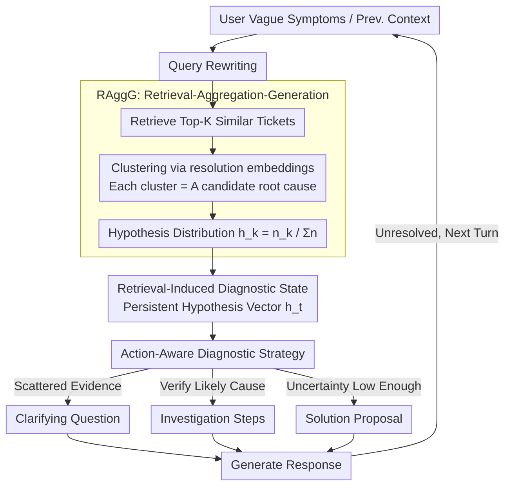

# DQA: Diagnostic Question Answering for IT Support

**Conference**: ACL 2026  
**arXiv**: [2604.05350](https://arxiv.org/abs/2604.05350)  
**Code**: None  
**Area**: Information Retrieval / Dialogue Systems  
**Keywords**: Diagnostic QA, IT Support, RAG, Root Cause Analysis, Diagnostic State Tracking

## TL;DR
This paper proposes the DQA framework, which achieves systematic troubleshooting in enterprise IT support by maintaining a persistent diagnostic state and aggregating retrieval evidence at the root-cause level (instead of per-document processing). It improves the success rate from a 41.3% baseline to 78.7% and reduces the average number of turns from 8.4 to 3.9.

## Background & Motivation

**Background**: Enterprise IT support interactions are inherently diagnostic—users submit vague symptom reports, and support agents must iteratively collect evidence to identify the root cause. Retrieval-Augmented Generation (RAG) is the dominant method for knowledge grounding, with multi-turn RAG further improving retrieval robustness through dialogue query rewriting.

**Limitations of Prior Work**: Standard multi-turn RAG systems lack an explicit representation of the diagnostic state. Retrieved documents are consumed independently in each turn, making it difficult to accumulate evidence across turns, reconcile conflicting signals, or maintain awareness of unresolved hypotheses. Large-scale ticket repository retrieval also produces many near-duplicate redundant results, wasting context window space and latency budgets.

**Key Challenge**: Diagnostic dialogues require tracking competing hypotheses, interpreting partial signals, and deciding when to ask questions versus when to provide solutions. Existing RAG systems conflate "dialogue coherence" with "diagnostic progress" and lack explicit modeling of the troubleshooting trajectory.

**Goal**: Design a troubleshooting framework that maintains an explicit diagnostic state, aggregates evidence at the root-cause level, and supports state-based action selection.

**Key Insight**: Drawing inspiration from Case-Based Reasoning (CBR)—learning from similar resolved cases—this approach aggregates distributional information (such as cluster prevalence) across the entire retrieval neighborhood rather than adapting to a single case.

**Core Idea**: Cluster retrieved tickets by root-cause descriptions and maintain a hypothesis-weight vector as the diagnostic state. This state is dynamically updated with new evidence each turn, guiding the strategy shift from "broad questioning" to "precise investigation" and finally "proposing solutions."

## Method

### Overall Architecture

DQA models enterprise IT troubleshooting as a multi-turn loop with an explicit diagnostic state. After a user provides vague symptoms, the system executes "Query Rewriting → Retrieve Similar Tickets → Aggregate by Root Cause → Update Diagnostic State → Select Action → Generate Response" in each turn. This allows the dialogue to converge from broad questioning to precise troubleshooting and solution delivery. The core mechanism elevates traditional RAG from per-document processing to the root-cause level, using a persistent hypothesis-weight vector to carry diagnostic progress across turns.

### Key Designs

**1. RAggG (Retrieval-Aggregation-Generation): Aggregating Tickets into Diagnostic Signals**

Retrieving from large-scale ticket repositories often yields near-duplicate results. Inserting them individually into the context wastes the window and drowns out signals. RAggG retrieves Top-K similar tickets for a user description, encodes the `resolution` field using sentence embeddings, and merges them using mini-batch k-means or hierarchical clustering. Each cluster represents a candidate root cause, outputting aggregated evidence $\mathcal{E} = \{(n_j, R_j)\}_{j=1}^{J}$, where $n_j$ is the evidence count and $R_j$ is the representative case. This yields a query-conditioned hypothesis distribution $h_k = \frac{n_k(x)}{\sum_{k'} n_{k'}(x)}$. Crucially, aggregation preserves distributional information (e.g., which root cause is most common) rather than just deduplicating, providing stronger signals for downstream action selection.

**2. Retrieval-Induced Diagnostic State: Accumulating Evidence Across Turns**

Standard multi-turn RAG processes documents independently each turn, failing to accumulate evidence or remember unverified hypotheses. DQA maintains a structured state $s_t$, centered on a hypothesis-weight vector $\mathbf{h}_t \in \mathbb{R}^K$ (each component corresponding to a root-cause cluster), along with associated symptoms, KB articles, and typical solutions. The weights are refreshed each turn via re-retrieval and re-aggregation—the retrieval-induced weights reflect the latest evidence while structured fields persist. This "implicit belief update via re-retrieval" avoids the complexity of manual probabilistic modeling while remaining reactive to current evidence.

**3. Action-Aware Diagnostic Strategy: Making Diagnostic Progress Explicit**

Unconstrained free-text generation conflates "dialogue flow" with "diagnostic progress." DQA constrains each turn to one of three actions: Clarifying Question (collecting discriminative evidence), Investigation Steps (verifying likely causes), and Solution Proposal (providing a fix when uncertainty is low). As evidence accumulates and support clusters around a few root causes, the strategy automatically transitions from broad questioning to precise investigation, making the process trackable and interpretable.

### Loss & Training

DQA is a system-level design and does not involve parameter training. It uses a playback-based evaluation protocol: on 150 anonymized enterprise IT support scenarios, a user simulator interacts with the DQA agent for multiple turns to measure success rate and average turns.

## Key Experimental Results

### Main Results

| Method | Success Rate | Avg. Turns |
|------|--------|---------|
| Multi-turn RAG Baseline | 41.3% | 8.4 |
| **Ours (DQA)** | **78.7%** | **3.9** |

### Ablation Study

| Configuration | Success Rate | Description |
|------|--------|------|
| DQA Full | 78.7% | Complete framework |
| w/o Aggregation | ~55% | Significant degradation without root-cause aggregation |
| w/o Diagnostic State | ~50% | No cross-turn state tracking |
| w/o Action Strategy | ~60% | No explicit action selection |

### Key Findings
- DQA nearly doubles the success rate (41.3% → 78.7%) while reducing the average number of turns by more than half (8.4 → 3.9).
- Root-cause level aggregation is more effective than per-document retrieval because it compresses redundancy while preserving distributional signals.
- The explicit diagnostic state allows the system to accumulate evidence across turns and avoid repetitive questioning.
- The transition of action strategies (Questioning → Investigation → Solution) naturally corresponds to changes in diagnostic confidence.

## Highlights & Insights
- **Paradigm Shift from Document Retrieval to Root-Cause Aggregation**: While traditional RAG operates at the document level, DQA elevates this to semantic concept (root cause) aggregation. This idea can be generalized to any retrieval scenario requiring structured insights from many similar cases.
- **Implicit Belief Update**: Updating the diagnostic state through per-turn re-retrieval and re-aggregation avoids the complexity of explicit probabilistic models. This represents a "retrieval-as-inference" strategy.
- **Formalization of Diagnostic Actions**: Constraining open-ended dialogue into three action types makes system behavior interpretable and controllable.

## Limitations & Future Work
- The evaluation is based on a playback protocol with 150 scenarios, which is relatively small and may not fully reflect real-world deployment.
- Clustering quality depends on the quality of the ticket `resolution` fields; noisy or incomplete descriptions could impact performance.
- Current strategies use three manually defined action types; future work could explore learned policies.
- Latency and scalability issues for integration with real-time systems were not discussed.

## Related Work & Insights
- **vs. Standard Multi-turn RAG**: Multi-turn RAG improves retrieval robustness but does not represent diagnostic state. DQA explicitly tracks hypotheses and evidence.
- **vs. Case-Based Reasoning (CBR)**: CBR adapts from a few cases, whereas DQA aggregates distributional information from a large neighborhood.
- **vs. Medical Diagnostic Dialogue**: Shared logic of uncertainty reduction, but IT scenarios involve higher heterogeneity and faster-changing fault patterns.

## Rating
- Novelty: ⭐⭐⭐⭐ The combination of root-cause aggregation and diagnostic state is a novel design in RAG systems.
- Experimental Thoroughness: ⭐⭐⭐ Significant performance gains, though the 150-scenario evaluation scale is small.
- Writing Quality: ⭐⭐⭐⭐ Clear problem definition and systematic method design.
- Value: ⭐⭐⭐⭐ Directly practical for enterprise IT support; the aggregation concept is highly generalizable.

<!-- RELATED:START -->

## Related Papers

- [\[ACL 2026\] MAB-DQA: Addressing Query Aspect Importance in Document Question Answering with Multi-Armed Bandits](mab-dqa_addressing_query_aspect_importance_in_document_question_answering_with_m.md)
- [\[ACL 2026\] FinRAG-12B: A Production-Validated Recipe for Grounded Question Answering in Banking](finrag-12b_a_production-validated_recipe_for_grounded_question_answering_in_bank.md)
- [\[ACL 2026\] ChatR1: Reinforcement Learning for Conversational Reasoning and Retrieval Augmented Question Answering](chatr1_reinforcement_learning_for_conversational_reasoning_and_retrieval_augment.md)
- [\[ACL 2026\] CounterRefine: Answer-Conditioned Counterevidence Retrieval for Inference-Time Knowledge Repair in Factual Question Answering](counterrefine_answer-conditioned_counterevidence_retrieval_for_inference-time_kn.md)
- [\[ACL 2026\] Is Agentic RAG Worth It? An Experimental Comparison of RAG Approaches](is_agentic_rag_worth_it_an_experimental_comparison_of_rag_approaches.md)

<!-- RELATED:END -->
