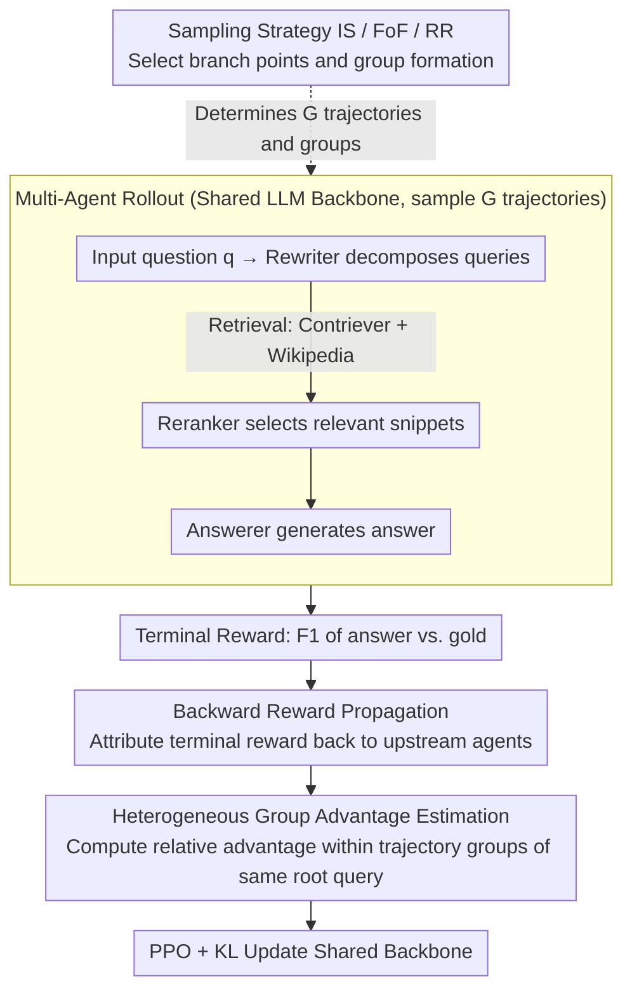

# End-to-End Optimization of LLM-Driven Multi-Agent Search Systems via Heterogeneous-Group-Based Reinforcement Learning

**Conference**: ACL 2026  
**arXiv**: [2506.02718](https://arxiv.org/abs/2506.02718)  
**Code**: None  
**Area**: Information Retrieval / Multi-Agent RL  
**Keywords**: Multi-Agent Search, MARL, Group Optimization, End-to-End Optimization, RAG

## TL;DR

This paper proposes MHGPO (Multi-Agent Heterogeneous Group Policy Optimization), a critic-free multi-agent RL method. By employing heterogeneous group relative advantage estimation and backward reward propagation, it achieves end-to-end optimization in a three-agent search system (Rewriter→Reranker→Answerer). It captures implicit cross-agent dependencies and cross-trajectory correlations, significantly outperforming MAPPO and GRPO baselines on multi-hop QA benchmarks such as HotpotQA.

## Background & Motivation

**Background**: Multi-agent search systems (MASS) decompose tasks and perform retrieval-augmented reasoning by coordinating multiple specialized LLM agents equipped with search tools. Common architectures consist of a Rewriter (decomposing questions into queries) → Reranker (selecting relevant snippets) → Answerer (generating the final answer).

**Limitations of Prior Work**: (1) Prompt engineering and single-agent SFT involve high engineering overhead and lack adaptability; (2) MAPPO requires large critic networks to evaluate joint actions, leading to instability and high memory overhead; (3) Group optimization algorithms like GRPO are effective in single-context settings but do not extend directly to multi-context MASS, where multi-agent rollouts span across agents with disjoint local contexts; (4) Upstream outputs affect downstream behavior without a direct gradient path (indirect dependency), and rollouts from the same root query explore related but distinct intermediate decisions (implicit cross-trajectory relations).

**Key Challenge**: MASS requires system-level optimization rather than local agent optimization—yet existing MARL methods either rely on expensive critics (MAPPO) or fail to handle multi-context cross-agent dependencies (GRPO).

**Goal**: Design an efficient critic-free multi-agent RL method capable of capturing indirect cross-agent dependencies and implicit cross-trajectory correlations, shifting the optimization focus from local agent performance to global system success.

**Key Insight**: Parameter sharing + group optimization—all agents share a single LLM backbone, utilizing relative advantage estimation within heterogeneous groups to compare rollouts from different prompts, and attributing terminal rewards to upstream agents via backward reward propagation.

**Core Idea**: Heterogeneous Group Advantage Estimation—by comparing rollouts stemming from the same root query but involving different intermediate decisions (forming heterogeneous groups), the optimization focus is shifted from "selecting the best local action given fixed upstream output" to "rewarding system behaviors that lead to global success."

## Method

### Overall Architecture

MHGPO addresses the problem of training the Rewriter→Reranker→Answerer search chain end-to-end without relying on a critic or degrading into single-agent optimization. Three agents share a single LLM backbone. For each input question, $G$ complete trajectories are sampled (sampling strategies determine the branching points to form isomorphic/heterogeneous groups). The F1 score between the Answerer's result and the gold answer serves as the terminal reward. This reward is back-propagated along the trajectory and attributed to each upstream agent. Relative advantage is estimated within heterogeneous groups, and the shared backbone is updated using the PPO objective with KL regularization. The system takes a raw question as input, produces multiple trajectories with search actions as intermediate products, and outputs a multi-agent policy optimized by system-level success signals.

### Key Designs

**1. Backward Reward Propagation: Attributing Terminal Success to Upstream Agents**

The output of upstream agents like the Rewriter determines the final answer, yet there is no direct gradient path between them and the terminal reward, which is a core challenge in MASS optimization. MHGPO propagates the terminal reward backward from the Answerer's output along the trajectory: for the $i$-th output of agent $k$, the assigned reward is the aggregation (averaging by default) of rewards from all direct successor agents that "consumed" that output, plus agent-specific format penalties. Thus, even without direct gradients, indirect dependencies such as "poor retrieval queries leading to poor final answers" are exposed by the back-propagated reward.

**2. Heterogeneous Group Advantage Estimation: Learning Global Behavior from Cross-Trajectory Correlations**

Standard GRPO only calculates relative advantage between rollouts of the same input (isomorphic groups), failing to handle multi-context scenarios in MASS where downstream inputs vary with upstream rollouts. MHGPO allows groups to include rollouts from different prompts (heterogeneous groups)—for instance, the same question with different Rewriter queries providing different inputs to the Reranker. After cross-trajectory comparison in heterogeneous groups, the advantage signal is no longer just "picking the best local action under a fixed upstream prefix," but rewarding system behaviors that truly lead to global success.

**3. Three Rollout Sampling Strategies: Balancing Efficiency and Stability**

The sampling of heterogeneous groups directly determines efficiency and optimization quality. IS (Independent Sampling) unfolds rollouts independently for each agent, forming pure isomorphic groups with high redundancy, requiring $n \times G$ samples. FoF (Fork-on-First) branches $G$ times only at the entry agent with one-to-one downstream paths, saving sampling costs but providing an isomorphic baseline only for the entry agent. RR (Round-Robin) randomizes the branching point, ensuring all agents have a probability of receiving isomorphic comparison opportunities, thereby balancing global coordination and local stability. These three form a spectrum from "fully redundant/high stability" to "efficient but lacking downstream baselines" to "compromise."

### Loss & Training

The optimization objective is the PPO loss plus KL regularization. Since all agents share parameters, the multi-agent RL effectively reduces to multi-task learning. Training is performed for 1 epoch with $G=4$, using Llama3.1-8B-Instruct as the backbone, Wikipedia dump as the retrieval corpus, and Contriever as the retrieval backend.

## Key Experimental Results

### Main Results

**Performance on HotpotQA / 2WikiMultihopQA / MuSiQue**

| Method | HotpotQA F1 | 2WikiMHQA F1(OOD) | MuSiQue F1(OOD) |
|------|------------|-------------------|-----------------|
| Llama3.1-8B (No RL) | 22.78 | 20.82 | 2.81 |
| PPO | 24.52 | 9.20 | 8.02 |
| GRPO | 27.42 | 11.03 | 9.29 |
| Search-o1 | - | - | - |
| **Ours (MHGPO-FoF)** | **Highest** | **Significantly Higher** | **Significantly Higher** |
| **Ours (MHGPO-RR)** | **Top Tier** | **Top Tier** | **Top Tier** |

### Ablation Study

**Comparison of Sampling Strategies**

| Strategy | Sampling Efficiency | Training Stability | Performance |
|------|---------|----------|------|
| IS | Low (High Redundancy) | High | Medium |
| FoF | High | Medium | High |
| FoF (os) | Medium | Medium | High+ |
| RR | Medium-High | High | **Highest** |

### Key Findings

- MHGPO significantly outperforms PPO and GRPO—the critic-free design is more stable, and heterogeneous groups capture cross-agent dependencies.
- PPO training is unstable and shows a significant drop in OOD performance (2WikiMHQA F1 only 9.20), whereas MHGPO exhibits better OOD generalization.
- The RR strategy achieves the best balance between efficiency and performance—probabilistic branching points provide isomorphic comparison opportunities for all agents.
- Parameter sharing and the critic-free design significantly reduce memory and computational overhead.

## Highlights & Insights

- First systematic study of group optimization algorithms applied to multi-agent search systems.
- Heterogeneous group advantage estimation is a natural extension of GRPO, shifting the optimization focus from local to global.
- Backward reward propagation is a simple and effective solution for handling indirect cross-agent dependencies.

## Limitations & Future Work

- Validated only on a three-agent MASS architecture; effects on more complex topologies are unknown.
- Parameter sharing might limit role differentiation between agents.
- Only 1 epoch of training was conducted; the effects of more training rounds remain unexplored.

## Related Work & Insights

- **vs MAPPO**: MAPPO requires large critic networks; MHGPO replaces them with group relative advantages, making it more efficient and stable.
- **vs GRPO**: GRPO only supports isomorphic groups and single contexts; MHGPO extends this to heterogeneous groups and multi-context scenarios.
- **vs Search-o1**: Search-o1 integrates retrieval within a single model; MHGPO optimizes modular multi-agent systems.

## Rating

- Novelty: ⭐⭐⭐⭐ Heterogeneous group advantage estimation and backward reward propagation are meaningful extensions to GRPO/MARL.
- Experimental Thoroughness: ⭐⭐⭐⭐ Multiple datasets including OOD evaluations, though agent architectures are relatively simple.
- Writing Quality: ⭐⭐⭐⭐ Theoretical formalization is rigorous, with clear analysis of the connection to GRPO.
- Value: ⭐⭐⭐⭐⭐ Provides a practical and efficient solution for end-to-end RL optimization of LLM multi-agent systems.

<!-- RELATED:START -->

## Related Papers

- [\[ACL 2026\] Enhancing LLM-based Search Agents via Contribution Weighted Group Relative Policy Optimization](enhancing_llm-based_search_agents_via_contribution_weighted_group_relative_polic.md)
- [\[ICML 2026\] Graph-R1: Towards Agentic GraphRAG Framework via End-to-end Reinforcement Learning](../../ICML2026/information_retrieval/graph-r1_towards_agentic_graphrag_framework_via_end-to-end_reinforcement_learnin.md)
- [\[ACL 2025\] Gumbel Reranking: Differentiable End-to-End Reranker Optimization](../../ACL2025/information_retrieval/gumbel_reranking.md)
- [\[ACL 2026\] Agentic Conversational Search with Contextualized Reasoning via Reinforcement Learning](agentic_conversational_search_with_contextualized_reasoning_via_reinforcement_le.md)
- [\[ACL 2025\] MEMERAG: A Multilingual End-to-End Meta-Evaluation Benchmark for Retrieval Augmented Generation](../../ACL2025/information_retrieval/memerag_a_multilingual_end-to-end_meta-evaluation_benchmark_for_retrieval_augmen.md)

<!-- RELATED:END -->
