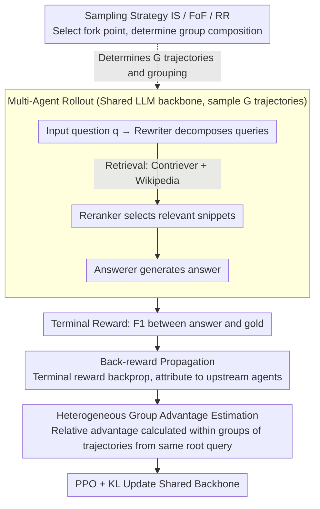

# End-to-End Optimization of LLM-Driven Multi-Agent Search Systems via Heterogeneous-Group-Based Reinforcement Learning

**Conference**: ACL 2026  
**arXiv**: [2506.02718](https://arxiv.org/abs/2506.02718)  
**Code**: None  
**Area**: Information Retrieval / Multi-Agent RL  
**Keywords**: Multi-agent search, MARL, Group optimization, End-to-end optimization, RAG

## TL;DR

This paper proposes MHGPO (Multi-Agent Heterogeneous Group Policy Optimization), a critic-free multi-agent RL method. By employing heterogeneous group relative advantage estimation and back-reward propagation, it achieves end-to-end optimization in a three-agent search system (Rewriter→Reranker→Answerer). It captures implicit cross-agent dependencies and cross-trajectory associations, significantly outperforming MAPPO and GRPO baselines on multi-hop QA benchmarks such as HotpotQA.

## Background & Motivation

**Background**: Multi-agent search systems (MASS) decompose tasks and perform retrieval-augmented reasoning by coordinating multiple specialized LLM agents (equipped with search tools). A common architecture consists of a Rewriter (decomposing questions into retrieval queries) → Reranker (selecting relevant snippets from retrieval results) → Answerer (generating the final answer).

**Limitations of Prior Work**: (1) Prompt engineering and single-agent SFT optimization methods are labor-intensive and lack adaptability; (2) MAPPO requires a large critic network to evaluate joint actions, leading to instability and high memory overhead; (3) Group optimization algorithms like GRPO are effective in single-context settings but do not scale directly to multi-context MASS—multi-agent rollouts span across multiple agents with disjoint local contexts; (4) Upstream agent outputs affect downstream behavior without direct gradient paths (indirect dependency), and rollouts from the same root query explore related but distinct intermediate decisions (implicit cross-trajectory relations).

**Key Challenge**: MASS requires system-level optimization rather than single-agent optimization—but existing MARL methods either depend on expensive critics (MAPPO) or fail to handle multi-context cross-agent dependencies (GRPO).

**Goal**: To design an efficient critic-free multi-agent RL method capable of capturing indirect cross-agent dependencies and implicit cross-trajectory associations, shifting the optimization focus from local agent performance to global system success.

**Key Insight**: Parameter sharing + Group optimization—all agents share a single LLM backbone. Relative advantage estimation across heterogeneous groups is used to compare rollouts from different prompts, and back-reward propagation attributes terminal rewards to upstream agents.

**Core Idea**: Heterogeneous group advantage estimation—by comparing rollouts from the same root query but with different intermediate decisions (forming a heterogeneous group), the optimization focus shifts from "selecting the best local action under a fixed upstream output" to "rewarding system behaviors that lead to global success."

## Method

### Overall Architecture

MHGPO addresses the problem of "how to train the Rewriter→Reranker→Answerer search chain end-to-end without relying on a critic or degrading into single-agent optimization." It allows the three agents to share the same LLM backbone, sampling $G$ complete trajectories for each input question (with the sampling strategy determining where the trajectory forks, thereby forming homogeneous or heterogeneous groups). The F1 score between the Answerer's response and the reference answer is used as the terminal reward. This reward is first propagated backward along the trajectory to be attributed to each upstream agent and then used for relative advantage estimation within the heterogeneous group. Finally, the shared backbone is updated using the PPO objective with KL regularization. The input is the original question, intermediate products are multiple trajectories containing search actions, and the output is a multi-agent policy optimized by system-level success signals.

### Key Designs

**1. Back-reward Propagation: Attributing Terminal Success to Upstream**

The output of upstream agents like the Rewriter determines the final answer, yet there is no direct gradient path between them and the terminal reward, which is a core difficulty in MASS optimization. MHGPO allows the terminal reward to start from the Answerer's output and propagate backward along the trajectory: for the $i$-th output of agent $k$, the reward it receives is the aggregation (defaulting to average) of the rewards of all direct successor agents that "consumed this output," plus specific formatting penalties for that agent. In this way, even without direct gradients, indirect dependencies such as "poor retrieval queries leading to poor final answers" are exposed by the back-propagated reward.

**2. Heterogeneous Group Advantage Estimation: Learning Global Behavior from Cross-Trajectory Associations**

Standard GRPO only calculates relative advantages between rollouts of the same input (homogeneous groups), failing to handle multi-context scenarios in MASS where "downstream inputs change with upstream rollouts." MHGPO allows a group to include rollouts from different prompts (heterogeneous groups)—for instance, different Rewriter queries for the same question will feed different inputs to the Reranker, naturally forming a heterogeneous group. After performing cross-trajectory comparisons within a heterogeneous group, the advantage signal is no longer just "picking the best local action under a fixed upstream prefix" but rather rewarding system behaviors that truly lead to global success, elevating the optimization focus from local to global.

**3. Three Rollout Sampling Strategies: Trading Off Efficiency and Stability**

How the heterogeneous group is sampled directly determines efficiency and optimization quality. IS (Independent Sampling) independently expands rollouts for each agent; it uses purely homogeneous groups but has high redundancy, requiring $n \times G$ samples. FoF (Fork-on-First) only forks $G$ times at the entry agent and proceeds one-to-one downstream; it is highly sample-efficient but only the entry agent has a homogeneous comparison baseline. RR (Round-Robin) randomizes the fork point, ensuring each agent has a probability of obtaining a homogeneous comparison opportunity, thereby balancing global coordination and local stability. These three form a spectrum from "fully redundant and highly stable" to "highly efficient but lacking downstream baselines" to a "compromise."

### Loss & Training

The optimization objective is the PPO loss plus KL regularization; since all agent parameters are shared, multi-agent RL effectively degrades to multi-task learning. Training is performed for 1 epoch with $G=4$, using Llama3.1-8B-Instruct as the backbone, Wikipedia dump as the retrieval corpus, and Contriever as the retrieval backend.

## Key Experimental Results

### Main Results

**Performance on HotpotQA / 2WikiMultihopQA / MuSiQue**

| Method | HotpotQA F1 | 2WikiMHQA F1(OOD) | MuSiQue F1(OOD) |
|------|------------|-------------------|-----------------|
| Llama3.1-8B (No RL) | 22.78 | 20.82 | 2.81 |
| PPO | 24.52 | 9.20 | 8.02 |
| GRPO | 27.42 | 11.03 | 9.29 |
| Search-o1 | - | - | - |
| **MHGPO-FoF (Ours)** | **Highest** | **Significantly Higher** | **Significantly Higher** |
| **MHGPO-RR (Ours)** | **Top Tier** | **Top Tier** | **Top Tier** |

### Ablation Study

**Comparison of Sampling Strategies**

| Strategy | Sampling Efficiency | Training Stability | Performance |
|------|---------|----------|------|
| IS | Low (High Redundancy) | High | Medium |
| FoF | High | Medium | High |
| FoF (os) | Medium | Medium | High+ |
| RR | High-Medium | High | **Highest** |

### Key Findings

- MHGPO significantly outperforms PPO and GRPO—the critic-free design is more stable, and heterogeneous groups capture cross-agent dependencies.
- PPO training is unstable, and OOD performance drops significantly (2WikiMHQA F1 is only 9.20), whereas MHGPO demonstrates better OOD generalization.
- The RR strategy achieves the best balance between efficiency and performance—probabilistic fork points provide homogeneous comparison opportunities for all agents.
- Parameter sharing + critic-free design substantially reduces memory and computational overhead.

## Highlights & Insights

- This is the first systematic study of group optimization algorithms applied to multi-agent search systems.
- Heterogeneous group advantage estimation is a natural extension of GRPO, shifting the optimization focus from local to global.
- Back-reward propagation is a concise and effective solution for handling indirect cross-agent dependencies.

## Limitations & Future Work

- Validated only on a three-agent MASS architecture; effectiveness on more complex topologies is unknown.
- Parameter sharing might limit the role differentiation between agents.
- Only 1 epoch of training was conducted; the effects of more training iterations have not been explored.

## Related Work & Insights

- **vs MAPPO**: MAPPO requires a large critic network, whereas MHGPO replaces it with group relative advantage, making it more efficient and stable.
- **vs GRPO**: GRPO only supports homogeneous groups and single contexts, while MHGPO extends this to heterogeneous groups and multiple contexts.
- **vs Search-o1**: Search-o1 integrates retrieval within a single model, whereas MHGPO optimizes a modular multi-agent system.

## Rating

- Novelty: ⭐⭐⭐⭐ Heterogeneous group advantage estimation and back-reward propagation are meaningful extensions of GRPO/MARL.
- Experimental Thoroughness: ⭐⭐⭐⭐ Multiple datasets including OOD evaluations were used, though agent architectures are relatively simple.
- Writing Quality: ⭐⭐⭐⭐ Theoretical formalization is rigorous, and the analysis of the connection with GRPO is clear.
- Value: ⭐⭐⭐⭐⭐ Provides a practical and efficient solution for end-to-end RL optimization of LLM multi-agent systems.

<!-- RELATED:START -->

## Related Papers

- [\[ACL 2026\] Enhancing LLM-based Search Agents via Contribution Weighted Group Relative Policy Optimization](enhancing_llm-based_search_agents_via_contribution_weighted_group_relative_polic.md)
- [\[ICML 2026\] Graph-R1: Towards Agentic GraphRAG Framework via End-to-end Reinforcement Learning](../../ICML2026/information_retrieval/graph-r1_towards_agentic_graphrag_framework_via_end-to-end_reinforcement_learnin.md)
- [\[ACL 2025\] Gumbel Reranking: Differentiable End-to-End Reranker Optimization](../../ACL2025/information_retrieval/gumbel_reranking.md)
- [\[ACL 2026\] Agentic Conversational Search with Contextualized Reasoning via Reinforcement Learning](agentic_conversational_search_with_contextualized_reasoning_via_reinforcement_le.md)
- [\[ACL 2026\] ChatR1: Reinforcement Learning for Conversational Reasoning and Retrieval Augmented Question Answering](chatr1_reinforcement_learning_for_conversational_reasoning_and_retrieval_augment.md)

<!-- RELATED:END -->
