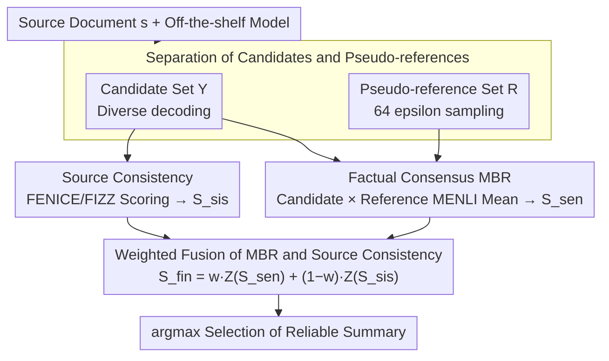

# Enhancing Factuality through Consensus and Consistency in Summarization Using Minimum Bayes Risk Decoding

**Conference**: ACL2026 Findings  
**arXiv**: [2605.29336](https://arxiv.org/abs/2605.29336)  
**Code**: https://github.com/naist-nlp/ConSUM  
**Area**: Summarization / Factual Consistency / Reranking  
**Keywords**: Summary Factuality, MBR decoding, Pseudo-reference summaries, reference-free metric, reranking

## TL;DR
Ours proposes ConSUM, which evaluates candidates by simultaneously examining their factual consistency with the source document and consensus among candidates. By combining MBR decoding with factuality metrics such as FENICE/FIZZ for reranking, the factual reliability of summaries is improved on CNN/DailyMail, XSum, and in human evaluations.

## Background & Motivation
**Background**: Automatic summarization systems typically generate one or more candidate summaries using a generative model and then select a better output using ROUGE, BERTScore, factuality evaluators, or rerankers. Since no human gold summaries are available at test time, many reference-free reranking methods rely solely on the source document as the ground truth to judge whether the candidate is faithful to the input.

**Limitations of Prior Work**: Reference-free metrics that rely only on the source document are unstable. First, source documents are often long, and evaluators might only coarsely judge relevance, missing small but critical factual errors. Second, a single metric tends to push reranking toward its own biases, such as preferring longer summaries or those easily recognized by a specific fact extractor, which are not necessarily better.

**Key Challenge**: Summary factuality needs to satisfy two conditions: it must be consistent with the source document (consistency) and should fall within the semantic region that the generative model itself considers credible (consensus). Previous reranking methods often optimize only one of these signals, leading to results easily swayed by metric bias or individual anomalous candidates.

**Goal**: Ours aims to construct a usable "reference signal" in testing scenarios where no human reference summaries exist. Specifically, the system selects the final summary from candidates and pseudo-references sampled from the same model, utilizing both source-based factuality metrics and NLI-style consistency between candidates and pseudo-references.

**Key Insight**: Minimum Bayes Risk (MBR) decoding is commonly used in machine translation to select the output with the highest expected utility from a candidate pool. This paper migrates this idea to summary factuality: if a candidate remains consistent with multiple pseudo-references from the same source, it is more likely to represent a stable fact within the model's distribution. Combined with source document consistency checks, this can filter out "fluent but factually incorrect" candidates.

**Core Idea**: Supplement "inter-candidate consensus" with "source document consistency," using a weighted combination of MBR scores and reference-free factuality scores to select more reliable summaries.

## Method

### Overall Architecture
ConSUM does not retrain the summarization model but performs candidate selection after decoding. The input is a source document $s$ and a pre-trained summarization model, and the output is the summary determined to be the most reliable. The system first samples two sets of texts from the model: a candidate set $\mathcal{Y}$ providing diverse outputs for selection, and a pseudo-reference set $\mathcal{R}$ acting as an internal reference approximating a gold summary. Two scores are then calculated for each candidate $y_i$: first, factual consistency with the source document (consistency, using reference-free factuality metrics like FENICE/FIZZ), and second, the average utility against the pseudo-reference set (consensus, using MENLI for MBR utility). Finally, the two scores are fused after z-score normalization: $S_{fin} = wZ(S_{sen}) + (1-w)Z(S_{sis})$. The candidate $\arg\max_y S_{fin}$ is selected to filter out fluent but unfaithful outputs.

### Key Designs

**1. Separation of Candidates and Pseudo-references: Distinguishing "Selection Targets" from "Evaluation Yardsticks"**

Since no human gold summaries are available during inference, ConSUM uses pseudo-references sampled from the same model as proxies. However, if $\mathcal{Y} = \mathcal{R}$, MBR consensus would be contaminated by the sampling bias of the candidate pool; an anomalous candidate sampled multiple times would be wrongly treated as "consensus." Ours therefore separates them: the candidate set $\mathcal{Y}$ uses decoding that emphasizes diversity (epsilon sampling/diverse beam search for PLMs, nucleus sampling for LLMs), while the pseudo-reference set $\mathcal{R}$ is fixed to 64 epsilon sampling samples to cover the true model distribution. This allows independent tuning of generation and consensus estimation, reducing the risk of misidentifying anomalies as consensus.

**2. Factual Consensus MBR using MENLI: Guiding "Consensus" Toward Factual Agreement Rather Than Common Phrasing**

For each candidate $y_i$, the average MENLI utility against all pseudo-references $r_j$ is calculated: $S_{sen}(y_i, \mathcal{R}) = \frac{1}{|\mathcal{R}|} \sum_j u(y_i, r_j)$. Instead of using ROUGE or BERTScore (common in MT), which favor lexical or semantic similarity and shift consensus toward common expressions, Ours uses MENLI. An NLI-based utility ensure a candidate only receives a high consensus score if it is factually supported by multiple pseudo-references, effectively using the model's self-sampled "majority facts" to vote.

**3. Weighted Fusion of MBR and Source Consistency: Mutual Reinforcement of Consensus Signals and Source Constraints**

Relying solely on MBR may favor longer summaries or those easily validated by MENLI, while relying only on reference-free metrics might miss fine-grained factual errors. ConSUM normalizes $S_{sis}$ (from FENICE/FIZZ) and $S_{sen}$ (from MBR) and blends them via $w$: $w=0$ reverts to source consistency only, while $w=1$ reverts to MBR consensus only. Sensitivity experiments on $w \in \{0, 0.25, 0.5, 0.75, 1.0\}$ show $w=0.75$ is the optimal default—performing best on CNN/DM and remaining competitive on XSum. This indicates that while the consensus signal should dominate, source consistency is still required as a safeguard to suppress reward hacking by a single metric.

### Training Strategy
Ours does not train a new generative model or a supervised reranker; all enhancements occur during inference. The "configuration" consists of the sampling strategies for candidates/references and the choice of weight $w$. Statistical significance was calculated using 10,000 iterations of paired-bootstrap resampling with Bonferroni correction to ensure reranking gains were not due to sampling noise.

## Key Experimental Results

### Main Results

| Dataset / Eval | Metric or Setting | Key Result (Ours) | Comparison | Conclusion |
|--------|------|------|----------|------|
| CNN/DM | FIZZ Score, epsilon setting | FENICE-0.75 improves Fi from 39.36 to 52.44 | Baseline 39.36 | Significant improvement in factuality |
| XSum | FIZZ Score, epsilon setting | FENICE-0.75 improves Fi from 16.91 to 27.79 | Baseline 16.91 | More effective for high-hallucination abstractive summaries |
| CNN/DM | MENLI-Entailment | Improved from 4.46 to 10.44 | Baseline 4.46 | Consensus signal improves entailment |
| XSum | MENLI-Entailment | Improved from -31.15 to -20.36 | Baseline -31.15 | Clear improvement even in negative-score scenarios |
| Human Eval / CNN/DM | Overall | FENICE-0.75 Score: 4.63 | Baseline 4.56, MBR-1.0: 4.57, Gold: 3.92 | Humans prefer FENICE-0.75 |

### Ablation Study

| Configuration | Key Metric | Description |
|------|---------|------|
| FENICE, $w=0.75$ | CNN/DM 81.05, XSum 77.52 | Stable across datasets; serves as the default configuration |
| FIZZ, $w=0.75$ | CNN/DM 71.08, XSum 55.03 | Significant benefit from MBR consensus compared to $w=0$ (14.15 / 17.37) |
| SimCLS, $w=1.0$ | CNN/DM 65.35, XSum 90.91 | Reference-free component hurt SimCLS; excluded from the final system |
| MBR-only, $w=1.0$ | FENICE: CNN/DM 68.86, XSum 39.70 | MBR alone is unstable, indicating the need for source consistency constraints |
| Human Eval / Factuality | FENICE-0.75 Score: 4.87 | Higher than MBR-1.0 (4.74), FIZZ-0.75 (4.77), and Baseline (4.79) |

### Key Findings
- The most effective setting is neither pure reference-free factuality nor pure MBR, but a fusion of both; $w=0.75$ suggests consensus signals dominate while source consistency acts as a necessary constraint.
- Gains on XSum are particularly telling: as the dataset is more abstractive with frequent hallucinations, ConSUM filters out obvious factual deviations through pseudo-reference consensus.
- Oracle scores remain much higher than current methods (often more than double the ConSUM scores), indicating that better summaries exist in the candidate pool but selectors have not yet fully identified them.
- While FENICE and FIZZ are both atomic fact metrics, FENICE typically extracts 3-6 ACUs while FIZZ extracts many more; thus, their relationship with the final factuality score is not perfectly identical.

## Highlights & Insights
- The main strength is transforming the "lack of gold references" into "constructing pseudo-references from the model distribution." It does not assume pseudo-references are perfect but treats their average consistency as an anti-noise signal, which is a practical approach.
- The separation of candidates and pseudo-references is a subtle but critical detail. It serves as a reminder that when using sampled sets for self-evaluation, candidate diversity and reference representativeness are two different goals that should not be conflated.
- The paper avoids blindly chasing the optimization of a single factuality metric and explicitly discusses metric bias. For any "evaluator-guided generation" task, a transferable lesson is to model target metrics and constraint metrics separately.
- In human evaluations, the fact that gold references did not score the highest is an interesting but reasonable signal. The quality of CNN/DM reference summaries is controversial; thus, "exceeding gold" should be interpreted as the benchmark's reference noise impacting automatic evaluation rather than the model being perfect.

## Limitations & Future Work
- The $O(n^2)$ computational complexity of MBR means costs scale quickly with more candidates/references. Only a limited number of settings for candidate/reference counts were explored.
- FENICE and FIZZ also have computational bottlenecks in large-scale processing, preventing a more exhaustive search of weights, metric combinations, and sampling strategies.
- Experiments were limited to two English news summarization datasets. The variation in optimal weights between them suggests that migration to long-form, dialogue, medical/legal, or multilingual summarization may require recalibration.
- Future work could consider more efficient MBR approximations, learned weight selection, dynamic adjustment of $w$ based on source/candidate features, and extending pseudo-reference consensus to multi-model ensembles.

## Related Work & Insights
- **vs source-only reranking**: Traditional reference-free reranking compares candidates to the source document; ours introduces inter-candidate consensus to capture anomalous facts missed by source evaluators, albeit at higher sampling and scoring costs.
- **vs MBR decoding in NMT**: While NMT MBR uses similarity between candidates and references, Ours replaces the utility with MENLI and shifts the objective from semantic similarity to factual consistency.
- **vs SimCLS / BERTScore-style consensus**: These emphasize semantic similarity, whereas ConSUM's MENLI utility focuses on entailment and contradiction, making it better suited for factuality-sensitive summarization.
- **Insight**: In generation tasks without human references, a weak-supervised selector can be constructed using "intra-model consensus + external consistency constraints." This paradigm could extend to QA, report generation, code explanation, and open-domain IE.

## Rating
- Novelty: ⭐⭐⭐⭐ MBR and factuality metrics are not new, but combining candidate consensus and source consistency into a systematic factuality reranking framework is clear.
- Experimental Thoroughness: ⭐⭐⭐⭐ Automatic metrics, weight analysis, human evaluation, and oracle analysis are comprehensive, though the data domain is limited to English news.
- Writing Quality: ⭐⭐⭐⭐ Motivations are clear and charts are helpful; however, Main Tables are dense, requiring effort to identify key trends.
- Value: ⭐⭐⭐⭐ Direct reference value for factual summarization, reference-free reranking, and sampling-based decoding, particularly for inference-time enhancement of existing models.

<!-- RELATED:START -->

## Related Papers

- [\[ICLR 2026\] Attribution-Guided Decoding](../../ICLR2026/information_retrieval/attribution-guided_decoding.md)
- [\[NeurIPS 2025\] Retrieval is Not Enough: Enhancing RAG Reasoning through Test-Time Critique and Optimization](../../NeurIPS2025/information_retrieval/retrieval_is_not_enough_enhancing_rag_reasoning_through_test-time_critique_and_o.md)
- [\[ACL 2025\] Reranking-based Generation for Unbiased Perspective Summarization](../../ACL2025/information_retrieval/reranking-based_generation_for_unbiased_perspective_summarization.md)
- [\[ACL 2025\] ARise: Towards Knowledge-Augmented Reasoning via Risk-Adaptive Search](../../ACL2025/information_retrieval/arise_risk_adaptive_search.md)
- [\[ICML 2026\] CARE: Class-Adaptive Expert Consensus for Reliable Learning with Long-Tailed Noisy Labels](../../ICML2026/information_retrieval/care_class-adaptive_expert_consensus_for_reliable_learning_with_long-tailed_nois.md)

<!-- RELATED:END -->
