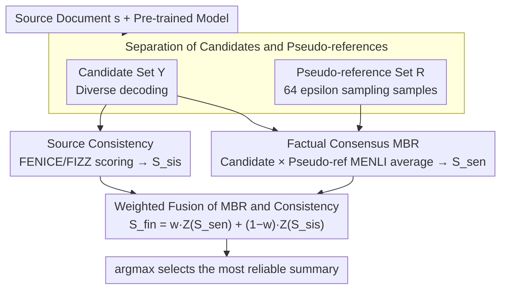

# Enhancing Factuality through Consensus and Consistency in Summarization Using Minimum Bayes Risk Decoding

**Conference**: ACL2026 Findings  
**arXiv**: [2605.29336](https://arxiv.org/abs/2605.29336)  
**Code**: https://github.com/naist-nlp/ConSUM  
**Area**: Summarization / Factual Consistency / Reranking  
**Keywords**: Summary Factuality, MBR decoding, Pseudo-references, reference-free metric, reranking

## TL;DR
This paper proposes ConSUM, which evaluates both the factual consistency of summary candidates with the source document and the consensus among candidates. By combining MBR decoding with factuality metrics such as FENICE/FIZZ for reranking, it enhances the factual reliability of summaries on CNN/DailyMail, XSum, and in human evaluations.

## Background & Motivation
**Background**: Automatic summarization systems typically generate one or more candidate summaries using a generative model and then select the best output using ROUGE, BERTScore, factuality evaluators, or rerankers. Since human gold summaries are unavailable at test time, many reference-free reranking methods rely solely on the source document to judge whether a candidate is faithful to the input.

**Limitations of Prior Work**: Reference-free metrics that rely only on the source document are unstable. On one hand, for long source documents, evaluators may only judge the relevance between the candidate and the source at a coarse level, missing small but critical factual errors. On the other hand, a single metric tends to push reranking toward its own preferences, such as longer summaries or those easily recognized by a specific fact extractor, which are not necessarily better.

**Key Challenge**: Summary factuality needs to satisfy two conditions simultaneously: it must be consistent with the source document and should fall within the semantic region that the generative model itself considers credible. The former corresponds to consistency, and the latter to consensus. Previous reranking methods often optimized only one of these signals, leading to results easily swayed by metric bias or a single anomalous candidate.

**Goal**: The authors aim to construct a usable "reference signal" in test scenarios where human reference summaries are absent. Specifically, the system selects the final summary from candidates and pseudo-references sampled from the same model, utilizing both source-based factuality metrics and NLI-style consistency between candidates and pseudo-references.

**Key Insight**: Minimum Bayes Risk (MBR) decoding is commonly used in machine translation to select the output with the highest expected utility from a candidate pool. This paper applies this idea to summary factuality: if a candidate remains consistent with multiple pseudo-references from the same source, it is more likely to represent a stable fact in the model's distribution. Combined with source document consistency checks, this can filter out candidates that "look fluent but deviate from facts."

**Core Idea**: Supplement "inter-candidate consensus" with "source document consistency" by using a weighted combination of MBR scores and reference-free factuality scores to select more reliable summaries.

## Method

### Overall Architecture
ConSUM does not retrain the summarization model but performs candidate selection after decoding. The input is a source document $s$ and a pre-trained summarization model, and the output is the summary judged most reliable. The system first samples two sets of texts from the model: a candidate set $\mathcal{Y}$ providing diverse outputs to be selected, and a pseudo-reference set $\mathcal{R}$ as an internal reference approximating the gold summary. Two scores are calculated for each candidate $y_i$: first, factual consistency with the source document (consistency, using reference-free metrics like FENICE/FIZZ), and second, the average utility against the pseudo-reference set (consensus, using MENLI for MBR utility). Finally, the two scores are fused after z-score normalization: $S_{fin}=wZ(S_{sen})+(1-w)Z(S_{sis})$. The candidate $\arg\max_y S_{fin}$ is selected to filter out summaries that appear fluent but are factually incorrect.

### Key Designs

**1. Separation of Candidate and Pseudo-reference Sets: Decoupling "the evaluated" from "the ruler"**

Since no human gold summary is available at test time, ConSUM uses pseudo-references sampled from the same model as an approximate reference. However, if $\mathcal{Y}=\mathcal{R}$, MBR consensus would be contaminated by the sampling bias of the candidate pool itself; an anomalous candidate sampled multiple times would be wrongly treated as "consensus." Therefore, this paper separates the two: the candidate set $\mathcal{Y}$ uses decoding strategies emphasizing diversity (epsilon sampling/diverse beam search for PLMs, nucleus sampling for LLMs), while the pseudo-reference set $\mathcal{R}$ is fixed at 64 epsilon sampling samples to cover the model's true distribution. This allows independent tuning and reduces the risk of misidentifying anomalous candidates as consensus.

**2. Using MENLI for Factual Consensus MBR: Directing "consensus" toward factual agreement rather than common phrasing**

For each candidate $y_i$, the MENLI utility against all pseudo-references $r_j$ is averaged: $S_{sen}(y_i,\mathcal{R})=\frac{1}{|\mathcal{R}|}\sum_j u(y_i,r_j)$. ROUGE or BERTScore, common in machine translation, are avoided because they favor lexical or semantic similarity, which might lead "consensus" toward common expressions. Summarization hallucination problems care about factual agreement. By switching to NLI-based MENLI, a candidate only receives a high consensus score if it is factually supported by multiple pseudo-references, effectively using a majority vote of facts sampled from the model.

**3. Weighted Fusion of MBR and Source Consistency: Mutual support between consensus signals and source constraints**

Relying solely on MBR might favor longer summaries or those easily validated by MENLI, while relying solely on reference-free metrics might miss fine-grained factual errors. ConSUM normalizes $S_{sis}$ (from FENICE/FIZZ) and $S_{sen}$ (from MBR) and blends them with weight $w$: $w=0$ reverts to source consistency only, and $w=1$ reverts to MBR consensus only. Sensitivity experiments over $w\in\{0, 0.25, 0.5, 0.75, 1.0\}$ established $w=0.75$ as the unified default—it is optimal for CNN/DM and remains competitive for XSum, indicating that identifying consensus is dominant but still requires source consistency to prevent reward hacking of single metrics.

### Loss & Training
This work does not train a new generative model or a supervised reranker. All enhancements occur during inference: the sampling strategies for candidates and pseudo-references and the selection of weight $w$ constitute the "configuration." Statistical significance is tested using paired-bootstrap resampling with 10,000 iterations and Bonferroni correction to ensure that reranking gains are not due to sampling noise.

## Key Experimental Results

### Main Results

| Dataset / Eval | Metric or Setting | Key Result (Ours) | Comparison | Conclusion |
|--------|------|------|----------|------|
| CNN/DM | FIZZ score, epsilon setting | FENICE-0.75 increased Fi from 39.36 to 52.44 | Baseline 39.36 | Significant improvement in factuality |
| XSum | FIZZ score, epsilon setting | FENICE-0.75 increased Fi from 16.91 to 27.79 | Baseline 16.91 | More effective for highly abstractive/hallucinatory summaries |
| CNN/DM | MENLI-Entailment | Increased from 4.46 to 10.44 | Baseline 4.46 | Consensus signal improves entailment |
| XSum | MENLI-Entailment | Increased from -31.15 to -20.36 | Baseline -31.15 | Clear improvement even in negative score scenarios |
| Human Eval / CNN/DM | Overall | FENICE-0.75 is 4.63 | Baseline 4.56, MBR-1.0 is 4.57, Gold is 3.92 | Human evaluators prefer FENICE-0.75 most |

### Ablation Study

| Configuration | Key Metrics | Description |
|------|---------|------|
| FENICE, $w=0.75$ | CNN/DM 81.05, XSum 77.52 | Stable on both datasets, basis for default config |
| FIZZ, $w=0.75$ | CNN/DM 71.08, XSum 55.03 | Significant gain from MBR consensus compared to $w=0$ (14.15 / 17.37) |
| SimCLS, $w=1.0$ | CNN/DM 65.35, XSum 90.91 | Reference-free portion hurt SimCLS; excluded from final system |
| MBR-only, $w=1.0$ | FENICE: CNN/DM 68.86, XSum 39.70 | MBR alone is insufficient; source consistency constraints remain necessary |
| Human Eval / Factuality | FENICE-0.75 is 4.87 | Higher than MBR-1.0 (4.74), FIZZ-0.75 (4.77), and Baseline (4.79) |

### Key Findings
- The most effective configuration is neither relying solely on reference-free factuality nor solely on MBR, but a fusion of both; $w=0.75$ shows the consensus signal dominates but still needs the source document document consistency as a safeguard.
- Gains on XSum are particularly illustrative: as the dataset is more abstractive and hallucination-prone, ConSUM filters out obvious factual deviations through pseudo-reference consensus.
- Oracle scores remain significantly higher than current methods; the authors note that for many metrics, the oracle can more than double the best ConSUM score, suggesting better summaries exist in the candidate pool but selectors have not yet fully identified them.
- Although FENICE and FIZZ are both atomic fact-style metrics, their granularity differs: FENICE usually extracts 3-6 ACUs, while FIZZ extracts more fact units, so their relationship with final factuality scores is not perfectly identical.

## Highlights & Insights
- A major highlight is transforming the "absence of gold references" into "constructing pseudo-references from the model distribution." It does not assume pseudo-references are perfectly correct but treats the average consistency across multiple pseudo-references as a noise-resistant signal, which is a practical approach.
- The separation of candidates and pseudo-references is a subtle but critical detail. It serves as a reminder that when using sampling sets for self-evaluation, candidate diversity and reference representativeness are two distinct goals; mixing them can muddy the evaluation signal.
- The paper avoids blind pursuit of optimizing a single factuality metric and explicitly discusses metric bias. For any task using "evaluators to guide generation," this experience is transferable: it is best to model target metrics and constraint metrics separately.
- In human evaluation, the gold reference did not score high, which is an interesting but reasonable signal. The quality of CNN/DM reference summaries is controversial; thus, "surpassing gold" should not necessarily be interpreted as the model being strictly better, but rather that reference noise in the benchmark affects automatic evaluation.

## Limitations & Future Work
- The computational complexity of MBR is $O(n^2)$, and increasing the number of candidates or pseudo-references rapidly scales up costs. This paper limited its exploration to numbers of candidates/pseudo-references, leaving utility functions and pseudo-reference generation strategies for further study.
- FENICE and FIZZ also have computational bottlenecks in large-scale processing, preventing the authors from more exhaustively searching weights, metric combinations, and sampling strategies.
- Experiments covered only two English news summarization datasets (CNN/DM and XSum). The difference in optimal weights between them suggests that the method may need recalibration for long documents, dialogue summarization, medical/legal summaries, or multilingual tasks.
- Future work could consider more efficient MBR approximations, learned weight selection, dynamic adjustment of $w$ based on source/candidate features, and extending pseudo-reference consensus to multi-model ensembles rather than sampling from a single model.

## Related Work & Insights
- **vs source-only reranking**: Traditional reference-free reranking primarily compares candidates to the source document. This paper introduces inter-candidate consensus, which captures anomalous facts missed by source document evaluators at the cost of higher sampling and pairwise scoring expenses.
- **vs MBR decoding in NMT**: MBR in NMT typically uses similarity between candidates and pseudo-references to select translations. This paper replaces the utility with MENLI and shifts the objective from semantic similarity to factual consistency, better suiting the summarization hallucination problem.
- **vs SimCLS / BERTScore-style consensus**: These methods emphasize semantic or quality similarity. ConSUM’s MENLI utility focuses on entailment vs. contradiction, making it more suitable for factuality-sensitive summarization.
- **Insights**: In generation tasks without human reference answers, a weakly supervised selector can be constructed using "model self-sampling consensus + external consistency constraints." This paradigm could potentially be applied to Q&A, report generation, code explanation, and open information extraction.

## Rating
- Novelty: ⭐⭐⭐⭐ While MBR and factuality metrics are not new, systematically combining candidate consensus with source document consistency for summarization factuality reranking is clear and effective.
- Experimental Thoroughness: ⭐⭐⭐⭐ Automatic metrics, weight analysis, human evaluation, and oracle analysis are comprehensive, though the data domain is limited to English news.
- Writing Quality: ⭐⭐⭐⭐ The motivation is clear, and charts/appendix are sufficient; the main tables are large, requiring readers to focus on the main trends among many metrics.
- Value: ⭐⭐⭐⭐ Directly valuable for factual summarization, reference-free reranking, and sampling-based decoding, particularly as an inference-time enhancement for existing models.

<!-- RELATED:START -->

## Related Papers

- [\[ICLR 2026\] Attribution-Guided Decoding](../../ICLR2026/information_retrieval/attribution-guided_decoding.md)
- [\[NeurIPS 2025\] Retrieval is Not Enough: Enhancing RAG Reasoning through Test-Time Critique and Optimization](../../NeurIPS2025/information_retrieval/retrieval_is_not_enough_enhancing_rag_reasoning_through_test-time_critique_and_o.md)
- [\[ACL 2025\] Reranking-based Generation for Unbiased Perspective Summarization](../../ACL2025/information_retrieval/reranking-based_generation_for_unbiased_perspective_summarization.md)
- [\[ACL 2025\] ARise: Towards Knowledge-Augmented Reasoning via Risk-Adaptive Search](../../ACL2025/information_retrieval/arise_risk_adaptive_search.md)
- [\[ICML 2026\] CARE: Class-Adaptive Expert Consensus for Reliable Learning with Long-Tailed Noisy Labels](../../ICML2026/information_retrieval/care_class-adaptive_expert_consensus_for_reliable_learning_with_long-tailed_nois.md)

<!-- RELATED:END -->
