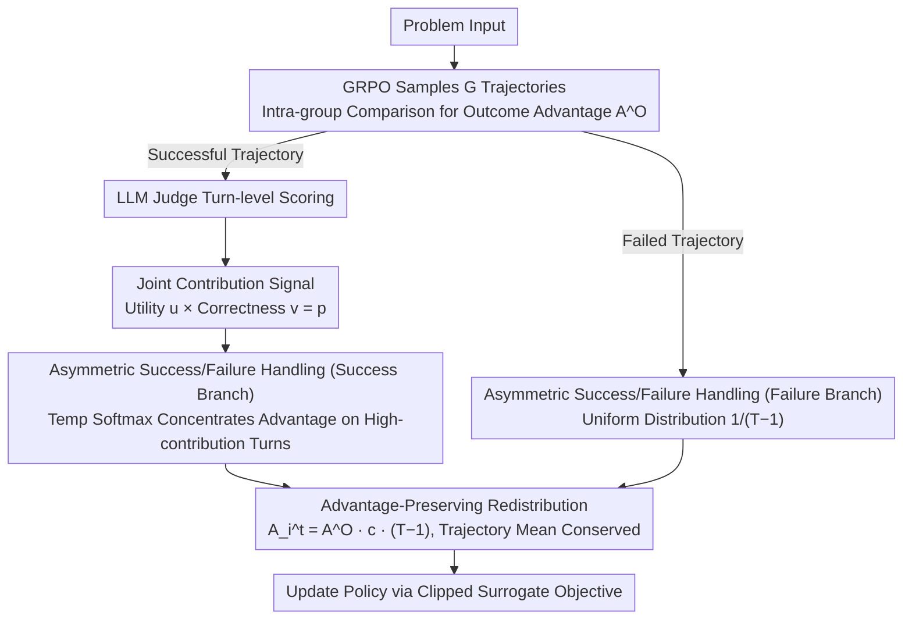

# Enhancing LLM-based Search Agents via Contribution Weighted Group Relative Policy Optimization

**Conference**: ACL 2026  
**arXiv**: [2604.14267](https://arxiv.org/abs/2604.14267)  
**Code**: [GitHub](https://github.com/zsxmwjz/CW-GRPO)  
**Area**: Information Retrieval  
**Keywords**: Search Agents, GRPO, Contribution Weighting, Process Supervision, Credit Assignment

## TL;DR
CW-GRPO redefines process supervision as "advantage redistribution": using an LLM judge to evaluate the retrieval utility and reasoning correctness of each search round, calculating contribution scores to scale outcome-based advantages. This achieves turn-level credit assignment without introducing unstable value functions, outperforming standard GRPO by 5.0% on Qwen3-8B.

## Background & Motivation

**Background**: Search agents (e.g., Search-R1, R1-Searcher) enhance the factual reliability of LLMs by iteratively retrieving external evidence. Training methods are typically categorized into process supervision (turn-level rewards + PPO) and outcome supervision (final answer rewards + GRPO).

**Limitations of Prior Work**: Process supervision requires learning a value function for turn-level reward estimation, but the high variance of intermediate states leads to unstable estimates and fragile training. Outcome supervision (GRPO) provides stable training but suffers from sparse reward signals—assigning identical credit to every search turn in a successful trajectory, failing to distinguish between critical and redundant steps.

**Key Challenge**: Process supervision is fine-grained but unstable, while outcome supervision is stable but coarse-grained—a balance must be struck between the two.

**Goal**: Achieve turn-level credit assignment while maintaining the training stability of GRPO.

**Key Insight**: Instead of directly optimizing process rewards, use process signals to modulate (rescale) outcome advantages—treating process supervision as an advantage redistribution problem.

**Core Idea**: An LLM judge evaluates the retrieval utility $u$ and reasoning correctness $v$ for each turn $\rightarrow$ joint contribution score $p = u \cdot v$ $\rightarrow$ redistribute outcome advantages to high-contribution turns via temperature softmax.

## Method

### Overall Architecture
CW-GRPO reformulates process supervision as "advantage redistribution" rather than learning an additional value function. For each problem, $G$ search trajectories are sampled following the GRPO framework, and a trajectory-level outcome advantage $A_i^O$ is obtained through intra-group relative comparison; traditionally, this would be uniformly distributed across every search turn of the trajectory. CW-GRPO inserts a modulation layer: for each turn of a successful trajectory, an LLM judge evaluates the retrieval utility and reasoning correctness to synthesize a contribution score. A temperature softmax is then used to tilt the total advantage of the trajectory toward high-contribution turns; failed trajectories maintain a uniform distribution. Finally, the policy is optimized using the standard clipped surrogate objective, ensuring training stability consistent with GRPO while gaining turn-level credit assignment.

### Key Designs

**1. Conjunctive Contribution: Real progress requires both good retrieval and correct application**

Each round of a search agent involves two potentially decoupled actions—retrieval and reasoning. CW-GRPO utilizes an LLM judge to assign two orthogonal binary signals per round: retrieval utility $u_i^t$ (whether new, task-relevant evidence was obtained) and reasoning correctness $v_i^t$ (whether the reasoning chain correctly interpreted the current context). The contribution score is the logical AND of the two: $p_i^t = u_i^t \cdot v_i^t$. This "AND" logic is intentional: useful retrieval paired with faulty reasoning wastes good evidence, while correct reasoning paired with useless retrieval results in idling. Only when both are present is the agent truly progressing toward the answer, and only such turns should receive amplified credit.

**2. Asymmetric Treatment of Success/Failure Trajectories: Attribution for success, no forced attribution for failure**

Successful trajectories use temperature-controlled softmax to concentrate advantage on high-contribution turns: $c_i^t = \exp(\alpha p_i^t) / \sum_{t'} \exp(\alpha p_i^{t'})$. Failed trajectories, however, use uniform distribution $c_i^t = 1/(T_i-1)$. The underlying philosophy is that the attribution of success and failure is asymmetric—if a trajectory succeeds, it is usually possible to pinpoint which specific turns of good retrieval/reasoning caused it; however, failure is often rooted in external factors (e.g., the corpus not covering the answer) rather than a specific decision error by the agent. Forcing attribution when it is ambiguous introduces noisy supervision, so failed trajectories revert to uniform distribution to avoid erroneous penalties and preserve GRPO's inherent stability.

**3. Advantage-Preserving Redistribution: Redistributing credit without changing the total learning signal**

The redistributed turn-level advantage is defined as $A_i^t = A_i^O \cdot c_i^t \cdot (T_i-1)$. This specific form ensures that $\frac{1}{T_i-1}\sum_t A_i^t = A_i^O$, meaning the mean advantage within a trajectory remains equal to the original outcome advantage. This setup amplifies gradient signals for high-contribution turns and suppresses them for low-contribution turns without altering the total signal magnitude at the trajectory level. Consequently, CW-GRPO maintains the same gradient scale as original GRPO, avoiding the training instability typically associated with process signals.

### Loss & Training
The policy is optimized using the clipped surrogate objective $\mathcal{L}(\theta) = -\mathbb{E}[\min(rA, \text{clip}(r, 1-\epsilon, 1+\epsilon)A)]$, where $A$ represents the redistributed turn-level advantage. The reliability of the judge was calibrated: across 97 search turns of human annotation, the LLM judge achieved a 95% consensus rate with human experts, supporting the feasibility of using LLMs as a substitute for PRM-style human process labeling.

## Key Experimental Results

### Main Results

| Model | Method | Performance Gain | Note |
|------|------|---------|------|
| Qwen3-8B | CW-GRPO vs GRPO | +5.0% | Multiple knowledge-intensive benchmarks |
| Qwen3-1.7B | CW-GRPO vs GRPO | +6.3% | Larger gains for smaller models |
| - | CW-GRPO vs Process Supervision Baseline | Consistently Superior | Avoids value function instability |

### Ablation Study

| Configuration | Key Metric | Note |
|------|---------|------|
| Retrieval Utility Only | Lower than Joint | Single signal is insufficient |
| Reasoning Correctness Only | Lower than Joint | Single signal is insufficient |
| Attribution for Failed Trajectories | Inferior to Uniform | Validates the necessity of asymmetric design |
| Different Temperature $\alpha$ | Optimal at Moderate Values | Too high causes over-concentration; too low degrades to GRPO |

### Key Findings
- In successful trajectories, contribution is highly concentrated in a few key turns—a structural characteristic of search agent tasks.
- Small models (1.7B) benefit more from CW-GRPO (+6.3%), likely because they require finer credit assignment to improve search efficiency.
- The 95% consensus rate between the LLM judge and human labels proves the feasibility of LLM-based process evaluation.
- Accurate attribution for failed trajectories remains a structural challenge—many failures are not caused by agent decision errors.

## Highlights & Insights
- **Redefining process supervision as advantage redistribution** provides an elegant perspective shift—it avoids training a value function or directly optimizing process rewards, instead using process signals to modulate outcome advantages.
- The design of the **Conjunctive Contribution signal ($u \cdot v$)** reflects the core of search tasks: good retrieval must be accompanied by correct interpretation; neither is sufficient alone.
- The **asymmetric treatment philosophy** is profound—"We know why we succeeded, but we don't necessarily know why we failed."

## Limitations & Future Work
- The LLM judge itself may have biases, particularly in judging reasoning correctness.
- Validation is limited to knowledge-intensive QA tasks; applicability to other agent tasks like code generation remains to be verified.
- The temperature $\alpha$ is a hyperparameter that may require tuning across different tasks.
- Binary contribution signals (0/1) may be too coarse; continuous valuations could offer finer granularity.

## Related Work & Insights
- **vs Search-R1**: Search-R1 uses standard GRPO for outcome supervision; CW-GRPO adds turn-level credit assignment.
- **vs PPO Process Supervision**: PPO requires learning a value function and suffers from training instability; CW-GRPO eliminates the value function entirely.
- **vs PRM Methods**: PRM requires turn-level human annotation; CW-GRPO replaces this with an LLM judge.

## Rating
- Novelty: ⭐⭐⭐⭐ The shift from process supervision to advantage redistribution is novel, and the joint contribution signal is well-designed.
- Experimental Thoroughness: ⭐⭐⭐⭐ Validated across two model sizes, multiple benchmarks, and judger calibration.
- Writing Quality: ⭐⭐⭐⭐⭐ Clear motivation chain, smooth derivation of methods, and elegant formula design.

<!-- RELATED:START -->

## Related Papers

- [\[ACL 2026\] End-to-End Optimization of LLM-Driven Multi-Agent Search Systems via Heterogeneous-Group-Based Reinforcement Learning](end-to-end_optimization_of_llm-driven_multi-agent_search_systems_via_heterogeneo.md)
- [\[ACL 2026\] Can Compact Language Models Search Like Agents? Distillation-Guided Policy Optimization for Preserving Agentic RAG Capabilities](can_compact_language_models_search_like_agents_distillation-guided_policy_optimi.md)
- [\[ACL 2026\] From Relevance to Authority: Authority-aware Generative Retrieval in Web Search Engines](from_relevance_to_authority_authority-aware_generative_retrieval_in_web_search_e.md)
- [\[ICML 2026\] ReSeek: A Self-Correcting Framework for Search Agents with Instructive Rewards](../../ICML2026/information_retrieval/reseek_a_self-correcting_framework_for_search_agents_with_instructive_rewards.md)
- [\[ACL 2026\] Rerank Before You Reason: Analyzing Reranking Tradeoffs through Effective Token Cost in Deep Search Agents](rerank_before_you_reason_analyzing_reranking_tradeoffs_through_effective_token_c.md)

<!-- RELATED:END -->
