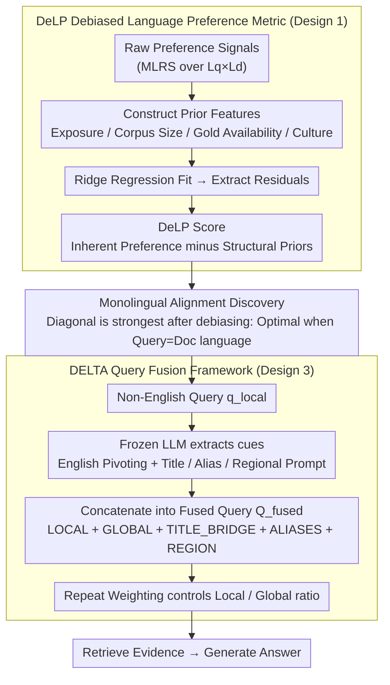

# Enhancing Multilingual RAG Systems with Debiased Language Preference-Guided Query Fusion

**Conference**: ACL 2026 Findings  
**arXiv**: [2601.02956](https://arxiv.org/abs/2601.02956)  
**Code**: [GitHub](https://github.com/jeonghyunpark2002/DELTA)  
**Area**: Information Retrieval / Multilingual RAG  
**Keywords**: Multilingual RAG, English-centric bias, Language preference, Query fusion, Debiased calibration

## TL;DR

This paper discovers that the "English preference" in multilingual RAG systems is primarily an artifact of structural priors in evaluation benchmarks (gold evidence concentrated in English, cultural priors) rather than an inherent model bias. It proposes DeLP, a debiased language preference metric, to reveal that retrievers actually prefer monolingual alignment. Based on this, the DELTA query enhancement framework is designed, consistently surpassing English-pivoting strategies in multilingual RAG.

## Background & Motivation

**Background**: Multilingual RAG (mRAG) enhances the cross-lingual answering capabilities of LLMs by retrieving evidence from multilingual knowledge sources. English-pivoting (translating non-English queries into English before retrieval) is widely considered an effective heuristic strategy.

**Limitations of Prior Work**: (1) The academic community generally attributes the effectiveness of English-pivoting to the "English-centric" capabilities of LLMs—stronger English reasoning and less translation noise. (2) However, this paper finds that "English preference" is mainly driven by structural biases in evaluation benchmarks—in MKQA, 73.3% of gold evidence exists in English Wikipedia, while other languages account for only 0.5-1.4%. (3) Existing metrics (such as MLRS) cannot distinguish between the model's true preference and the external necessity imposed by data distribution.

**Key Challenge**: English-pivoting appears effective not because the model prefers English, but because correct answers exist almost exclusively in English resources—this is data imbalance rather than model bias. After removing these structural confounders, what is the model's true preference?

**Goal**: (1) Reveal the true source of "English preference" in mRAG; (2) Design a debiased metric DeLP to measure the model's inherent language preference; (3) Design a better mRAG strategy based on debiased insights.

**Key Insight**: Identify three types of structural priors—exposure prior (high-resource corpora dominating retrieval results), gold availability prior (correct evidence concentrated in English), and cultural prior (regional topics tied to specific languages). These priors are then regressed out from the raw preference signals using ridge regression.

**Core Idea**: After debiasing, it is found that the retriever's true preference is monolingual alignment (retrieval is most effective when query and document languages match) rather than English preference. Therefore, queries should be augmented as multilingual anchors to leverage monolingual alignment instead of blindly translating to English.

## Method

### Overall Architecture
This paper proceeds in two steps: first, utilizing the DeLP metric to diagnose which language the multilingual retriever "truly prefers," and then using the DELTA framework to rewrite queries accordingly. The input for DeLP is the raw preference signals of the retriever under various combinations of query language $L_q$ and document language $L_d$. It constructs a set of prior features (exposure, corpus size, gold availability, culture) and uses ridge regression to fit the portions explainable by these structural priors. The remaining residuals are defined as the debiased inherent preference. Plotting the de-biased preferences into a matrix reveals a counter-intuitive conclusion: the strongest signals fall on the diagonal—the retriever truly prefers "query-document language matching" (monolingual alignment), not English. The DELTA framework rewrites queries based on this: for a non-English query, it retains the original local query to benefit from monolingual alignment, while using a frozen LLM to supplement English pivoting and cross-lingual entity anchors (canonical titles, aliases, regional prompts), concatenating these cues into a fused query for the retriever. The balance between local signals and global English signals is controlled via "repeat weighting" based on the debiased preferences revealed by DeLP, and finally, the generator produces the answer.

### Key Designs

**1. DeLP Debiased Language Preference Metric: Subtracting Data Distribution Effects from Model Preference**

Existing metrics (like MLRS) conflate "model preference for English" with "answers happening to be in English resources." In MKQA, 73.3% of gold evidence is in English Wikipedia, while others are at 0.5–1.4%; this extreme imbalance is often misread as model preference. DeLP explicitly decomposes the raw preference into a prior-explained part and a residual: using ridge regression $s_e(L_q, L_d) \approx w^\top \phi(L_q, L_d) + \epsilon$ to fit structural factors like exposure prior, gold availability prior, and cultural prior. The residual $\epsilon$ is defined as the DeLP score, representing the model's true linguistic inclination after deducting environmental necessity.

**2. Monolingual Alignment Discovery: True Preference Emerging After Debiasing**

Applying DeLP to retrievers yields a counter-intuitive conclusion: the seemingly overwhelming English preference shrinks significantly to a moderate level after debiasing, while "monolingual alignment" signals strengthen—retrieval performance is best when the query language matches the document language (e.g., Japanese query searching Japanese Wikipedia). This discovery rewrites the explanation for English-pivoting: it is effective only because it indirectly leverages the richness of English resources, not because it hits the model's optimal preference. Since the model truly wants same-language matching, blind translation to English moves further away from the optimum.

**3. DELTA Query Fusion Framework: Implementing Monolingual Alignment as a Fused Query**

DELTA translates the above insights into a lightweight enhancement operating solely at the query level. For a local query $q_{local}$, it first utilizes a frozen LLM to construct an English pivot $q_{glob}$ and extracts cross-lingual entity cues (paired canonical titles, aliases, regional prompts). These are concatenated with the original query into a fused query $Q_{fused}$ consisting of five segments: [LOCAL] (original query for monolingual alignment dividends), [GLOBAL] (English pivot for English gold resource coverage), [TITLE_BRIDGE] (bilingual title bridge), [ALIASES] (aliases), and regional prompts. Retaining the original script is crucial: native surface anchors like titles, aliases, and original characters are vital for precise entity matching—information often lost during English-pivoting translation. The ratio between local and global signals is not set by a single weight but by a "repeat weighting" strategy—repeating corresponding segments based on the debiased preference from DeLP and confidence in cultural cues (repeating local-side title/alias anchors when cultural cues are hit with high confidence). The entire process requires no changes to the retriever, generator, or corpus, making it lightweight and dynamically adaptable per query.

### Loss & Training
This work does not involve model training; all conclusions are derived from off-the-shelf components. The retriever uses BGE-m3, and generators include Qwen3-235B, DeepSeek-v3.1, and Gemini-2.5-Flash. DeLP's ridge regression is an analytical tool, and DELTA is an inference-time query rewriting strategy.

## Key Experimental Results

### Main Results

**End-to-End Multilingual RAG Accuracy (Selected Languages)**

| Method | ko | zh | ja | ar | Avg |
|------|-----|-----|-----|-----|------|
| Base (Original Language Query) | Low | Low | Low | Low | Low |
| English-Pivoting | Mid | Mid | Mid | Mid | Mid |
| **DELTA** | **High** | **High** | **High** | **High** | **Highest** |

### Ablation Study

**Impact of Structural Priors on Preference Metrics**

| Metric | English Preference | Monolingual Alignment Signal |
|------|---------|-----------|
| MLRS (Original) | Strong | Weak |
| **DeLP (Debiased)** | **Weak** | **Strong** |

### Key Findings

- English Wikipedia covers 73.3% of gold evidence, while others cover only 0.5-1.4%—the "effectiveness" of English-pivoting stems largely from this extreme imbalance.
- After debiasing, English preference significantly decreases, and monolingual alignment becomes the dominant preference—retrievers perform best when query and document languages match.
- DELTA consistently outperforms English-pivoting, proving that leveraging the model's true preference is more effective than following biased environmental signals.
- Cultural prior is also a major confounder—correct answers for regional questions are more likely to exist in the Wikipedia of the corresponding language.

## Highlights & Insights

- The systematic deconstruction of the "English preference myth" is the core contribution of this paper, revealing a significant blind spot in evaluation methodology.
- The design of the DeLP metric (regressing out known priors to examine residuals) is transferable to any evaluation scenario involving confounding factors.
- DELTA is extremely lightweight, operating only at the query level without requiring modifications to models, retrievers, or corpora.

## Limitations & Future Work

- The debiasing effect of DeLP depends on the completeness of identified prior factors—unidentified confounders may still influence conclusions.
- Validated only on the MKQA benchmark; conclusions might differ on other multilingual QA benchmarks.
- The translation step in DELTA introduces additional latency.
- The impact of the retriever's own training bias on language preference was not explored.

## Related Work & Insights

- **vs. English-pivoting Strategy**: This paper proves the effectiveness of English-pivoting comes from data imbalance rather than model preference.
- **vs. MLRS**: MLRS conflates structural priors with model preference; DeLP reveals true signals through debiasing.
- **vs. CoPriva**: While CoPriva studies text privacy protection, this paper focuses on debiasing language preferences.

## Rating

- Novelty: ⭐⭐⭐⭐⭐ The deconstruction of "English preference myth" and the DeLP metric are significant contributions.
- Experimental Thoroughness: ⭐⭐⭐⭐ Validated with three strong LLMs, but only on the MKQA benchmark.
- Writing Quality: ⭐⭐⭐⭐⭐ Analytical logic is rigorous; the identification and demonstration of structural biases are convincing.
- Value: ⭐⭐⭐⭐ Changed the understanding of multilingual RAG; both DeLP and DELTA have direct practical value.

<!-- RELATED:START -->

## Related Papers

- [\[ACL 2025\] Investigating Language Preference of Multilingual RAG Systems](../../ACL2025/information_retrieval/investigating_language_preference_of_multilingual_rag_systems.md)
- [\[ACL 2026\] Language-Coupled Reinforcement Learning for Multilingual Retrieval-Augmented Generation](language-coupled_reinforcement_learning_for_multilingual_retrieval-augmented_gen.md)
- [\[ICML 2026\] Linguistic Nepotism: Trading-off Quality for Language Preference in Multilingual RAG](../../ICML2026/information_retrieval/linguistic_nepotism_trading-off_quality_for_language_preference_in_multilingual_.md)
- [\[ACL 2026\] All Languages Matter: Understanding and Mitigating Language Bias in Multilingual RAG](all_languages_matter_understanding_and_mitigating_language_bias_in_multilingual_.md)
- [\[ACL 2026\] Multi-Faceted Self-Consistent Preference Alignment for Query Rewriting in Conversational Search](multi-faceted_self-consistent_preference_alignment_for_query_rewriting_in_conver.md)

<!-- RELATED:END -->
