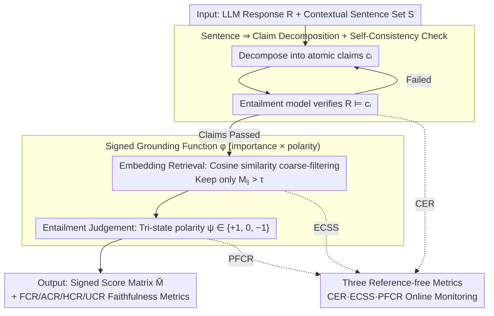

# eTracer: Towards Traceable Text Generation via Claim-Level Grounding

**Conference**: ACL 2026  
**arXiv**: [2601.03669](https://arxiv.org/abs/2601.03669)  
**Code**: https://github.com/chubohao/eTracer  
**Area**: Text Generation / Traceability / Biomedical RAG  
**Keywords**: claim-level grounding, RAG verifiability, hallucination detection, biomedical QA, citation granularity

## TL;DR
eTracer decomposes RAG responses into atomic claims and searches for sentence-level evidence (supporting or refuting) within the context. By using a three-step pipeline (decomposition → embedding retrieval → entailment judgment), it outputs a signed score matrix. This allows for precise back-tracing of factual origins and quantitative assessment of response faithfulness in biomedical scenarios.

## Background & Motivation

**Background**: Current mainstream RAG systems and commercial search engines (e.g., Perplexity, Bing Chat) provide responses with citations. However, the citation granularity remains at the level of "entire webpage/passage ⇒ entire response sentence." Users often must read through the entire context to verify a single fact. Subsequent academic works proposed inline citation, attribute-then-generate, and TRUE/NLI evaluation methods, but these are largely built on the assumption of "sentence-level ⇒ sentence-level" alignment.

**Limitations of Prior Work**: Through preliminary user experiments (Appendix A), the authors found that the average manual verification time for three mainstream schemes—passages ⇒ response, passages ⇒ sentence, and token ⇒ token—was 446 s, 212 s, and 312 s, respectively, with accuracy only between 91%–96%. This indicates that "finer is not necessarily better": coarse granularity requires excessive reading, while token-level granularity is too noisy. The intermediate sentence-to-sentence alignment frequently fails because a single response sentence often carries multiple independent facts.

**Key Challenge**: Response sentences are information-dense complexes (often containing multiple subject-predicate-object relations), whereas contextual evidence consists of sentences stating single assertions. Forcing sentence-to-sentence entailment inevitably results in only partial fact matching, leading to low recall and precision. Furthermore, the biomedical field allows for the coexistence of "supporting and refuting evidence," a state of ambiguity that traditional binary classification (entailment vs. non-entailment) cannot represent.

**Goal**: (1) Redefine the semantic unit of grounding—shifting from "sentence" to "claim" (atomic, independent, and verifiable facts); (2) Design a signed grounding function to characterize both the importance and polarity of evidence; (3) Develop reference-free metrics that allow for self-monitoring in real-world scenarios without ground truth.

**Key Insight**: The authors made three key empirical observations (Appendix B): ① Extracted claims should be entailed by the original response (CER $\ge$ 97%); ② A claim and its evidence should share high semantic similarity (cos $\approx$ 0.75); ③ After semantic negation of a claim, the roles of supporting/refuting evidence should flip (PFCR $\approx$ 90%). These properties serve as natural metrics for evaluating grounding methods.

**Core Idea**: Replace "sentence ⇒ sentence" grounding with "sentence ⇒ claim" grounding. Utilize a lightweight pipeline consisting of "decomposition + embedding retrieval + NLI polarity judgment" to assign a signed score $ \in \{-1, 0, +1\} \times \text{cos sim} $ to each (claim, context sentence) pair.

## Method

### Overall Architecture

eTracer is a plug-and-play post-processor following RAG. It takes "LLM response $\mathcal{R}$ + context sentence set $S=\{s_i\}_{i=1}^m$" as input and outputs a "signed score matrix $\tilde{M} \in \mathbb{R}^{p \times m}$" for each sentence in the response. The pipeline operates in three stages: first, it decomposes response sentences into atomic claims and performs self-verification; second, it computes cosine similarity between claim and context sentence embeddings (via Qwen3-Embedding-8B) for coarse filtering; finally, an entailment model determines the polarity of candidate (claim, evidence) pairs. This score, combining intensity and direction, enables back-tracing of facts and calculation of four faithfulness metrics: FCR, ACR, HCR, and UCR. Three reference-free indicators monitor the pipeline online.

### Key Designs

**1. Sentence ⇒ Claim Decomposition + Self-Consistency Check: Splitting response sentences into atomic facts and enforcing entailment by the original sentence.**

The pain point is that if the decomposition model hallucinates even one claim, the downstream grounding is permanently contaminated—the false claim will never find supporting evidence and will be misjudged as a hallucination. eTracer uses GPT-5.1 to generate distillation data $\mathcal{D}_{dec}$ on 182 manually labeled sentence-claim groups, distilling this capability into Qwen3-14B (LoRA, 4-bit, 10 epochs, lr $2 \times 10^{-4}$). The goal is to maximize the conditional NLL: $\max_{\mathcal{M}_{dec}} \mathbb{E}_{(r,\{c_i\})} \log p_{\mathcal{M}_{dec}}(\{c_i\} \mid r)$. It treats "decomposition-stage hallucinations" as a failure mode that must be fixed: during inference, after each sentence is split, an entailment model $\mathcal{M}_{ent}$ verifies $\mathcal{R} \models c_i$. If it fails, the system resamples until it passes or reaches a threshold, preventing downstream contamination.

**2. Signed Grounding Function $\phi$ (Importance × Polarity): A scalar encoding both evidence strength and support/refutation direction.**

Traditional binary NLI often conflates "neutral" and "contradiction" into "not supported," losing critical biomedical signals like "this evidence actually contradicts this claim." eTracer splits the determination into two paths: the intensity path uses cosine similarity $M_{ij} = \mathbf{e}_{c_i} \cdot \mathbf{e}_{s_j}$ for retrieval filtering, and the polarity path uses an entailment model to give a tri-state sign $\psi(s, c) \in \{+1, -1, 0\}$. The final score $\tilde{M}_{ij} = M_{ij} \cdot \psi(s_j, c_i)$ is retained only when $M_{ij} > \tau$ (default $\tau = 0.5$); otherwise, it is set to 0. Decoupling "which sentences are worth looking at" (retrieval) from "how to compute after reading" (judgment) allows for speed adjustments and individual ablation of FCR / ACR / HCR / UCR.

**3. Three Reference-free Metrics (CER / ECSS / PFCR): Online monitoring of grounding quality without ground truth.**

In production deployment, golden citation sets are unavailable for continuous scoring. eTracer uses three properties verified as proxies. CER $= \frac{1}{p} \sum \mathbb{I}[\mathcal{R} \models c_i]$ measures decomposition faithfulness; being close to 1 indicates claims weren't fabricated (97% on GT). ECSS $= \frac{1}{k} \sum \mathrm{Sim}(c, s_i)$ measures "retrieval-semantic" consistency between the claim and picked evidence (cos $\approx$ 0.75 on GT). PFCR $= \frac{1}{k} \sum \mathbb{I}[\phi(s_i, c) \approx -\phi(s_i, \neg c)]$ measures whether the sign flips when a claim is negated, indicating robust polarity judgment (90% on GT). These three correspond to the decomposition, retrieval, and polarity judgment stages, allowing industrial deployment to calculate performance scores without manual labeling.

### Example

For the response sentence "Drug X lowers blood pressure but raises liver enzymes": The decomposition model splits it into $c_1$ = "Drug X lowers blood pressure" and $c_2$ = "Drug X raises liver enzymes," each passing the $\mathcal{R} \models c_i$ check. After embedding, $c_1$ matches a sentence with cos 0.82, and $\mathcal{M}_{ent}$ determines "Entailment," resulting in $\tilde{M} = +0.82$. $c_2$ matches a sentence with cos 0.6 but is judged as "Contradiction," yielding $\tilde{M} = -0.6$. The final matrix informs the user: the first half has strong support, while the second half is refuted by the context and should be flagged.

### Loss & Training

Only two small models are fine-tuned:

- **Decomposition Model** $\mathcal{M}_{dec}$: Base = Qwen3-14B, LoRA + 4-bit, 182 samples, effective batch 256, 10 epochs on one A6000 GPU (~38 min). Target: $\max \log p(\{c_i\} \mid r)$ calculated only on response tokens.
- **Entailment Model** $\mathcal{M}_{ent}$: Base = Qwen3-4B-Instruct-2507, LoRA + 4-bit, 4,267 (claim, evidence, label) samples, effective batch 512, 5 epochs on one A6000 GPU (~45 min). Target: $\max \log p(y \mid (c, s))$.
- Inference: No sampling (temperature=0, top-k=1); Qwen3-Embedding-8B used as the universal embedder; $\tau = 0.5$ is default.

## Key Experimental Results

Databases: The authors manually labeled a biomedical grounding ground truth $\mathcal{D}_g$ (100 instances each from PubMedQA, BioASQ-QA, and TracSum), consisting of 578 response sentences, 1,564 claims, and 4,579 (claim, evidence) pairs. Negative samples were balanced by generating 1,564 refuting contexts via Qwen3-14B (98% verified as true contradictions). Split 30/70 for training/evaluation.

### Main Results

Baselines categorized into three tiers: sentence-level NLI (DeBERTa), sentence-level instruct-following (Qwen3 / Ministral / Llama), claim-level equivalents, and end-to-end claim grounding. All baselines were run twice (with and without decomposition).

| Method | Granularity | $\mathrm{F1}_e$ (Support) | $\mathrm{F1}_c$ (Refute) | Time (s) |
| :--- | :--- | :--- | :--- | :--- |
| Qwen3-4B-Instruct | Sentence | 0.557 | 0.815 | 4.71 |
| Qwen3-14B | Sentence | 0.592 | 0.811 | 8.70 |
| Qwen3-4B-Instruct + decomp | Claim | 0.639 ↑.082 | 0.817 ↑.002 | 14.18 |
| Qwen3-14B + decomp | Claim | 0.660 ↑.068 | 0.860 ↑.049 | 26.02 |
| **eTracer** ($\tau=0$) | Claim | **0.709** | **0.946** | 22.19 |
| **eTracer** ($\tau=0.5$) | Claim | 0.705 | 0.939 | **14.35** |

Compared to the same base Qwen3-4B-Instruct (sentence-level), eTracer improves $\mathrm{F1}_e$ by +0.152 (+27%) and $\mathrm{F1}_c$ by +0.131 (+16%). Improvements for refuting evidence are particularly significant.

End-to-end baselines (one-step claim+citation generation) collapsed in CER—Qwen3-14B scored only 0.309 as it tended to copy context as claims. eTracer pipeline CER = 0.930, proving the necessity of decoupled decomposition.

### Ablation Study

| Configuration | $\mathrm{F1}_e$ | $\mathrm{F1}_c$ | Description |
| :--- | :--- | :--- | :--- |
| w/o $\mathcal{M}_{dec}$ (Direct Sentence Grounding) | 0.607 | 0.485 | Removed decomposition |
| w/ $\mathcal{M}_{dec}$ (Full eTracer) | 0.705 | 0.939 | Full method |
| Δ | ↑.098 (+16%) | ↑.454 (+94%) | Refuting evidence nearly doubled |

Threshold $\tau$ scanning: Across $\tau \in \{0, 0.25, 0.5, 0.75, 1\}$, all metrics peaked at $\tau=0.25$. $\tau=0.5$ showed only marginal decline but reduced inference time by 7.84 s (-35%).

User experiment (Appendix A): S⇒C (Ours) had an average verification time of 116 s with 100% accuracy, while P⇒R was 446 s/91%, P⇒S was 212 s/96%, and T⇒T was 312 s/93%. S⇒C is 1.83x faster than the strongest baseline.

### Key Findings

- Removing decomposition affects **refuting evidence** ($\mathrm{F1}_c$ -0.454, -94%) significantly more than supporting evidence ($\mathrm{F1}_e$ -0.098, -16%). This suggests claim granularity is essential for identifying "opposing views," as refutations often target only a specific sub-assertion.
- The "failed claim redecomposition" mechanism through reverse distillation resulted in a CER +0.621 higher than end-to-end Qwen3-14B (0.930 vs 0.309), validating that "explicit decomposition + verification" is superior to single-pass processing.
- The peak at $\tau = 0.25$ aligns with the observed semantic prior of claim-evidence average cos $\approx$ 0.75, effectively embedding the prior into the pipeline.

## Highlights & Insights

- **"Fine-grained $\neq$ better" is a counter-intuitive but key insight**: Human experiments proved token-level grounding is slower than sentence-level (312 s vs 212 s). Selection of granularity should match the "semantic unit of human verification," not just be finer. This is valuable for explainability/attribution tasks.
- **Explainability of three reference-free metrics**: CER captures "false claim rate," ECSS captures "retrieval accuracy," and PFCR captures "polarity stability." Since they correspond to the three pipeline stages, they provide a white-box diagnosis system.
- **"Decomposition + Self-Consistency loop" moves the hallucination problem upstream**: Instead of detecting hallucinations in the final response, intercepting them during decomposition prevents the entire downstream chain from being contaminated.
- **Signed grounding characterizes "Support/Refute/Neutral" simultaneously**: The separation of FCR / ACR / HCR / UCR metrics is beneficial for evidence-based medicine. "Ambiguous" states (simultaneous contradiction) are exactly what clinicians need to flag, which binary classification fails to express.

## Limitations & Future Work

- **High inference cost**: Claim-level grounding is 1.7–22x slower than sentence-level. $\tau=0.5$ mitigates this by 35%, but further acceleration (e.g., batched NLI, smaller entailment models) is required for real-time scenarios.
- **Biomedical domain focus**: Evaluations were limited to biomedical data. While components are general-purpose, migration risks lie in prompt and fine-tuning data scale rather than architecture.
- **Mismatch with extractive generation**: When responses heavily copy context (e.g., extractive summarization), decomposition may introduce noise. The authors suggest reverting to sentence-level grounding for such cases.
- **Small ground truth scale (300 instances, ~5k claims)**: Statistical significance is limited. Future work should expand to 10k+ instances across multiple domains.
- **Coupling of embedder and NLI model**: Changing base models requires re-selecting $\tau$ and retraining.

## Related Work & Insights

- **vs LongCite (Zhang et al. 2025)**: LongCite outputs fine-grained citations during the generation phase, relying on instruction following. eTracer is a post-hoc framework with zero intrusion on generation and higher interpretability via independent search and entailment steps.
- **vs TRUE / NLI Evaluation (Honovich et al. 2022)**: TRUE uses sentence-level NLI for factuality but ignores the "one sentence, multiple facts" problem. eTracer applies NLI at the claim level for better granularity.
- **vs LOO attribution (Qi et al. 2024)**: LOO computes token-level influence, which is fine-grained but noisy. eTracer's "sentence ⇒ claim" middle ground is 1.83x faster and more accurate according to user experiments.
- **vs FActScore (Min et al. 2023)**: FActScore also uses atomic facts but focuses on precision and does not distinguish between support/refute/neutral. eTracer’s signed grounding is better suited for high-risk scenarios.

## Rating
- Novelty: ⭐⭐⭐⭐ The "sentence ⇒ claim" shift and signed grounding are clear upgrades; the reference-free metrics are particularly novel.
- Experimental Thoroughness: ⭐⭐⭐⭐ Coverage across 3 corpora, 8 baselines, and human experiments is excellent, though limited to the medical domain and 300 instances.
- Writing Quality: ⭐⭐⭐⭐⭐ Extremely readable with consistent notation and well-explained figures/tables.
- Value: ⭐⭐⭐⭐ Plug-and-play framework and open-sourced code provide immediate value for biomedical RAG and high-risk QA.

<!-- RELATED:START -->

## Related Papers

- [\[ACL 2025\] Investigating the Robustness of Retrieval-Augmented Generation at the Query Level](../../ACL2025/information_retrieval/investigating_the_robustness_of_retrieval-augmented_generation_at_the_query_leve.md)
- [\[ICLR 2026\] Query-Level Uncertainty in Large Language Models](../../ICLR2026/information_retrieval/query-level_uncertainty_in_large_language_models.md)
- [\[ACL 2026\] Quantifying and Improving the Robustness of Retrieval-Augmented Language Models Against Spurious Features in Grounding Data](quantifying_and_improving_the_robustness_of_retrieval-augmented_language_models_.md)
- [\[ACL 2025\] FaithfulRAG: Fact-Level Conflict Modeling for Context-Faithful Retrieval-Augmented Generation](../../ACL2025/information_retrieval/faithfulrag_fact_level_conflict.md)
- [\[ACL 2026\] SkMTEB: Slovak Massive Text Embedding Benchmark and Model Adaptation](skmteb_slovak_massive_text_embedding_benchmark_and_model_adaptation.md)

<!-- RELATED:END -->
