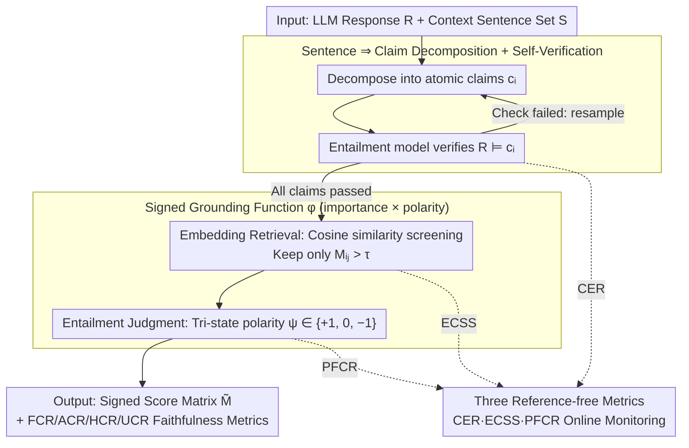

# eTracer: Towards Traceable Text Generation via Claim-Level Grounding

**Conference**: ACL 2026  
**arXiv**: [2601.03669](https://arxiv.org/abs/2601.03669)  
**Code**: https://github.com/chubohao/eTracer  
**Area**: Text Generation / Traceability / Biomedical RAG  
**Keywords**: claim-level grounding, RAG verifiability, hallucination detection, biomedical QA, citation granularity

## TL;DR
eTracer decomposes RAG responses into atomic claims and searches the context for sentence-level evidence that supports or refutes them. Using a three-step pipeline (decomposition → embedding retrieval → entailment judgment), it outputs a signed score matrix, enabling precise back-tracing of factual origins and quantitative assessment of response faithfulness in biomedical scenarios.

## Background & Motivation

**Background**: Current mainstream RAG and commercial search engines (Perplexity, Bing Chat) provide responses with citations, but the citation granularity remains "entire webpage/passage ⇒ entire sentence/response." Users often must read the entire context to verify a single fact. Subsequent academic methods like inline citation, attribute-then-generate, and TRUE/NLI evaluation are mostly built on the "sentence ⇒ sentence" alignment assumption.

**Limitations of Prior Work**: Preliminary user experiments (Appendix A) conducted by the authors revealed that the average manual verification time for three major schemes—passages ⇒ response, passages ⇒ sentence, and token ⇒ token—was 446 s, 212 s, and 312 s, respectively, with accuracy only reaching 91%–96%. In other words, "finer is not necessarily better": coarse granularity requires reading too much, while token-level is too noisy. The intermediate sentence-to-sentence alignment often fails because a single response sentence frequently carries multiple independent facts.

**Key Challenge**: Response sentences are information-dense complexes (often containing multiple subject-predicate-object triples), whereas context evidence consists of sentences stating single propositions. Forcing sentence-to-sentence entailment inevitably hits only partial sub-facts, resulting in low recall and precision. Furthermore, the biomedical field allows for "simultaneous supporting and refuting evidence," a state of "ambiguity" that traditional binary classification (entailment/non-entailment) cannot express.

**Goal**: (1) Redefine the semantic unit of grounding—shifting from "sentences" to "claims" (atomic, independent facts capable of being verified individually); (2) Design a signed grounding function to characterize both the importance and polarity of evidence; (3) Propose reference-free metrics that allow systems to self-monitor in real-world scenarios without ground truth.

**Key Insight**: The authors made three key empirical observations (Appendix B): ① Extracted claims should be entailed by the original response (CER ≥ 97%); ② A claim and its evidence should share high semantic similarity (cos ≈ 0.75); ③ After semantic negation of a claim, the roles of supporting/refuting evidence should flip (PFCR ≈ 90%). These three properties serve as natural indicators for evaluating grounding methods.

**Core Idea**: Replace "sentence ⇒ sentence" grounding with "sentence ⇒ claim" grounding. Using a lightweight pipeline of "decomposition + embedding retrieval + NLI polarity judgment," a signed score $\in\{-1, 0, +1\}\times \text{cos sim}$ is assigned to each (claim, context sentence) pair.

## Method

### Overall Architecture

eTracer is a plug-and-play post-processor for RAG. It takes "LLM response $\mathcal{R}$ + context sentence set $S=\{s_i\}_{i=1}^m$" as input and outputs a "signed score matrix $\tilde{M}\in\mathbb{R}^{p\times m}$" for each sentence in the response. The pipeline flows through three stages: first, response sentences are decomposed into atomic claims and self-verified; second, claims and context sentences are embedded using Qwen3-Embedding-8B for coarse screening via cosine similarity; finally, an entailment model judges the polarity of candidate (claim, evidence) pairs. Multiplying polarity by similarity yields a score indicating both strength and direction, enabling fact tracing and calculation of four faithfulness metrics (FCR/ACR/HCR/UCR). Three reference-free metrics are attached to these stages for online monitoring.

### Key Designs

**1. Sentence ⇒ Claim Decomposition + Self-Verification: Breaking sentences into atomic facts while forcing entailment by the original sentence.**

A major pain point is that if the decomposition model hallucinates a claim, downstream grounding is permanently contaminated—incorrect claims will never find supporting evidence and will be misjudged as hallucinations. eTracer used GPT-5.1 to generate distillation data $\mathcal{D}_{dec}$ on 182 manually labeled sentence-claim groups, distilling decomposition capabilities into Qwen3-14B (LoRA, 4-bit, 10 epochs, lr $2\times 10^{-4}$). The goal is standard conditional NLL $\max_{\mathcal{M}_{dec}}\mathbb{E}_{(r,\{c_i\})}\log p_{\mathcal{M}_{dec}}(\{c_i\}\mid r)$. It treats "decomposition-stage hallucinations" as a failure mode that must be fixed: during inference, an entailment model $\mathcal{M}_{ent}$ verifies $\mathcal{R}\models c_i$. If it fails, the system resamples until all pass or a limit is reached, blocking contamination at the source.

**2. Signed Grounding Function $\phi$ (importance × polarity): One scalar encoding evidence strength and support/refute direction.**

Traditional binary NLI conflates "neutral" and "contradiction" into "not entailing," losing the critical signal "this evidence actually opposes this claim" in medical contexts. eTracer splits judgment into two paths: the strength path uses cosine similarity $M_{ij}=\mathbf{e}_{c_i}\cdot \mathbf{e}_{s_j}$ for retrieval screening; the polarity path uses an entailment model for a tri-state sign $\psi(s, c)\in\{+1, -1, 0\}$. The final score $\tilde{M}_{ij}=M_{ij}\cdot \psi(s_j, c_i)$ is retained only if $M_{ij}>\tau$ (default $\tau=0.5$ based on cos-sim distribution), else it is set to 0. Decoupling "which sentences are worth looking at" (retrieval) from "how to calculate after looking" (judgment) allows for speed tuning and isolation of FCR/ACR/HCR/UCR components.

**3. Three Reference-Free Metrics (CER / ECSS / PFCR): Monitoring grounding quality without ground truth.**

Since a gold set of citations is unavailable in real deployment, eTracer uses three properties verified on labeled data as proxies. CER $=\frac{1}{p}\sum \mathbb{I}[\mathcal{R}\models c_i]$ measures decomposition faithfulness (97% on GT); ECSS $=\frac{1}{k}\sum \mathrm{Sim}(c, s_i)$ measures "retrieval-semantic" consistency between claims and selected evidence (cos ≈ 0.75 on GT); PFCR $=\frac{1}{k}\sum \mathbb{I}[\phi(s_i, c)\approx -\phi(s_i, \neg c)]$ measures polarity robustness by checking if the sign flips when a claim is negated (90% on GT). These correspond to the decomposition, retrieval, and polarity judgment stages, respectively, allowing industrial deployments to calculate performance scores without manual labeling.

### Mechanism

Consider a response sentence: "Drug X lowers blood pressure but raises liver enzymes." The decomposition model splits it into $c_1$= "Drug X lowers blood pressure" and $c_2$= "Drug X raises liver enzymes," both verified by $\mathcal{R}\models c_i$. After embedding, cos-sim is calculated against the context. $c_1$ hits an evidence sentence with cos 0.82, and $\mathcal{M}_{ent}$ judges it as Entailment, resulting in $\tilde{M}=+0.82$. $c_2$ hits an evidence sentence with cos 0.6 but is judged as Contradiction, resulting in $\tilde{M}=-0.6$. The final matrix informs the user that the first half is strongly supported, while the second half is actually refuted by context and needs to be flagged.

### Loss & Training

Only two small models are fine-tuned:

- **Decomposition Model** $\mathcal{M}_{dec}$: Base = Qwen3-14B, LoRA + 4-bit, 182 samples, effective batch 256, 10 epochs, approx. 38 min on a single A6000 GPU, target $\max\log p(\{c_i\}\mid r)$ calculated only on response tokens.
- **Entailment Model** $\mathcal{M}_{ent}$: Base = Qwen3-4B-Instruct-2507, LoRA + 4-bit, 4,267 (claim, evidence, label) triplet samples, effective batch 512, 5 epochs, approx. 45 min on a single A6000 GPU, target $\max\log p(y\mid (c, s))$.
- Inference: Sampling disabled (temperature=0, top-k=1), Qwen3-Embedding-8B used as the general embedder; $\tau=0.5$ is the default.

## Key Experimental Results

Datasets: Authors manually labeled a biomedical grounding ground truth $\mathcal{D}_g$ (100 instances each from PubMedQA + BioASQ-QA + TracSum), containing 578 response sentences, 1,564 claims, and 4,579 (claim, evidence) pairs. For each claim, Qwen3-14B was used to back-generate 1,564 refuting contexts to balance negative samples (98% verified as true contradictions). Split: 30/70 for training/evaluation.

### Main Results

Baselines cover three tiers: sentence-level NLI (DeBERTa), sentence-level instruct-following (Qwen3 / Ministral / Llama), claim-level versions of the same, and end-to-end claim grounding. All baselines were run twice (with/without decomposition).

| Method | Granularity | $\mathrm{F1}_e$ (Support) | $\mathrm{F1}_c$ (Refute) | Time (s) |
|------|------|------|------|------|
| Qwen3-4B-Instruct | Sentence | 0.557 | 0.815 | 4.71 |
| Qwen3-14B | Sentence | 0.592 | 0.811 | 8.70 |
| Qwen3-4B-Instruct + decomp | Claim | 0.639 ↑.082 | 0.817 ↑.002 | 14.18 |
| Qwen3-14B + decomp | Claim | 0.660 ↑.068 | 0.860 ↑.049 | 26.02 |
| **eTracer** ($\tau=0$) | Claim | **0.709** | **0.946** | 22.19 |
| **eTracer** ($\tau=0.5$) | Claim | 0.705 | 0.939 | **14.35** |

Compared to its base model Qwen3-4B-Instruct (sentence-level), eTracer improves $\mathrm{F1}_e$ by +0.152 (+27%) and $\mathrm{F1}_c$ by +0.131 (+16%). The improvement on refuting evidence is particularly significant (baselines generally < 0.83, eTracer ≥ 0.94).

End-to-end baselines (LLM outputs claim+citation in one step) collapsed on CER—Qwen3-14B reached only 0.309 as it tended to copy context as claims. eTracer pipeline CER = 0.930, proving the necessity of decoupled decomposition.

### Ablation Study

| Configuration | $\mathrm{F1}_e$ | $\mathrm{F1}_c$ | Description |
|------|------|------|------|
| w/o $\mathcal{M}_{dec}$ (Direct Sentence Grounding) | 0.607 | 0.485 | Removed decomposition |
| w/ $\mathcal{M}_{dec}$ (Full eTracer) | 0.705 | 0.939 | Full method |
| Δ | ↑.098 (+16%) | ↑.454 (+94%) | Refute evidence nearly doubled |

Threshold $\tau$ scanning: Metrics peaked at $\tau=0.25$. $\tau=0.5$ showed only marginal decline but reduced inference time by 7.84 s (-35%).

User experiment (Appendix A, 4 people × 12 tasks): S⇒C (ours) average verification 116 s / 100% accuracy; P⇒R 446 s / 91%; P⇒S 212 s / 96%; T⇒T 312 s / 93%. S⇒C is 1.83x faster than the strongest baseline.

### Key Findings

- Removing the decomposition module affects **refuting evidence** ($\mathrm{F1}_c$ -0.454, -94%) far more than supporting evidence ($\mathrm{F1}_e$ -0.098, -16%). This suggests that claim granularity is essential for uncovering "opposing views," as refutations often target only one specific sub-proposition within a sentence.
- The reverse distillation and "decomposition failure" mechanism allowed eTracer's CER to outperform end-to-end Qwen3-14B by +0.621 (0.930 vs. 0.309), confirming that "explicit decomposition + verification" is far superior to "single-step reasoning."
- The peak at $\tau=0.25$ aligns with the observed claim-evidence mean cos ≈ 0.75 semantic prior, effectively encoding this prior directly into the pipeline.

## Highlights & Insights

- **"Fine-grained $\neq$ better" is counter-intuitive but crucial**: Verified through human experiments, token-level grounding is slower than sentence-level (312 s vs. 212 s). Selection should match the "semantic unit of human verification," not just be as fine as possible. This insight is transferable to all explainability/attribution work.
- **Interpretability of reference-free metrics**: CER captures "fake claim rates," ECSS captures "retrieval accuracy," and PFCR captures "polarity stability." Each corresponds to a pipeline stage, embedding white-box diagnostics into the evaluation—a template other RAG systems could adopt.
- **Decomposition + self-verification cycle shifts the hallucination problem**: Rather than detecting hallucinations in final responses, intercepting them during decomposition prevents the entire downstream chain from being contaminated, making it applicable to any multi-step pipeline.
- **Signed grounding characterizes "support/refute/neutral" simultaneously**: The breakdown into FCR/ACR/HCR/UCR is highly useful for clinical evidence-based medicine, where "ambiguous" (simultaneously containing contradictory evidence) is exactly what doctors need to flag—something binary classification cannot represent.

## Limitations & Future Work

- **High inference cost**: Claim-level grounding is 1.7–22x slower than sentence-level. While $\tau=0.5$ mitigates this by 35%, real-time scenarios still require further acceleration (e.g., batched NLI, smaller entailment models).
- **Domain-specific evaluation**: Evaluation was limited to biomedical data. Although the components (decomposition, embedding, NLI) are general, migration risks lie in prompt tuning and fine-tuning data scale rather than architecture.
- **Extractive generation mismatch**: In cases where responses nearly copy context (e.g., extractive summarization), forced decomposition might introduce noise. The authors suggest reverting to sentence-level grounding for such tasks.
- **Small ground truth**: Relying on 300 instances (~5k claims) limits statistical significance. Expansion to 10k+ instances across domains is needed.
- **Model coupling**: Switching base models (e.g., away from Qwen3) would require re-selecting $\tau$ thresholds and retraining hyperparameters.
- **Missing comparisons**: Lack of end-to-end comparison with recent attribute-then-generate works (Slobodkin 2024, Chu 2025) leaves a small methodological gap.

## Related Work & Insights

- **vs. LongCite (Zhang et al. 2025)**: LongCite outputs fine-grained citations during the generation phase, relying on instruction-following, which may be inaccurate. eTracer is a post-hoc framework with zero intrusion on generation and higher interpretability via independent "search + verification."
- **vs. TRUE / NLI Evaluation (Honovich et al. 2022)**: TRUE performs NLI at the sentence level but misses the "single sentence, multiple facts" issue. eTracer applies NLI at the claim level and adds semantic similarity to filter evidence candidates.
- **vs. LOO Attribution (Qi et al. 2024)**: LOO calculates token-level influence, providing the finest evidence but with high noise and low interpretability. eTracer's "sentence ⇒ claim" middle ground is 1.83x faster and more accurate than T⇒T approaches in user trials.
- **vs. FActScore (Min et al. 2023)**: FActScore also uses atomic facts for factuality but only measures precision without distinguishing between support/refute/neutral. eTracer’s signed grounding allows for more complex metrics like HCR/UCR for high-stakes scenarios.

## Rating
- Novelty: ⭐⭐⭐⭐ "Sentence ⇒ claim" combined with signed grounding is a clear conceptual upgrade. Reference-free metrics are particularly novel; however, the decomposition + NLI pipeline has existing prototypes in FActScore/DocLens.
- Experimental Thoroughness: ⭐⭐⭐⭐ Covers three corpora, 8 baselines, two granularity comparisons, user experiments, threshold scanning, and self-verification ablations. Weakness lies in biomedical domain focus and 300 GT instances.
- Writing Quality: ⭐⭐⭐⭐⭐ Definitions, algorithms, hypotheses, and experiments are self-consistent and closed-loop. Formulae and figures are well-explained and highly readable.
- Value: ⭐⭐⭐⭐ Plug-and-play framework, open-sourced code/data, and 2.6x faster human verification make it highly valuable for biomedical RAG and high-risk QA.

<!-- RELATED:START -->

## Related Papers

- [\[ACL 2025\] Investigating the Robustness of Retrieval-Augmented Generation at the Query Level](../../ACL2025/information_retrieval/investigating_the_robustness_of_retrieval-augmented_generation_at_the_query_leve.md)
- [\[ACL 2026\] Quantifying and Improving the Robustness of Retrieval-Augmented Language Models Against Spurious Features in Grounding Data](quantifying_and_improving_the_robustness_of_retrieval-augmented_language_models_.md)
- [\[ACL 2026\] VisRet: Visualization Improves Knowledge-Intensive Text-to-Image Retrieval](visret_visualization_improves_knowledge-intensive_text-to-image_retrieval.md)
- [\[ACL 2026\] ReasonEmbed: Enhanced Text Embeddings for Reasoning-Intensive Document Retrieval](reasonembed_enhanced_text_embeddings_for_reasoning-intensive_document_retrieval.md)
- [\[ICLR 2026\] Query-Level Uncertainty in Large Language Models](../../ICLR2026/information_retrieval/query-level_uncertainty_in_large_language_models.md)

<!-- RELATED:END -->
