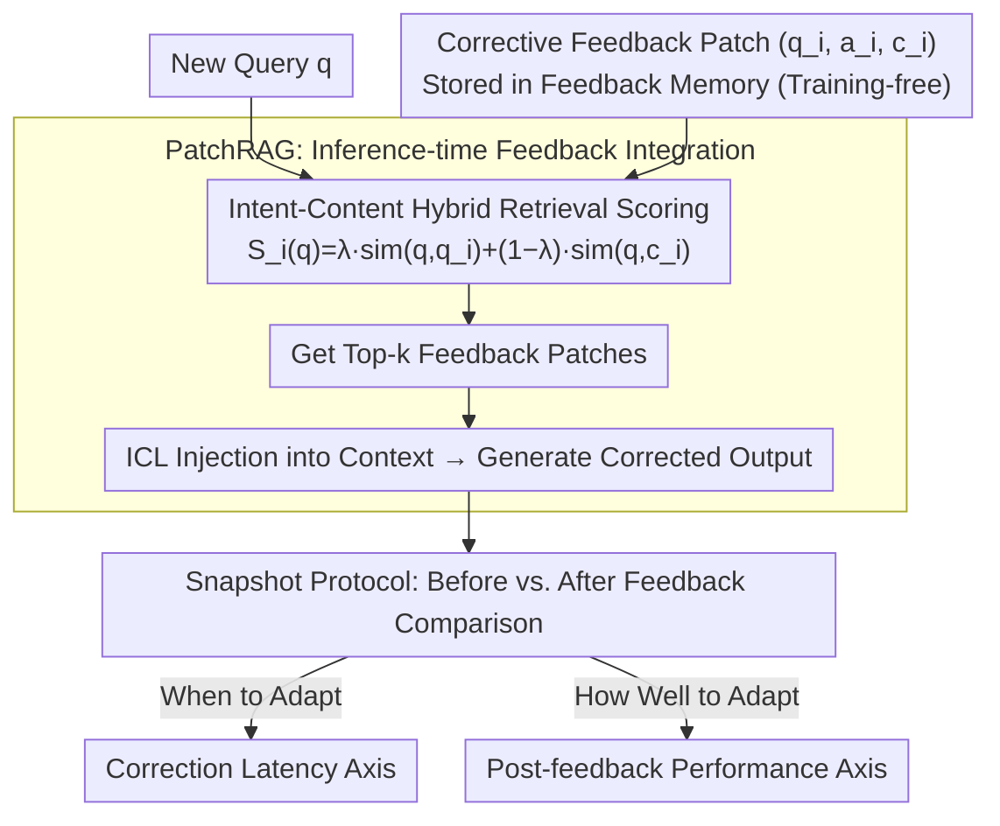

# Feedback Adaptation for Retrieval-Augmented Generation

**Conference**: ACL 2026 Findings  
**arXiv**: [2604.06647](https://arxiv.org/abs/2604.06647)  
**Code**: None  
**Area**: Information Retrieval / RAG  
**Keywords**: RAG, Feedback Adaptation, Correction Latency, PatchRAG, Online Learning

## TL;DR
This paper proposes "Feedback Adaptation" as a new problem setting for RAG systems—investigating how quickly and effectively corrective feedback propagates to future queries. It defines two evaluation axes: correction latency and post-feedback performance, and introduces PatchRAG as a training-free inference-time feedback integration solution to achieve instant correction and strong generalization.

## Background & Motivation

**Background**: RAG has become the dominant paradigm for grounding LLMs in external knowledge. However, existing research assumes that knowledge and system behavior remain static after deployment. In practical deployments, RAG systems are frequently corrected by users or experts—providing feedback when outputs are outdated, incorrect, or undesirable.

**Limitations of Prior Work**: (1) Existing methods handle feedback through retraining or fine-tuning, introducing inherent latency between feedback provision and behavior change; (2) existing evaluation protocols focus only on overall accuracy, failing to capture the speed and quality of system adaptation post-feedback; (3) current benchmarks conflate correctness with adaptability, obscuring key dimensions of system behavior in interactive scenarios.

**Key Challenge**: Training-based methods can achieve strong performance but suffer from latency (high correction latency), while inference-time methods can react instantly but may lack generalization (low post-feedback performance). This trade-off is completely invisible under existing evaluation frameworks.

**Goal**: (1) Formalize the feedback adaptation problem; (2) define evaluation metrics that capture adaptation dynamics; (3) provide a proof-of-concept instance.

**Key Insight**: Elevate "adapting to feedback" from a training/maintenance concern to a first-class research problem. Feedback adaptation is not about improving average accuracy, but about characterizing the dynamics of knowledge updates under interactive conditions.

**Core Idea**: Define two orthogonal evaluation axes—correction latency (how fast feedback takes effect) and post-feedback performance (generalization to semantically related queries)—and demonstrate that instant adaptation is possible using PatchRAG.

## Method

### Overall Architecture
This paper establishes "Feedback Adaptation" as a new class of problem for RAG: after deployment, the system is corrected by users or experts, and the key is how quickly and effectively these corrections propagate to future queries. The work consists of three layers: first, formalizing the problem with two orthogonal evaluation axes; second, using the training-free PatchRAG to integrate feedback instantly at inference time; and finally, using a snapshot protocol to compare before and after feedback injection to isolate the marginal effect of the feedback.

### Key Designs

**1. Correction Latency Evaluation Axis: Quantifying the time gap between feedback provision and sustained change in system behavior**

Two systems may have the same final accuracy but differ drastically in "how long they continue to make mistakes after feedback," a dimension invisible in standard evaluations. Given feedback $f_t$ at time $t$, correction latency is defined as the elapsed time before the system begins to consistently produce corrected outputs for semantically consistent queries. Any method relying on retraining naturally carries significant latency; regardless of its final accuracy, this is the cost that correction latency aims to expose.

**2. Post-feedback Performance Evaluation Axis: Measuring generalization quality to queries semantically consistent with feedback but phrased differently**

Systems that only memorize feedback instances without generalizing to related queries are identified on this axis. Its difference from standard test accuracy lies in explicitly conditioning on the presence of feedback, focusing on queries with "consistent intent but different wording." It complements correction latency—one answers "when to adapt," and the other answers "how well to adapt." Together, they reveal behavioral dimensions invisible to standard accuracy metrics.

**3. PatchRAG: A training-free instance of inference-time feedback integration**

PatchRAG is intentionally minimal—no architecture changes, no parameter training, only storage and retrieval—to prove that instant adaptation is feasible rather than providing an ultimate solution. Each piece of feedback is stored as a tuple $f_i = (q_i, a_i, c_i)$ (original query, corrected answer, supporting evidence). For a new query $q$, an intent-content hybrid retrieval score is used: $S_i(q) = \lambda \cdot \text{sim}(q, q_i) + (1-\lambda) \cdot \text{sim}(q, c_i)$, balancing intent matching with content grounding. Top-k feedback items are then injected as context via ICL for generation. Hybrid retrieval is specifically designed to address generalization needs where "surface wording differs but intent is consistent."

### Loss & Training
PatchRAG involves no training. Evaluation uses NQ, TriviaQA, and HotpotQA datasets, comparing against baselines such as Standard RAG, Self-RAG, Auto-RAG, and ChatQA-1.5.

## Key Experimental Results

### Main Results

| Method | NQ | TriviaQA | HotpotQA | Correction Latency |
|------|-----|---------|---------|---------|
| Standard RAG | 28.7 | 67.1 | 28.5 | High (requires retraining) |
| Auto-RAG | 37.9 | 60.9 | 44.9 | High |
| PatchRAG | **Competitive** | **Competitive** | **Competitive** | **Instant (Zero Latency)** |

### Ablation Study

| Evaluation Axis | Training-based Methods | PatchRAG | Description |
|--------|-----------|---------|------|
| Correction Latency | High (requires retraining time) | **Zero** | Reflects feedback immediately |
| Post-feedback Performance | High (but after latency) | **High** | Intent-aware retrieval supports generalization |
| Overall Accuracy | High | Competitive | Standard evaluation cannot distinguish |

### Key Findings
- Training-based methods exhibit a structural latency-performance trade-off—this is completely invisible in standard accuracy evaluations.
- PatchRAG achieves strong post-feedback performance with zero correction latency, proving that instant adaptation is feasible.
- Intent-content hybrid retrieval is more effective than pure intent or pure content retrieval because it simultaneously handles surface form variations and content relevance.
- Stress testing under imperfect feedback conditions shows that PatchRAG possesses reasonable robustness.

## Highlights & Insights
- **Feedback Adaptation as a First-class Citizen**: Elevating "how to respond to corrections after deployment" from an operational issue to a core research problem and defining a clear evaluation framework. This provides broad inspiration for all interactive AI systems.
- **Concept of Correction Latency**: Similar to "time to fix" in software engineering, correction latency quantifies the real gap between user correction and system change. This metric can be generalized to the evaluation of any system requiring rapid adaptation.
- **Power of Minimalist Design**: PatchRAG proves the concept through minimal design, demonstrating that "storage + retrieval + ICL" can achieve instant adaptation, providing a benchmark for future, more complex solutions.

## Limitations & Future Work
- PatchRAG is a proof-of-concept rather than a final solution; retrieval efficiency and conflict management after large-scale feedback accumulation have not been explored.
- Only factual corrections were evaluated; feedback at the preference or style level was not addressed.
- Evaluation is based on a snapshot protocol rather than true online streaming evaluation.
- Feedback quality is assumed to be perfect or near-perfect, whereas feedback in actual deployments may be noisy or contradictory.

## Related Work & Insights
- **vs. Continual Learning**: Continual learning focuses on not forgetting old knowledge, while feedback adaptation focuses on rapidly integrating new corrections.
- **vs. Model Editing**: Model editing achieves updates through parameter modification, while PatchRAG does not modify parameters.
- **vs. Online Learning**: Online learning optimizes aggregate performance, while feedback adaptation focuses on temporal dynamics after correction.

## Rating
- Novelty: ⭐⭐⭐⭐⭐ The proposal and formalization of feedback adaptation as an independent research problem is a significant contribution.
- Experimental Thoroughness: ⭐⭐⭐ Three datasets used, but the novel evaluation protocol requires more extensive validation.
- Writing Quality: ⭐⭐⭐⭐⭐ Problem definition is extremely clear and the evaluation framework design is elegant.
- Value: ⭐⭐⭐⭐⭐ Opens a new dimension for RAG evaluation and provides direct guidance for deployment practices.

<!-- RELATED:START -->

## Related Papers

- [\[ACL 2026\] Domain-Specific Data Generation Framework for RAG Adaptation](domain-specific_data_generation_framework_for_rag_adaptation.md)
- [\[AAAI 2026\] ReFeed: Retrieval Feedback-Guided Dataset Construction for Style-Aware Query Rewriting](../../AAAI2026/information_retrieval/refeed_retrieval_feedback-guided_dataset_construction_for_style-aware_query_rewr.md)
- [\[ACL 2026\] CodePromptZip: Code-specific Prompt Compression for Retrieval-Augmented Generation in Coding Tasks with LMs](codepromptzip_code-specific_prompt_compression_for_retrieval-augmented_generatio.md)
- [\[ACL 2026\] Disco-RAG: Discourse-Aware Retrieval-Augmented Generation](disco-rag_discourse-aware_retrieval-augmented_generation.md)
- [\[ACL 2026\] Language-Coupled Reinforcement Learning for Multilingual Retrieval-Augmented Generation](language-coupled_reinforcement_learning_for_multilingual_retrieval-augmented_gen.md)

<!-- RELATED:END -->
