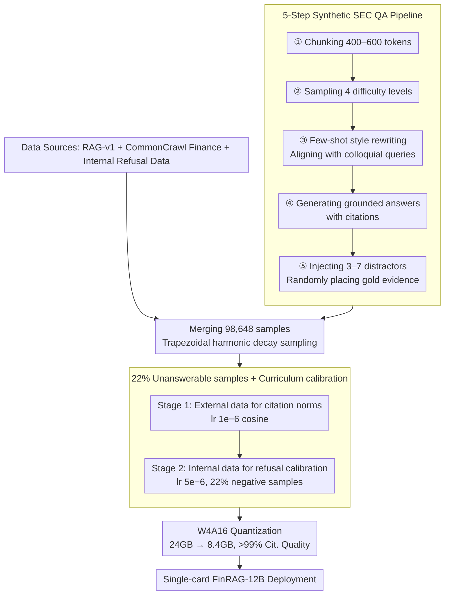

# FinRAG-12B: A Production-Validated Recipe for Grounded Question Answering in Banking

**Conference**: ACL 2026  
**arXiv**: [2605.05482](https://arxiv.org/abs/2605.05482)  
**Code**: Not open-sourced (Stage 1 can be reproduced based on RAG-v1)  
**Area**: RAG / Finance / Model Compression  
**Keywords**: Financial QA, Citation grounding, calibrated refusal, curriculum learning, W4A16 quantization

## TL;DR
The Kasisto team developed FinRAG-12B based on Gemma 3 12B-IT using an efficient data recipe of 143M tokens (LLM-as-Judge filtering + citation annotation + 22% unanswerable samples + two-stage curriculum). It was compressed via W4A16 quantization to 8.4 GB for single-card deployment. The model's answer quality (6.21 JudgeLM) and citation quality (73.1) both exceed GPT-4.1. Its refusal rate of 12% sits between the base model's unsafe 4.3% and GPT-4.1's over-refusal of 20.2%. Following deployment across 40+ financial institutions, the query resolution rate significantly improved by +7.1pp ($p<0.001$), with latency and costs decreased by 3–5$\times$ and 20–50$\times$ respectively compared to GPT-4.1.

## Background & Motivation

**Background**: The core hurdle for LLM adoption in the banking industry is compliance. Answers must be verifiable, traceable, and free of hallucinations. Furthermore, RAG is required to handle daily changes in interest rates, account balances, and policies. While routes like BloombergGPT (50B/346B tokens) prove that scaling works, they remain closed-source and do not report latency costs. FinGPT utilizes LoRA but focuses on classification rather than generative RAG.

**Limitations of Prior Work**: (a) General instruction-tuned LLMs are often sycophantic—attempting to answer even when the retrieved context is insufficient (Sharma 2024); the base Gemma 3 12B says "I don't know" (IDK) for only 4.3% of queries, leading to frequent hallucinations. (b) GPT-4.1 represents the opposite extreme, with a 20.2% over-refusal rate, rejecting answerable queries. (c) RAG models suffer from "lost in the middle" position bias (Liu 2024). (d) Mixed training on all data leads to catastrophic performance (JudgeLM 3.28, IDK skyrocketing to 46.5%). (e) Deployment costs are prohibitive, with GPT-4.1 costing \$0.02–0.05 per query, which is unsustainable for 10K daily queries across 40 institutions.

**Key Challenge**: There is a conflict between five dimensions: grounded answer quality, refusal calibration, citation quality, latency, and cost. Direct SFT tends to overfit one dimension at the expense of others, yet banking scenarios require excellence in all five. Additionally, compliance restrictions prevent the direct use of large amounts of real user data containing PII for training.

**Goal**: (i) Develop a data-efficient (≤200M tokens) training recipe to simultaneously optimize answer quality, citations, and calibrated refusal; (ii) provide a service solution deployable on a single card with costs ≤\$0.005/query; (iii) establish an end-to-end production methodology from data curation to quantized serving; (iv) validate the approach in a real production environment (40+ institutions).

**Key Insight**: The authors found that "data quality > data scale" (as proven by Phi-3 and LIMA) + "curriculum learning to resolve multi-objective conflicts" + "refusal calibration via controlled negative sample ratios" could be combined into a single recipe.

**Core Idea**: Use LLM-as-Judge filtering + multi-stage synthesis + curriculum learning on 143M tokens to optimize answers, citations, and refusals. Refusal is calibrated by sweeping for the optimal negative sample ratio (22% unanswerable samples). Finally, W4A16 quantization is applied to maintain >99% citation quality.

## Method

### Overall Architecture
FinRAG-12B is an end-to-end recipe that transforms Gemma 3 12B-IT into a "traceable, refusal-capable, and single-card deployable" financial QA model using only 143M tokens. On the data side, it merges open-source RAG-v1 (43,581 samples filtered by JudgeLM < 5), a 5-step synthetic SEC QA (16,773 samples), a CommonCrawl financial subset (20,499 samples), and internal refusal calibration data (17,795 samples), totaling 98,648 samples. To break position bias, gold evidence is sampled among distractors following a right-trapezoidal weighted harmonic decay distribution: $P(X=x)=\frac{1}{N-K_{\min}+1}\sum_{K=\max(x,K_{\min})}^{N}\frac{1}{K}$. On the training side, a two-stage curriculum is employed (Stage 1 lr $1\times10^{-6}$ cosine for citation norms; Stage 2 lr $5\times10^{-6}$ linear for refusal calibration and realistic style). Finally, it leverages SmoothQuant W4A16 to compress 24GB to 8.4GB for deployment.

### Key Designs

**1. 5-Step Synthetic SEC QA Pipeline: Making synthetic data both grounded and realistic.**
One-shot LLM-generated QA tends to be verbose and differs significantly from "fragmented, colloquial" real-user queries. Direct training causes overfitting to the synthetic distribution. FinRAG treats "distribution alignment" as the core goal. The steps include: chunking (400–600 tokens) → generating across 4 difficulty levels with higher weights for easy/medium → few-shot style rewriting (controlling style fragments, length, and formality, e.g., converting "What is the minimum credit score required for mortgage approval?" into "min credit score for mortgage") → producing grounded answers with citations → injecting 3–7 topically-similar distractors. This reduced the JS divergence of question-types by 10$\times$ (0.434 to 0.041).

**2. 22% Unanswerable Samples + Curriculum Calibration: Proactive refusal without over-refusal.**
Refusal calibration conflicts with answer quality; a model that is more willing to answer may be more correct but also more prone to hallucination. The authors swept negative sample ratios from 10% to 30% in 2pp steps, finding a Pareto sweet spot at 22%. Performance beyond 26% led to sharp drops in recall (over-refusal), while ratios below 22% resulted in high false positives (sycophancy). Staged curriculum training isolated conflicting tasks: Stage 1 taught citation norms while Stage 2 calibrated refusal, resulting in a 13.2% IDK rate with 56% True Negative accuracy.

**3. W4A16 Quantization Retaining >99% Citation Quality.**
To achieve sub-second response times on cost-effective hardware, the model used SmoothQuant W4A16 (4-bit weights + 16-bit activations), compressing it to 8.4GB (2.86$\times$). Deployable on a single GPU (RTX 6000 Ada), the cost is ~\$0.001 per query. Time to Click (TTC) is 0.57s, 3.2$\times$ faster than the previous Mistral-7B-based version. A key finding is that citation quality is highly robust to aggressive quantization, retaining >99% performance.

### Loss & Training
LoRA ($r=64, \alpha=256$, dropout 0.05) was applied to all attention and MLP layers. Training used 8-bit AdamW with lr $2\times10^{-5}$, effective batch size of 16, max sequence length of 16,384, and early stopping with a patience of 5. Total training took ~360 GPU-hours on 8$\times$ RTX A6000, costing approximately \$1,800.

## Key Experimental Results

### Main Results: 258 Bank QA Test Set (3 Financial Institutions)

| Model | JudgeLM (1–10) | Citation Q (0–100) | QA F1 | IDK% |
|------|---------------|--------------------|-------|------|
| Gemma 3 12B (base) | 5.70 | 80.2 | 0.964 | 4.3 (under-refuse) |
| GPT-4.1 (API) | 5.72 | 70.8 | 0.900 | 20.2 (over-refuse) |
| **FinRAG-12B** | **6.21** | **73.1** | 0.936 | **12.0 (calibrated)** |

FinanceBench (150 SEC questions):

| Model | FinanceBench F1 |
|------|-----------------|
| Gemma 3 12B (base) | 0.249 |
| GPT-4.1 | 0.238 |
| **FinRAG-12B** | **0.284** (97.3% citation rate) |

### Ablation Study (Curriculum / Data Strategy)

| Strategy | JudgeLM | QA F1 | Cit. Q | IDK% | TN% (Refusal Acc) |
|------|---------|-------|--------|------|---------------------|
| External only | 5.72 | 0.972 | 76.1 | 0.4 | 0 |
| Internal only | 5.62 | 0.913 | 69.2 | 17.4 | 53 |
| Combined (Mixed) | 3.28 | 0.706 | 51.2 | 46.5 | 39 |
| **Curriculum (staged)** | **5.91** | 0.938 | **74.7** | 13.2 | **56** |

### Key Findings
- **Mixed Training $\neq$ Better**: Mixing all data caused JudgeLM scores to drop from 5.91 to 3.28; multi-objective conflicts must be isolated via curriculum.
- **Base Model IDK (4.3%) is Dangerous**: Such low refusal rates mean the model hallucinates for ~95% of unanswerable queries, which is unacceptable in regulated environments.
- **GPT-4.1 IDK (20.2%) is Wasteful**: Over 20% of queries are rejected, hurting user experience. FinRAG-12B's 12% is the calibrated sweet spot.
- **Production Gains**: In 3,297 real queries over 7 months, resolution rate increased from 77.4% to 84.5% ($p<0.001$). Satisfaction improved by +3.4pp (not significant, $p=0.26$), driven primarily by "more queries resolved" rather than "better individual answers."
- **W4A16 Robustness**: Grounded generation is remarkably robust to low-bit quantization.
- **Distribution Alignment**: The 5-step synthesis improved question-type alignment by 10$\times$, emphasizing that alignment is more critical than raw generation quality.

## Highlights & Insights
- **Data-efficient + Curriculum**: Training a model that beats GPT-4.1 on 143M tokens proves that "recipe > scale" in vertical domains.
- **Negative Sample Sweeping**: Refusal calibration is a Pareto optimization; a simple grid search for the optimal ratio is a highly transferable trick.
- **Trapezoidal Harmonic Decay**: This distribution effectively mitigates "lost-in-the-middle" by forcing the model to ignore position-based heuristics.
- **Causal Attribution of Satisfaction**: The discovery that satisfaction gains come from distribution shifts (coverage) rather than individual answer quality suggests that future RAG efforts should prioritize coverage.

## Limitations & Future Work
- Small evaluation set: 258 Bank QA samples are mostly from retail banking.
- Internal data (Stage 2) cannot be released due to compliance, limiting full academic reproducibility.
- Refusal evaluation does not model "hedged" expressions (e.g., "perhaps...").
- Satisfaction improvement of +3.4pp was not statistically significant.
- Dependence on teacher models for synthesis poses long-term risks of "model collapse."

## Related Work & Insights
- **vs BloombergGPT**: Proven that data quality is more reasonable than brute-force scaling for vertical domains.
- **vs FinGPT**: Moves beyond classification to generative RAG with citations.
- **vs LIMA/Phi-3**: Applies "precision data" philosophy to grounded RAG and refusal tasks.
- **vs RARR/Self-RAG**: FinRAG-12B optimizes for groundedness at training-time, avoiding the high inference overhead of multi-turn verification.
- **Insight**: Any vertical LLM deployment should perform a negative sample sweep for refusal calibration and prioritize curriculum over mixed training for conflicting objectives.

## Rating
- **Novelty**: ⭐⭐⭐ While individual techniques are not new, the integrated recipe for financial RAG is a significant first.
- **Experimental Thoroughness**: ⭐⭐⭐⭐ Includes production data, ablation studies, and causal attribution, though the test set is small.
- **Writing Quality**: ⭐⭐⭐⭐ Exceptionally clear for an industry paper, with reproducible steps and honest limitations.
- **Value**: ⭐⭐⭐⭐⭐ Directly applicable recipe for teams building vertical-domain grounded LLMs.

<!-- RELATED:START -->

## Related Papers

- [\[ACL 2026\] DQA: Diagnostic Question Answering for IT Support](dqa_diagnostic_question_answering_for_it_support.md)
- [\[ACL 2026\] ChatR1: Reinforcement Learning for Conversational Reasoning and Retrieval Augmented Question Answering](chatr1_reinforcement_learning_for_conversational_reasoning_and_retrieval_augment.md)
- [\[ACL 2026\] MAB-DQA: Addressing Query Aspect Importance in Document Question Answering with Multi-Armed Bandits](mab-dqa_addressing_query_aspect_importance_in_document_question_answering_with_m.md)
- [\[ACL 2026\] CounterRefine: Answer-Conditioned Counterevidence Retrieval for Inference-Time Knowledge Repair in Factual Question Answering](counterrefine_answer-conditioned_counterevidence_retrieval_for_inference-time_kn.md)
- [\[AAAI 2026\] N2N-GQA: Noise-to-Narrative for Graph-Based Table-Text Question Answering Using LLMs](../../AAAI2026/information_retrieval/n2n-gqa_noise-to-narrative_for_graph-based_table-text_question_answering_using_l.md)

<!-- RELATED:END -->
