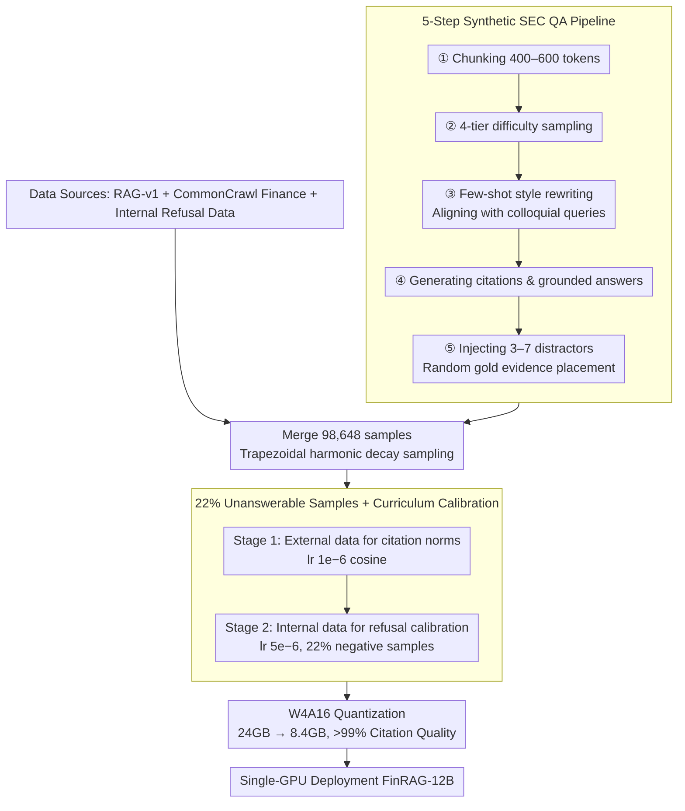

# FinRAG-12B: A Production-Validated Recipe for Grounded Question Answering in Banking

**Conference**: ACL 2026  
**arXiv**: [2605.05482](https://arxiv.org/abs/2605.05482)  
**Code**: Not open source (Stage 1 can be reproduced based on RAG-v1)  
**Area**: RAG / Finance / Model Compression  
**Keywords**: Financial QA, citation grounding, calibrated refusal, curriculum learning, W4A16 quantization

## TL;DR
The Kasisto team developed FinRAG-12B based on Gemma 3 12B-IT using an efficient 143M-token data recipe (LLM-as-Judge filtering + citation labeling + 22% unanswerable samples + two-stage curriculum). Compressed via W4A16 quantization to 8.4 GB for single-GPU deployment, it outperforms GPT-4.1 in both answer quality (JudgeLM 6.21) and citation quality (73.1). Its refusal rate of 12% balances the unsafe 4.3% of the base model and the 20.2% over-refusal of GPT-4.1. Following deployment across 40+ financial institutions, the query resolution rate increased significantly by +7.1pp ($p<0.001$), with latency and costs reduced by 3–5$\times$ and 20–50$\times$ respectively compared to GPT-4.1.

## Background & Motivation

**Background**: The primary obstacle to adopting LLMs in the banking industry is compliance. Responses must be verifiable, traceable, and free of hallucinations. RAG is essential for handling daily fluctuations in interest rates, account balances, and policies. While the BloombergGPT (50B/346B tokens) approach demonstrated that scaling works, it is closed-source and does not report latency or costs. FinGPT utilizes LoRA but focuses on classification rather than generative RAG.

**Limitations of Prior Work**: (a) General instruction-tuned LLMs are often sycophantic, attempting to answer even when retrieved context is insufficient (Sharma 2024); the base Gemma 3 12B model says "I don't know" (IDK) for only 4.3% of queries, leading to hallucinations. (b) GPT-4.1 exhibits the opposite extreme, with a 20.2% over-refusal rate, rejecting answerable queries. (c) RAG models suffer from "lost in the middle" positional bias (Liu 2024). (d) Hybrid training on all data types leads to catastrophic performance (JudgeLM 3.28, IDK skyrocketing to 46.5%), while training on only external or internal data remains flawed. (e) Deployment costs for GPT-4.1 (\$0.02–0.05 per query) are prohibitive for institutions with 10K daily queries.

**Key Challenge**: There is a conflict between five dimensions: grounded answer quality, refusal calibration, citation quality, latency, and cost. Direct SFT tends to overfit to one dimension at the expense of others, yet all five are mandatory in banking. Furthermore, compliance restrictions prevent the direct use of large amounts of real user data (containing PII) for training.

**Goal**: (i) Develop a data-efficient (≤200M token) training recipe to simultaneously optimize answer quality, citations, and calibrated refusal; (ii) create a single-GPU deployment solution with costs ≤\$0.005/query; (iii) establish an end-to-end production methodology from data curation to quantized serving; (iv) validate the system in a real production environment with 40+ institutions.

**Key Insight**: Data quality is more critical than data scale (as proven by Phi-3 and LIMA). Curriculum learning can resolve multi-objective conflicts, and controlled negative sample ratios can calibrate refusal.

**Core Idea**: Use LLM-as-Judge filtering, multi-stage synthesis, and curriculum learning on 143M tokens to optimize answers, citations, and refusal. Refusal is calibrated by sweeping for the optimal negative sample ratio (found at 22%). W4A16 quantization is applied to maintain >99% citation quality.

## Method

### Overall Architecture
FinRAG-12B is an end-to-end recipe for transforming Gemma 3 12B-IT into a traceable, calibrated financial QA model for single-GPU deployment using 143M tokens. The data pipeline merges RAG-v1 (43,581 samples filtered by JudgeLM), a 5-step synthetic SEC QA dataset (16,773 samples), a CommonCrawl financial subset (20,499 samples), and internal refusal calibration data (17,795 samples). Positional bias is mitigated using a right-trapezoidal harmonic decay distribution $P(X=x)=\frac{1}{N-K_{\min}+1}\sum_{K=\max(x,K_{\min})}^{N}\frac{1}{K}$ to sample gold evidence among distractors. Training follows a two-stage curriculum (Stage 1: citation norms with lr $1\times10^{-6}$ cosine; Stage 2: refusal and style calibration with lr $5\times10^{-6}$ linear). Finally, SmoothQuant W4A16 compresses the model from 24GB to 8.4GB.

### Key Designs

**1. 5-Step Synthetic SEC QA Pipeline: Grounding synthetic data in real query distributions**

Single-shot LLM-generated QA tends to be verbose and deviates from the fragmented, colloquial nature of real user queries. FinRAG prioritizes "distribution alignment" by following five steps: chunking (400-600 tokens) → 4-tier difficulty generation with higher weights for easy/medium samples → few-shot style rewriting (controlling fragments, length, and formality, e.g., converting "What is the minimum credit score required for mortgage approval?" to "min credit score for mortgage") → producing grounded answers with citations → injecting 3-7 topically similar distractors. This reduced the Jensen-Shannon divergence of question types by 10$\times$ (0.434 to 0.041) and aligned average lengths (8.85 words vs. 9.91 real-world words).

**2. 22% Unanswerable Samples + Curriculum Refusal Calibration: Active IDK without over-refusal**

Refusal calibration is a multi-objective problem that conflicts with answer quality. By sweeping negative sample ratios from 10% to 30% in 2pp increments, the authors identified 22% as the Pareto sweet spot. Above 26%, recall drops sharply due to over-refusal; below 22%, sycophancy (high false positives) dominates. Curriculum learning isolates conflicting tasks: Stage 1 focuses on citation learning using external data, while Stage 2 calibrates refusal using internal data. This resulted in a controlled 13.2% IDK rate with 56% true negative (TN) accuracy.

**3. W4A16 Quantization maintaining >99% Citation Quality: Single-GPU real-time deployment**

SmoothQuant W4A16 (4-bit weight + 16-bit activation) was used to compress the model to 8.4GB (2.86$\times$). Deployed on an RTX 6000 Ada, it achieved a cost of ~$0.001 per query, with a TTFT of 0.14s and TTC of 0.57s (3.2$\times$ faster than the previous Mistral-7B based version). A key finding is that citation quality is highly robust to aggressive quantization, retaining >99% of its performance.

### Loss & Training
LoRA ($r=64, \alpha=256$, dropout 0.05) was applied to all attention and MLP layers. Training used 8-bit AdamW with lr $2\times10^{-5}$, an effective batch size of 16, and a max sequence length of 16,384. Total training time was ~360 GPU-hours on 8$\times$ RTX A6000, costing approximately \$1,800.

## Key Experimental Results

### Main Results: 258 Banking QA Test Set (3 Institutions)

| Model | JudgeLM (1–10) | Citation Q (0–100) | QA F1 | IDK% |
|------|---------------|--------------------|-------|------|
| Gemma 3 12B (base) | 5.70 | 80.2 | 0.964 | 4.3 (under-refuse) |
| GPT-4.1 (API) | 5.72 | 70.8 | 0.900 | 20.2 (over-refuse) |
| **FinRAG-12B** | **6.21** | **73.1** | 0.936 | **12.0 (calibrated)** |

Public Benchmark (FinanceBench, 150 SEC questions):

| Model | FinanceBench F1 |
|------|-----------------|
| Gemma 3 12B (base) | 0.249 |
| GPT-4.1 | 0.238 |
| **FinRAG-12B** | **0.284** (Citation Rate 97.3%) |

### Ablation Study: Curriculum / Data Strategy (258 Banking QA)

| Strategy | JudgeLM | QA F1 | Cit. Q | IDK% | TN% (Refusal Acc.) |
|------|---------|-------|--------|------|---------------------|
| External only (RAG-v1+SEC) | 5.72 | 0.972 | 76.1 | 0.4 | 0 (Catastrophic) |
| Internal only (CC+Internal) | 5.62 | 0.913 | 69.2 | 17.4 | 53 |
| Combined (Mixed) | 3.28 | 0.706 | 51.2 | 46.5 | 39 |
| **Curriculum (staged)** | **5.91** | 0.938 | **74.7** | 13.2 | **56** |

### Key Findings
- **Mixed Training ≠ Better Performance**: Mixing all data types caused JudgeLM scores to drop from 5.91 to 3.28. Multi-objective conflicts must be isolated via curriculum learning.
- **The Danger of 4.3% IDK**: The low refusal rate of the base model indicates it hallucinates on over 95% of unanswerable queries, which is unacceptable in regulatory environments.
- **GPT-4.1 Over-refusal**: A 20.2% refusal rate wastes commercial value. FinRAG-12B's 12% rate is the calibrated sweet spot.
- **+7.1pp Resolution Rate in Production**: Analysis of 3,297 real-world queries showed an increase from 77.4% to 84.5% ($\chi^2=24.4, p<0.001$). Satisfaction gains came from "more queries being resolved" rather than "better per-line quality."
- **W4A16 Robustness**: 4-bit quantization retains >99% citation quality, proving grounded generation is robust to low-bit weights.
- **5-Step Synthesis vs. Single-shot**: Question-type distribution alignment improved by 10$\times$.

## Highlights & Insights
- **Curriculum + Data Efficiency**: Training a model that beats GPT-4.1 on 143M tokens proves that recipe matters more than scale in vertical domains.
- **Refusal Calibration Sweep**: Finding the 22% Pareto sweet spot via grid search is a simple yet effective technique transferable to any SFT pipeline.
- **Trapezoidal Distribution for Positional Bias**: Using a harmonic decay distribution to place evidence outperforms standard shuffling by being more controllable.
- **Attribution of Satisfaction**: The discovery that satisfaction gains originate from higher coverage (resolution) rather than marginal quality improvements suggests future RAG efforts should focus on coverage.
- **The Modern Recipe**: The combination of W4A16, LoRA, and Gemma 3 provides a robust blueprint for 2025-era financial LLM deployments.

## Limitations & Future Work
- Evaluation set size: The 258 banking QA samples are limited to retail banking; corporate, investment, and insurance domains are not covered.
- Data privacy: Internal Stage 2 data cannot be released, limiting full academic reproducibility.
- Refusal modeling: Only explicit "I don't know" phrases were tracked; hedged expressions were not modeled.
- Statistical significance: The +3.4pp satisfaction increase was not significant ($p=0.26$), requiring larger sample sizes.
- Regulatory variation: The model was validated only under US retail banking regulations.

## Related Work & Insights
- **vs. BloombergGPT (Wu 2023)**: Proves that a data-quality-centric approach is more practical than massive scaling for vertical domains.
- **vs. FinGPT (Yang 2023)**: Moves beyond classification to full grounded generative RAG with citations.
- **vs. Self-RAG (Asai 2024)**: FinRAG-12B achieves grounding at training-time, avoiding the inference overhead of external verification layers.
- **Insight**: Any vertical LLM deployment should include a negative sample sweep for refusal calibration and use curriculum learning to isolate conflicting objectives.

## Rating
- **Novelty**: ⭐⭐⭐ Combines existing techniques into the first systematic deployment recipe for financial RAG.
- **Experimental Thoroughness**: ⭐⭐⭐⭐ Includes production data analysis (3,297 queries) and detailed attribution, though the static test set is small.
- **Writing Quality**: ⭐⭐⭐⭐ High clarity with reproducible steps and honest evaluation of limitations.
- **Value**: ⭐⭐⭐⭐⭐ Provides a production-validated recipe with immediate utility for vertical domain LLM teams.

<!-- RELATED:START -->

## Related Papers

- [\[ACL 2026\] DQA: Diagnostic Question Answering for IT Support](dqa_diagnostic_question_answering_for_it_support.md)
- [\[ACL 2026\] ChatR1: Reinforcement Learning for Conversational Reasoning and Retrieval Augmented Question Answering](chatr1_reinforcement_learning_for_conversational_reasoning_and_retrieval_augment.md)
- [\[ACL 2026\] MAB-DQA: Addressing Query Aspect Importance in Document Question Answering with Multi-Armed Bandits](mab-dqa_addressing_query_aspect_importance_in_document_question_answering_with_m.md)
- [\[ACL 2026\] CounterRefine: Answer-Conditioned Counterevidence Retrieval for Inference-Time Knowledge Repair in Factual Question Answering](counterrefine_answer-conditioned_counterevidence_retrieval_for_inference-time_kn.md)
- [\[ICLR 2026\] FrugalRAG: Less is More in RL Finetuning for Multi-hop Question Answering](../../ICLR2026/information_retrieval/frugalrag_less_is_more_in_rl_finetuning_for_multi-hop_question_answering.md)

<!-- RELATED:END -->
