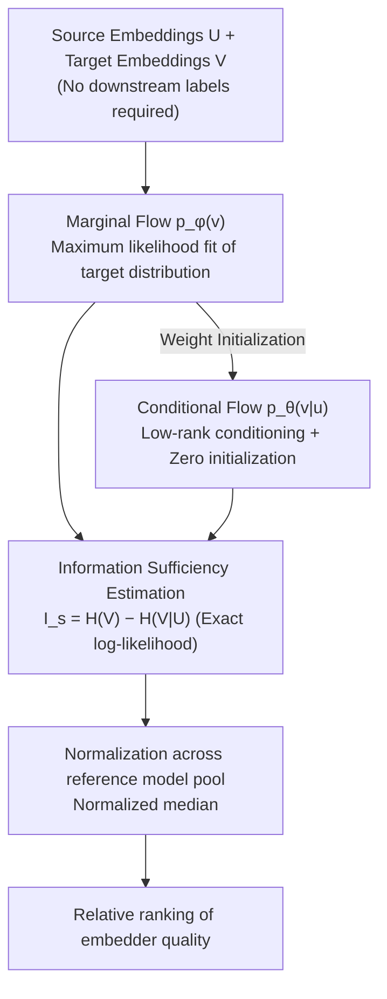

# FLARE: Task-Agnostic Embedding Model Evaluation via Normalizing Flows

**Conference**: ACL 2026 Findings  
**arXiv**: [2604.17344](https://arxiv.org/abs/2604.17344)  
**Code**: None  
**Area**: Information Retrieval  
**Keywords**: Embedding Model Evaluation, Label-free Evaluation, Normalizing Flows, Information Sufficiency, High-dimensional Density Estimation

## TL;DR

The FLARE framework is proposed, utilizing Normalizing Flows for label-free text embedding model evaluation. By directly estimating information sufficiency from log-likelihood, it avoids the collapse of distance-based density estimation in high-dimensional spaces, achieving a Spearman $\rho$ of 0.90 with supervised benchmarks across 11 datasets.

## Background & Motivation

**Background**: The number of text embedding models (e.g., Qwen3 Embedding, Gemini Embedding) is growing rapidly, making it increasingly difficult to select the most suitable model for a specific corpus. Standard methods rely on annotated benchmarks like MTEB, but these require labeled data and may suffer from benchmark contamination.

**Limitations of Prior Work**: (1) Annotated benchmarks are unavailable for proprietary domains, and benchmark leakage leads to inflated scores; (2) Label-free methods such as uniformity and IsoScore focus on geometric properties rather than semantic content; (3) The EMIR method uses KDE or GMM to estimate density, which becomes unstable in high-dimensional spaces due to the curse of dimensionality.

**Key Challenge**: There is a need for label-free evaluation of embedding quality, but existing density estimation methods are statistically unreliable in high-dimensional spaces.

**Goal**: Design a label-free embedding evaluation framework that remains stable and reliable for high-dimensional embeddings.

**Key Insight**: Utilize the exact log-likelihood estimation capability of Normalizing Flows to avoid distance-based density estimation.

**Core Idea**: Replace KDE/GMM with Normalizing Flows to estimate information sufficiency, shifting the estimation error from depending on the raw dimensionality to the intrinsic dimensionality of the data manifold.

## Method

### Overall Architecture

FLARE reformulates the question of "how good an embedding model is" as a label-free density estimation problem: given source embeddings $U$ and target embeddings $V$, it measures how much information the former preserves for the latter. It first trains a marginal flow $p_\phi(v)$ to fit the distribution of target embeddings, then initializes and trains a conditional flow $p_\theta(v|u)$ based on this to capture source-target dependencies; the information sufficiency score is calculated as the marginal entropy minus the conditional entropy, and finally, the output ranking is normalized across a reference model pool. The entire process requires no downstream labels, and the output provides a relative ranking of embedder quality.

### Key Designs

**1. Information Sufficiency Estimation via Normalizing Flows: Replacing Collapsed Kernel Density with Exact Likelihood**

Existing label-free methods like EMIR use KDE or GMM to estimate high-dimensional density, which fails statistically due to the curse of dimensionality as dimensions increase. FLARE instead uses Normalizing Flows, defining embedding quality as the reduction in uncertainty of the target given the source $I_s(U \to V) = H(V) - H(V|U)$, where both entropies are calculated from the exact log-likelihood of the flow model rather than a variational lower bound. Consequently, the reliability of the estimation no longer depends on sample density in the raw dimension, and the final score is taken as the normalized median across a reference model pool to ensure comparability between different embedders.

**2. Low-rank Conditioning and Zero Initialization: Ensuring Trainable and Stable Conditional Flows at High Dimensions**

Standard conditional flows must model cross-dependencies for every dimension, where $O(d^2)$ complexity is infeasible for embeddings with $d \ge 3584$. FLARE allows the conditional flow to reuse marginal flow weights, injecting source information only through a low-rank residual branch: $\mathbf{h}_{cond} = \mathbf{h}_{base} + B(A(u))$, where $A$ compresses the source embedding to a bottleneck of $r=64$ and $B$ projects it back to the original dimension, reducing parameter complexity from $O(d^2)$ to $O(dr)$. Zero initialization of $B$ ensures the conditional flow starts exactly at the pre-trained marginal flow, avoiding gradient oscillations during cold starts and ensuring smooth convergence in two-stage progressive training.

**3. Finite Sample Generalization Bound: Decoupling Reliability from Raw Dimensions to Intrinsic Dimensions**

To demonstrate that a moderate sample size is sufficient, FLARE proves that the upper bound of the estimation error is primarily determined by the intrinsic dimension $d_{eff}$ of the data manifold rather than the raw dimension $d$ of the embedding. Since real embeddings are typically concentrated on low-dimensional manifolds ($d_{eff} \ll d$), this bound guarantees that when FLARE is deployed on new unlabelled corpora, it can yield reliable rankings even with high dimensionality and finite samples—the theoretical root cause of its stability in high dimensions.

### Loss & Training

Both stages use standard maximum likelihood training for Normalizing Flows: first training the marginal flow $p_\phi(v)$, then initializing the conditional flow $p_\theta(v|u)$ with its weights and continuing training with the zero-initialized low-rank branch to ensure stable progressive convergence.

## Key Experimental Results

### Main Results

Comparison of Spearman $\rho$ against supervised rankings:

| Method | High-dim Embeddings ($d \ge 3584$) | Description |
|------|------------------|------|
| Silhouette Score | Unstable | Geometric metric |
| EMIR (GMM) | Collapse | Curse of dimensionality |
| **FLARE** | **$\rho$ up to 0.90** | Normalizing Flows |

### Ablation Study

| Configuration | Effect | Description |
|------|------|------|
| FLARE Full | Optimal | NF + Low-rank + Zero-init |
| Replace with KDE | High-dim collapse | Curse of dimensionality |
| No Zero-init | Slow convergence | Gradient instability |

### Key Findings

- FLARE maintains stability with high-dimensional embeddings while existing methods collapse—a key differentiating advantage.
- Ranking predictions are highly consistent with supervised benchmarks ($\rho = 0.90$).
- Theoretical bounds align with experiments: error depends on intrinsic dimensions rather than raw dimensions.

## Highlights & Insights

- Framing embedding evaluation as a density estimation problem is a profound insight: embedding quality is equivalent to "how much original information is preserved."
- The engineering design of low-rank conditioning + zero initialization is ingenious and reusable for other high-dimensional conditional density estimation scenarios.
- The finite sample generalization bound elevates empirical success to theoretical assurance.

## Limitations & Future Work

- Normalizing Flow training costs are higher than simple geometric metrics.
- Dependency on reference embedding models in the pool; pool composition may affect results.
- Validated only on text embeddings; multi-modal embeddings remain to be explored.

## Related Work & Insights

- **vs EMIR**: Shares the information sufficiency framework, but GMM collapses in high dimensions; FLARE resolves this with Normalizing Flows.
- **vs MTEB**: Requires labeled data and is susceptible to benchmark contamination; FLARE is applicable to any unlabeled corpus.
- **vs Uniformity/IsoScore**: Measures geometry rather than semantics; FLARE is based on information theory.

## Rating
- Novelty: ⭐⭐⭐⭐⭐ Novel combination of Normalizing Flows and information sufficiency.
- Experimental Thoroughness: ⭐⭐⭐⭐ 11 datasets × 8 embedders, dual verification via theory and experiment.
- Writing Quality: ⭐⭐⭐⭐⭐ Rigorous theoretical derivation.
- Value: ⭐⭐⭐⭐⭐ Addresses a key pain point in label-free evaluation of high-dimensional embeddings.

<!-- RELATED:START -->

## Related Papers

- [\[NeurIPS 2025\] Learning Task-Agnostic Representations through Multi-Teacher Distillation](../../NeurIPS2025/information_retrieval/learning_task-agnostic_representations_through_multi-teacher_distillation.md)
- [\[CVPR 2026\] ProM3E: Probabilistic Masked MultiModal Embedding Model for Ecology](../../CVPR2026/information_retrieval/prom3e_probabilistic_masked_multimodal_embedding_model_for_ecology.md)
- [\[ACL 2026\] SkMTEB: Slovak Massive Text Embedding Benchmark and Model Adaptation](skmteb_slovak_massive_text_embedding_benchmark_and_model_adaptation.md)
- [\[CVPR 2026\] MuCo: Multi-turn Contrastive Learning for Multimodal Embedding Model](../../CVPR2026/information_retrieval/muco_multi-turn_contrastive_learning_for_multimodal_embedding_model.md)
- [\[ICLR 2026\] HUME: Measuring the Human-Model Performance Gap in Text Embedding Tasks](../../ICLR2026/information_retrieval/hume_measuring_the_human-model_performance_gap_in_text_embedding_tasks.md)

<!-- RELATED:END -->
