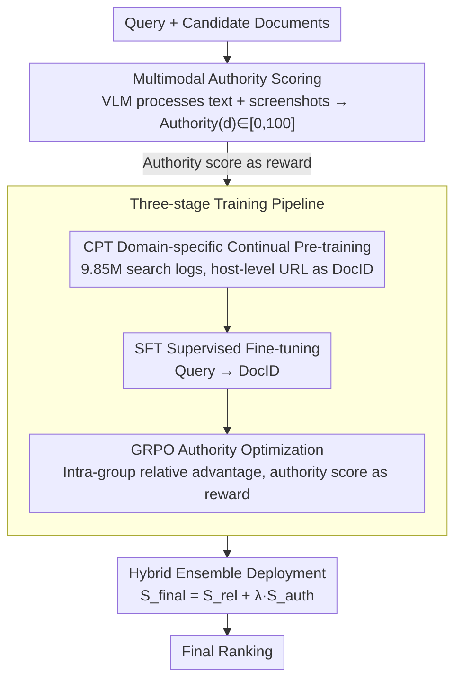

# From Relevance to Authority: Authority-aware Generative Retrieval in Web Search Engines

**Conference**: ACL 2026  
**arXiv**: [2604.13468](https://arxiv.org/abs/2604.13468)  
**Code**: None  
**Area**: Information Retrieval / Search Engines  
**Keywords**: Generative Retrieval, Authority, GRPO, Multimodal Scoring, Web Search

## TL;DR
This paper proposes AuthGR, the first framework to systematically integrate document authority into generative retrieval. By utilizing VLM multimodal authority scoring, a three-stage progressive training pipeline (CPT→SFT→GRPO), and a hybrid ensemble deployment pipeline, it validated significant user engagement improvements in large-scale A/B tests on the Naver commercial search engine.

## Background & Motivation

**Background**: Generative Information Retrieval (GenIR) reformulates retrieval as a text generation task, directly generating document identifiers (DocIDs). Recently, it has been widely applied in industrial scenarios such as e-commerce search, food delivery, and financial services. However, existing methods primarily optimize for semantic relevance.

**Limitations of Prior Work**: In high-risk fields like health and finance, relying solely on semantic relevance may rank unverified personal blogs (e.g., health bloggers) as equal to official medical associations. However, integrating authority into GenIR faces three challenges: (1) Defining authority—textual cues alone cannot distinguish trusted sources from well-disguised promotional sites; (2) Learning authority—injecting authority concepts without compromising semantic relevance is non-trivial; (3) Deployment—directly replacing existing rankers is impractical.

**Key Challenge**: Highly relevant documents do not equate to trustworthy documents. In high-risk domains, recommending unreliable information to users can lead to serious consequences. However, existing GenIR systems lack mechanisms to differentiate between authoritative and non-authoritative sources.

**Goal**: To design the first authority-aware GenIR framework that prioritizes displaying trustworthy documents while maintaining relevance.

**Key Insight**: (1) Utilize VLMs to simulate human multimodal judgments of webpage authority (textual content + visual design + advertisement distribution); (2) Use GRPO preference optimization to enable the model to prioritize high-authority documents among candidates; (3) Coordinate deployment with existing rankers via a hybrid ensemble pipeline.

**Core Idea**: Authority scores serve as reward signals for GRPO, enabling the generative retrieval model to learn a preference for authoritative sources while maintaining semantic relevance.

## Method

### Overall Architecture

AuthGR addresses the "relevance $\neq$ trustworthiness" issue: while standard GenIR generates DocIDs given a query, optimizing only for semantic relevance treats promotional pages similarly to official authoritative sources. The mechanism involves first using a VLM to generate a multimodal authority score for each candidate document. This score is then used as a reward to inject authority preferences into a generative retrieval model through a three-stage process: "Domain-specific Continual Pre-training → Supervised Fine-tuning → GRPO Authority Optimization." Finally, the model is deployed online through a hybrid ensemble with existing rankers. When a query is received, AuthGR produces a set of authoritative DocIDs, which are weighted and fused with the original ranker's relevance scores for the final ranking.

### Key Designs

**1. Multimodal Authority Scoring: Using VLM to transform "trustworthiness" into a scalable reward signal**

Promotional content is adept at mimicking authoritative language textually; thus, identifying it purely through text is difficult. Visual cues, such as advertisement density and page layout quality, are critical for distinguishing true authority from sophisticated disguises. AuthGR allows the VLM to consume both textual signals (titles, body text, URL metadata) and visual signals (page screenshots). Using a unified scoring standard across three dimensions—professionalism, official status, and public interest—while checking for commercial intent and harmfulness, the VLM outputs $\text{Authority}(d) = f_{\text{VLM}}(T(d), V(d)) \in [0,100]$ along with natural language justifications. This transforms human judgment into a scalable automated agent, providing dense authority rewards for training.

**2. Three-stage Training Pipeline: Progressively upgrading authority awareness from "knowledge" to "preference"**

Direct SFT treats all valid documents equally and fails to learn the relative differences in authority, while weighted cross-entropy is point-wise and lacks exploration. AuthGR adopts a progressive three-stage approach: First, Continual Pre-training (CPT) on 9.85 million search logs allows the model to master associations between queries, URLs, titles, and content, specifically using host-level URLs (e.g., `plus.gov.kr`) as DocIDs to expose source identity. Second, Supervised Fine-tuning (SFT) on 3.95 million high-quality query-document pairs teaches the model to generate DocIDs from queries. Third, GRPO authority optimization is performed: for each query, $G$ candidate DocIDs are sampled, using authority scores as rewards to update the strategy based on the group's relative advantage $A_i = \frac{r_i - \text{mean}(\mathbf{r})}{\text{std}(\mathbf{r})}$. Intra-group comparison is the mechanism that enables the model to learn "prioritizing authoritative sources" among multiple candidates.

**3. Hybrid Ensemble Deployment Pipeline: Replacing high-risk replacement with weighted fusion**

Directly replacing existing rankers in a commercial search engine risks destabilizing tuned recall. AuthGR instead uses a sidecar ensemble: existing retrievers provide relevance scores $S_{\text{rel}}(d|q)$, while AuthGR generates a set of authoritative DocIDs $\mathcal{D}_{\text{auth}}(q)$, with authority scores $S_{\text{auth}} = \frac{N - \text{rank}(d) + 1}{N}$ derived via linear rank decay. The two are fused via $S_{\text{final}} = S_{\text{rel}} + \lambda \cdot S_{\text{auth}} \cdot \mathbb{I}[d \in \mathcal{D}_{\text{auth}}]$. This maintains the original system's recall while boosting the ranking of trustworthy documents, applying bonuses only to documents within the authoritative set.

### Loss & Training

Each stage uses corresponding objectives: CPT uses standard language modeling loss, SFT uses negative log-likelihood, and GRPO uses a PPO-style clipping objective with authority scores as rewards. All training is based on Korean data from the Naver commercial search engine.

## Key Experimental Results

### Main Results

| Model | Scale | P@3 | R@5 | R@10 |
|------|------|------|------|------|
| Qwen3 (ICL) | 32B | 0.0821 | 0.1176 | 0.1570 |
| K-EXAONE (ICL) | 236B | 0.1366 | 0.1918 | 0.2656 |
| AuthGR | **3B** | Matches 14B baseline | — | — |

### Ablation Study

| Configuration | Result | Description |
|------|------|------|
| Full AuthGR (CPT+SFT+GRPO) | Best | Complete three-stage pipeline |
| w/o CPT | Decrease | Lacks domain knowledge priors |
| w/o GRPO (CPT+SFT only) | Low Authority | Unable to distinguish authority levels |
| Online A/B Test | User Engagement ↑ | Large-scale commercial validation |
| Human Evaluation | Quality Score ↑ | Expert verification |

### Key Findings
- AuthGR’s 3B model matches the 14B baseline in offline evaluations (4.7× parameter efficiency gain).
- Large-scale online A/B testing confirmed significant improvements in real user engagement.
- Human evaluations verified high consistency between authority scores and human judgment.
- The GRPO stage is key to injecting authority awareness; SFT alone cannot learn the relativity of authority.
- Multimodal (text + visual) scoring is more accurate than text-only scoring because promotional content mimics authoritative text well.

## Highlights & Insights
- **Paradigm Extension from Relevance to Authority**: This is the first work to systematically introduce authority signals into GenIR, extending from "finding relevant items" to "finding trustworthy ones." This direction is crucial in an era of information overload and misinformation.
- **VLM as a Scalable Proxy for Authority Assessment**: Leveraging VLM’s multimodal understanding to automate webpage authority assessment represents a modern upgrade to traditional PageRank concepts.
- **Industrial-grade Validation**: Large-scale A/B testing and human evaluations on the Naver commercial search engine provide strong practical validation, distinguishing it from most academic works that rely solely on offline experiments.

## Limitations & Future Work
- Validated only on Korean web search; authority standards may vary across languages and cultures.
- Computational costs for VLM scoring are high; large-scale real-time scoring may face efficiency challenges.
- Authority assessments may contain biases—certain legitimate but niche information sources might be undervalued.
- Host-level DocID granularity might incorrectly treat different quality content under the same domain as equivalent.

## Related Work & Insights
- **vs PageRank/TrustRank**: Traditional methods rely on link structures, whereas AuthGR assesses authority directly from content and visuals.
- **vs Standard GenIR**: Standard GenIR only optimizes for relevance, while AuthGR adds an authority dimension.
- **vs TREC Health Misinformation Track**: While others focus on trustworthiness within the health domain, AuthGR provides a general-purpose framework.

## Rating
- Novelty: ⭐⭐⭐⭐⭐ First work to systematically integrate authority into GenIR, with significant industrial impact.
- Experimental Thoroughness: ⭐⭐⭐⭐⭐ Complete validation system including offline, online A/B, and human evaluations.
- Writing Quality: ⭐⭐⭐⭐ Clear motivation and systematic method, though some technical details are brief.
- Value: ⭐⭐⭐⭐⭐ Directly impacts the trustworthiness of commercial search engines, with major social significance.

<!-- RELATED:START -->

## Related Papers

- [\[ACL 2026\] AuthorityBench: Benchmarking LLM Authority Perception for Reliable Retrieval-Augmented Generation](authoritybench_benchmarking_llm_authority_perception_for_reliable_retrieval-augm.md)
- [\[ACL 2026\] IF-GEO: Conflict-Aware Instruction Fusion for Multi-Query Generative Engine Optimization](if-geo_conflict-aware_instruction_fusion_for_multi-query_generative_engine_optim.md)
- [\[ACL 2026\] Enhancing LLM-based Search Agents via Contribution Weighted Group Relative Policy Optimization](enhancing_llm-based_search_agents_via_contribution_weighted_group_relative_polic.md)
- [\[ACL 2026\] Why These Documents? Explainable Generative Retrieval with Hierarchical Category Paths](why_these_documents_explainable_generative_retrieval_with_hierarchical_category_.md)
- [\[ACL 2026\] GLIER: Generative Legal Inference and Evidence Ranking for Legal Case Retrieval](glier_generative_legal_inference_and_evidence_ranking_for_legal_case_retrieval.md)

<!-- RELATED:END -->
