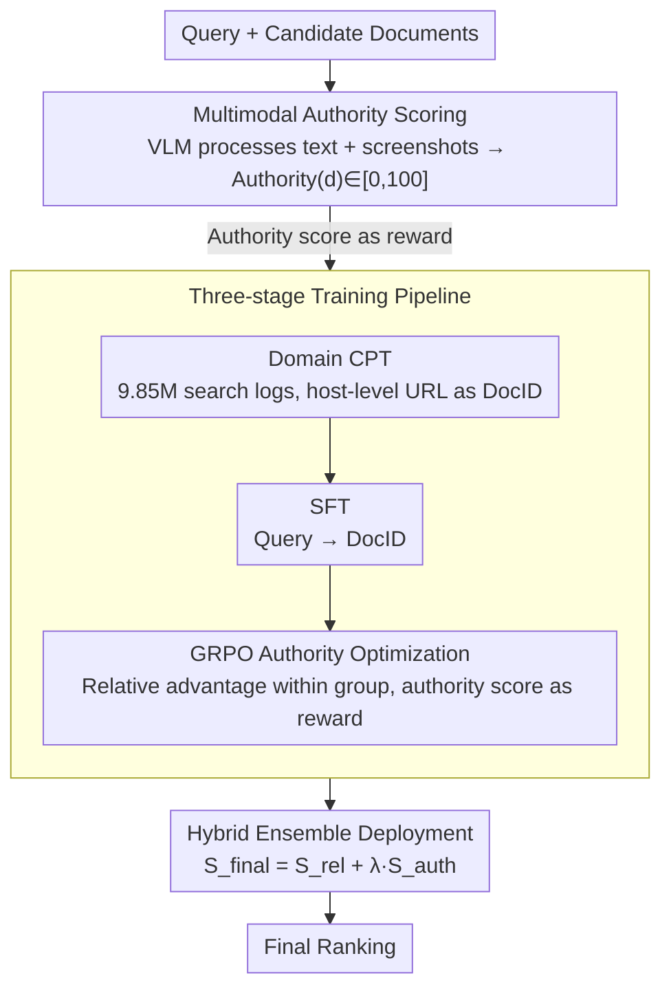

# From Relevance to Authority: Authority-aware Generative Retrieval in Web Search Engines

**Conference**: ACL 2026  
**arXiv**: [2604.13468](https://arxiv.org/abs/2604.13468)  
**Code**: None  
**Area**: Information Retrieval / Search Engines  
**Keywords**: Generative Retrieval, Authority, GRPO, Multimodal Scoring, Web Search

## TL;DR
This paper proposes AuthGR, the first framework to systematically integrate document authority into generative retrieval. Through multimodal authority scoring via VLM, a three-stage progressive training pipeline (CPT → SFT → GRPO), and a hybrid ensemble deployment strategy, significant improvements in user engagement were verified in large-scale A/B testing on the Naver commercial search engine.

## Background & Motivation

**Background**: Generative Information Retrieval (GenIR) reformulates retrieval as a text generation task by directly generating Document Identifiers (DocIDs). Recently, it has been widely applied in industrial scenarios such as e-commerce search, food delivery, and financial services. However, existing methods primarily optimize for semantic relevance.

**Limitations of Prior Work**: In high-stakes domains like health and finance, relying solely on semantic relevance may rank unverified personal blogs (e.g., health bloggers) at the same level as official medical associations. However, integrating authority into GenIR faces three challenges: (1) Defining authority—textual clues alone cannot distinguish trustworthy sources from well-disguised promotional websites; (2) Learning authority—injecting the concept of authority without compromising semantic relevance is non-trivial; (3) Deployment—directly replacing existing rankers is impractical.

**Key Challenge**: Highly relevant documents are not necessarily trustworthy. In high-stakes areas, recommending unreliable information to users can lead to serious consequences. Current GenIR systems lack mechanisms to distinguish between authoritative and non-authoritative sources.

**Goal**: To design the first authority-aware GenIR framework that prioritizes trustworthy documents while maintaining relevance.

**Key Insight**: (1) Utilize VLMs to simulate human multimodal judgments of webpage authority (textual content + visual design + advertisement distribution); (2) Use GRPO-based preference optimization to train the model to prioritize high-authority documents among candidates; (3) Deploy collaboratively with existing rankers through a hybrid ensemble pipeline.

**Core Idea**: Authority scores serve as reward signals for GRPO, enabling the generative retrieval model to learn a preference for authoritative sources while maintaining semantic relevance.

## Method

### Overall Architecture

AuthGR addresses the "relevance $\neq$ trustworthiness" issue: while GenIR directly generates DocIDs for a given query, optimizing only for semantic relevance might rank disguised promotional pages as highly as official authoritative sources. The approach first uses a VLM to generate a multimodal authority score for each candidate document. This score is then treated as a reward to inject authority preferences into a GenIR model via a three-stage process: "Continual Pre-training (CPT) → Supervised Fine-Tuning (SFT) → GRPO Authority Optimization." Finally, the model is deployed online using a hybrid ensemble with existing rankers—when a query arrives, AuthGR produces a set of authoritative DocIDs, which are then fused with the original ranker's relevance scores for final ranking.

### Key Designs

**1. Multimodal Authority Scoring: Using VLM to transform "trustworthiness" into scalable reward signals**

Promotional content excels at mimicking authoritative language textually, making it difficult to detect via text alone. Visual cues such as ad density and page layout quality are critical for distinguishing true authority from sophisticated disguises. AuthGR enables the VLM to process both textual signals (title, body, URL metadata) and visual signals (page screenshots). It scores documents across three dimensions—professionalism, officiality, and public interest—while checking for commercial intent and harmfulness, outputting $\text{Authority}(d) = f_{\text{VLM}}(T(d), V(d)) \in [0,100]$ along with natural language justifications. This transforms human evaluator judgment into a scalable automated proxy, providing dense authority rewards for subsequent training.

**2. Three-stage Training Pipeline: Gradually upgrading authority awareness from "knowledge" to "preference"**

Direct SFT treats all valid documents equally and fails to learn relative differences in authority; weighted cross-entropy is point-wise and lacks exploration. AuthGR utilizes a progressive three-stage pipeline: First, Domain Continual Pre-training (CPT) is conducted on 9.85 million search logs to help the model master associations between queries, URLs, titles, and body text, specifically using host-level URLs (e.g., `plus.gov.kr`) as DocIDs to expose source identity. Second, Supervised Fine-Tuning (SFT) is performed on 3.95 million high-quality query-document pairs to learn DocID generation. Finally, GRPO is used for authority optimization—for each query, $G$ candidate DocIDs are sampled, and the policy is updated using authority scores as rewards based on the group relative advantage $A_i = \frac{r_i - \text{mean}(\mathbf{r})}{\text{std}(\mathbf{r})}$. Intra-group comparison is the mechanism that allows the model to learn to "prioritize authoritative sources" among multiple candidates.

**3. Hybrid Ensemble Deployment Pipeline: Replacing high-risk total replacement with weighted fusion**

Directly replacing an existing ranker in a commercial search engine is high-risk and could destabilize tuned recall. AuthGR employs a bypass ensemble: the existing retriever provides relevance scores $S_{\text{rel}}(d|q)$, while AuthGR generates a set of authoritative DocIDs $\mathcal{D}_{\text{auth}}(q)$. Authority scores are derived via linear decay based on rank: $S_{\text{auth}} = \frac{N - \text{rank}(d) + 1}{N}$. These scores are fused via $S_{\text{final}} = S_{\text{rel}} + \lambda \cdot S_{\text{auth}} \cdot \mathbb{I}[d \in \mathcal{D}_{\text{auth}}]$, which maintains the original system's recall while boosting the ranking of trustworthy documents in the authoritative set.

### Loss & Training

Each stage uses corresponding objectives: CPT uses standard language modeling loss, SFT uses negative log-likelihood, and GRPO uses a PPO-style clipping objective with authority scores as rewards. All training is based on Korean language data from the Naver commercial search engine.

## Key Experimental Results

### Main Results

| Model | Scale | P@3 | R@5 | R@10 |
|------|------|------|------|------|
| Qwen3 (ICL) | 32B | 0.0821 | 0.1176 | 0.1570 |
| K-EXAONE (ICL) | 236B | 0.1366 | 0.1918 | 0.2656 |
| AuthGR | **3B** | Matches 14B baseline | — | — |

### Ablation Study

| Configuration | Effect | Description |
|------|------|------|
| Full AuthGR (CPT+SFT+GRPO) | Optimal | Complete three stages |
| w/o CPT | Decrease | Lacks domain knowledge prior |
| w/o GRPO (CPT+SFT only) | Low Authority | Cannot distinguish authority levels |
| Online A/B Test | User Engagement ↑ | Large-scale commercial validation |
| Human Evaluation | Quality Score ↑ | Expert verification |

### Key Findings
- AuthGR's 3B model matches the 14B baseline in offline evaluation (4.7× parameter efficiency improvement).
- Large-scale online A/B testing confirmed significant increases in real user engagement.
- Human evaluations verified high consistency between authority scores and human judgment.
- The GRPO stage is crucial for injecting authority awareness—SFT alone cannot learn the relativity of authority.
- Multimodal (text + visual) scoring is more accurate than text-only scoring, as promotional content frequently mimics authoritative text.

## Highlights & Insights
- **Paradigm Expansion from Relevance to Authority**: Systematically introduces authority signals into GenIR for the first time, expanding from "finding relevant info" to "finding trustworthy info." This direction is vital in an era of information overload and misinformation.
- **VLM as a Scalable Proxy for Authority Assessment**: Leveraging VLM multimodal understanding to automate webpage authority evaluation is a modern upgrade to traditional PageRank concepts.
- **Industrial-grade Validation**: Large-scale A/B tests and human evaluations on the Naver commercial search engine provide strong practical verification, distinguishing it from academic works that rely solely on offline experiments.

## Limitations & Future Work
- Validated only on Korean web search; authority standards may vary across languages and cultures.
- The computational cost of VLM scoring is high, posing efficiency challenges for large-scale real-time scoring.
- Authority assessments may contain biases—certain legitimate but niche information sources might be underestimated.
- Host-level DocID granularity might incorrectly treat different quality content under the same domain as equivalent.

## Related Work & Insights
- **vs PageRank/TrustRank**: Traditional methods rely on link structures, while AuthGR evaluates authority directly from content and visuals.
- **vs Standard GenIR**: Standard GenIR optimizes only for relevance, whereas AuthGR adds an authority dimension.
- **vs TREC Health Misinformation Track**: While TREC focuses on trustworthiness in the health domain, AuthGR provides a generalized framework.

## Rating
- Novelty: ⭐⭐⭐⭐⭐ First work to systematically integrate authority into GenIR, significant industrial importance.
- Experimental Thoroughness: ⭐⭐⭐⭐⭐ Complete verification system including offline, online A/B, and human evaluations.
- Writing Quality: ⭐⭐⭐⭐ Clear motivation and systematic method, though some technical details are brief.
- Value: ⭐⭐⭐⭐⭐ Directly impacts the trustworthiness of commercial search engines, possessing significant social importance.

<!-- RELATED:START -->

## Related Papers

- [\[ACL 2026\] AuthorityBench: Benchmarking LLM Authority Perception for Reliable Retrieval-Augmented Generation](authoritybench_benchmarking_llm_authority_perception_for_reliable_retrieval-augm.md)
- [\[ACL 2026\] IF-GEO: Conflict-Aware Instruction Fusion for Multi-Query Generative Engine Optimization](if-geo_conflict-aware_instruction_fusion_for_multi-query_generative_engine_optim.md)
- [\[CVPR 2025\] GENIUS: A Generative Framework for Universal Multimodal Search](../../CVPR2025/information_retrieval/genius_a_generative_framework_for_universal_multimodal_search.md)
- [\[ACL 2026\] Enhancing LLM-based Search Agents via Contribution Weighted Group Relative Policy Optimization](enhancing_llm-based_search_agents_via_contribution_weighted_group_relative_polic.md)
- [\[ACL 2026\] Why These Documents? Explainable Generative Retrieval with Hierarchical Category Paths](why_these_documents_explainable_generative_retrieval_with_hierarchical_category_.md)

<!-- RELATED:END -->
