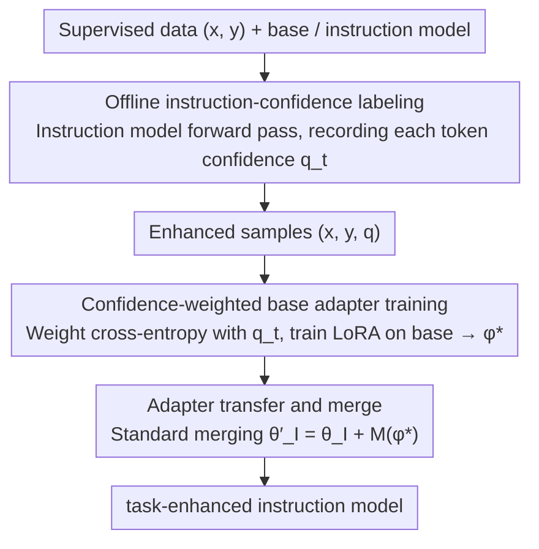

# GIFT: Guided Fine-Tuning and Transfer for Enhancing Instruction-Tuned Language Models

**Conference**: ACL2026  
**arXiv**: [2605.01256](https://arxiv.org/abs/2605.01256)  
**Code**: https://github.com/sustech-nlp/gift  
**Area**: LLM Adaptation / Parameter-Efficient Fine-Tuning / Model Merging  
**Keywords**: Guided Fine-Tuning, LoRA, Instruction Model, Adapter Merge, Confidence Weighting  

## TL;DR
GIFT transforms the instruction-tuned model from a passive merging target into a teacher that provides confidence scores for training tokens. These scores guide the LoRA fine-tuning of the base model, after which the adapter is merged back into the instruction model. This approach consistently outperforms direct fine-tuning and transfer baselines like Shadow-FT on mathematical, medical, and instruction-following tasks.

## Background & Motivation
**Background**: Open-source LLMs are typically released as both base and instruction-tuned models. Instruction models undergo complex post-training to achieve superior instruction following, robustness, and general reasoning. However, direct fine-tuning on downstream tasks often risks disrupting this equilibrium.

**Limitations of Prior Work**: A common alternative is to train task adapters on the base model and merge the learned updates into the instruction model (e.g., Shadow-FT, Chat Vector, Re-Adapt). These methods typically utilize the instruction model only in the final step, treating all tokens equally during adapter training, much like standard SFT.

**Key Challenge**: Tokens in task data are not equivalent. Some represent critical reasoning steps or domain knowledge, while others are merely style, phrasing, or replaceable expressions. Standard SFT forces fitting on all tokens in the base model, applying strong gradients even to tokens for which the instruction model itself has low confidence, leading to adapters that are incompatible with the instruction model’s representation space.

**Goal**: The authors aim to introduce instruction model knowledge early in the training phase, using it to identify which tokens align with instruction-following behavior to train adapters more suitable for merging back into the instruction model.

**Key Insight**: The paper treats the probability assigned by the instruction model to reference tokens as a measure of "token importance." High confidence from the instruction model suggests the token is task-critical and instruction-aligned, while low confidence may indicate noise, stylistic differences, or unstable regions that should receive lower training weight.

**Core Idea**: First, use the instruction model offline to calculate the confidence $q_t$ for each target token. Then, use $q_t$ to weight the cross-entropy loss during base model LoRA fine-tuning. Finally, merge the trained LoRA adapter back into the instruction model.

## Method
The mechanism of GIFT is to transform the "train on base, merge on instruct" transfer pipeline into "instruct-guided base training, then merge back to instruct." It does not change the LoRA merging method but modifies the gradient contribution of each token during adapter learning.

### Overall Architecture
Given supervised data $\mathcal{D}=\{(x,y)\}$, with base model parameters $\theta_B$ and instruction model parameters $\theta_I$. Existing transfer methods assume $\theta_I=\theta_B+\Delta_I$, allowing task updates $M(\phi)$ trained on the base model to be added to the instruction model: $\theta'_I=\theta_I+M(\phi)$. GIFT maintains this merging logic but uses the instruction model to calculate $q_t=p_{\theta_I}(y_t|x,y_{<t})$ for each target token before training $\phi$. When training the LoRA adapter on the base model, token losses are weighted by $q_t$. After training, the adapter is merged back into the instruction model to obtain a task-enhanced instruction model. The pipeline consists of three sequential stages: "instruct labeling → base weighted training → merging back to instruct."

### Key Designs

**1. Offline instruction-confidence labeling: Let the instruction model assign an "alignment importance" score to each target token.**

Tokens in task data are not equal—some are key reasoning steps or domain knowledge, while others are just style or phrasing. To train an adapter compatible with the instruction model, one must identify which tokens are worth learning. GIFT performs a single forward pass per sample $(x,y)$ using the instruction model to record the probability $q_t=p_{\theta_I}(y_t|x,y_{<t})$ for each token in the reference answer. These scores are fixed as enhanced samples $(x,y,\mathbf{q})$, avoiding repeated teacher calls during training.

The instruction model's confidence is used instead of the base model's likelihood because the instruction model, having undergone post-training, better understands which expressions align with instruction-following and task-solving. Its high-confidence tokens are more likely to belong to the "merge-compatible" space.

**2. Confidence-weighted base adapter training: Redistribute cross-entropy gradients using $q_t$ to focus the adapter on high-confidence tokens while avoiding low-confidence regions.**

Standard SFT treats all tokens equally by calculating negative log-likelihood, applying strong gradients even to tokens that the instruction model finds improbable. This creates adapters incompatible with the instruction model's representation space, causing performance degradation after merging. GIFT modifies the loss to be weighted by $q_t$:

$$\mathcal{L}_{\mathrm{GIFT}}(\phi)=\mathbb{E}_{(x,y)\sim\mathcal{D}}\Big[\sum_{t=1}^T q_t\,\ell_t(\phi)\Big],\quad \ell_t(\phi)=-\log p_{\theta_B,\phi}(y_t|x,y_{<t})$$

Experiments use the raw $q_t$ without normalization, truncation, or temperature scaling. This is distinct from distillation: it does not fit the teacher distribution or minimize KL divergence. It merely uses the teacher's confidence to redistribute standard CE gradients, pulling the update direction towards instruction-consistent regions.

**3. Adapter transfer and merge: Standard merger of base-learned capabilities back into the instruction model without fancy techniques.**

After obtaining the optimal adapter $\phi^\star$, GIFT uses standard LoRA merging: $\theta'_I=\theta_I+M(\phi^\star)$. This follows the assumption that $\theta_I=\theta_B+\Delta_I$, making base task updates directly additive. The paper intentionally uses the most primitive merging method to attribute gains solely to the guided fine-tuning process rather than merging tricks. Advanced merging methods like TIES, DARE, or Fisher-weighted averaging are left for future enhancement; the core contribution of GIFT lies in the training phase.

### Loss & Training
All methods use identical LoRA settings: AdamW, 1 epoch, max sequence length 2048, global batch size 256, learning rate $2\times10^{-4}$, LoRA rank $r=64$, LoRA scaling $\alpha=128$, dropout 0.05, and warmup ratio 0.1. Mathematical tasks are trained on 2,000 samples from NuminaMath-CoT and evaluated on Math500, Minerva Math, OlympiadBench, AIME 2024, and AMC 2023. Inference uses temperature 1.0, max generation length 4096, and reports Average@16 over 16 samples. Medical tasks use 10,000 MedMCQA samples for training and report multi-choice accuracy on MedQA, MMLU-medical, and MedMCQA test.

## Key Experimental Results

### Main Results

| Dataset / Model | Metric | GIFT | Original Instruct / Strong Baseline | Gain / Conclusion |
|--------|------|------|----------|------|
| Llama3.1-8B Math (5 tasks) | Average@16 | 22.0 | Instruct 16.8; Shadow-FT 18.0 | +5.2 over base, +4.0 over Shadow-FT |
| Llama3.2-3B Math (5 tasks) | Average@16 | 19.5 | Instruct 16.5; Shadow-FT 16.7 | Consistent gains on small models |
| Qwen2.5-7B Math (5 tasks) | Average@16 | 42.9 | Instruct 41.3; Shadow-FT 38.0 | +1.6 even on strong instruction models |
| DeepSeek-Math-7B Math (5 tasks) | Average@16 | 19.7 | Instruct 16.8; Shadow-FT 17.4 | Math-specific models also benefit |
| Llama3.1-8B Medical QA | Average accuracy | 68.8 | Instruct 62.6; Shadow-FT 65.1 | +6.2 on knowledge-intensive tasks |
| MedQA | Accuracy | 68.3 | Instruct 55.2; Shadow-FT 65.6 | Largest gains in factual/MC reasoning |
| MMLU-medical | Accuracy | 77.7 | Instruct 75.1; Shadow-FT 73.8 | Maintained and improved general medical knowledge |
| MedMCQA | Accuracy | 60.2 | Instruct 57.4; Shadow-FT 55.9 | Leading in training domain tests |

### Ablation Study

| Configuration | Key Metric | Description |
|------|---------|------|
| Qwen2.5-7B Instruct | Math Avg 41.3 | Strong original instruction baseline |
| SFT+Merge / Shadow-FT | Math Avg 38.0 | Standard base adapter merging causes -3.3 degradation |
| GIFT-BaseT | Math Avg 41.0 | Using base model as teacher only recovers baseline; reweighting alone is insufficient |
| GIFT full | Math Avg 42.9 | Instruction teacher guidance provides stable gains |
| Qwen2.5-7B MMLU / IFEval | 68.8 / 72.1 | vs 68.7 / 71.2; no loss to general knowledge or instruction following |
| Llama3.1-8B MMLU / IFEval | 63.7 / 74.7 | vs 63.2 / 73.8; similarly maintained or improved |
| Super-NaturalInstructions summarization | EM 12.00; RougeL 40.28 | vs 10.75 / 37.38; suggests utility beyond Math/Medicine |
| Qwen2.5 scale 0.5B→32B | 0.5B: 8.3 vs 7.9; 32B: 51.2 vs 50.6 | GIFT outperforms instruct baseline across model scales |

### Key Findings
- Direct fine-tuning of instruction models significantly degrades performance under limited supervision. For instance, Llama3.1-8B math average dropped from 16.8 to 8.9, and Qwen2.5-7B from 41.3 to 21.2, highlighting the high risk of naive Instruct-SFT.
- GIFT remains effective for strong models. Qwen2.5-7B-Instruct originally averaged 41.3, Shadow-FT dropped it to 38.0, while GIFT raised it to 42.9, indicating that guidance improves merge compatibility.
- Learning signal analysis explains the mechanism: In Shadow-FT, 79.7% of the learning signal comes from low-confidence tokens, with high-confidence tokens accounting for only 6.9%. GIFT reduces low-confidence contribution to 29.6% and increases high-confidence contribution to 31.5%.
- Offline labeling is low-cost: For 2,000 NuminaMath-CoT samples on a single RTX 4090 24GB, Llama3.1-8B-Instruct takes 2m11s and Qwen2.5-7B-Instruct takes 2m9s, with peak VRAM utilization below 22GB.

## Highlights & Insights
- **Instruction model as a "mentor" rather than a "target"**: This is a conceptual shift. Since the adapter is eventually merged back into the instruction model, the instruction model should decide what the adapter learns.
- **Lower cost than distillation**: GIFT requires no KL divergence between teacher and student per step, nor online teacher inference. It uses a single offline token confidence annotation while preserving SFT simplicity.
- **Explaining Shadow-FT instability**: Standard CE is dominated by low-confidence, high-loss tokens, which correspond to regions the instruction model does not approve of. Merging these updates breaks existing instruction capabilities.
- **Suitability for low-data adaptation**: Using only 2,000 math samples or 10,000 medical samples, results suggest that selecting the right learning signals is more important than increasing training intensity when data is limited and specialized.

## Limitations & Future Work
- GIFT requires an additional offline annotation pass. While cost is currently low for 2K samples, preprocessing time and storage will scale with millions of samples.
- The paper primarily uses standard LoRA merging to isolate variables, leaving the exploration of gains combined with TIES or Fisher-weighted averaging for future work.
- Guidance directly uses raw token probabilities. Alternative designs using normalization, temperature, truncation, or sequence/step-level confidence have not been studied.
- If the instruction model has weak domain knowledge or systematic bias, its confidence might erroneously suppress valuable new knowledge. Future research should examine the tension between teacher confidence and task novelty.

## Related Work & Insights
- **vs Shadow-FT / Chat Vector**: These also train on base models and merge back to instruction models, but the instruction model only appears at the merge stage. GIFT uses instruction confidence to shape the update direction during training.
- **vs Re-Adapt / Task Arithmetic**: These focus on linear combinations of base, instruction offset, and task update. GIFT focuses on making the task update itself more compatible. These are complementary.
- **vs TIES / DARE**: TIES and DARE address interference and redundancy during post-hoc merging. GIFT addresses the issue of low-quality gradients entering the adapter during training.
- **Insight**: In model adaptation, the teacher does not need to provide a full distribution. Providing the weights for "which tokens are worth learning" can significantly improve the quality of parameter updates.

## Rating
- Novelty: ⭐⭐⭐⭐☆ The confidence-weighting idea is intuitive, but using the instruction model as a "mentor" for base adaptation is precise and effective.
- Experimental Thoroughness: ⭐⭐⭐⭐☆ Covers math, medicine, and summarization across various model scales and learning signal analyses. Could benefit from larger data scales.
- Writing Quality: ⭐⭐⭐⭐☆ Method definitions are concise, with convincing ablation and mechanism analyses and strong tabular evidence.
- Value: ⭐⭐⭐⭐⭐ Highly practical for low-cost domain adaptation of open-source instruction models, particularly for LoRA/adapter workflows.

<!-- RELATED:START -->

## Related Papers

- [\[ACL 2026\] Enhancing Multilingual RAG Systems with Debiased Language Preference-Guided Query Fusion](enhancing_multilingual_rag_systems_with_debiased_language_preference-guided_quer.md)
- [\[ICLR 2026\] Fine-tuning with RAG for Improving LLM Learning of New Skills](../../ICLR2026/information_retrieval/fine-tuning_with_rag_for_improving_llm_learning_of_new_skills.md)
- [\[ICML 2025\] FedRAG: A Framework for Fine-Tuning Retrieval-Augmented Generation Systems](../../ICML2025/information_retrieval/fedrag_a_framework_for_fine-tuning_retrieval-augmented_generation_systems.md)
- [\[ACL 2025\] Enhancing Lexicon-Based Text Embeddings with Large Language Models](../../ACL2025/information_retrieval/enhancing_lexicon-based_text_embeddings_with_large_language_models.md)
- [\[CVPR 2026\] Language-driven Fine-grained Retrieval](../../CVPR2026/information_retrieval/language-driven_fine-grained_retrieval.md)

<!-- RELATED:END -->
