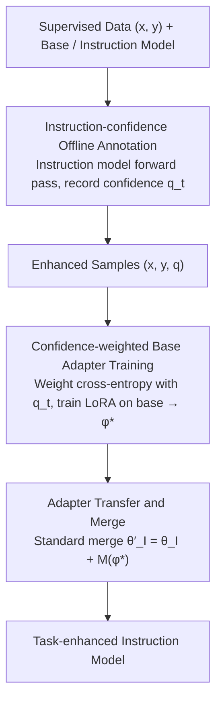

# GIFT: Guided Fine-Tuning and Transfer for Enhancing Instruction-Tuned Language Models

**Conference**: ACL2026  
**arXiv**: [2605.01256](https://arxiv.org/abs/2605.01256)  
**Code**: https://github.com/sustech-nlp/gift  
**Area**: LLM Adaptation / Parameter-Efficient Fine-Tuning / Model Merging  
**Keywords**: Guided Fine-Tuning, LoRA, Instruction Model, Adapter Merge, Confidence Weighting  

## TL;DR
GIFT transforms the instruction-tuned model from a passive merge target into an active guide. It first utilizes the instruction model to annotate the confidence of training tokens, uses these confidence scores to guide the LoRA fine-tuning of the base model, and finally merges the adapter back into the instruction model. This approach consistently outperforms direct fine-tuning and transfer baselines like Shadow-FT across mathematical, medical, and instruction tasks.

## Background & Motivation
**Background**: Open-source LLMs are typically released as both base and instruction-tuned models. Instruction models undergo complex post-training to achieve better instruction following, robustness, and general reasoning, but direct downstream fine-tuning often disrupts this balance.

**Limitations of Prior Work**: A common alternative is to train a task adapter on the base model and merge the learned updates into the instruction model (e.g., Shadow-FT, Chat Vector, Re-Adapt). However, these methods usually involve the instruction model only in the final step, while treating all tokens equally during adapter training, as in standard SFT.

**Key Challenge**: Not all tokens in task data are equivalent. Some represent critical reasoning steps or domain knowledge, while others are merely style, phrasing, or replaceable expressions. Standard SFT forces the base model to fit all tokens, particularly imposing strong gradients on tokens where the instruction model itself has low confidence, leading to learned adapters that are incompatible with the instruction model's representation space.

**Goal**: The authors aim to introduce the knowledge of the instruction model into the training phase earlier, using it to determine which tokens align better with instruction-aligned behavior, thereby training adapters that are more suitable for merging back into the instruction model.

**Key Insight**: The paper treats the probability assigned by the instruction model to tokens in reference answers as a measure of token importance. High confidence from the instruction model suggests a token is likely task-critical and instruction-aligned, whereas low confidence may indicate noise, stylistic differences, or unstable regions, necessitating reduced training weights.

**Core Idea**: The instruction model is first used offline to calculate the confidence $q_t$ for each target token. Subsequently, $q_t$ is used to weight the cross-entropy loss of the base model's LoRA training. After training, the LoRA adapter is merged into the instruction model.

## Method
The essence of GIFT is converting the "train on base, merge on instruct" transfer workflow into "train base guided by instruct, then merge back." It does not change the LoRA merging mechanism but alters the contribution of each token to the gradient during adapter learning.

### Overall Architecture
Given supervised data $\mathcal{D}=\{(x,y)\}$, base model parameters $\theta_B$, and instruction model parameters $\theta_I$. Existing transfer methods assume $\theta_I=\theta_B+\Delta_I$, thus task updates $M(\phi)$ trained on the base can be added to the instruction model: $\theta'_I=\theta_I+M(\phi)$. GIFT retains this merging logic but, before training $\phi$, calculates $q_t=p_{\theta_I}(y_t|x,y_{<t})$ for each target token using the instruction model. During LoRA training on the base model, the token loss is weighted by $q_t$. Finally, the adapter is merged back into the instruction model to produce a task-enhanced instruction model. The pipeline consists of three sequential stages: "Instruction Annotation → Weighted Base Training → Merge Back."

### Key Designs

**1. Instruction-confidence Offline Annotation: Assigning "Alignment Importance" scores via the instruction model**

Tokens in task data are non-equivalent. To train an adapter compatible with the instruction model, it is necessary to identify which tokens are worth learning. GIFT performs a forward pass for each sample $(x,y)$ using the instruction model to record the probability $q_t=p_{\theta_I}(y_t|x,y_{<t})$ for each reference token. These scores are saved as enhanced samples $(x,y,\mathbf{q})$, avoiding repeated teacher calls during training.

Confidence from the instruction model is used instead of the base model's likelihood because the instruction model, having undergone post-training, better understands which expressions align with instruction following and task resolution.

**2. Confidence-weighted Base Adapter Training: Reallocating gradients to focus on high-confidence tokens**

Standard SFT treats all tokens equally, applying strong gradients even to tokens where the instruction model has low confidence. This creates adapters incompatible with the instruction model's space. GIFT modifies the loss to be weighted by $q_t$:

$$\mathcal{L}_{\mathrm{GIFT}}(\phi)=\mathbb{E}_{(x,y)\sim\mathcal{D}}\Big[\sum_{t=1}^T q_t\,\ell_t(\phi)\Big],\quad \ell_t(\phi)=-\log p_{\theta_B,\phi}(y_t|x,y_{<t})$$

The raw $q_t$ is used without normalization or scaling. This is not distillation; it does not fit the teacher distribution or minimize KL divergence, but merely uses teacher confidence to redirect the standard CE gradients toward instruction-consistent areas.

**3. Adapter Transfer and Merge: Standard merging of base-learned capabilities back to the instruction model**

After obtaining the optimal adapter $\phi^\star$, GIFT uses standard LoRA merging: $\theta'_I=\theta_I+M(\phi^\star)$. The paper deliberately uses the most basic merging to attribute gains directly to the guided fine-tuning process rather than the merging technique itself.

### Loss & Training
All methods use identical LoRA settings: AdamW, 1 epoch, max sequence length 2048, global batch size 256, learning rate $2\times10^{-4}$, $r=64$, $\alpha=128$, dropout 0.05, and warmup ratio 0.1. Mathematical tasks are trained on 2,000 samples from NuminaMath-CoT and evaluated on Math500, Minerva Math, etc., reporting Average@16. Medical tasks use 10,000 samples from MedMCQA and report accuracy on MedQA and MMLU-medical.

## Key Experimental Results

### Main Results

| Dataset / Model | Metric | GIFT | Original Instruct / Strong Baseline | Gain / Conclusion |
|--------|------|------|----------|------|
| Llama3.1-8B (5 Math Tasks) | Average@16 | 22.0 | Instruct 16.8; Shadow-FT 18.0 | +5.2 over original, +4.0 over Shadow-FT |
| Llama3.2-3B (5 Math Tasks) | Average@16 | 19.5 | Instruct 16.5; Shadow-FT 16.7 | Consistent gains on small models |
| Qwen2.5-7B (5 Math Tasks) | Average@16 | 42.9 | Instruct 41.3; Shadow-FT 38.0 | +1.6 even on strong instruction models |
| DeepSeek-Math-7B (5 Math Tasks) | Average@16 | 19.7 | Instruct 16.8; Shadow-FT 17.4 | Specialized models also benefit |
| Llama3.1-8B Medical QA | Avg Acc | 68.8 | Instruct 62.6; Shadow-FT 65.1 | +6.2 on knowledge-intensive tasks |
| MedQA | Accuracy | 68.3 | Instruct 55.2; Shadow-FT 65.6 | Largest gains in factual reasoning |
| MMLU-medical | Accuracy | 77.7 | Instruct 75.1; Shadow-FT 73.8 | Maintains/enhances general knowledge |

### Ablation Study

| Configuration | Key Metric | Description |
|------|---------|------|
| Qwen2.5-7B Instruct | Math Avg 41.3 | Strong original instruction baseline |
| SFT+Merge / Shadow-FT | Math Avg 38.0 | Standard base adapter merge causes -3.3 degradation |
| GIFT-BaseT | Math Avg 41.0 | Case-based teacher only recovers the baseline |
| GIFT full | Math Avg 42.9 | Instruction teacher guidance yields stable gains |
| Qwen2.5-7B General | 68.8 / 72.1 | Maintains general knowledge (MMLU/IFEval) |
| Llama3.1-8B General | 63.7 / 74.7 | No degradation in general capabilities |

### Key Findings
- Direct fine-tuning of instruction models degrades significantly under limited supervision (e.g., Llama3.1-8B math avg drops from 16.8 to 8.9).
- GIFT remains effective for strong models. While Shadow-FT causes a drop on Qwen2.5-7B, GIFT improves it.
- Learning signal analysis: In Shadow-FT, 79.7% of learning signals originate from low-confidence tokens. GIFT reduces this to 29.6% and increases high-confidence contribution to 31.5%.
- Offline annotation is efficient: Annotating 2,000 samples takes approximately 2 minutes on a single RTX 4090.

## Highlights & Insights
- **Instruction Model as "Tutor"**: Shifting the instruction model from a target to a guide is a compelling conceptual pivot.
- **Cost-Effective**: GIFT avoids per-step KL divergence or online teacher inference, maintaining SFT's simplicity.
- **Instability of Shadow-FT**: Standard CE is dominated by high-loss, low-confidence tokens that the instruction model may not approve of; merging these disrupts original capabilities.
- **Data-Efficient**: High performance with only 2,000 math or 10,000 medical samples highlights the importance of signal selection.

## Limitations & Future Work
- Requires an additional offline annotation pass, which may scale with data size.
- Only standard LoRA merging was explored; synergy with TIES or DARE remains to be studied.
- Direct use of raw probabilities might be improved by normalization or sequence-level confidence.
- Risks of systematic bias: If the instruction model is weak in a domain, it may suppress valuable new knowledge.

## Related Work & Insights
- **vs Shadow-FT / Chat Vector**: These involve the instruction model only at the end; GIFT uses it during training to shape the update direction.
- **vs Re-Adapt / Task Arithmetic**: These focus on linear weight combinations, whereas GIFT focuses on improving the quality of the task update itself.
- **vs TIES / DARE**: These address post-hoc interference; GIFT addresses low-quality gradient entry during training.

## Rating
- Novelty: ⭐⭐⭐⭐☆ Intuitive yet precise application of instruction guidance.
- Experimental Thoroughness: ⭐⭐⭐⭐☆ Extensive coverage across tasks and scales, though could expand to larger data scales.
- Writing Quality: ⭐⭐⭐⭐☆ Clear definitions and persuasive mechanism analysis.
- Value: ⭐⭐⭐⭐⭐ Highly practical for low-cost domain adaptation of open-source instruction models.

<!-- RELATED:START -->

## Related Papers

- [\[ACL 2026\] Enhancing Multilingual RAG Systems with Debiased Language Preference-Guided Query Fusion](enhancing_multilingual_rag_systems_with_debiased_language_preference-guided_quer.md)
- [\[ICLR 2026\] Fine-tuning with RAG for Improving LLM Learning of New Skills](../../ICLR2026/information_retrieval/fine-tuning_with_rag_for_improving_llm_learning_of_new_skills.md)
- [\[ICML 2025\] FedRAG: A Framework for Fine-Tuning Retrieval-Augmented Generation Systems](../../ICML2025/information_retrieval/fedrag_a_framework_for_fine-tuning_retrieval-augmented_generation_systems.md)
- [\[ACL 2025\] Enhancing Lexicon-Based Text Embeddings with Large Language Models](../../ACL2025/information_retrieval/enhancing_lexicon-based_text_embeddings_with_large_language_models.md)
- [\[ACL 2026\] Can Compact Language Models Search Like Agents? Distillation-Guided Policy Optimization for Preserving Agentic RAG Capabilities](can_compact_language_models_search_like_agents_distillation-guided_policy_optimi.md)

<!-- RELATED:END -->
