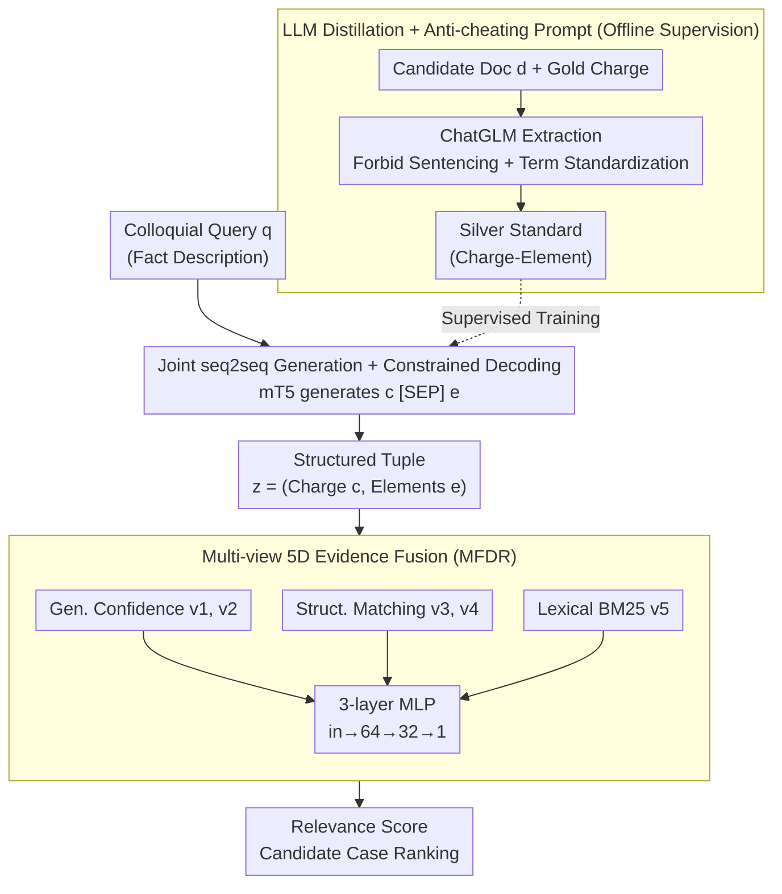

# GLIER: Generative Legal Inference and Evidence Ranking for Legal Case Retrieval

**Conference**: ACL 2026  
**arXiv**: [2604.23779](https://arxiv.org/abs/2604.23779)  
**Code**: TBD  
**Area**: Information Retrieval / Legal NLP  
**Keywords**: Legal Case Retrieval, Generative Inference, Charge-Element, Multi-view Evidence Fusion, Knowledge Distillation

## TL;DR
This paper proposes **GLIER**: a two-stage framework that reframes Legal Case Retrieval (LCR) from "direct text similarity matching" to "jointly generating latent variables of *Charge + Constitutive Elements* via seq2seq, then fusing them through multi-view (generation confidence + structural matching + lexical BM25) MLP." It outperforms SAILER and KELLER on LeCaRD/LeCaRDv2 and beats strong full-data baselines using only 10% of the training data.

## Background & Motivation

**Background**: There are currently three mainstream paradigms for Legal Case Retrieval (LCR): (i) Lexical matching like BM25, which identifies keywords but cannot model legal logic; (ii) Dense retrieval such as BERT, Lawformer, or SAILER, which relies on pre-trained long-text encoding but remains a black-box similarity measure; (iii) Generative retrieval like DSI or LegalSearchLM, which directly generates DocIDs but carries a high risk of hallucination and lacks evidence alignment.

**Limitations of Prior Work**: Legal relevance is not "literal similarity" but "legal consistency"—it essentially involves determining the alignment between *Charge* and *Constitutive Elements*. Queries are typically colloquial descriptions of facts, while candidate documents use formal legal language, creating a significant *semantic gap*. Even with structural pre-training or LLM rewriting, methods like SAILER/KELLER still belong to the "Retrieve-then-Rank" discriminative paradigm and fail to explicitly model the legal reasoning chain of "inferring charges and then elements from the query."

**Key Challenge**: Retrieval tasks are modeled as a direct mapping from query to doc, whereas legal relevance follows a chained conditional dependency: query $\rightarrow$ (charge, elements) $\rightarrow$ doc. The system must be both *interpretable* and *robustly controllable*.

**Goal**: (1) Formalize LCR as an inference problem over latent variables $z=(c,e)$; (2) Use joint seq2seq generation to enforce legal sequential dependencies between charges and elements; (3) Fuse generation confidence with structural and lexical signals for reranking to avoid pure generative hallucinations.

**Key Insight**: Emulate the thinking of legal experts—first infer the charge and elements from the case facts, then search the case library for precedents matching this legal profile. Meanwhile, utilize LLMs for offline distillation of a silver standard to avoid expensive manual labeling.

**Core Idea**: Generate `c [SEP] e` at once using seq2seq. It leverages autoregressive decoding to naturally implement the chained constraint $P(e|q,c)$, then fuses "latent confidence + explicit structure + lexical matching" into a 5D feature MLP for ranking.

## Method

### Overall Architecture

GLIER reframes LCR from "direct similarity matching" to "chained inference: query $\rightarrow$ (charge, elements) $\rightarrow$ doc," ensuring retrieval follows the logic of legal experts. It consists of two sequential modules: the generator GLIE (mT5-base student model) generates a structured tuple $K_q=(c_q,e_q)$ from a colloquial query $q$, supervised by "charge-element" silver standards $\mathcal{D}_{struct}$ distilled offline from a ChatGLM teacher. The reranker MFDR then concatenates generation confidence, structural matching, and lexical matching into a 5-dimensional feature vector $\mathbf{v}_{q,d}\in\mathbb{R}^5$, which is processed by a 3-layer MLP (in $\rightarrow$ 64 $\rightarrow$ 32 $\rightarrow$ 1) to output relevance scores. The entire process is formalized as $\hat z = \arg\max_z P_\theta(z|q)$ and $S(q,d)=f_\psi(q,d,\hat z)$, where $P_\theta(z|q)=P_\theta(c|q)P_\theta(e|q,c)$ explicitly encodes the conditional dependency of "charge before elements."

### Key Designs

**1. Joint seq2seq Generation + Constrained Decoding: Autoregressive decoding carries legal sequential dependency**

Using two independent classifiers to predict charges and elements separately can lead to logical conflicts (e.g., "violent" elements attached to a "property crime" charge). GLIER generates the target sequence $Y=c_q\oplus\text{[SEP]}\oplus e_q$ in one go, minimizing $\mathcal{L}_{\text{gen}}=-\sum_{t=1}^{|Y|}\log P(y_t|y_{<t},X;\theta)$. Since elements are sampled conditioned on the previously generated charge prefix, logical conflicts are naturally filtered. During inference, a beam width of 3 is used with a validity filter $\hat c_q=\{t\in\hat c_{raw}\mid t\in\mathcal{K}_{charge}\}$ and $\hat e_q=\{t\in\hat e_{raw}\mid t\in\mathcal{K}_{element}\}$ to constrain outputs to a legal taxonomy $\mathcal{K}$, suppressing synonym hallucinations common in generative models. Ablations show this joint strategy improves MAP by +1.87% and Hits@5 by +1.89% over independent generation.

**2. LLM Distillation + Anti-cheating Prompt: Refining noisy documents into searchable structured supervision**

Manual labeling of "charge-element" pairs is extremely costly. GLIER uses ChatGLM for offline silver standard distillation: for each document $d$ with a gold charge $c_{gt}$, it calls $K_d=\text{LLM}(d,c_{gt},\mathcal{P})=(c_d,e_d)$. The prompt design enforces two points: first, it uses professional legal terminology rather than colloquial descriptions; second, it **strictly forbids extracting sentencing results** (e.g., "fixed-term imprisonment/compensation"). The latter is crucial: legal documents are full of sentencing and procedural details; if not removed, silver labels would leak target signals, allowing the student model to learn "sentencing template matching" shortcuts. Failed samples are re-extracted using deepseek-R1 as a fallback. Manual evaluation of 100 cases showed charge accuracy of 97.0%, element precision of 82.0%, and Cohen's $\kappa=0.71$.

**3. Multi-view 5D Evidence Fusion (MFDR): MLP learns non-linear complementarity between signals**

Generation confidence, structural hits, and lexical BM25 are heterogeneous signals. Simple rule-based summation misses their non-linear relationships (ablation without MLP dropped MAP by 15.2%). MFDR organizes these into 5 features: *Latent Confidence* $v_1, v_2$ are length-normalized generation probabilities $v_1=\exp(\tfrac{1}{|\hat c_q|}\sum_t\log P(t|\hat c_{<t},q))$ and $v_2$ (similarly for $e$); *Explicit Structural* $v_3=\mathbb{I}(\hat c_q\cap c_d\neq\varnothing)$ and $v_4=\tfrac{|\hat e_q\cap e_d|}{|\hat e_q|+\epsilon}$; and *Lexical* $v_5=\tfrac{\text{BM25}(q,d)}{\max_{d'\in\mathcal{C}_q}\text{BM25}(q,d')}$ (normalized per query). The MLP is trained using BCE with BM25 hard negatives (1:3 positive-to-negative ratio): $\mathcal{L}_{\text{score}}=-[\log S(q,d^+)+\sum_{d^-}\log(1-S(q,d^-))]$. SHAP analysis reveals that Charge Hit is a decisive "gatekeeper" feature, while Norm_BM25 is a fine-grained "tuner."

### Loss & Training

The two modules are trained independently. Generator: mT5-base performs NLL on silver standards with max source/target = 512/128 and beam=3. Scorer: 3-layer MLP (dropout 0.1), AdamW, lr 1e-4, batch 64; hard negatives are sampled from non-relevant documents in the BM25 top-K to ensure the MLP does not rely solely on $v_5$.

## Key Experimental Results

### Main Results

| Model | Dataset | MAP | Hits@3 | Hits@5 | MRR@5 |
|------|--------|-----|--------|--------|-------|
| BM25 | LeCaRD | 49.13 | 72.72 | 81.13 | 62.42 |
| SAILER | LeCaRD | 58.28 | 71.96 | 80.37 | 67.90 |
| KELLER | LeCaRD | **61.81** | 83.81 | 88.57 | 68.20 |
| **GLIER (Ours)** | LeCaRD | 58.61 | **95.45†** | **95.45†** | **71.97** |
| KELLER | LeCaRDv2 | 76.22 | 95.94 | 98.71 | 93.02 |
| **GLIER (Ours)** | LeCaRDv2 | **76.58** | **97.48** | **99.37** | **93.52** |

On LeCaRDv2, GLIER achieves SOTA on all 7 metrics. On LeCaRD, Hits@3 is 11.64 percentage points higher than KELLER (95.45% vs 83.81%), and Recall@3 is 26.13% vs 19.01%, proving GLIER significantly reduces "zero-recall" risks.

### Ablation Study

| Setting | MAP | MRR@5 | NDCG@5 | Note |
|------|-----|-------|--------|------|
| Full Model (5 features) | 76.58 | 93.52 | 84.64 | Complete |
| w/o Lexical (BM25) | 50.23 | 66.03 | 51.69 | −26.35 |
| w/o Charge features | 60.19 | 84.62 | 72.22 | −16.39 |
| w/o Element features | 73.60 | 91.53 | 84.12 | −2.98 |
| Only Lexical | 58.43 | 79.42 | 65.13 | BM25 Only |
| Only Charge | 48.26 | 66.55 | 49.30 | Charge Only |
| Only Elements | 40.88 | 63.97 | 47.31 | Elements Only |
| w/o GenIR (Direct LLM) | 74.78 | 91.14 | — | No student −1.80 |
| w/o MLP (Rule Sum) | 61.38 | 84.22 | — | No fusion −15.20 |
| Independent Gen. | 74.71 | 92.53 | — | Separate −1.87 |

### Key Findings
- **Charge acts as "gatekeeper," BM25 as "tuner"**: SHAP shows charge matching is a decisive binary filter, while BM25 provides fine-grained adjustment. Combining the two leads to supra-linear improvement (76.58), validating the hypothesis that lexical provides ranking resolution while generative provides a semantic gatekeeper.
- **Charge > Elements**: Removing charge drops MAP by 16.39 vs 2.98 for elements, validating the legal hierarchy where the charge is the coarse primary filter and elements are fine-grained secondary checks.
- **Exceptional data efficiency**: With only 10% of training data, GLIER achieves a MAP of 74.58, surpassing full SAILER (73.60). This is likely because legal texts are highly homogeneous, allowing mapping fact facts to charges with few samples.
- **Backbone is not critical**: replacing mT5-base with Qwen2.5-7B-Instruct only increased MAP by +0.0020, suggesting performance stems from the structural inference paradigm rather than model scale.
- **Joint > Independent**: Joint generation yields +1.87 MAP over independent steps, proving the chain-of-logic (charge as semantic anchor) outweighs the risk of error propagation.

## Highlights & Insights
- **Paradigm Reframing**: Upgrading LCR from "text similarity" to "latent juridical structure inference" explicitly models the reasoning chain; this can be migrated to other vertical domains like medicine or compliance.
- **Anti-cheating Distillation Prompts**: Forbidding sentencing details is a subtle but critical trick to prevent student models from taking shortcuts, providing a template for distilling expert domain data.
- **MLP Multi-view Fusion**: A minimalist 5D vector with high SHAP interpretability reveals that role separation (gatekeeping vs. tuning) determines the non-linear form of signal fusion.
- **Data Efficiency**: The success with 10% data suggests that structural priors compress the search space significantly, indicating that modelers should prioritize latent structures over data volume in knowledge-intensive tasks.

## Limitations & Future Work
- **mT5-base 512 token limit**: Long queries are truncated, potentially causing incomplete element extraction.
- **Teacher bias propagation**: Silver standards depend on ChatGLM; hallucinations from the teacher might propagate to the student.
- **Jurisdiction specificity**: Experiments focused on Chinese criminal cases; tree-like charge-element structures may differ in common law systems.
- **Explainability concentrated on charges**: Attribution at the element level remains relatively weak.
- **Comparison with Generative Retrieval**: Direct comparison with models like LegalSearchLM could be strengthened.

## Related Work & Insights
- **vs SAILER**: SAILER uses decision sections for structure-aware pre-training but remains a dual-encoder paradigm; GLIER explicitly generates legal variables.
- **vs KELLER**: KELLER uses LLMs to rewrite cases into crime-subfact pairs for multi-granularity contrastive learning; GLIER uses joint generation as explicit gatekeeping signals.
- **vs PromptCase**: PromptCase replaces text with legal facts/issues using LLMs but lacks joint modeling of chain dependencies.
- **vs LegalSearchLM / DSI**: Pure generative retrieval directly outputs DocIDs with high hallucination risks; GLIER uses generation as a "semantic bridge" for a discriminative fusion ranker.

## Rating
- Novelty: ⭐⭐⭐⭐ Reframing LCR as latent variable inference is a clear paradigm contribution.
- Experimental Thoroughness: ⭐⭐⭐⭐ Extensive ablations, two datasets, and SHAP interpretability are provided.
- Writing Quality: ⭐⭐⭐⭐ Clear formulas, tables, and intuitive metaphors.
- Value: ⭐⭐⭐⭐ A strong, usable baseline for legal IR and a blueprint for vertical retrieval with reasoning chains.

<!-- RELATED:START -->

## Related Papers

- [\[ACL 2025\] GRAF: Graph Retrieval Augmented by Facts for Romanian Legal Multi-Choice Question Answering](../../ACL2025/information_retrieval/graf_graph_retrieval_augmented_by_facts_for_romanian_legal_multi-choice_question.md)
- [\[ACL 2026\] Low-Resource Language Dilemma in Multilingual Retrieval: Evidence from Amharic](the_multilingual_curse_at_the_retrieval_layer_evidence_from_amharic.md)
- [\[ACL 2026\] From Relevance to Authority: Authority-aware Generative Retrieval in Web Search Engines](from_relevance_to_authority_authority-aware_generative_retrieval_in_web_search_e.md)
- [\[ACL 2026\] CounterRefine: Answer-Conditioned Counterevidence Retrieval for Inference-Time Knowledge Repair in Factual Question Answering](counterrefine_answer-conditioned_counterevidence_retrieval_for_inference-time_kn.md)
- [\[ACL 2026\] Learning to Extract Rational Evidence via Reinforcement Learning for Retrieval-Augmented Generation](learning_to_extract_rational_evidence_via_reinforcement_learning_for_retrieval-a.md)

<!-- RELATED:END -->
