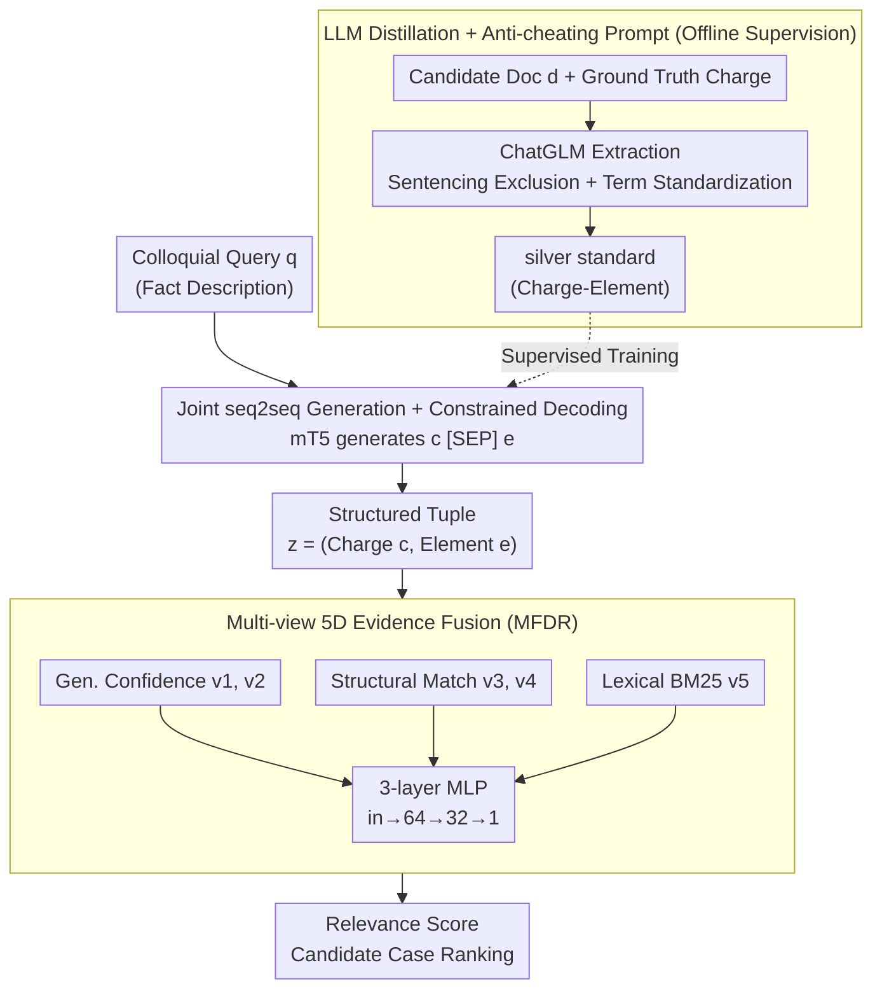

# GLIER: Generative Legal Inference and Evidence Ranking for Legal Case Retrieval

**Conference**: ACL 2026  
**arXiv**: [2604.23779](https://arxiv.org/abs/2604.23779)  
**Code**: To be confirmed  
**Area**: Information Retrieval / Legal NLP  
**Keywords**: Legal Case Retrieval, Generative Inference, Charge-Element, Multi-view Evidence Fusion, Knowledge Distillation

## TL;DR
Ours proposes **GLIER**: a two-stage framework that reframes Legal Case Retrieval (LCR) from "direct text similarity matching" to "jointly generating *Charge + Constitutive Elements* as latent variables via seq2seq, followed by multi-view fusion (generative confidence + structural matching + lexical BM25) using an MLP." It outperforms SAILER and KELLER on LeCaRD/LeCaRDv2 and beats full-data strong baselines using only 10% of the training data.

## Background & Motivation

**Background**: Current Legal Case Retrieval (LCR) follows three main paradigms: (i) Lexical matching like BM25, which has strong keyword support but lacks legal logic modeling; (ii) Dense retrieval like BERT/Lawformer/SAILER, which relies on pre-trained long text encoding but remains a black-box similarity measure; (iii) Generative retrieval like DSI/LegalSearchLM, which directly generates DocIDs but faces high hallucination risks and lacks evidence alignment.

**Limitations of Prior Work**: Legal relevance is "legal consistency" rather than "literal similarity"—it essentially involves determining the alignment between *Charge* and *Constitutive Elements*. Queries are often colloquial fact descriptions, while candidate documents use formal legal language, creating a significant *semantic gap*. Methods like SAILER/KELLER, despite introducing structural pre-training or LLM rewriting, still follow the "Retrieve-then-Rank" discriminative paradigm and fail to explicitly model the legal reasoning chain from query to charge to elements.

**Key Challenge**: Retrieval tasks are modeled as direct query→doc mappings, yet legal relevance is a chain of conditional dependencies: query→(charge, elements)→doc. The system must be both *interpretable* and *robustly controllable*.

**Goal**: (1) Formalize LCR as an inference problem over latent variables $z=(c,e)$; (2) Use joint seq2seq generation to enforce the legal dependency of charge→elements; (3) Fuse generative confidence with structural/lexical signals for reranking to avoid hallucinations inherent in pure generation.

**Key Insight**: Mimic legal experts' thinking—first infer charges and elements from the facts, then search the case library for precedents matching this legal profile. Simultaneously, use LLMs for offline distillation of silver standards to avoid expensive human annotation.

**Core Idea**: Use seq2seq to generate `c [SEP] e` in one pass, naturally realizing the chain constraint of $P(e|q,c)$ through autoregressive decoding, then fuse "latent confidence + explicit structure + lexical matching" into a 5-dimension feature MLP for ranking.

## Method

### Overall Architecture

GLIER reframes LCR from "direct similarity matching" to "chain inference of query→(charge, elements)→doc." This allows retrieval to follow the legal expert's logic: first inferring latent variables $z=(c,e)$ from the facts, then finding precedents matching this legal profile. It consists of two serial modules: the generator GLIE (mT5-base student model) generates structured tuples $K_q=(c_q,e_q)$ from the colloquial query $q$, supervised by "charge-element" silver standards $\mathcal{D}_{struct}$ distilled offline from a ChatGLM teacher; the reranker MFDR then concatenates generative confidence, structural matching, and lexical matching into 5-dimension features $\mathbf{v}_{q,d}\in\mathbb{R}^5$, outputting a relevance score through a 3-layer MLP (in→64→32→1). The overall process is formalized as $\hat z = \arg\max_z P_\theta(z|q)$ and $S(q,d)=f_\psi(q,d,\hat z)$, where $P_\theta(z|q)=P_\theta(c|q)P_\theta(e|q,c)$ explicitly encodes the conditional dependency of "charge before elements."

### Key Designs

**1. Joint seq2seq Generation + Constrained Decoding: Natural encoding of charge→element legal order**

Using two independent classifiers to predict charges and elements separately can lead to logical conflicts, such as "violent" elements being attached to a "property crime" charge. GLIER generates the target sequence $Y=c_q\oplus\text{[SEP]}\oplus e_q$ in one pass, minimizing $\mathcal{L}_{\text{gen}}=-\sum_{t=1}^{|Y|}\log P(y_t|y_{<t},X;\theta)$. Thus, elements are sampled conditioned on the charge prefix, naturally filtering logical conflicts. During inference, beam search (width=3) is used with a validity filter $\hat c_q=\{t\in\hat c_{raw}\mid t\in\mathcal{K}_{charge}\}$ and $\hat e_q=\{t\in\hat e_{raw}\mid t\in\mathcal{K}_{element}\}$ to force outputs into the legal taxonomy $\mathcal{K}$, suppressing synonym hallucinations common in generative models. Ablations show this joint strategy improves MAP by +1.87% and Hits@5 by +1.89% compared to independent generation.

**2. LLM Distillation + Anti-cheating Prompt: Extracting structured supervision from noisy documents**

Human annotation for "charge-element" pairs is extremely costly. GLIER uses ChatGLM to distill silver standards offline: for each document $d$ with ground truth charge $c_{gt}$, it calls $K_d=\text{LLM}(d,c_{gt},\mathcal{P})=(c_d,e_d)$. The prompt design enforces two points: first, using professional legal terminology rather than colloquialisms; second, **strictly prohibiting the extraction of sentencing results** ("imprisonment/compensation," etc.). The latter is crucial: legal documents are full of sentencing and procedural details. Without stripping these, silver labels would leak goal signals, allowing the student model to learn shortcuts like "matching sentencing templates." Term standardization ensures extracted elements align with the legal taxonomy and are compatible with the validity filter. Failed samples use DeepSeek-R1 as a fallback, and a cleaning pipeline removes ~2.7% of erroneous instances. Human evaluation of 100 cases shows 97.0% charge accuracy, 82.0% element precision, and Cohen's $\kappa$=0.71.

**3. Multi-view 5-dimension Evidence Fusion (MFDR): Learning non-linear complementarity via MLP**

Generative confidence, structural hits, and lexical BM25 are heterogeneous signals; simple rule-based addition loses non-linear relationships (w/o MLP rule-based summation drops MAP by 15.2%). MFDR organizes them into 5 features: *Latent Confidence* $v_1,v_2$ represent length-normalized generation probabilities for charge/element sequences, e.g., $v_1=\exp(\tfrac{1}{|\hat c_q|}\sum_t\log P(t|\hat c_{<t},q))$; *Explicit Structural* $v_3=\mathbb{I}(\hat c_q\cap c_d\neq\varnothing)$ and $v_4=\tfrac{|\hat e_q\cap e_d|}{|\hat e_q|+\epsilon}$; and *Lexical* $v_5=\tfrac{\text{BM25}(q,d)}{\max_{d'\in\mathcal{C}_q}\text{BM25}(q,d')}$ (normalized per query). The MLP is trained using BCE with BM25 hard negatives (1:3 positive-to-negative ratio) via $\mathcal{L}_{\text{score}}=-[\log S(q,d^+)+\sum_{d^-}\log(1-S(q,d^-))]$. SHAP analysis reveals its mechanism: Hit_Charge is a decisive "gatekeeping" feature, while Norm_BM25 is a fine-grained "tuning" feature; combined, they achieve super-linear gains.

### Loss & Training

The two modules are trained independently. Generator: mT5-base trained on silver standards using NLL, max source/target = 512/128, beam=3. Ranker: 3-layer MLP (dropout 0.1), AdamW, lr 1e-4, batch 64; hard negatives are non-relevant documents from BM25 top-K, forcing the MLP to not rely solely on $v_5$.

## Key Experimental Results

### Main Results

| Model | Dataset | MAP | Hits@3 | Hits@5 | MRR@5 |
|------|--------|-----|--------|--------|-------|
| BM25 | LeCaRD | 49.13 | 72.72 | 81.13 | 62.42 |
| SAILER | LeCaRD | 58.28 | 71.96 | 80.37 | 67.90 |
| KELLER | LeCaRD | **61.81** | 83.81 | 88.57 | 68.20 |
| **GLIER (ours)** | LeCaRD | 58.61 | **95.45†** | **95.45†** | **71.97** |
| KELLER | LeCaRDv2 | 76.22 | 95.94 | 98.71 | 93.02 |
| **GLIER (ours)** | LeCaRDv2 | **76.58** | **97.48** | **99.37** | **93.52** |

On LeCaRDv2, GLIER achieves SOTA across all 7 metrics. On LeCaRD, Hits@3 is 11.64 percentage points higher than KELLER (95.45% vs 83.81%), and Recall@3 is 26.13% vs 19.01%, proving GLIER significantly reduces "zero-recall" risks.

### Ablation Study

| Setting | MAP | MRR@5 | NDCG@5 | Note |
|------|-----|-------|--------|------|
| Full Model (5 features) | 76.58 | 93.52 | 84.64 | Complete |
| w/o Lexical (BM25) | 50.23 | 66.03 | 51.69 | Gain: -26.35 |
| w/o Charge features | 60.19 | 84.62 | 72.22 | Gain: -16.39 |
| w/o Element features | 73.60 | 91.53 | 84.12 | Gain: -2.98 |
| Only Lexical | 58.43 | 79.42 | 65.13 | BM25 only |
| Only Charge | 48.26 | 66.55 | 49.30 | Charge only |
| Only Elements | 40.88 | 63.97 | 47.31 | Elements only |
| w/o GenIR (direct LLM) | 74.78 | 91.14 | — | Lacks student: -1.80 |
| w/o MLP (rule sum) | 61.38 | 84.22 | — | Lacks fusion: -15.20 |
| Independent Gen. | 74.71 | 92.53 | — | Separate gen: -1.87 |

### Key Findings
- **Charge as "Gatekeeper," BM25 as "Tuning"**: SHAP shows charge matching is a decisive binary filter, while BM25 provides fine-grained adjustment. BM25 alone outperforms legal features alone (58.43 vs 50.23), but their combination yields 76.58, validating the hypothesis of mutual complementarity between "lexical ranking resolution" and "generative semantic gatekeeping."
- **Charge > Element**: Removing charge drops MAP by 16.39 vs 2.98 for elements, confirming the legal hierarchy where the charge is the coarse filter and elements are fine-grained verification.
- **Rare Data Efficiency**: With only 10% training data, GLIER achieves 74.58 MAP, surpassing SAILER's full-data result (73.60) and Lawformer (70.44). This is due to LeCaRDv2's scale and the homogeneity of legal texts, where few samples suffice to learn "fact→charge" mappings.
- **Backbone is not Critical**: Replacing mT5-base with Qwen2.5-7B-Instruct (1024 ctx) only increased MAP by +0.0020, suggesting performance stems from the structural inference paradigm rather than model scale.
- **Joint > Independent**: Joint generation yields +1.87 MAP over independent steps, proving the chain-of-logic benefit outweighs error propagation risks.

## Highlights & Insights
- **Paradigm Reframing**: Upgrading LCR from "text similarity" to "latent juridical structure inference"; a rare example of explicit reasoning chain modeling in legal IR.
- **Anti-cheating Prompt**: Prohibiting sentencing details is a subtle but critical trick to prevent student models from taking shortcuts, providing a template for LLM distillation in specialized domains.
- **MLP Multi-view Fusion**: The 5D vector is minimalist yet powerful under SHAP analysis. The role separation of gatekeeping vs. tuning reveals how signal granularity determines non-linear fusion.
- **Data Efficiency**: The 10% data success stems from structural priors compressing the search space, suggesting that for tasks with *strong domain knowledge*, modeling latent structures is superior to scaling data.

## Limitations & Future Work
- **mT5-base 512 Token Limit**: Extremely long queries may still be truncated, causing incomplete element extraction.
- **Teacher Bias Propagation**: The silver standard depends on ChatGLM; teacher hallucinations or biases may trickle down to the student.
- **Legal System Constraints**: Experiments were conducted on Chinese criminal cases; the charge→elements tree might not fit Common Law systems (precedent-based reasoning) as naturally.
- **Interpretability focuses on "Charge Hits"**: Explanations at the element level are weaker, lacking fine-grained attribution for which specific element was critical.
- **Baseline Comparison**: Direct comparison with purely generative retrieval like LegalSearchLM could be strengthened.

## Related Work & Insights
- **vs SAILER**: SAILER uses reasoning/decision sections for structure-aware pre-training but remains a dual encoder paradigm; GLIER generates juridical variables for better interpretability.
- **vs KELLER**: KELLER rewrites cases into crime-subfact pairs for contrastive learning; GLIER uses joint generation and explicit hit features as ranking gatekeepers.
- **vs PromptCase**: PromptCase replaces text with legal facts/issues using LLMs but ignores chain dependencies; GLIER embeds the chain-of-logic into seq2seq autoregression.
- **vs LegalSearchLM / DSI**: Pure generative retrieval generates DocIDs with high hallucination risk; GLIER uses generation as a "semantic bridge" while the final ranking remains discriminative.

## Rating
- Novelty: ⭐⭐⭐⭐ Reframing LCR as "latent legal variable inference" is a clear paradigm contribution.
- Experimental Thoroughness: ⭐⭐⭐⭐ Solid results on two datasets, SHAP analysis, and high data efficiency.
- Writing Quality: ⭐⭐⭐⭐ Clear formulas, tables, and intuitive gatekeeper-tuner explanations.
- Value: ⭐⭐⭐⭐ A strong, usable baseline for legal IR providing a blueprint for incorporating reasoning chains.

<!-- RELATED:START -->

## Related Papers

- [\[ACL 2025\] GRAF: Graph Retrieval Augmented by Facts for Romanian Legal Multi-Choice Question Answering](../../ACL2025/information_retrieval/graf_graph_retrieval_augmented_by_facts_for_romanian_legal_multi-choice_question.md)
- [\[ACL 2026\] From Relevance to Authority: Authority-aware Generative Retrieval in Web Search Engines](from_relevance_to_authority_authority-aware_generative_retrieval_in_web_search_e.md)
- [\[ACL 2026\] CounterRefine: Answer-Conditioned Counterevidence Retrieval for Inference-Time Knowledge Repair in Factual Question Answering](counterrefine_answer-conditioned_counterevidence_retrieval_for_inference-time_kn.md)
- [\[ACL 2026\] Utility-Oriented Visual Evidence Selection for Multimodal Retrieval-Augmented Generation](utility-oriented_visual_evidence_selection_for_multimodal_retrieval-augmented_ge.md)
- [\[ACL 2026\] Learning to Extract Rational Evidence via Reinforcement Learning for Retrieval-Augmented Generation](learning_to_extract_rational_evidence_via_reinforcement_learning_for_retrieval-a.md)

<!-- RELATED:END -->
