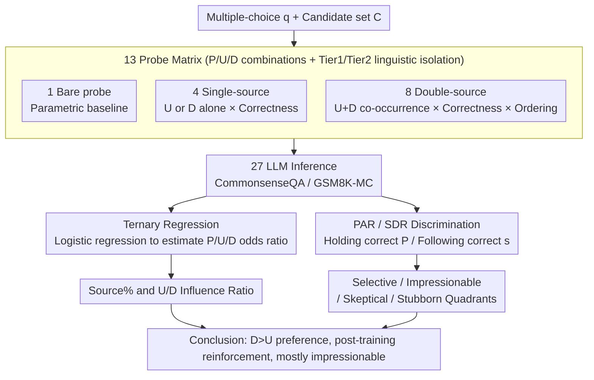

# How Large Language Models Balance Internal Knowledge with User and Document Assertions

**Conference**: ACL 2026 Findings  
**arXiv**: [2604.22193](https://arxiv.org/abs/2604.22193)  
**Code**: https://github.com/shuowl/llm-source-balancing (Available)  
**Area**: RAG / Knowledge Conflict / Sycophancy  
**Keywords**: Ternary Source Interaction, Document Preference, Sycophancy, Discrimination, Post-training Impact

## TL;DR
This paper moves beyond the binary conflict paradigm of "parametric knowledge vs. a single external source" and proposes a ternary source interaction evaluation framework comprising "parametric (P) / user assertion (U) / document assertion (D)." Based on evaluations of 27 LLMs across two datasets, it finds that most models are more credulous of documents than users, post-training further strengthens this preference, and most models are "impressionable" — failing to distinguish whether external information is helpful or harmful.

## Background & Motivation

**Background**: RAG and chat-based systems require LLMs to interact simultaneously with three types of information sources: parametric knowledge (P), retrieved documents (D), and user-provided assertions (U). However, existing research only investigates binary combinations: P vs. D (knowledge conflict) or P vs. U (sycophancy), never comparing all three within a unified framework.

**Limitations of Prior Work**: Binary settings cannot address the most common scenarios in real-world systems: when a document suggests one answer, the user suggests another, and the model itself has a third answer, which one prevails? Existing sycophancy and knowledge conflict literatures operate in isolation, making it impossible to directly compare the relative influence of U and D.

**Key Challenge**: The "safety" of model capabilities depends on its ability to distinguish "helpful external info" from "harmful external info" rather than simple compliance or rejection. However, the vast majority of evaluations only measure the former, equating "suggestibility" with "good alignment."

**Goal**: (RQ1) Quantify the relative influence of P, U, and D; (RQ2) determine if models can distinguish between beneficial and harmful external information; (RQ3) analyze how post-training (SFT / RLHF) shifts preferences among these three sources.

**Key Insight**: Each question is constructed as 13 probe variants (Bare probe / 4 single-source / 8 double-source). A logistic regression is employed to estimate the odds ratio for each of the three sources simultaneously, which is then normalized into a "reliance ratio" to compare the influence of U and D on the same scale.

**Core Idea**: A three-layer evaluation consisting of "controlled probe design + statistical modeling + choice behavior classification" is used to decompose "model reliance on external sources" into two independent dimensions: "reliance" (influence when present) and "discrimination" (distinguishing between helpful and harmful information).

## Method

### Overall Architecture

This paper does not train new models but builds an evaluation pipeline that expands a "multiple-choice question" into a set of controlled probes to measure the tension between parametric knowledge (P), user assertions (U), and document assertions (D). For a given multiple-choice question $q$ and candidate set $\mathcal{C}$, the presence and correctness of P, U, and D are combined into 13 probe variants. Linguistic complexity is controlled using Tier 1 (uniform template) and Tier 2 (context-aware) assertions. These probes are fed into 27 LLMs (GPT-4o, LLaMA3 series, Qwen3 series) using CommonsenseQA and GSM8K-multiple-choice. Finally, a three-tier analysis is performed: extracting macro reliance ratios via logistic regression, classifying models based on choices, and examining how external information shifts the probability distribution of answers.

### Key Designs

**1. 13 Probe Matrix: Minimizing cost to cover all source combinations and isolate linguistic factors**

To separate the three forces, the first step is to systematically cover every source combination without introducing noise. The matrix consists of three layers: 1 bare probe (no external source) for the parametric baseline; 4 single-source probes $v_{u^+}, v_{u^-}, v_{d^+}, v_{d^-}$ independently toggling U or D and their correctness to measure reactions to single sources and provide data for discrimination metrics; and 8 double-source probes presenting U and D together, covering two correctness combinations × two orderings to recreate conflict scenarios and measure positional bias. Linguistic complexity is separated via Tier 1 / Tier 2: Tier 1 uses uniform templates, while Tier 2 uses GPT-4o to generate natural assertions fitting the question context, isolating "truth-like phrasing" from "source identity."

**2. Ternary Regression: Measuring three influences on a single scale**

Since probe results are binary (correct/incorrect), simply comparing accuracy only reveals whether external information helps or hurts, not whether the impact stems from the "source presence" or its "correctness." This work uses logistic regression to estimate marginal effects: $\log \frac{p}{1-p} = \beta_0 + \beta_P P_i + \delta_U U_{pres} + \beta_U (U_{pres} \times U_{corr}) + \delta_D D_{pres} + \beta_D (D_{pres} \times D_{corr})$, where $\delta$ captures the effect of "presence" and the interaction term captures "correctness." Exponentiating coefficients yields the odds ratio: $\text{Parametric OR} = e^{\beta_P}$, $\text{User OR} = e^{\delta_U + \beta_U}$, $\text{Doc OR} = e^{\delta_D + \beta_D}$, normalized to $\text{Source%} = \text{Source OR} / (P+U+D)$. Crucially, the U/D influence ratio $e^{(\delta_U + \beta_U) - (\delta_D + \beta_D)}$ indicating a ratio $<1$ means the model trusts documents more than users, unifying the study of sycophancy (trusting users) and knowledge conflict (trusting documents).

**3. PAR / SDR: Refining "alignment quality" into measurable discrimination**

Regression only answer whether a model "listens." Blindly following external sources is not equivalent to good alignment—true safety lies in listening when appropriate and resisting when necessary. Two conditional probabilities characterize this discrimination using single-source probes: Parametric Assertion Resistance ($\text{PAR}^+_s = P(\hat{y}_{v_{s^-}, q} = \hat{y}_{v_{bare}, q} \mid \hat{y}_{v_{bare}, q} = y_q^*, y^{assert}_{v_{s^-}, q} \neq y_q^*)$), measuring the ability to maintain correct parametric answers against incorrect assertions; and Source-Derived Rectification ($\text{SDR}^+_s = P(\hat{y}_{v_{s^+}, q} = y^{assert}_{v_{s^+}, q} \mid \hat{y}_{v_{bare}, q} \neq y_q^*, y^{assert}_{v_{s^+}, q} = y_q^*)$), measuring correct rectification when the source is right and the model is wrong. Models are classified into Selective / Impressionable / Skeptical / Stubborn quadrants with a $0.5$ threshold. Only "Selective" models (high PAR and SDR) are truly reliable; others are deficient, notably "Impressionable" models that are easily misled by incorrect retrieved documents in RAG.

### Loss & Training

The evaluation itself involves no training loss. In mitigation experiments, the authors perform SFT on data covering four source interaction patterns (U+D+ / U+D- / U-D+ / U-D-) to simultaneously improve PAR and SDR. This suggests that "whom to trust under source conflict" is learnable and discrimination is not purely an emergent property of model scale.

## Key Experimental Results

### Main Results

| Finding | Key Data Point | Explanation |
|---|---|---|
| Document > User Preference | U%/D% < 1 for most models | Doc OR is higher; models prioritize retrieved results over users |
| Post-training Reinforcement | U%/D% continues to drop across base / SFT / instruct stages | Post-training makes models increasingly "trust documents" |
| Most models are Impressionable | PAR$^+$ < 0.5 and SDR$^+ \geq 0.5$ is prevalent | Compliant but lacks judgment; copies external errors |
| SFT as a Solution | PAR / SDR rise together after SFT on diverse interaction data | Discrimination is learnable, not just dependent on model size |

### Ablation Study

| Configuration | Key Observation | Explanation |
|---|---|---|
| Tier 1 vs Tier 2 assertion | Consistent trends, but Tier 2 has larger impact | Linguistic complexity itself is a source of reliance |
| User-first vs Doc-first ordering | Trend holds; magnitude changes slightly | Positional bias exists but does not flip the U < D direction |
| GPT-4o / LLaMA3 / Qwen3 | Document preference consistent across architectures | Not an artifact of a specific dataset; a systemic result of training paradigms |
| Base → SFT → Instruct | U%/D% decreases throughout | Post-training effects are decomposed to locate the stage amplifying preference |

### Key Findings
- **"Document Reliability" bias likely stems from training**: Base model U/D ratios are nearly balanced, while instruct models favor D heavily. This suggests SFT/RLHF samples with citations/evidence might teach models to equate document sources with authority.
- **Most models are impressionable**: They readily adopt correct external information (high SDR) but also adopt incorrect external information (low PAR), which is the root cause of hallucinations in RAG when incorrect documents are retrieved.
- **SFT can improve PAR and SDR simultaneously**: Fine-tuning on data covering 4 interaction modes (U+D+ / U+D- / U-D+ / U-D-) teaches models to evaluate correctness rather than just source identity.
- **Probability Distribution Drift Analysis**: KL divergence shows external information "squeezes out" confidence in correct answers—even if the final prediction remains unchanged, the internal confidence is diluted by external assertions.

## Highlights & Insights
- **Unified framework for sycophancy and knowledge conflict**: These two research lines previously existed in isolation. By using logistic regression and odds ratios, this paper places U and D on the same scale, providing a clear methodological contribution.
- **Practical utility of the U%/D% ratio**: This simple ratio can serve as a "trust calibration" metric for RAG/chat systems before deployment, offering more information than accuracy alone.
- **Transferability of "impressionable" concept**: The four-quadrant classification can be applied to any scenario involving "model vs. external input," such as tool use, code review, or medical Q&A.

## Limitations & Future Work
- **Constraint to multiple-choice questions**: Information integration in open-ended generation is far more complex; whether the ternary framework holds remains unknown.
- **Single assertions for U and D**: Realistic RAG involves multiple retrieved documents and multi-turn user dialogues; intra-source conflicts are not modeled.
- **No distinction between "trusted" and "untrusted" documents**: All document assertions are treated equally, leaving the question of model sensitivity to metadata unanswered.
- **Mitigation limited to SFT**: More mainstream methods like DPO/RLHF or Constitutional AI were not compared; a reproducible industrial path needs completion.

## Related Work & Insights
- **vs. Wu et al. 2024 (Context Dependence)**: They examined P vs. context; Ours decomposes context into U and D as independent sources with attribution, a substantial extension.
- **vs. Sharma et al. 2024 (Sycophancy)**: Ours aligns with the odds ratio logic of sycophancy literature but estimates three sources simultaneously rather than U in isolation.
- **vs. Mallen et al. 2023 (Selective Trust)**: They proposed models decide between parametric vs. external; Ours refines "whom to trust" into measurable and tunable PAR/SDR metrics.

## Rating
- Novelty: ⭐⭐⭐⭐ The ternary framework and PAR/SDR classification provide clear methodological gains.
- Experimental Thoroughness: ⭐⭐⭐⭐ Evaluation across 27 models, 2 datasets, 13 probes, 2 tiers, and 2 orderings is comprehensive.
- Writing Quality: ⭐⭐⭐⭐ Clear three-layer structure from macro OR to meso choice behavior to micro probability distributions.
- Value: ⭐⭐⭐⭐ U%/D% and PAR/SDR can be directly used as discrimination audit metrics for RAG/chat systems.

<!-- RELATED:START -->

## Related Papers

- [\[ACL 2026\] How Retrieved Context Shapes Internal Representations in RAG](how_retrieved_context_shapes_internal_representations_in_rag.md)
- [\[ACL 2026\] RiTeK: A Dataset for Large Language Models Complex Reasoning over Textual Knowledge Graphs in Medicine](ritek_a_dataset_for_large_language_models_complex_reasoning_over_textual_knowled.md)
- [\[ACL 2026\] Navigating Large-Scale Document Collections: MuDABench for Multi-Document Analytical QA](navigating_large-scale_document_collections_mudabench_for_multi-document_analyti.md)
- [\[ICLR 2026\] Query-Level Uncertainty in Large Language Models](../../ICLR2026/information_retrieval/query-level_uncertainty_in_large_language_models.md)
- [\[ICLR 2026\] TokMem: One-Token Procedural Memory for Large Language Models](../../ICLR2026/information_retrieval/tokmem_one-token_procedural_memory_for_large_language_models.md)

<!-- RELATED:END -->
