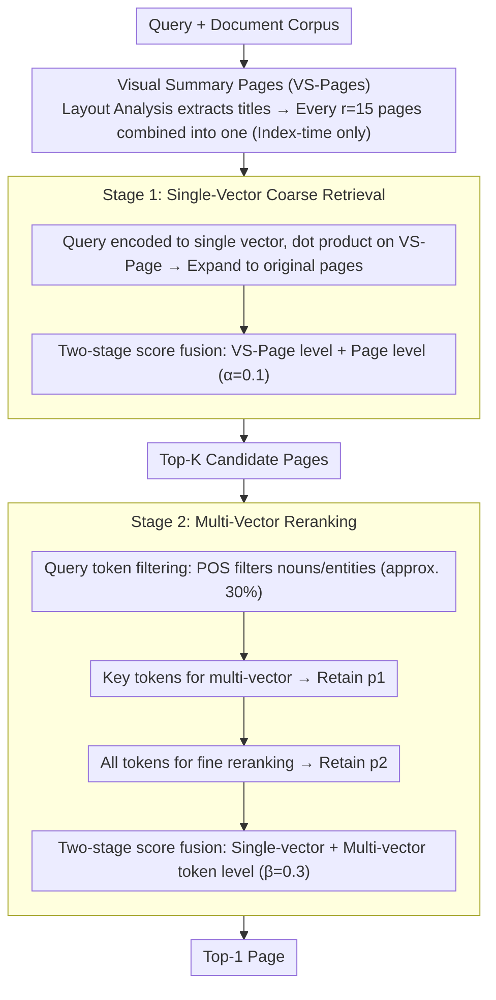

# Hybrid-Vector Retrieval for Visually Rich Documents: Combining Single-Vector Efficiency and Multi-Vector Accuracy

**Conference**: ACL 2026 Findings  
**arXiv**: [2510.22215](https://arxiv.org/abs/2510.22215)  
**Code**: [https://github.com/juyeonnn/HEAVEN](https://github.com/juyeonnn/HEAVEN)  
**Area**: Information Retrieval  
**Keywords**: Visual Document Retrieval, Hybrid-Vector Retrieval, Efficiency-Accuracy Tradeoff, Visual Summary Pages, Query Token Filtering

## TL;DR

HEAVEN proposes a plug-and-play two-stage hybrid vector framework that accelerates single-vector coarse retrieval via Visual Summary Pages (VS-Pages) and reduces multi-vector reranking computation through POS-based query token filtering, achieving 99.87% of multi-vector Recall@1 while reducing per-query FLOPs by 99.82% across four benchmarks.

## Background & Motivation

**Background**: Visual Document Retrieval (VDR) is a core component of RAG. Current methods are divided into two paradigms: single-vector retrieval (efficient but coarse) and multi-vector retrieval (accurate but computationally expensive), presenting a significant efficiency-accuracy trade-off.

**Limitations of Prior Work**:
- Single-vector methods (e.g., DSE) require only one dot product per query but lose fine-grained information, leading to a large Recall@1 gap (e.g., 22.5% lower than multi-vector on ViMDoc).
- Multi-vector methods (e.g., ColQwen2.5) must compute interactions between all query tokens and all page patches, resulting in hundreds of times higher FLOPs.
- Existing efficiency optimizations (patch pooling/pruning) suffer from sharp performance degradation as the compression ratio increases.

**Key Challenge**: Single-vector methods are sufficient for coarse retrieval (large K) (Recall@200 differs by only 0.63%) but lack precision in fine-grained retrieval; multi-vector methods offer high accuracy but unacceptable computational overhead.

**Goal**: Design a framework that reduces per-query computation by orders of magnitude with almost no loss in multi-vector retrieval accuracy.

**Key Insight**: Leverage two empirical observations: (1) Single-vector retrieval is acceptable for large candidate sets; (2) Approximately 70% of query tokens are redundant information like stop words. Based on these, a two-stage cascaded filtering is designed.

**Core Idea**: First use single-vector + visual summary pages to rapidly narrow candidates, then use multi-vector + key query tokens for fine-grained reranking, achieving plug-and-play hybrid retrieval.

## Method

### Overall Architecture

HEAVEN addresses the efficiency-accuracy tug-of-war in visual document retrieval by chaining the two into a coarse-to-fine cascaded pipeline. After inputting a query, Stage 1 utilizes a single-vector model (e.g., DSE) to perform efficient coarse retrieval on compressed Visual Summary Pages (VS-Pages), quickly narrowing down to a small set of candidate pages. Stage 2 then uses a multi-vector model (e.g., ColQwen2.5) to perform fine reranking on this small candidate set using only key tokens from the query. The encoders for both stages are plug-and-play and can be independently replaced without extra training, ultimately reducing per-query computation by orders of magnitude while maintaining multi-vector accuracy.

### Key Designs

**1. Visual Summary Pages (VS-Pages): Compressing Multiple Pages into One**

Large numbers of document pages contain repetitive or non-informative content (logos, headers), while key layouts like titles are most useful for retrieval. Running single-vector retrieval per page is wasteful. HEAVEN uses layout analysis (DocLayout-YOLO) to extract title layouts from each page and crops/concatenates these layouts from multiple pages (default $r=15$) into a single summary page. Retrieval is performed at the VS-Page level first and then expanded to original pages, reducing single-vector comparisons to $1/r$. Crucially, VS-Pages are constructed once during indexing, adding no query-time overhead.

**2. Query Token Filtering: Multi-Vector Computation with Nouns Only**

The cost of multi-vector reranking stems from interacting all query tokens with all page patches. However, ~70% of query tokens are redundant. HEAVEN uses Part-of-Speech (POS) tagging to filter key tokens (nouns, named entities, etc., comprising ~30%). It first uses only these key tokens to calculate multi-vector similarity for initial reranking (retaining $p_1$), then uses all tokens for final ranking on the refined small candidate set (retaining $p_2$). Experiments prove using key tokens matches the performance of using all tokens and significantly outperforms random selection of an equal number of tokens.

**3. Two-Stage Score Fusion: Complementary Multi-Granularity Signals**

Retrieval signals at the document, page, and token levels emphasize different aspects; relying on only one leads to information loss. In Stage 1, HEAVEN fuses VS-Page level (document-level info) and page-level (fine-grained positioning) single-vector scores with weight $\alpha=0.1$. In Stage 2, the final ranking fuses the single-vector score with the multi-vector token-level matching score with weight $\beta=0.3$. Ablations show removing any fusion level significantly degrades accuracy, confirming the complementarity of the three granularities.

### Mechanism

Taking the query "What was the revenue growth in Q3?" as an example: During indexing, documents are compressed into VS-Pages (15 pages per summary). In Stage 1, the query is encoded into a single vector for coarse dot-product retrieval on VS-Pages, expanded to original pages, and fused with an $\alpha=0.1$ weight to yield Top-$K$ candidates. In Stage 2, POS tagging extracts "revenue / growth / Q3" as key tokens. These are used to calculate multi-vector similarity to prune $K$ candidates down to $p_1$. Finally, all query tokens are used to rerank this batch, incorporating the single-vector score with $\beta=0.3$ to output the Top-1 page. Expensive multi-vector interactions only apply to $K$ candidates × 30% tokens, enabling a multi-order reduction in FLOPs.

### Loss & Training

HEAVEN is a training-free, plug-and-play framework. Encoders for both stages use off-the-shelf pre-trained models (DSE for Stage 1, ColQwen2.5 for Stage 2), which can be directly replaced with stronger models.

## Key Experimental Results

### Main Results

| Dataset | Metric | HEAVEN | ColQwen2.5 (Multi-vector SOTA) | Performance Retained / FLOPs Reduction |
| :--- | :--- | :--- | :--- | :--- |
| ViMDoc | R@1 | 71.05% | 71.13% | 99.88% / -99.88% |
| OpenDocVQA | R@1 | 71.56% | 72.63% | 98.52% / -99.89% |
| ViDoSeek | R@1 | 75.04% | 75.57% | 99.30% / -98.50% |
| M3DocVQA | R@1 | 59.31% | 57.99% | **102.27%** / -99.81% |
| **Average** | R@1 | 69.24% | 69.33% | **99.87% / -99.82%** |

### Ablation Study

| Configuration | Key Impact | Description |
| :--- | :--- | :--- |
| w/o VS-Pages | Significant FLOPs increase | Requires comparison with all original pages |
| w/o Candidate Refinement | Severe performance drop | Score fusion between VS-Page and page is critical |
| w/o Query Token Filtering | FLOPs increase | Redundant tokens cause unnecessary computation |
| w/o Reranking Refinement | Significant performance drop | Single/multi-vector score fusion is complementary |

### Key Findings
- On M3DocVQA, HEAVEN even outperforms full ColQwen2.5 (+2.27% R@1) because document-level signals from VS-Pages are beneficial.
- Stage 1 alone already exceeds DSE (+1.74% Avg R@1, -49.31% FLOPs), proving VS-Pages effectively compress the search space.
- Using only ~30% of key query tokens matches full-token multi-vector performance and outperforms random selection.
- Compared to patch pooling/pruning, HEAVEN achieves significantly higher accuracy at the same FLOPs.

## Highlights & Insights
- Practical plug-and-play design: No training required, encoders can be independently upgraded.
- Clever VS-Pages concept: Extracting layouts via analysis → Concatenating summary pages → Reducing retrieval object count, built only once during indexing.
- Optimizing from the query side (filtering tokens) rather than the document side (compressing patches) is a relatively overlooked but effective direction.
- Introduces the ViMDoc benchmark, filling the gap in multi-document and long-document visual retrieval evaluation.

## Limitations & Future Work
- VS-Pages rely on the quality of layout analysis (DocLayout-YOLO); performance may be limited for non-standard layouts.
- Query token filtering is based on POS tagging; effectiveness for non-English languages requires verification.
- Default hyperparameters are tuned for English; cross-lingual/cross-domain generalization remains to be explored.
- The two-stage cascaded design introduces system complexity and multiple hyperparameters ($\alpha, \beta, p_1, p_2, K, r$).

## Related Work & Insights
- **vs. ColQwen2.5 (Pure Multi-Vector)**: HEAVEN maintains 99.87% R@1 while reducing FLOPs by 99.82%.
- **vs. DSE (Pure Single-Vector)**: HEAVEN exceeds DSE in Stage 1 alone, with VS-Pages effectively compressing the search space.
- **vs. Patch Pooling/Pruning**: Comparing document-side compression vs. query-side filtering, HEAVEN offers a superior efficiency-accuracy trade-off.

## Rating
- Novelty: ⭐⭐⭐⭐ The combination of two-stage hybrid design + VS-Pages + query-side filtering is unique.
- Experimental Thoroughness: ⭐⭐⭐⭐⭐ Four benchmarks, multiple baselines, ablations, efficiency, hyperparameter, and plug-and-play validation are all comprehensive.
- Writing Quality: ⭐⭐⭐⭐ Clear structure with a complete logical chain of observation → method → verification.

<!-- RELATED:START -->

## Related Papers

- [\[ACL 2026\] Prune-then-Merge: Towards Efficient Multi-Vector Visual Document Retrieval](sculpting_the_vector_space_towards_efficient_multi-vector_visual_document_retrie.md)
- [\[ICML 2026\] LEMUR: Learned Multi-Vector Retrieval](../../ICML2026/information_retrieval/lemur_learned_multi-vector_retrieval.md)
- [\[ICML 2025\] POQD: Performance-Oriented Query Decomposer for Multi-Vector Retrieval](../../ICML2025/information_retrieval/poqd_performance-oriented_query_decomposer_for_multi-vector_retrieval.md)
- [\[CVPR 2025\] VDocRAG: Retrieval-Augmented Generation over Visually-Rich Documents](../../CVPR2025/information_retrieval/vdocrag_retrieval-augmented_generation_over_visually-rich_documents.md)
- [\[ACL 2026\] Why These Documents? Explainable Generative Retrieval with Hierarchical Category Paths](why_these_documents_explainable_generative_retrieval_with_hierarchical_category_.md)

<!-- RELATED:END -->
