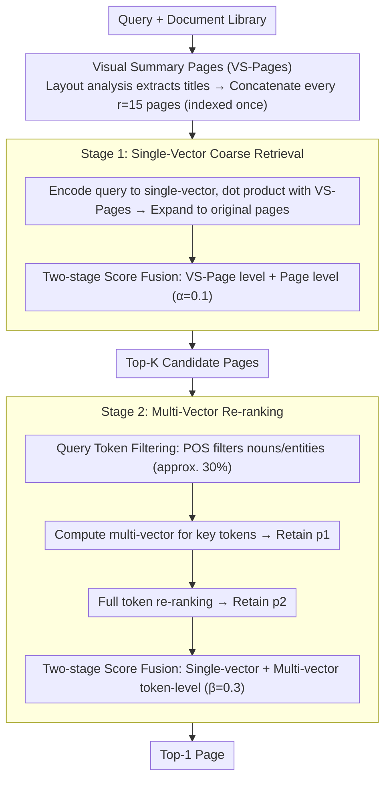

# Hybrid-Vector Retrieval for Visually Rich Documents: Combining Single-Vector Efficiency and Multi-Vector Accuracy

**Conference**: ACL 2026 Findings  
**arXiv**: [2510.22215](https://arxiv.org/abs/2510.22215)  
**Code**: [https://github.com/juyeonnn/HEAVEN](https://github.com/juyeonnn/HEAVEN)  
**Area**: Information Retrieval  
**Keywords**: Visual Document Retrieval, Hybrid-Vector Retrieval, Efficiency-Accuracy Trade-off, Visual Summary Pages, Query Token Filtering

## TL;DR

HEAVEN proposes a plug-and-play two-stage hybrid vector framework. It accelerates single-vector coarse retrieval via Visual Summary Pages (VS-Pages) and reduces multi-vector re-ranking computation through POS-based query token filtering. This approach maintains 99.87% of multi-vector Recall@1 while reducing per-query FLOPs by 99.82% across four benchmarks.

## Background & Motivation

**Background**: Visual Document Retrieval (VDR) is a core component of RAG. Current methods follow two paradigms: single-vector retrieval (efficient but coarse) and multi-vector retrieval (accurate but computationally expensive), presenting a significant efficiency-accuracy trade-off.

**Limitations of Prior Work**:
- Single-vector methods (e.g., DSE) require only one dot product per query but lose fine-grained information, leading to a large Recall@1 gap (e.g., 22.5% lower than multi-vector on ViMDoc).
- Multi-vector methods (e.g., ColQwen2.5) must compute interactions between all query tokens and all page patches, resulting in hundreds of times higher FLOPs.
- Existing efficiency optimizations (patch pooling/pruning) show sharp performance degradation as compression ratios increase.

**Key Challenge**: Single-vector methods are sufficient for coarse-grained retrieval (large $K$, where Recall@200 differs by only 0.63%) but insufficient for fine-grained retrieval; multi-vector methods provide high accuracy but at unacceptable computational costs.

**Goal**: Design a framework to reduce per-query computation by orders of magnitude with minimal loss in multi-vector retrieval accuracy.

**Key Insight**: Utilizing two empirical observations: (1) single-vector retrieval is acceptable for large candidate sets; (2) approximately 70% of query tokens are redundant information like stop words. These support a two-stage cascaded filtering design.

**Core Idea**: Use single-vector retrieval + VS-Pages to rapidly narrow the candidate range, followed by multi-vector retrieval + key query tokens for fine-grained re-ranking, achieving plug-and-play hybrid retrieval.

## Method

### Overall Architecture

HEAVEN addresses the efficiency-accuracy tension in visual document retrieval by cascading the two paradigms into a coarse-to-fine pipeline. Upon receiving a query, Stage 1 utilizes a single-vector model (e.g., DSE) to perform efficient coarse retrieval on compressed Visual Summary Pages (VS-Pages), narrowing the search to a small set of candidate pages. Stage 2 then employs a multi-vector model (e.g., ColQwen2.5) to perform fine-grained re-ranking using only the key tokens from the query. The encoders for both stages are plug-and-play and independently replaceable without additional training, ultimately reducing per-query computation by orders of magnitude with negligible loss in multi-vector accuracy.

### Key Designs

**1. Visual Summary Pages (VS-Pages): Compressing Multiple Pages into One**

Many pages in documents contain repetitive or uninformative content like logos and headers; useful retrieval signals often reside in layout elements like titles. Performing single-vector retrieval on every page is wasteful. HEAVEN uses layout analysis (DocLayout-YOLO) to extract title layouts from each page, cropping and stitching titles from multiple pages (default $r=15$) into a single summary page. Retrieval is performed at the VS-Page level before expanding to original pages, reducing Stage 1 comparisons by a factor of $1/r$. Crucially, VS-Pages are built once during indexing and add no query-time overhead.

**2. Key Query Token Filtering: Multi-Vector Computation with Nouns Only**

The cost of multi-vector re-ranking stems from computing interactions between all query tokens and all page patches. However, ~70% of tokens are redundant info (e.g., stop words). HEAVEN uses Part-of-Speech (POS) tagging to identify key tokens (nouns, named entities, etc., approx. 30% of the query). Multi-vector similarity is first computed using only these key tokens for initial re-ranking (retaining $p_1$), followed by full token re-ranking on the refined small candidate set (retaining $p_2$). Experiments show that using only key tokens matches full token performance and significantly outperforms random token selection.

**3. Two-Stage Score Fusion: Complementary Signals Across granularities**

Retrieval signals at the document, page, and token levels emphasize different information. HEAVEN fuses VS-Page level (document info) and page-level (precise localization) single-vector scores in Stage 1 with weight $\alpha=0.1$. In the final Stage 2 ranking, single-vector scores are fused with multi-vector token-level matching scores using weight $\beta=0.3$. Ablation studies show that removing fusion at any level leads to a noticeable drop in accuracy, confirming the complementarity of the three granularities.

### Mechanism

Using the query "What was the revenue growth in Q3?" as an example: During indexing, documents are stitched into VS-Pages every 15 pages. In Stage 1, the query is encoded into a single vector for coarse dot-product retrieval on VS-Pages, expanded to original pages, and fused with $\alpha=0.1$ to obtain Top-$K$ candidate pages. In Stage 2, POS tagging extracts key tokens "revenue / growth / Q3." Multi-vector similarity is computed for these tokens to prune $K$ candidates down to $p_1$, followed by a final re-rank with all query tokens and single-vector fusion ($\beta=0.3$) to output the Top-1 page. Expensive multi-vector interactions apply only to $K$ candidates × 30% of tokens, driving the two-order-of-magnitude reduction in FLOPs.

### Loss & Training

HEAVEN is a training-free, plug-and-play framework. Encoders for both stages use off-the-shelf pre-trained models (DSE for Stage 1, ColQwen2.5 for Stage 2) and can be directly replaced with stronger models.

## Key Experimental Results

### Main Results

| Dataset | Metric | HEAVEN | ColQwen2.5 (Multi-vector SOTA) | Performance Retention / FLOPs Reduction |
| :--- | :--- | :--- | :--- | :--- |
| ViMDoc | R@1 | 71.05% | 71.13% | 99.88% / -99.88% |
| OpenDocVQA | R@1 | 71.56% | 72.63% | 98.52% / -99.89% |
| ViDoSeek | R@1 | 75.04% | 75.57% | 99.30% / -98.50% |
| M3DocVQA | R@1 | 59.31% | 57.99% | **102.27%** / -99.81% |
| **Average** | R@1 | 69.24% | 69.33% | **99.87% / -99.82%** |

### Ablation Study

| Configuration | Key Impact | Description |
| :--- | :--- | :--- |
| w/o VS-Pages | Significant FLOPs increase | Requires comparison with all original pages |
| w/o Candidate Refinement | Severe performance drop | VS-Page to page score fusion is critical |
| w/o Query Token Filtering | FLOPs increase | Redundant query tokens cause unnecessary computation |
| w/o Re-ranking Refinement | Significant performance drop | Single/multi-vector score fusion is complementary |

### Key Findings
- On M3DocVQA, HEAVEN actually outperforms full ColQwen2.5 (+2.27% R@1), as VS-Page document-level signals are beneficial.
- Stage 1 alone outperforms DSE (+1.74% avg R@1, -49.31% FLOPs), validating VS-Page compression.
- Using only ~30% of key query tokens matches full token multi-vector performance and outperforms random sampling.
- Compared to patch pooling/pruning, HEAVEN achieves significantly higher accuracy at equivalent FLOPs.

## Highlights & Insights
- Practical plug-and-play design: No additional training required; encoders for both stages can be upgraded independently.
- Innovative VS-Pages: Extracts key layouts via layout analysis → stitches into summary pages → reduces searchable objects, constructed once at indexing.
- Token filtering from the query side (rather than document-side patch compression) is a relatively overlooked but effective optimization.
- Introduces the ViMDoc benchmark, filling a gap in visual retrieval evaluation for multi-document and long-document scenarios.

## Limitations & Future Work
- VS-Pages depend on layout analysis quality (DocLayout-YOLO); performance may be limited on non-standard layouts.
- Query token filtering is based on English POS tagging; effectiveness in other languages needs verification.
- Default hyperparameters are tuned for English; cross-lingual/cross-domain generalization requires further study.
- Two-stage cascade introduces system complexity and multiple hyperparameters ($\alpha, \beta, p_1, p_2, K, r$).

## Related Work & Insights
- **vs. ColQwen2.5 (Pure Multi-vector)**: HEAVEN maintains 99.87% R@1 while reducing FLOPs by 99.82%.
- **vs. DSE (Pure Single-vector)**: HEAVEN outperforms DSE even at Stage 1, as VS-Pages effectively compress the search space.
- **vs. Patch Pooling/Pruning**: By combining document-side compression with query-side filtering, HEAVEN achieves a superior efficiency-accuracy trade-off.

## Rating
- Novelty: ⭐⭐⭐⭐ Unique combination of two-stage hybrid design + VS-Pages + query-side filtering.
- Experimental Thoroughness: ⭐⭐⭐⭐⭐ Comprehensive evaluation across four benchmarks, ablations, efficiency analysis, hyperparameter sensitivity, and plug-and-play validation.
- Writing Quality: ⭐⭐⭐⭐ Clear structure with a complete logical chain from observation → method → verification.

<!-- RELATED:START -->

## Related Papers

- [\[ICML 2026\] LEMUR: Learned Multi-Vector Retrieval](../../ICML2026/information_retrieval/lemur_learned_multi-vector_retrieval.md)
- [\[ICML 2025\] POQD: Performance-Oriented Query Decomposer for Multi-Vector Retrieval](../../ICML2025/information_retrieval/poqd_performance-oriented_query_decomposer_for_multi-vector_retrieval.md)
- [\[CVPR 2025\] VDocRAG: Retrieval-Augmented Generation over Visually-Rich Documents](../../CVPR2025/information_retrieval/vdocrag_retrieval-augmented_generation_over_visually-rich_documents.md)
- [\[ACL 2026\] Why These Documents? Explainable Generative Retrieval with Hierarchical Category Paths](why_these_documents_explainable_generative_retrieval_with_hierarchical_category_.md)
- [\[ACL 2026\] MASS-RAG: Multi-Agent Synthesis Retrieval-Augmented Generation](mass-rag_multi-agent_synthesis_retrieval-augmented_generation.md)

<!-- RELATED:END -->
