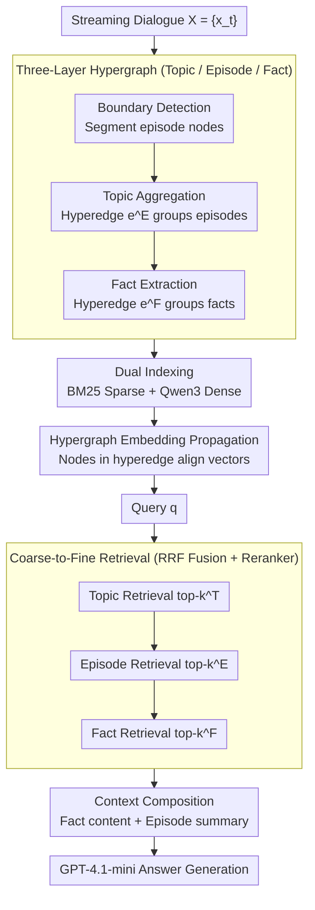

# HyperMem: Hypergraph Memory for Long-Term Conversations

**Conference**: ACL 2026  
**arXiv**: [2604.08256](https://arxiv.org/abs/2604.08256)  
**Code**: Will be open-sourced (footnote states "source code is about to be released")  
**Area**: Long-Term Conversation Memory / Agentic Memory / Retrieval-Augmented Generation (RAG)  
**Keywords**: Hypergraph Memory, Three-Layer Architecture, High-Order Correlation, Coarse-to-Fine Retrieval, LoCoMo

## TL;DR
HyperMem replaces pairwise edges in traditional RAG with "hyperedges" (edges connecting $\ge 3$ nodes), organizing long-term conversation memory into a "Topic → Episode → Fact" structure. By combining coarse-to-fine retrieval with hypergraph embedding propagation, it solves retrieval fragmentation caused by multi-episode cross-temporal dependencies, achieving a 92.73% LLM-as-judge accuracy on the LoCoMo benchmark (compared to the Prev. SOTA of 86.49%).

## Background & Motivation

**Background**: The fixed context window of dialogue agents cannot accommodate dialogue history spanning months, necessitating long-term memory modules. Current solutions fall into two categories: (1) RAG-based (GraphRAG / LightRAG / HippoRAG2 / HyperGraphRAG), which use chunks or graph structures for external knowledge; (2) Memory System-based (MemoryBank / A-Mem / Mem0 / Zep / MIRIX / MemOS), specifically designed for hierarchical memory in dialogue scenarios.

**Limitations of Prior Work**: Both categories rely solely on **pairwise** relations—chunk-based RAG uses chunk-chunk retrieval, while graph-based RAG uses entity-entity edges. However, essential correlations in dialogue are often **high-order**. For example, a user's "sports" topic may involve 7 dialogue fragments across different times (Episode 1, 3, 4, ...), each containing scattered facts (which sport, with whom, when, results). Pairwise edges cannot explicitly represent the fact that "this set of episodes belongs to one theme," leading to fragmented retrieval and significant performance drops in multi-hop reasoning.

**Key Challenge**: The joint dependency in dialogue memory is inherently high-order, yet existing data structures (graphs/trees) support only binary relations. Even tree-based indices like RAPTOR, SiReRAG, or HiRAG use hierarchical edges (parent-child pairwise relations) and cannot explicitly group nodes.

**Goal**: (1) Identify a structure capable of expressing joint associations between $\ge 3$ nodes; (2) Organize memory into three semantic granularities: Topic / Episode / Fact; (3) Design a coarse-to-fine retrieval strategy that locates topics before expanding to facts.

**Key Insight**: Hyperedges in a hypergraph can connect any number of nodes, making them naturally suited for grouping multiple episodes of the same topic. This aligns with the associative nature of human memory (Anderson & Bower).

**Core Idea**: Use hyperedges to explicitly group episodes of the same topic and facts from the same episode, unifying fragmented content into coherent units. Employ hypergraph embedding propagation to allow nodes within the same hyperedge to share semantics. Finally, implement a Topic → Episode → Fact coarse-to-fine retrieval with RRF fusion and reranking for the final context.

## Method

### Overall Architecture

HyperMem organizes streaming dialogues $X = \{x_t\}_{t=1}^T$ offline into a three-layer "Topic-Episode-Fact" hypergraph. Online, it uses coarse-to-fine retrieval to assemble context for a query $q$. Offline construction involves three steps: first, LLM-based streaming boundary detection segments dialogues into episode nodes $v^E = (v^E_{\text{dialogue}}, v^E_{\text{title}}, v^E_{\text{episode}})$; next, new episodes retrieve similar historical episodes and aggregate into topics using hyperedges $e^E_t \in \mathcal{E}^E$; finally, atomic facts $v^F = (v^F_{\text{content}}, v^F_{\text{potential}}, v^F_{\text{keywords}})$ are extracted (where `potential` predicts query types and `keywords` assist BM25), and facts from the same episode are grouped by hyperedge $e^F$. Dual indexing (BM25 sparse + Qwen3-Embedding-4B dense) is performed, followed by hypergraph embedding propagation to align semantically related episodes. Online retrieval follows the Topic → Episode → Fact pipeline, using RRF fusion and Qwen3-Reranker-4B at each stage (top-$k^T=10$, $k^E=10$, $k^F=30$), feeding fact content and episode summaries to GPT-4.1-mini.

### Key Designs

**1. Three-Layer Hypergraph Structure: Upgrading Pairwise to Joint Correlations**

The failure of traditional GraphRAG in multi-hop scenarios stems from the inability to encode high-order relations like "two facts belonging to one event." Conventional graphs link them indirectly via a shared entity; if that entity is absent from the query, the link breaks. HyperMem formalizes memory as $\mathcal{H} = (\mathcal{V}^T \cup \mathcal{V}^E \cup \mathcal{V}^F, \mathcal{E}^E \cup \mathcal{E}^F)$. The hyperedge $\mathcal{E}^E$ groups all episodes of a topic, while $\mathcal{E}^F$ groups facts from an episode, with importance weights $w_{e,v} \in [0,1]$. Topics act as semantic anchors across months, Episodes are temporal event segments, and Facts are atomic units—allowing a single topic hyperedge to retrieve all mentions of a tournament over 10 months without relying on specific entities in the query.

**2. Hypergraph Embedding Propagation: Semantic Alignment of Grouped Nodes**

Standard BM25 or dense indexing ignores topic-level grouping. HyperMem adopts a one-step forward propagation inspired by HGNN: first aggregate hyperedge embeddings $\bm{h}_e = \sum_v \alpha_{e,v} \bm{h}_v$ (where $\alpha_{e,v} = \exp(w_{e,v}) / \sum_u \exp(w_{e,u})$), then propagate back to nodes $\bm{h}'_v = \bm{h}_v + \lambda \cdot \text{Agg}_{e \in \mathcal{N}(v)}(\bm{h}_e)$, using $\lambda = 0.5$. This imposes a soft constraint for semantic sharing within a hyperedge, allowing the retrieval of one episode to pull in related episodes without additional training.

**3. Coarse-to-Fine Retrieval + RRF Fusion + Reranking: Pruning and Coherence**

Ranking tens of thousands of facts directly introduces noise and loses thematic coherence. HyperMem decomposes retrieval into Topic → Episode → Fact. Each stage uses a "BM25 + dense → RRF fusion → reranker" pipeline. Reciprocal Rank Fusion ($\text{RRF}(d) = \sum_{m=1}^M 1/(k + \text{rank}_m(d))$) combines rankers while avoiding score scale inconsistencies. This "locate topic then find evidence" sequence mimics human recall and ensures token efficiency. HyperMem achieves 92.73% accuracy using only 7.5× tokens, whereas GraphRAG reaches only 67.6% even with 35.3× tokens.

### Loss & Training
The method uses **unsupervised construction**. Node building, hyperedge weighting, and boundary detection are performed zero-shot by LLMs (GPT-4.1-mini for generation, Qwen3 series for embedding/rerank). Hypergraph propagation is a closed-form one-step forward pass without trainable parameters. Results are averaged over 3 runs with $\lambda = 0.5$, $k^T = k^E = 10$, $k^F = 30$.

## Key Experimental Results

### Main Results (LoCoMo benchmark, LLM-as-judge accuracy %, judge = GPT-4o-mini)

| Method | Single-hop | Multi-hop | Temporal | Open Domain | Overall |
|------|-----------|-----------|----------|-------------|---------|
| GraphRAG | 79.55 | 54.96 | 50.16 | 58.33 | 67.60 |
| LightRAG | 86.68 | 84.04 | 60.75 | 71.88 | 79.87 |
| HippoRAG 2 | 86.44 | 75.89 | 78.50 | 66.67 | 81.62 |
| HyperGraphRAG | 90.61 | 80.85 | 85.36 | 70.83 | 86.49 |
| Mem0 / Mem0g | 67.13 / 65.71 | 51.15 / 47.19 | 55.51 / 58.13 | 72.93 / 75.71 | 66.88 / 68.44 |
| MIRIX (GPT-4.1-mini) | 85.11 | 83.70 | 88.39 | 65.62 | 85.38 |
| MemOS | 81.09 | 67.49 | 75.18 | 55.90 | 75.80 |
| **Ours (HyperMem)** | **96.08** | **93.62** | **89.72** | 70.83 | **92.73** |

Overall SOTA, with Gains of +5.5 in Single-hop, +9.6 in Multi-hop, +1.3 in Temporal, and +6.2 Overall (vs. HyperGraphRAG).

### Ablation Study

| Configuration | Overall | $\Delta$ |
|------|---------|----------|
| HyperMem (Full) | **92.66** | – |
| w/o FC (Fact Context) | 91.75 | −0.91 |
| w/o EC (Episode Context) | 88.90 | **−3.76** |
| w/o TR (Topic Retrieval) | 91.94 | −0.72 |
| w/o TR & FC | 91.75 | −0.91 |
| w/o TR & EC | 88.83 | −3.83 |
| w/o TR & ER (Fact-only) | 90.19 | −2.47 |

### Key Findings
- **Episode context is critical**: Removing EC results in a 3.76% drop Overall and a 5.61% drop in Temporal tasks, proving episode continuity acts as a temporal anchor for cross-session reasoning.
- **Hierarchical retrieval avoids multi-hop degradation**: Flattening retrieval to Fact-only drops Multi-hop performance by 5.68%, confirming that coarse-to-fine pruning effectively preserves coherence.
- **Topic top-k sensitivity**: Performance rises from 76.88% at $k=1$ to 92.66% at $k=10$, indicating topic recall coverage is a bottleneck.
- **Token Efficiency**: HyperMem achieves 92.73% at 7.5× tokens; a "Fact Only" configuration reaches 89.48% at 2.5× tokens, significantly outperforming HyperGraphRAG's 86.49% at 26.3× tokens.
- **Case Study**: For the multi-hop query "How many games did Nate win?", HyperMem retrieves 7 episodes via a topic hyperedge to answer "seven," whereas GraphRAG only answers "at least two."

## Highlights & Insights
- **Explicit Hyperedge Grouping**: This represents a paradigm shift in RAG. While previous GraphRAG improvements refined entities or paths (still pairwise), HyperMem makes high-order joint dependency a first-class citizen.
- **Cognitive Alignment**: The Topic/Episode/Fact granularity mirrors human dialogue memory layers—topics for long-term semantics, episodes for event units, and facts for detail.
- **The `potential` Field**: Predicting potential query types during indexing performs reverse query alignment early, acting as a query-side semantic index to boost hit rates.
- **Pipeline Template**: The "Coarse-to-fine + RRF + Reranker" sequence is a highly reusable retrieval template that handles scale, score inconsistencies, and precision.
- **Simplicity of Propagation**: Hypergraph propagation works without training, demonstrating that structural topology itself is a powerful signal.

## Limitations & Future Work
- **Single-User Assumption**: Multi-user/multi-agent scenarios require access control and memory isolation mechanisms.
- **LLM Overhead**: Construction relies heavily on LLM calls (boundary detection, extraction), which may be costly for large-scale deployment.
- **Simplistic Propagation**: Only one step of propagation is used; multi-layer message passing remains unexplored.
- **Incremental Updates**: The cost of updating topics and embedding propagation in real-time streaming dialogue is not fully detailed.

## Related Work & Insights
- **vs HyperGraphRAG**: While both use hypergraphs, HyperGraphRAG targets static KBs, whereas HyperMem is optimized for **dynamically evolving dialogue memory**.
- **vs tree-structured indices (RAPTOR, etc.)**: HyperMem's hyperedges allow facts to belong to multiple overlapping topics, offering more flexibility than rigid parent-child tree edges.
- **vs Memory Systems (Mem0, etc.)**: HyperMem moves beyond pairwise fact tracking, significantly outperforming Mem0g on the LoCoMo benchmark (92.73% vs 68.44%).
- **Inspiration**: Hypergraph concepts can be transferred to codebases (one commit = hyperedge across files) or medical knowledge (symptoms = hyperedge across diseases).

## Rating
- Novelty: ⭐⭐⭐⭐ Methodically introduces hypergraphs to dialogue memory.
- Experimental Thoroughness: ⭐⭐⭐⭐⭐ Comparison with 14 baselines across 4 categories.
- Writing Quality: ⭐⭐⭐⭐⭐ Clear structure and high-quality visualizations.
- Value: ⭐⭐⭐⭐⭐ Significant SOTA on LoCoMo with high token efficiency.

<!-- RELATED:START -->

## Related Papers

- [\[ICLR 2026\] AMemGym: Interactive Memory Benchmarking for Assistants in Long-Horizon Conversations](../../ICLR2026/information_retrieval/amemgym_interactive_memory_benchmarking_for_assistants_in_long-horizon_conversat.md)
- [\[ICML 2026\] HGMem: Hypergraph-based Working Memory to Improve Multi-step RAG for Long-Context Complex Relational Modeling](../../ICML2026/information_retrieval/hgmem_hypergraph-based_working_memory_to_improve_multi-step_rag_for_long-context.md)
- [\[AAAI 2026\] Mem-PAL: Towards Memory-based Personalized Dialogue Assistants for Long-term User-Agent Interaction](../../AAAI2026/information_retrieval/mem-pal_towards_memory-based_personalized_dialogue_assistants_for_long-term_user.md)
- [\[ACL 2026\] VideoStir: Understanding Long Videos via Spatio-Temporally Structured and Intent-Aware RAG](videostir_understanding_long_videos_via_spatio-temporally_structured_and_intent-.md)
- [\[AAAI 2026\] ComoRAG: A Cognitive-Inspired Memory-Organized RAG for Stateful Long Narrative Reasoning](../../AAAI2026/information_retrieval/comorag_a_cognitive-inspired_memory-organized_rag_for_stateful_long_narrative_re.md)

<!-- RELATED:END -->
