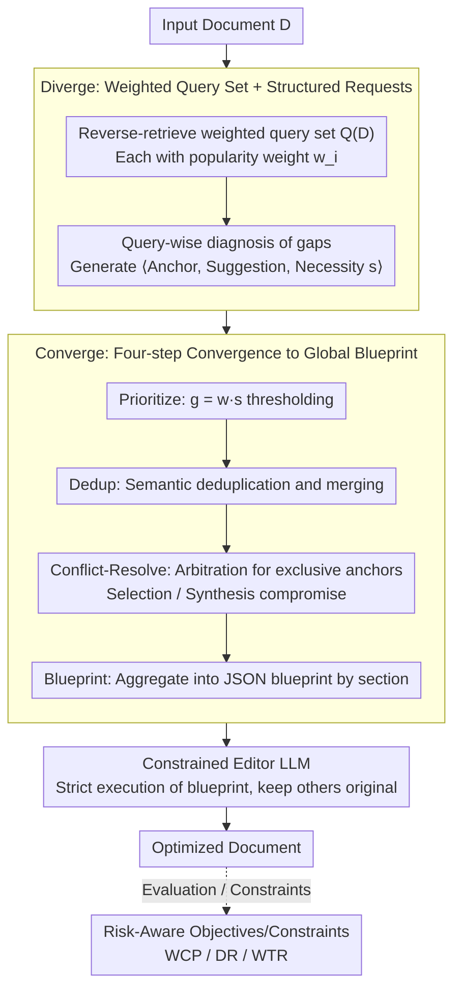

# IF-GEO: Conflict-Aware Instruction Fusion for Multi-Query Generative Engine Optimization

**Conference**: ACL 2026  
**arXiv**: [2601.13938](https://arxiv.org/abs/2601.13938)  
**Code**: Not declared by authors (as of acceptance)  
**Area**: Information Retrieval / Generative Engine Optimization (GEO) / RAG  
**Keywords**: GEO, Generative Search, Multi-query Optimization, Conflict-aware Instruction Fusion, Risk-aware Stability

## TL;DR
This paper treats "optimizing a single document for multiple potential queries simultaneously" as a constrained multi-objective optimization problem and proposes IF-GEO. It follows a "diverge-then-converge" strategy: first, LLMs perform reverse-retrieval of representative queries and generate structured edit requests; then, through **Priority × Necessity scoring + Deduplication + Conflict Resolution + Global Revision Blueprint**, multiple conflicting edit instructions are fused into one executable revision blueprint. Additionally, WCP/DR/WTR risk-aware stability metrics are introduced. On GEO-Bench, it pushes the objective overall from Auto-GEO's 7.59 up to 11.03, while reducing the worst single-query performance drop from -0.0511 to -0.0090.

## Background & Motivation

**Background**: Generative Search Engines (GSE, e.g., ChatGPT Search, Perplexity) are replacing traditional ranking-based search engines. Visibility no longer depends on rank but on whether the document is selected and cited by the LLM in its response. "Generative Engine Optimization (GEO)," proposed at KDD'24, specifically focuses on rewriting document content to improve its exposure in generated answers.

**Limitations of Prior Work**: Existing methods (GEO's 9 heuristic rules, Auto-GEO's preference rules, RAID's single-intent trajectory) all treat the multi-query visibility problem as a **one-dimensional** optimization—optimizing the document for a single goal. In reality, a single document must satisfy 3-5 heterogeneous queries simultaneously (e.g., "What is X" / "Pros and cons of X" / "Usage of X"). These often **conflict** under a limited content budget; adding examples for Query A might squeeze out the statistical data required by Query B.

**Key Challenge**: Using "mean" or a "single aggregated intent" as the optimization objective masks true failure modes—significant degradation on a minority of queries—under the guise of improved averages. Heuristic methods (e.g., "adding citations") might have positive means but fail to handle query-level trade-offs.

**Goal**: (a) Propose a framework capable of "generating divergent instructions then performing convergent fusion"; (b) Establish explicit risk-aware evaluation protocols (WCP/DR/WTR) to measure "tail degradation."

**Key Insight**: Treat each candidate query as an independent "stakeholder." Let the LLM first propose individual edit requests (with necessity scores), then use a "coordinator" to score, rank, deduplicate, and arbitrate conflicts globally. The final output is a JSON blueprint aggregated by document sections, serving as a strong constraint contract for subsequent rewriting.

**Core Idea**: Replace "one rewrite per query" with "diverge-then-converge + conflict-aware instruction fusion"—moving the multi-objective optimization coordinator into the LLM editing phase.

## Method

### Overall Architecture

IF-GEO is a pure LLM-API pipeline (using GPT-4o-mini for all calls), taking a document $D$ as input and outputting a revised document based on the blueprint. It consists of two core phases: "Diverge" and "Converge." Phase I (Diverge) tasks the LLM as a "Search Analyst" to reverse-retrieve a weighted representative query set $Q(D) = \{(q_i, w_i)\}_{i=1}^m$ ($w_i \in [0,100]$ is a popularity score; paraphrasing is prohibited), then independently diagnoses "what the document lacks" for each $q_i$, generating a structured request $r_{i,j} = \langle e_{i,j}, u_{i,j}, s_{i,j} \rangle$ (anchor segment $e_{i,j}$, rewrite suggestion $u_{i,j}$, and G-EVAL style necessity score $s_{i,j} \in [0,100]$). Phase II (Converge) converges these conflicting requests into a single blueprint: it performs global prioritization $g_{i,j} = w_i \cdot s_{i,j}$ with threshold denoising, semantic deduplication, and conflict arbitration for mutually exclusive requests on the same anchor. The retained instructions are aggregated by document **section** into an ordered JSON blueprint. Finally, a "Constrained Editor" LLM rewrites the document strictly according to the blueprint, keeping unmentioned sections unchanged. Besides maximizing expected visibility $\mathbb{E}[\Delta v]$, the system incorporates WCP, DR, and WTR as equally important constraints in the objective.

### Key Designs

**1. Diverge—Weighted query set + Necessity-scored structured requests: Making multi-query needs explicit and comparable**

Traditional GEO blurs the needs of multiple queries into a single "engine preference" for optimization, flattening query differences and making it impossible to "see conflicts." Conversely, IF-GEO uses reverse retrieval (rather than paraphrasing) to approximate the real potential user distribution $Q(D)$ and has the LLM assign two independent scores: $w_i$ for query importance and $s_{i,j}$ for the criticality of an edit to that query. The product $g_{i,j} = w_i \cdot s_{i,j}$ translates "vague optimization intent" into a rankable, comparable global priority, driving the subsequent fusion and arbitration.

**2. Converge—Sequence of Prioritize → Dedup → Conflict-Resolve → Blueprint: Tightening divergent requests into an executable global blueprint**

Requests from the divergence phase are often noisy, overlapping, or mutually exclusive on the same paragraph. Patching them sequentially leads to "revised-and-overwritten" disasters. The convergence phase uses $g_{i,j}$ to prune low-value requests and merges semantically similar intents into meta-requests. For remaining conflicts, rather than hard thresholding, it uses LLM-based "semantic arbitration"—choosing the best request (Selection) if $g$ values differ greatly or synthesizing a compromise (Synthesis) if they are close. Finally, instructions are reordered by **section** rather than query, transforming the revision from sequential patching into a one-time structured update. Ablation shows that removing Conflict Resolution causes Mean performance to drop from 9.24 to 6.14, the largest drop among all components.

**3. Risk-Aware Stability Objective (WCP / DR / WTR): Embedding "stability across all queries" into the objective function**

The true failure mode of GEO is "improved average but significantly degraded tail queries." Standard variance (VAR) penalizes both positive and negative fluctuations, incorrectly labeling "visibility upside" as risk. IF-GEO introduces three metrics: Worst-Case Performance $\text{WCP} = \min_{i=1}^m \Delta v_i$ for a safety floor; Downside Risk $\text{DR} = \frac{1}{m}\sum_{i=1}^m (\min(0, \Delta v_i))^2$ which only penalizes squared negative gains to distinguish harmful fluctuations; and Win-Tie Rate $\text{WTR} = \frac{1}{m}\sum_{i=1}^m \mathbb{I}(\Delta v_i \ge 0)$ as a proxy for Pareto safety. These serve as both evaluation metrics and optimization constraints.

### Loss & Training
**No model training**—IF-GEO is entirely an inference-time framework consisting of prompt calls with fixed schemas. Default hyperparameters: query expansion $N_q = 5$, suggestions per query $N_s = 5$, internal temperature = 0.2, $\tau = 0.7$. Rewriting is performed by the same LLM, with evaluation provided by the GPT-4o-mini simulation engine used in GEO-Bench.

## Key Experimental Results

### Main Results

Visibility improvements on GEO-Bench / RAID multi-query benchmarks (1k queries, 5 related queries per document):

| Method | Objective Overall | Objective Word | Objective Position | Subjective Average |
|------|--------------------|----------------|--------------------|---------------------|
| Trans. SEO | 1.84 | 1.83 | 1.77 | 1.51 |
| Cite Sources (Strong Heuristic) | 4.71 | 4.47 | 4.59 | 3.31 |
| Quotation Addition | 4.23 | 4.29 | 4.19 | 2.71 |
| Statistics Addition | 3.49 | 3.28 | 3.39 | 2.31 |
| RAID (Single Intent) | 0.88 | 1.06 | 0.78 | 1.36 |
| Auto-GEO (SOTA Preference-driven) | 7.59 | 7.80 | 7.64 | 5.30 |
| **IF-GEO (Ours)** | **11.03** | **11.07** | **11.15** | **5.87** |

Cross-query stability metrics (for Objective Overall):

| Method | VAR ↓ | WCP ↑ | WTR ↑ | DR ↓ |
|------|--------|--------|--------|-------|
| Cite Sources | 0.0165 | -0.0785 | 72.06% | 0.0044 |
| Auto-GEO | 0.0159 | -0.0511 | 73.56% | 0.0043 |
| **IF-GEO** | 0.0189 | **-0.0090** | **80.50%** | **0.0023** |

IF-GEO reduces the "worst single-query drop" from Auto-GEO's -0.0511 to -0.0090 (≈ -82% reduction), halves DR, and increases WTR from 73.56% to 80.50%.

### Ablation Study

On a 250-query subset (values slightly lower than main results due to sample size):

| Variant | Mean ↑ | VAR ↓ | WCP ↑ | WTR ↑ | DR ↓ |
|------|---------|--------|--------|--------|-------|
| IF-GEO (Full) | **9.24** | 0.0156 | **-0.0328** | **80.80%** | **0.0021** |
| w/o Blueprint Construction | 8.18 | 0.0167 | -0.0517 | 81.20% | 0.0021 |
| w/o Instruction Fusion | 7.07 | 0.0156 | -0.0569 | 74.80% | 0.0043 |
| w/o Conflict Resolution | 6.14 | 0.0174 | -0.0713 | 77.20% | 0.0032 |

### Key Findings
- **Conflict Resolution is the most critical safety guardrail**: Removing it causes the largest Mean drop (3.1pt) and the deepest WCP drop, showing that LLM-led "dynamic conflict arbitration" is the core of IF-GEO's stability. Blueprint Construction affects "execution efficiency" more than stability.
- **Instruction Fusion addresses the tail**: Removing it drops WTR from 80.8% to 74.8% and doubles DR to 0.0043. This proves fusion is about "reducing conflicting rules" rather than just "adding more rules."
- **$N=5$ is the sweet spot**: Extending the number of expansion queries from 1 to 9 shows a monotonic increase in Mean from 8.06 to 10.02, but WTR/DR/WCP plateau after $N=5$. $N=5$ is the default for optimal cost-latency balance.
- **Cross-Engine Generalization**: When evaluating against Gemini-2.0-Flash (without tuning), IF-GEO still leads Auto-GEO in WCP/WTR, indicating that "explicit cross-query coordination" is more generalizable than "engine-specific preference rules."
- **Robustness to Initial Ranking**: Binned analysis by initial document rank shows that IF-GEO maintains stable gains even for low-ranked documents, proving it enhances "content robustness" rather than exploiting positional bias.

## Highlights & Insights
- **Moving the "coordination mechanism" of multi-objective optimization directly into LLM editing** is the primary conceptual innovation. GEO is no longer just prompt engineering or a stack of heuristics, but an optimization problem with a formalized objective function (including WCP/DR constraints).
- **The WCP/DR/WTR trio is a highly reusable evaluation framework**: Many LLM applications face the "better average, but catastrophic failures in some cases" problem (recommendation, personalization, alignment). Upgrading from an "average-based" G-EVAL perspective to a risk-aware one should become an industry standard.
- **Structured requests with "reverse-retrieved queries + necessity scoring" is elegant**: It translates fuzzy optimization intents into comparable, structured objects, enabling "semantic negotiation" between LLMs. This can migrate to prompt rewriting, PR reviews, and collaborative document editing.
- **Synthesizing compromises based on "score differences"** instead of hard thresholds is a low-cost, flexible design that avoids the pain of tuning trade-off hyperparameters without massive manual labeling.

## Limitations & Future Work
- **Inference Cost**: The full pipeline requires $N_q$ query mining steps + $N_q \times N_s$ request generation steps + multi-step fusion + one rewrite. Token consumption is significantly higher than single-pass baselines; cost-per-visibility-gain analysis is missing.
- **Simulation Gap**: Evaluations are performed on a simulated GE (GPT-4o-mini). Real-world performance on commercial GSEs like Perplexity or Bing AI remains unverified.
- **Single Point of Failure in Query Discovery**: The blueprint quality depends entirely on the first step's representative query set. If the distribution shifts (e.g., in long-tail niches), subsequent fusion will be misaligned. There is a lack of research on whether the latter stages can recover from "wrong queries."

## Related Work & Insights
- **vs GEO (KDD'24)**: GEO uses 9 manual heuristics (add citations, statistics, etc.) and is query-agnostic; IF-GEO is a query-aware coordination framework, upgrading GEO from heuristics to optimization.
- **vs Auto-GEO (Wu et al., 2025)**: Auto-GEO learns preference rules from large-scale ranking data but remains single-objective; IF-GEO performs individual document "diagnosis → editing" with explicit risk-aware optimization.
- **vs RAID (Chen et al., 2025b)**: RAID uses 4W multi-role reflection to infer a single intent trajectory; IF-GEO handles multi-intent and explicitly arbitrates conflicts. RAID lags significantly behind IF-GEO in multi-query scenarios.
- **vs General Multi-Objective Optimization (Pareto / ε-constraint)**: IF-GEO replaces complex solvers with LLM prompts. This is a successful case of the "LLM-as-decision-maker" paradigm, potentially inspiring more scenarios where LLMs replace traditional solvers.

## Rating
- Novelty: ⭐⭐⭐⭐ The combination of "diverge-then-converge + LLM conflict arbitration + risk-aware metrics" is new in the GEO field.
- Experimental Thoroughness: ⭐⭐⭐⭐ Comprehensive comparison with 11 baselines, 4 stability metrics, ablation studies, and cross-model/ranking analysis, though lacking commercial GSE testing.
- Writing Quality: ⭐⭐⭐⭐ Clear motivation, well-defined formulas, and intuitive physical interpretations of metrics.
- Value: ⭐⭐⭐⭐ GEO is an emerging field; this work contributes both a methodology and an evaluation protocol (WCP/DR/WTR).

<!-- RELATED:START -->

## Related Papers

- [\[ACL 2026\] From Relevance to Authority: Authority-aware Generative Retrieval in Web Search Engines](from_relevance_to_authority_authority-aware_generative_retrieval_in_web_search_e.md)
- [\[ACL 2026\] Enhancing Multilingual RAG Systems with Debiased Language Preference-Guided Query Fusion](enhancing_multilingual_rag_systems_with_debiased_language_preference-guided_quer.md)
- [\[ACL 2026\] Context Attribution with Multi-Armed Bandit Optimization](context_attribution_with_multi-armed_bandit_optimization.md)
- [\[ICLR 2026\] GRO-RAG: Gradient-aware Re-rank Optimization for Multi-source Retrieval-Augmented Generation](../../ICLR2026/information_retrieval/gro-rag_gradient-aware_re-rank_optimization_for_multi-source_retrieval-augmented.md)
- [\[ACL 2026\] MAB-DQA: Addressing Query Aspect Importance in Document Question Answering with Multi-Armed Bandits](mab-dqa_addressing_query_aspect_importance_in_document_question_answering_with_m.md)

<!-- RELATED:END -->
