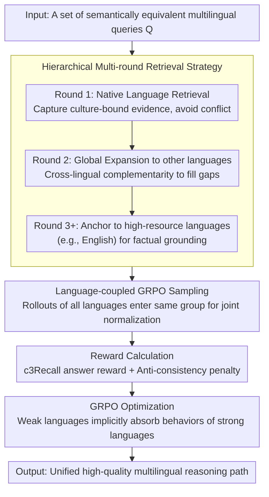

# Language-Coupled Reinforcement Learning for Multilingual Retrieval-Augmented Generation

**Conference**: ACL 2026 Findings  
**arXiv**: [2601.14896](https://arxiv.org/abs/2601.14896)  
**Code**: [GitHub](https://github.com/Cherry-qwq/LcRL-Open)  
**Area**: Reinforcement Learning  
**Keywords**: Multilingual RAG, Reinforcement Learning, GRPO, Knowledge Bias, Knowledge Conflict

## TL;DR

This paper proposes the LcRL framework, which addresses knowledge bias and knowledge conflict in multilingual RAG through language-coupled GRPO policy optimization and anti-consistency penalty rewards, achieving significant improvements in multilingual QA tasks.

## Background & Motivation

**Background**: Retrieval-Augmented Generation (RAG) has become an effective paradigm for mitigating LLM hallucinations and knowledge insufficiency. In multilingual scenarios, knowledge differences between languages are significant due to extremely unbalanced training data distribution. Multilingual RAG (MRAG) requires models to effectively acquire and integrate external knowledge from a multilingual collection.

**Limitations of Prior Work**: Existing MRAG methods mainly adopt a "one-size-fits-all" strategy—processing equivalent queries in different languages through single-round retrieval and unified optimization. This introduces two core issues: (1) **Knowledge Bias**—LLMs generate vastly different answers for semantically equivalent queries in different languages because knowledge reserves vary across languages; (2) **Knowledge Conflict**—when retrieval sets include multiple languages, linguistic expression differences cause retrieved documents to be semantically relevant but factually inconsistent, interfering with the generation of correct answers.

**Key Challenge**: Existing RL-based RAG methods (e.g., Search-R1) optimize policies independently within a single language, failing to reconcile conflicting facts across languages or leverage cross-lingual complementary effects.

**Goal**: To design a language-coupled reinforcement learning framework that allows the LLM to adaptively decide whether to retrieve and which language resources to utilize, while effectively reconciling conflicting knowledge between languages. **Key Insight**: Couple multilingual decision-making and experience rewards directly into the GRPO framework. **Core Idea**: Allow semantically equivalent multilingual queries to be sampled and evaluated within the same group to promote cross-lingual knowledge transfer.

## Method

### Overall Architecture

LcRL integrates multilingual decision-making directly into the GRPO training loop: for multiple semantically equivalent queries of the same question, the LLM interacts with a search engine in multiple rounds interleaved with `<search>`/`<answer>` tags. Each round selects which language resource to retrieve according to a hierarchical strategy. Rollouts of all language versions are placed into the same group for joint scoring, driven by a reward combining character recall and an anti-consistency penalty. This forces weak languages to align with strong languages within the group and actively breaks up clustered incorrect answers.

### Key Designs

**1. Hierarchical Multi-round Retrieval Strategy: Native First, Global Next, High-Resource Last**

Naïve "one-size-fits-all" retrieval causes documents from multiple languages to flood in simultaneously, leading to factual conflicts. LcRL adopts a phased expansion: Round 1 retrieves only native language resources $\mathcal{R}_L(q)$ to prioritize culture-bound evidence and avoid premature conflict; Round 2 expands globally to all other languages $\bigcup_{l \in \mathcal{L} \setminus \{L\}} \mathcal{R}_l(q)$ to fill knowledge gaps via complementarity; Round 3 and beyond anchor to high-resource languages (e.g., English) $\mathcal{R}_{en}(q)$ as a factual backstop. This "native → global → high-resource" progression establishes clear priorities between reconciling conflict and completing knowledge.

**2. Language-Coupled GRPO: Sharing a Common Baseline for Equivalent Queries**

Knowledge bias stems from independent optimization per language, preventing weak languages from learning strong language behaviors. LcRL puts sampling $o_i \sim \pi_\theta(\cdot \mid q_i; \mathcal{R})$ for a set of semantically equivalent queries $\mathcal{Q} = \{q_1, q_2, \dots, q_n\}$ into the same group. Advantages $\hat{A}_{i,t}^{\text{coupled}}$ are normalized across the entire multilingual group rather than separately. Consequently, embeddings of different languages are bound to the same high-quality reasoning path, allowing weak languages to implicitly absorb patterns from high-reward samples of strong languages.

**3. Anti-consistency Penalty Reward: Breaking Up Clustered Incorrect Answers**

GRPO in tool-augmented RL often collapses due to Lazy Likelihood Displacement—similar incorrect answers reinforcing each other. LcRL identifies a "bad samples" set $B_q = \{i \in G_q \mid r_{\text{ans}}(i) < \tau_{\text{bad}}\}$ and calculates a maximum similarity $m_i$ for each bad sample against others. Higher similarity indicates clustered errors, triggering a penalty $r_{\text{anti\_align}}(i) = -p_i \cdot w_q$. This specifically targets the "collective error" pattern to break positive feedback loops of mistakes.

### Loss & Training

For reward signals, the answer term uses character 3-gram recall $r_{\text{ans}}(i) = \text{c3Recall}(\hat{a}_i, a_{\text{gold}})$ to provide dense feedback instead of binary exact matching. The final reward is defined as $r_{\text{total}}(i) = \max(0, r_{\text{ans}}(i) + \lambda \cdot \tilde{r}_{\text{anti\_align}}(i))$, where the anti-consistency penalty is clipped to $[-0.5, 0]$. The objective follows the standard PPO-clip format with KL regularization.

## Key Experimental Results

### Main Results

| Dataset | Metric | LcRL (Qwen2.5-3B) | mSearch-R1 | Search-R1 | D-RAG |
|---------|--------|-------------------|------------|-----------|-------|
| MKQA    | fEM    | **41.2**          | 37.9       | 22.6      | 37.4  |
| MKQA    | c3Recall | **57.0**        | 53.2       | 34.8      | 43.3  |
| MKQA    | CLR    | **99.1**          | 95.6       | 83.6      | 90.2  |
| XOR-TyDi| fEM    | **31.7**          | 21.2       | 18.4      | 31.5  |
| XOR-TyDi| c3Recall | **43.9**        | 35.8       | 32.0      | 38.9  |

### Ablation Study

| Configuration | fEM | c3Recall | Description |
|---------------|-----|----------|-------------|
| Full LcRL     | 41.2 | 57.0    | Full model |
| w/o Lc Reward | 30.8 | 42.2    | Remove language-coupled reward |
| w/o c3Recall Reward | 18.0 | 20.2 | Use exact match instead |
| w/o Lc Rollout | 30.4 | 45.7   | Remove language-coupled sampling |
| w/o multi-language Rollout | 27.9 | 38.5 | Remove multilingual retrieval |
| Replace by PPO | 15.5 | 21.7   | Use PPO instead of GRPO |

### Key Findings
- LcRL achieves significant improvements over all baselines (t-test p < 0.01), with fEM reaching 47.6 on Qwen3-8B.
- As the number of languages in the retrieval set increases, only LcRL shows sustained performance gains, while other methods decline sharply beyond 2 languages.
- LcRL performs robustly under limited training data and successfully generalizes to languages unseen during training.
- GRPO significantly outperforms PPO, as its group learning mechanism facilitates cross-lingual generalization.

## Highlights & Insights
- The design of language-coupled GRPO effectively utilizes the complementarity of multilingual equivalent queries, providing a meaningful extension to standard GRPO.
- The anti-consistency penalty effectively resolves the reward collapse problem in RL training and is transferable to other tool-augmented RL scenarios.
- The hierarchical retrieval strategy (native → global → high-resource) strikes an excellent balance between simplicity and effectiveness.

## Limitations & Future Work
- Evaluation was limited to three LLMs and did not cover more open-source multilingual models.
- The retriever was fixed to multilingual-e5-base; joint optimization of the retriever was not explored.
- There is a lack of dedicated retrieval relevance annotation datasets tailored for multilingual RAG.
- Future work could explore wider language coverage and larger scale models.

## Related Work & Insights
- **vs Search-R1**: While Search-R1 is a monolingual RL-RAG, LcRL addresses optimization instability in multilingual settings via language coupling.
- **vs D-RAG**: D-RAG mitigates conflict through dialectical reasoning within a fixed pipeline, whereas LcRL optimizes retrieval and generation jointly end-to-end.
- **vs SFT methods**: RL methods achieve competitive performance even under low-resource conditions, whereas SFT relies on large-scale data.

## Rating
- Novelty: ⭐⭐⭐⭐ Language-coupled GRPO and anti-consistency penalty are significant innovations for multilingual RL-RAG.
- Experimental Thoroughness: ⭐⭐⭐⭐⭐ Multi-model × Two datasets × Detailed ablations × Data scale/Language coverage analysis.
- Writing Quality: ⭐⭐⭐⭐ Clear problem definition, well-organized methodology, and rich visualizations.
- Value: ⭐⭐⭐⭐ Establishes a new route for post-training optimization in multilingual RAG; anti-consistency penalty ideas are broadly reusable.

<!-- RELATED:START -->

## Related Papers

- [\[ACL 2026\] Learning to Extract Rational Evidence via Reinforcement Learning for Retrieval-Augmented Generation](learning_to_extract_rational_evidence_via_reinforcement_learning_for_retrieval-a.md)
- [\[ACL 2026\] Agentic Conversational Search with Contextualized Reasoning via Reinforcement Learning](agentic_conversational_search_with_contextualized_reasoning_via_reinforcement_le.md)
- [\[ACL 2026\] Enhancing Multilingual RAG Systems with Debiased Language Preference-Guided Query Fusion](enhancing_multilingual_rag_systems_with_debiased_language_preference-guided_quer.md)
- [\[ACL 2026\] ChatR1: Reinforcement Learning for Conversational Reasoning and Retrieval Augmented Question Answering](chatr1_reinforcement_learning_for_conversational_reasoning_and_retrieval_augment.md)
- [\[ACL 2026\] Beyond Black-Box Interventions: Latent Probing for Faithful Retrieval-Augmented Generation](beyond_black-box_interventions_latent_probing_for_faithful_retrieval-augmented_g.md)

<!-- RELATED:END -->
