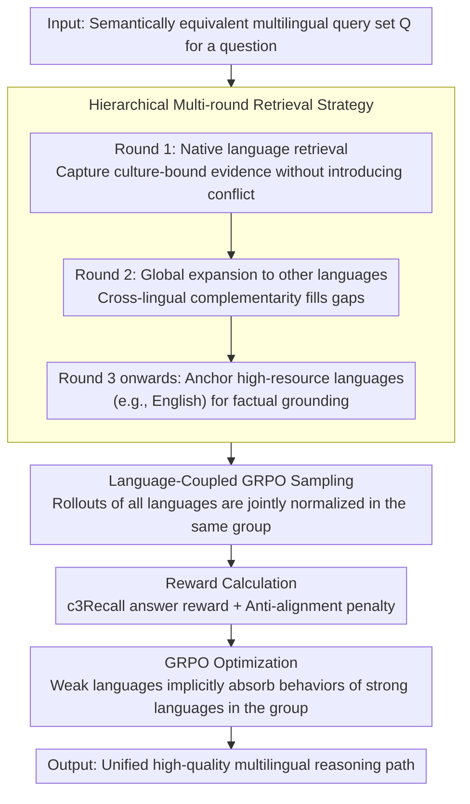

# Language-Coupled Reinforcement Learning for Multilingual Retrieval-Augmented Generation

**Conference**: ACL 2026 Findings  
**arXiv**: [2601.14896](https://arxiv.org/abs/2601.14896)  
**Code**: [GitHub](https://github.com/Cherry-qwq/LcRL-Open)  
**Area**: Reinforcement Learning  
**Keywords**: Multilingual RAG, Reinforcement Learning, GRPO, Knowledge Bias, Knowledge Conflict

## TL;DR

This paper proposes the LcRL framework, which addresses knowledge bias and knowledge conflict in multilingual RAG through language-coupled GRPO policy optimization and anti-alignment penalty rewards, achieving significant improvements in multilingual QA tasks.

## Background & Motivation

**Background**: Retrieval-Augmented Generation (RAG) has become an effective paradigm for mitigating LLM hallucinations and knowledge deficits. In multilingual scenarios, due to the extremely unbalanced distribution of training data and significant knowledge differences across languages, Multilingual RAG (MRAG) requires models to effectively acquire and integrate external knowledge from multilingual collections.

**Limitations of Prior Work**: Existing MRAG methods primarily adopt a "one-size-fits-all" strategy—treating equivalent queries in different languages through single-round retrieval and unified optimization. This leads to two core issues: (1) **Knowledge Bias**—LLMs produce vastly different answers for semantically equivalent queries in different languages due to varying knowledge reserves; (2) **Knowledge Conflict**—when the retrieval set contains multiple languages, linguistic differences lead to retrieved documents that are semantically relevant but factually inconsistent, interfering with the generation of correct answers.

**Key Challenge**: Policies in existing RL-based RAG methods (such as Search-R1) are optimized independently within a single language, failing to reconcile conflicting facts across languages or leverage cross-lingual complementarity.

**Goal**: Design a language-coupled reinforcement learning framework that allows LLMs to adaptively decide whether to retrieve, which language resources to retrieve, and effectively reconcile conflicting knowledge across languages. **Key Insight**: Couple multilingual decision-making and empirical rewards into the GRPO framework. **Core Idea**: Sample and evaluate semantically equivalent multilingual queries within the same group to facilitate cross-lingual knowledge transfer.

## Method

### Overall Architecture

LcRL integrates multilingual decision-making directly into the GRPO training loop: for multiple semantically equivalent queries of a question, the LLM interacts with a search engine in multiple rounds using interleaved `<search>`/`<answer>` tags, selecting which language resources to retrieve based on a hierarchical strategy in each round. Rollouts from all language versions are placed in the same group for joint scoring, driven by a reward that combines character-level recall and an anti-alignment penalty. This transition from "equivalent query set" input to "unified high-quality reasoning path" output allows weak languages to align with strong languages within the group, while conflicting incorrect answers are actively disrupted.

### Key Designs

**1. Hierarchical Multi-round Retrieval Strategy: Native first, then Global, finally High-resource Anchor**

Naive "one-size-fits-all" retrieval allows documents from multiple languages to flood in simultaneously, being semantically relevant but factually contradictory. LcRL changes this to a staged rollout by rounds: Round 1 retrieves only the query's native language $\mathcal{R}_L(q)$, prioritizing culture-bound evidence and avoiding initial conflict; Round 2 expands globally to all other languages $\bigcup_{l \in \mathcal{L} \setminus \{L\}} \mathcal{R}_l(q)$, using cross-lingual complementarity to fill native knowledge gaps; Round 3 and beyond anchor to high-resource languages (e.g., English) $\mathcal{R}_{en}(q)$ as factual grounding. This "Native → Global → High-resource" progression establishes clear priorities between reconciling conflicts and completing knowledge.

**2. Language-Coupled GRPO: Sharing the Same Baseline for Equivalent Queries**

The root of knowledge bias is that each language is optimized independently, preventing weak languages from learning the behaviors of strong ones. LcRL puts samples $o_i \sim \pi_\theta(\cdot \mid q_i; \mathcal{R})$ from a semantically equivalent query set $\mathcal{Q} = \{q_1, q_2, \dots, q_n\}$ into the same group. The advantage $\hat{A}_{i,t}^{\text{coupled}}$ is normalized uniformly across the entire multilingual group rather than calculated per language. Consequently, embeddings of different languages are bound to the same high-quality reasoning path, and weak languages implicitly absorb behavior patterns from high-reward samples of strong languages within the group, facilitating natural cross-lingual knowledge transfer.

**3. Anti-alignment Penalty Reward: Disrupting Clustered Incorrect Answers**

In tool-integrated RL, GRPO often collapses due to Lazy Likelihood Displacement—a phenomenon where similar incorrect answers reinforce each other to form positive feedback. LcRL identifies a "bad sample" set $B_q = \{i \in G_q \mid r_{\text{ans}}(i) < \tau_{\text{bad}}\}$ and calculates the maximum similarity $m_i$ for each bad sample against others. Higher similarity indicates more clustered errors, leading to a penalty $r_{\text{anti\_align}}(i) = -p_i \cdot w_q$. This specifically targets and suppresses the "collective error" pattern, breaking the positive feedback loop of mistakes and stabilizing training.

### Loss & Training

For reward signals, the answer term uses character 3-gram recall $r_{\text{ans}}(i) = \text{c3Recall}(\hat{a}_i, a_{\text{gold}})$ instead of binary exact matching to provide dense feedback; the final reward is $r_{\text{total}}(i) = \max(0, r_{\text{ans}}(i) + \lambda \cdot \tilde{r}_{\text{anti\_align}}(i))$, where the anti-alignment penalty is clipped to $[-0.5, 0]$. The objective function follows the standard PPO-clip form with KL regularization.

## Key Experimental Results

### Main Results

| Dataset | Metric | LcRL (Qwen2.5-3B) | mSearch-R1 | Search-R1 | D-RAG |
|---------|--------|-------------------|------------|-----------|-------|
| MKQA    | fEM    | **41.2**          | 37.9       | 22.6      | 37.4  |
| MKQA    | c3Recall| **57.0**          | 53.2       | 34.8      | 43.3  |
| MKQA    | CLR    | **99.1**          | 95.6       | 83.6      | 90.2  |
| XOR-TyDi| fEM    | **31.7**          | 21.2       | 18.4      | 31.5  |
| XOR-TyDi| c3Recall| **43.9**          | 35.8       | 32.0      | 38.9  |

### Ablation Study

| Configuration | fEM | c3Recall | Description |
|---------------|-----|----------|-------------|
| Full LcRL     | 41.2| 57.0     | Full model |
| w/o Lc Reward | 30.8| 42.2     | Removed language-coupled reward |
| w/o c3Recall Reward | 18.0 | 20.2 | Replaced with exact match |
| w/o Lc Rollout| 30.4| 45.7     | Removed language-coupled sampling |
| w/o multi-language Rollout | 27.9 | 38.5 | Removed multilingual retrieval |
| Replace by PPO| 15.5| 21.7     | Replaced GRPO with PPO |

### Key Findings
- LcRL achieves significant improvements across all baselines (t-test p < 0.01), with fEM reaching 47.6 on Qwen3-8B.
- As the number of languages in the retrieval set increases, only LcRL's performance continues to improve, while other methods drop sharply after 2 languages.
- LcRL performs robustly under limited training data conditions and successfully transfers to languages unseen during training.
- GRPO significantly outperforms PPO, benefiting from the intra-group learning mechanism that promotes cross-lingual generalization.

## Highlights & Insights
- The design of language-coupled GRPO cleverly utilizes the complementarity of multilingual equivalent queries, providing a meaningful extension to standard GRPO.
- The anti-alignment penalty effectively resolves the reward collapse issue in RL training and is transferable to other tool-integrated RL scenarios.
- The hierarchical retrieval strategy (Native → Global → High-resource) achieves a strong balance between simplicity and effectiveness.

## Limitations & Future Work
- Evaluation was limited to three LLMs, not covering a broader range of open-source multilingual models.
- The retriever is fixed as multilingual-e5-base, without exploring the possibility of joint retriever optimization.
- There is a lack of specialized retrieval relevance annotation datasets for multilingual RAG.
- Future work could explore broader language coverage and the effects on larger-scale models.

## Related Work & Insights
- **vs Search-R1**: While Search-R1 is a monolingual RL-RAG, LcRL addresses its optimization instability in multilingual settings through the language coupling mechanism.
- **vs D-RAG**: D-RAG mitigates conflict through dialectical reasoning but within a fixed pipeline; LcRL optimizes retrieval and generation jointly in an end-to-end manner.
- **vs SFT methods**: RL methods achieve competitive performance with low-resource requirements, whereas SFT relies on large-scale data.

## Rating
- Novelty: ⭐⭐⭐⭐ Language-coupled GRPO and anti-alignment penalty are significant innovations for multilingual RL-RAG.
- Experimental Thoroughness: ⭐⭐⭐⭐⭐ Multiple models × Two datasets × Detailed ablations × Data scale/Language coverage analysis.
- Writing Quality: ⭐⭐⭐⭐ Clear problem definition, organized method presentation, and rich visualizations.
- Value: ⭐⭐⭐⭐ Opens a new route for post-training optimization in multilingual RAG; the anti-alignment penalty concept is widely reusable.

<!-- RELATED:START -->

## Related Papers

- [\[ACL 2026\] Learning to Extract Rational Evidence via Reinforcement Learning for Retrieval-Augmented Generation](learning_to_extract_rational_evidence_via_reinforcement_learning_for_retrieval-a.md)
- [\[ACL 2026\] Agentic Conversational Search with Contextualized Reasoning via Reinforcement Learning](agentic_conversational_search_with_contextualized_reasoning_via_reinforcement_le.md)
- [\[ACL 2026\] ChatR1: Reinforcement Learning for Conversational Reasoning and Retrieval Augmented Question Answering](chatr1_reinforcement_learning_for_conversational_reasoning_and_retrieval_augment.md)
- [\[ACL 2026\] Enhancing Multilingual RAG Systems with Debiased Language Preference-Guided Query Fusion](enhancing_multilingual_rag_systems_with_debiased_language_preference-guided_quer.md)
- [\[ACL 2026\] Beyond Black-Box Interventions: Latent Probing for Faithful Retrieval-Augmented Generation](beyond_black-box_interventions_latent_probing_for_faithful_retrieval-augmented_g.md)

<!-- RELATED:END -->
