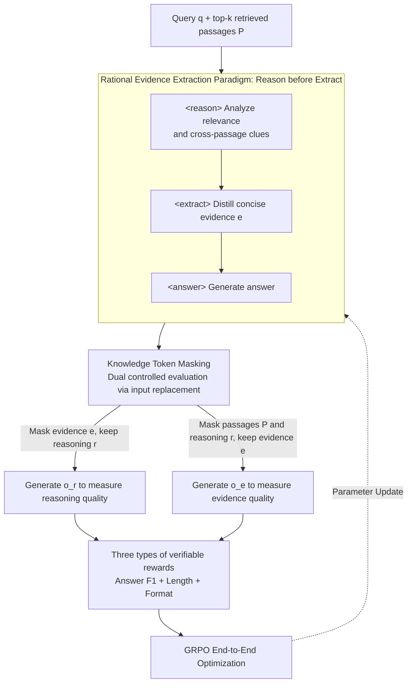

# Learning to Extract Rational Evidence via Reinforcement Learning for Retrieval-Augmented Generation

**Conference**: ACL 2026 Findings  
**arXiv**: [2507.15586](https://arxiv.org/abs/2507.15586)  
**Code**: [GitHub](https://github.com/HITsz-TMG/EviOmni)  
**Area**: Image Restoration  
**Keywords**: Retrieval-Augmented Generation, Evidence Extraction, Reinforcement Learning, Reasoning-guided Extraction, GRPO  

## TL;DR

This paper proposes EviOmni, which learns to extract rational evidence from retrieved documents via a "reason-then-extract" paradigm. By integrating evidence reasoning and evidence extraction into a unified trajectory, the method utilizes knowledge token masking to avoid information leakage. Optimized via GRPO with verifiable rewards, the model achieves higher accuracy than full-text retrieval while maintaining a significant compression ratio (~38x) across five benchmarks.

## Background & Motivation

**Background**: RAG enhances LLM accuracy by retrieving external passages. However, retrieved passages often contain substantial noise and irrelevant content, necessitating evidence extraction or denoising. Existing methods include re-ranking (placing relevant passages at the top) and summarization/extraction (training filter models via SFT).

**Limitations of Prior Work**: Current methods extract evidence directly without deep reasoning, which can result in missing critical clues. For instance, direct extraction might discard vital information scattered across multiple passages due to insufficient contextual understanding. Furthermore, training data is typically constructed via heuristics (e.g., string inclusion, lexical overlap), which does not directly align with the ultimate goal of RAG.

**Key Challenge**: Conventional evidence extraction follows a "what you see is what you get" approach, lacking deep reasoning over retrieved content. When key clues require cross-passage reasoning for identification, direct extraction is prone to omissions.

**Goal**: To enable the evidence extractor to reason first (identifying clues within retrieved content and their relevance) and then extract based on the reasoning results, while using RL optimization to align extraction results directly with downstream task accuracy.

**Key Insight**: Empirical research demonstrates that incorporating reasoning steps (reason $\rightarrow$ extract) into SFT data improves the answer recall of evidence from 70.8% to 75.2% (on the NQ dataset), proving the value of reasoning-guided extraction.

**Core Idea**: Unify evidence reasoning `<reason>` and evidence extraction `<extract>` into a single generation trajectory. Use knowledge token masking for isolated evaluation and perform end-to-end optimization via GRPO with three types of verifiable rewards (answer, length, and format).

## Method

### Overall Architecture

EviOmni transforms "evidence denoising" from "extracting what is seen" into "extracting after thinking." Given a query $q$ and top-k retrieved passages $P$, the same model acts as both extractor and generator, producing a unified trajectory: `<reason>Reasoning</reason><extract>Evidence</extract><answer>Answer</answer>`. It first analyzes the relevance and clues of various passages in the reasoning section, затем distills concise evidence based on this analysis, and finally provides an answer. A key difficulty during training is how to separately measure the quality of "reasoning" and "evidence." This paper employs knowledge token masking to isolate their evaluation and uses GRPO for end-to-end optimization with three types of verifiable rewards, aligning the extraction results directly with downstream answer accuracy.

### Key Designs

**1. Rational Evidence Extraction Paradigm: Reason before Extract**

The flaw in direct extraction is that key clues are often scattered across multiple passages and require cross-passage reasoning to be identified. EviOmni allows the model to first generate a `<reason>` section to analyze the relevance and clues contained in each passage, then produce `<extract>` evidence based on this reasoning, formalized as $e \sim \mathcal{M}_\mathcal{E}(\cdot \mid q,P,r) \cdot \mathcal{M}_\mathcal{E}(r \mid q,P)$. This reasoning step connects scattered clues and actively filters out misleading information, making it more robust than naive extraction—answer recall increased from 70.8% to 75.2% following the inclusion of reasoning.

**2. Knowledge Token Masking: Decoupling Reasoning and Evidence Credits**

Without isolation, the answer generated after evidence extraction could still "steal" information from the full context (including the original passages), preventing the reward from reflecting the specific quality of the evidence. EviOmni uses hard masking (direct replacement of input tokens) for two controlled evaluations: masking evidence $e$ while keeping reasoning $r$ to generate $o_r$ for measuring reasoning quality; and masking passages $P$ and reasoning $r$ while keeping evidence $e$ to generate $o_e$ for measuring evidence quality. Hard masking is preferred over soft masking (adjusting attention) because causal attention aggregates information into subsequent tokens; only input replacement can completely cut off information leakage.

**3. Three Types of Verifiable Rewards: Direct Alignment with Downstream Goals**

Heuristically constructed training data (string matching, overlap) is misaligned with the final goal of RAG. Consequently, this paper ties rewards directly to downstream performance. The answer reward $R^{ans}$ uses unigram F1 for unified cross-task evaluation; the length reward $R^{len}$ encourages comprehensive reasoning (longer than evidence) and concise evidence (much shorter than passages); and the format reward $R^{fmt}$ ensures a valid tag structure. These are weighted as $R^{final} = \lambda_1 R^{ans} + \lambda_2 R^{len} + \lambda_3 R^{fmt}$, replacing heuristic metrics with verifiable signals.

### Loss & Training

The model employs GRPO for on-policy optimization. The base models are Qwen2.5-1.5B/7B-Instruct, with the same model serving as both the evidence extractor and the answer generator.

## Key Experimental Results

### Main Results

Results for the 1.5B model on NQ/TQA/HotpotQA (EM/F1/Compression Ratio):

| Method | NQ EM | NQ CR | TQA EM | HotpotQA EM |
|------|-------|-------|--------|-------------|
| Full (No compression) | 41.97 | 1.0x | 57.02 | 19.20 |
| FilCo | 36.62 | 16.3x | 54.06 | 18.18 |
| SEER | 36.93 | 13.2x | 54.57 | 18.60 |
| **EviOmni** | **41.14** | **38.1x** | **56.84** | **20.46** |

EviOmni nears or exceeds full-text performance even with a ~38x compression ratio.

### Ablation Study

| Configuration | NQ AR | HotpotQA AR |
|------|-------|------------|
| Vanilla Evidence (No reasoning) | 70.79% | 60.55% |
| Rational Evidence (With reasoning) | **75.24%** | **67.74%** |
| Rationale itself | 77.30% | 71.48% |

### Key Findings

- The answer recall of rational evidence is 4-7 percentage points higher than that of vanilla evidence, confirming the value of reasoning guidance.
- Performance at a 38x compression ratio is close to that of full-text input, indicating that the extracted evidence is highly refined.
- Improvements are also observed on OOD datasets (HotpotQA), suggesting strong generalization.
- Supports both traditional RAG and Agentic RAG (e.g., early termination, noise robustness).

## Highlights & Insights

- The **paradigm shift to "reasoning before extraction"** has broad implications—it is applicable not only to RAG but to any task requiring key content extraction from noisy information.
- **Knowledge Token Masking** elegantly solves the technical challenge of information leakage during training.
- Achieving **no performance degradation under a 38x compression ratio** is an impressive result with significant practical implications for inference efficiency.

## Limitations & Future Work

- The reasoning process increases generation length; while the evidence is shorter, the total output is longer.
- Training and evaluation were conducted only on QA tasks; applicability to dialogue or summarization needs verification.
- Reasoning quality is limited by the capacity of the base model; the 1.5B model exhibits limited reasoning depth.

## Related Work & Insights

- **vs Recomp/FilCo/SEER**: These methods perform direct extraction/summarization without reasoning guidance, and are inferior to EviOmni in both compression ratio and accuracy.
- **vs SFT Methods (Wang et al., 2023)**: SFT relies on heuristically constructed training data, whereas RL directly aligns with the downstream task objective.

## Rating

- Novelty: ⭐⭐⭐⭐⭐ The combination of the "reasoning $\rightarrow$ extraction" paradigm, knowledge masking, and RL optimization is highly novel.
- Experimental Thoroughness: ⭐⭐⭐⭐⭐ Validated across 5 benchmarks, two model scales, and both traditional and Agentic RAG.
- Writing Quality: ⭐⭐⭐⭐ The architecture diagrams are clear, and the empirical research is persuasive.
- Value: ⭐⭐⭐⭐⭐ Directly practical for improving the efficiency and quality of RAG pipelines.

<!-- RELATED:START -->

## Related Papers

- [\[ACL 2026\] Language-Coupled Reinforcement Learning for Multilingual Retrieval-Augmented Generation](language-coupled_reinforcement_learning_for_multilingual_retrieval-augmented_gen.md)
- [\[ACL 2026\] Agentic Conversational Search with Contextualized Reasoning via Reinforcement Learning](agentic_conversational_search_with_contextualized_reasoning_via_reinforcement_le.md)
- [\[ACL 2026\] ChatR1: Reinforcement Learning for Conversational Reasoning and Retrieval Augmented Question Answering](chatr1_reinforcement_learning_for_conversational_reasoning_and_retrieval_augment.md)
- [\[ICML 2026\] Graph-R1: Towards Agentic GraphRAG Framework via End-to-end Reinforcement Learning](../../ICML2026/information_retrieval/graph-r1_towards_agentic_graphrag_framework_via_end-to-end_reinforcement_learnin.md)
- [\[AAAI 2026\] OPERA: A Reinforcement Learning--Enhanced Orchestrated Planner-Executor Architecture for Reasoning-Oriented Multi-Hop Retrieval](../../AAAI2026/information_retrieval/opera_a_reinforcement_learning--enhanced_orchestrated_planner-executor_architect.md)

<!-- RELATED:END -->
