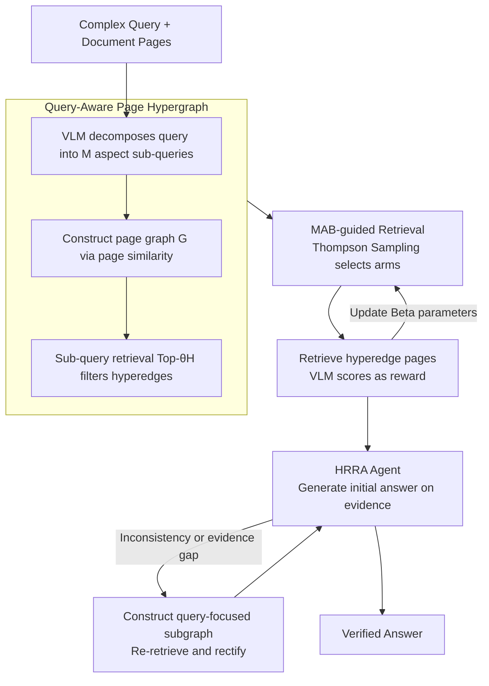

# MAB-DQA: Addressing Query Aspect Importance in Document Question Answering with Multi-Armed Bandits

**Conference**: ACL 2026  
**arXiv**: [2604.08952](https://arxiv.org/abs/2604.08952)  
**Code**: [GitHub](https://github.com/ElephantOH/MAB-DQA)  
**Area**: Document Question Answering and Information Retrieval  
**Keywords**: Document Visual Question Answering, Multi-Armed Bandits, Query Decomposition, Multimodal RAG, Hypergraph Reasoning

## TL;DR

The MAB-DQA framework is proposed to decompose complex queries into multiple aspect sub-queries and utilize a Multi-Armed Bandit mechanism (Thompson Sampling) to dynamically evaluate the importance of each aspect and reallocate the retrieval budget. This significantly improves retrieval precision and response accuracy in multimodal document question answering.

## Background & Motivation

- **Background**: Document Question Answering (DQA) requires AI to generate answers from documents based on user queries and stands as a core task in document understanding. State-of-the-art methods (e.g., ColPali, MoloRAG) adopt a vision-query Late Interaction paradigm, calculating similarity scores by summing the maximum dot products between query tokens and document image patches.
- **Limitations of Prior Work**: The "max-pooling + summation" operation in Late Interaction assigns equal weight to all query tokens, failing to distinguish the importance of different query aspects as humans do. This causes low-importance but high-frequency keywords (e.g., company names like "Best Buy") to generate high spurious similarity on irrelevant pages, while pages containing crucial evidence are ranked lower.
- **Key Challenge**: Multimodal RAG typically retains only a few candidate pages (e.g., Top-4), leading to the omission of high-information content with low visual salience. Statistical analysis by the authors reveals that 19.8% of samples in MMLongBench and 27.8% in LongDocURL exhibit retrieval errors due to ignoring key query conditions.
- **Goal**: Explicitly model the varying importance of multiple implicit aspects within a query and dynamically allocate retrieval attention to prioritize evidence pages containing critical information.
- **Key Insight**: Each sub-query is treated as an "arm" of a Multi-Armed Bandit (MAB). Using initial reasoning feedback from a VLM as a reward signal, an exploration-exploitation strategy is employed to adaptively allocate the retrieval budget to high-value aspects.
- **Core Idea**: A three-stage progressive document QA process featuring query decomposition, Thompson Sampling-driven dynamic retrieval budget allocation, and hypergraph reflective reasoning.

## Method

### Overall Architecture

MAB-DQA is an inference-time three-stage pipeline centered on learning "which query aspect is more important" online through a Multi-Armed Bandit. Given a query and document pages, it first decomposes the original query into multiple aspect sub-queries and organizes them with pages into a hypergraph. Then, it uses Thompson Sampling to dynamically allocate the retrieval budget among aspects (arms), prioritizing computation on high-information aspects to extract key evidence pages. Finally, a Hypergraph Reflective Reasoning Agent (HRRA) generates and self-verifies answers based on the evidence. From "complex query + full document" input to "verified answer" output, the entire chain revolves around reallocating retrieval attention based on aspect importance.

### Key Designs

**1. Query-Aware Page Hypergraph: Using hyperedges to express "one aspect associated with a set of pages"**

Ordinary graphs only connect page pairs and cannot represent group relationships where a query aspect involves a cluster of pages. MAB-DQA first constructs a query-independent page graph $G$ based on inter-page similarity. Then, a VLM decomposes the original query $q$ into $M$ aspect sub-queries $\{q_1,\dots,q_M\}$. For each sub-query, a candidate set $C_j$ is retrieved from Top-$\theta_H$ pages, from which pages ranked higher under the sub-query than the global query are filtered to form the hyperedge $\hat{E}_j$. The final hypergraph $H = (V_G, \{\hat{E}_j\} \cup E_G)$ carries both inter-page edges and aspect hyperedges, allowing subsequent retrieval to schedule page groups by "aspect".

**2. MAB-guided Retrieval: Allocating retrieval budget to high-value aspects**

The information value of different query aspects varies significantly. The equal weighting of all tokens in Late Interaction allows high-frequency, low-value keywords to inflate scores on irrelevant pages. MAB-DQA treats each sub-query $Q_j$ as an arm, maintaining a Beta$(\alpha_j, \beta_j)$ distribution. In each round, Thompson Sampling selects an arm to retrieve corresponding hyperedge pages, and the VLM provides a relevance score $s_{\text{vlm}}\in[0,1]$ as a reward to update the Beta parameters. The comprehensive score for a page $p_i$ is $\text{score}(p_i) = (1-\alpha)\cdot \max\text{LI} + \alpha\cdot s_{\text{vlm}} + \beta[(1-\lambda)\cdot h_i + \lambda\cdot \bar{s}_{\text{cb}}]$, where $\bar{s}_{\text{cb}}$ is the mean Thompson Sampling confidence of associated sub-queries. The natural balance of exploration-exploitation allows the budget to flow adaptively to truly important aspects.

**3. Hypergraph Reflective Reasoning Agent (HRRA): Multi-stage verification to prevent hallucinations**

Single-pass generation is prone to missing information or fabricating answers. Therefore, an "initial answer—verification—optimization" reflection loop is appended. It generates an initial answer using retrieved evidence pages; if internal inconsistencies or evidence gaps are detected, it builds a query-focused subgraph on the hypergraph to re-retrieve and rectify. This multi-stage verification acts as a safeguard, ensuring retrieval gains translate into answering accuracy.

### Loss & Training

The framework is an inference-time method and does not involve model training. The Beta distribution of the arms is updated online as:
$$(\alpha_j, \beta_j) \leftarrow (\alpha_j + s_{\text{vlm}}, \beta_j + 1 - s_{\text{vlm}})$$
Key hyperparameters: $\alpha=0.8$ (VLM evaluation weight), $\beta=0.1$ (hypergraph term ratio), $\lambda=0.75$ (balance between page degree and arm confidence), $\theta_G=0.8$ (page graph edge threshold), $\theta_H=10$ (hyperedge capacity), $m=20$ (retrieval iterations).

## Key Experimental Results

### Main Results

| Method | MMLongBench | LongDocURL | FetaTab | PaperTab | Average |
|---|---|---|---|---|---|
| Qwen-2.5-VL-7B (Direct) | 0.204 | 0.398 | 0.350 | 0.112 | 0.266 |
| MDocAgent | 0.315 | 0.527 | 0.598 | 0.227 | 0.417 |
| MoloRAG+ | 0.372 | 0.528 | 0.600 | 0.195 | 0.424 |
| **MAB-DQA** | **0.399** | **0.564** | **0.638** | **0.269** | **0.468** |
| Gain | +7.25% | +5.22% | +6.33% | +18.50% | +10.38% |

Retrieval Performance (Top-3, MMLongBench): MAB-DQA outperforms MoloRAG and MoloRAG+ across Recall (69.53), Precision (34.32), NDCG (41.05), and MRR (72.94).

### Ablation Study

| Variant | MMLongBench | LongDocURL | FetaTab | PaperTab | Avg. Gain |
|---|---|---|---|---|---|
| Colpali (Baseline) | 0.296 | 0.554 | 0.537 | 0.152 | 0.0% |
| + MABR | 0.388 | 0.543 | 0.609 | 0.226 | +22.8% |
| + HRRA | 0.395 | 0.561 | 0.624 | 0.236 | +26.5% |
| MAB-DQA (Full) | 0.399 | 0.564 | 0.638 | 0.269 | +33.1% |

### Key Findings

- **Significant Variance in Query Aspect Importance**: Approximately 20-28% of samples exhibit retrieval errors due to ignored key conditions, proving systematic flaws in uniformly weighted Late Interaction.
- **Highest Improvement in PaperTab (+18.5%)**: Tasks involving document structure and table understanding benefit most from aspect-aware retrieval.
- **Complementarity of MABR and HRRA**: MABR provides adaptive retrieval focusing on key aspects (+22.8%), while HRRA further corrects errors through reflection (+26.5%). Their joint use achieves a +33.1% improvement.
- **Generality across VLM backbones**: Consistent improvements are observed using Qwen2.5-VL-7B, LLaVa-13B, Qwen3-30B, and Qwen3-32B.

## Highlights & Insights

- **Precise Problem Definition**: The paper clearly characterizes the neglected issue of "uniform query aspect weights" in Late Interaction, supported by visualization heatmaps and statistical data (Issue column).
- **Clever MAB Modeling**: Estimating query aspect importance is transformed into a Multi-Armed Bandit problem, where the exploration-exploitation balance of Thompson Sampling naturally fits retrieval scenarios.
- **Inference-time Method, No Training Required**: The entire framework runs at inference time without requiring additional training data or fine-tuning, making it plug-and-play.
- **Hypergraph Modeling of Page-Aspect Relations**: This approach represents "one aspect associated with a group of pages" better than ordinary graphs.

## Limitations & Future Work

- Strong dependency on the underlying VLM's capability—performance may be limited if the VLM performs poorly in specialized domains (legal, medical, etc.).
- Multiple hyperparameters ($\alpha, \beta, \lambda, \theta_G, \theta_H, m$) are currently selected via grid search; the authors plan to introduce Bayesian optimization for auto-tuning.
- Only Thompson Sampling is used; other bandit strategies like UCB or $\epsilon$-Greedy have not been compared.
- Retrieval time complexity is $O(m \cdot T_{VLM})$, where VLM calls scale linearly with iterations, potentially creating a bottleneck for large-scale documents.

## Related Work & Insights

- **ColPali (Faysse et al., 2024)**: A vision-language embedding model serving as the retrieval backbone for this work.
- **MoloRAG (Wu et al., 2025)**: Also uses graph structures and VLM evaluation for multimodal DQA; it is the strongest baseline but uses a fixed retrieval budget and ignores aspect importance.
- **MBA-RAG (Tang et al., 2025)**: Also utilizes MAB but for unimodal tasks, selecting retrieval strategies rather than query aspects.
- **GraphRAG (Edge et al., 2025)**: Representative work for graph-enhanced RAG; MAB-DQA further introduces hypergraphs and dynamic budget allocation.
- The aspect-aware retrieval concept in this paper can be extended to general multimodal RAG scenarios.

## Rating

- Novelty: ⭐⭐⭐⭐ Introducing MAB for query aspect importance modeling is a novel perspective, and the hypergraph construction is unique.
- Experimental Thoroughness: ⭐⭐⭐⭐ Comprehensive evaluation across 4 benchmarks, multiple baselines, ablation studies, sensitivity analysis, and cross-VLM validation.
- Writing Quality: ⭐⭐⭐⭐ Clear illustrations, well-argued motivation, and convincing visual case studies.
- Value: ⭐⭐⭐⭐ Practical as an inference-time, training-free, and plug-and-play method.

<!-- RELATED:START -->

## Related Papers

- [\[ACL 2026\] DQA: Diagnostic Question Answering for IT Support](dqa_diagnostic_question_answering_for_it_support.md)
- [\[ACL 2026\] Context Attribution with Multi-Armed Bandit Optimization](context_attribution_with_multi-armed_bandit_optimization.md)
- [\[ACL 2026\] FinRAG-12B: A Production-Validated Recipe for Grounded Question Answering in Banking](finrag-12b_a_production-validated_recipe_for_grounded_question_answering_in_bank.md)
- [\[ACL 2026\] ChatR1: Reinforcement Learning for Conversational Reasoning and Retrieval Augmented Question Answering](chatr1_reinforcement_learning_for_conversational_reasoning_and_retrieval_augment.md)
- [\[ACL 2026\] CounterRefine: Answer-Conditioned Counterevidence Retrieval for Inference-Time Knowledge Repair in Factual Question Answering](counterrefine_answer-conditioned_counterevidence_retrieval_for_inference-time_kn.md)

<!-- RELATED:END -->
