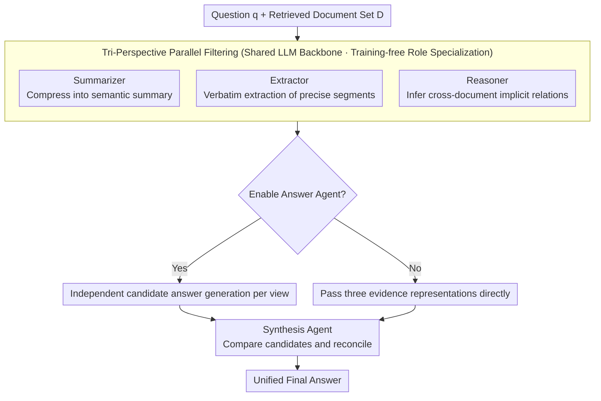

# MASS-RAG: Multi-Agent Synthesis Retrieval-Augmented Generation

**Conference**: ACL 2026 Findings  
**arXiv**: [2604.18509](https://arxiv.org/abs/2604.18509)  
**Code**: None  
**Area**: Information Retrieval / RAG  
**Keywords**: Multi-Agent RAG, Evidence Synthesis, Training-Free, Multi-View Filtering, Heterogeneous Evidence Fusion

## TL;DR

This paper proposes MASS-RAG, a training-free multi-agent synthesis RAG framework. It processes retrieved documents from complementary perspectives via three specialized filtering agents (Summarizer/Extractor/Reasoner) and integrates multi-view evidence or candidate answers through a Synthesis Agent, consistently outperforming strong baselines across four benchmarks.

## Background & Motivation

**Background**: RAG enhances the factuality of LLMs by introducing external knowledge during inference. However, when the retrieved context is noisy, incomplete, or heterogeneous, a single generation process struggles to effectively coordinate evidence.

**Limitations of Prior Work**: (1) Existing multi-agent RAG (e.g., Chang et al. 2024) uses only a single judge agent to filter context from a single perspective, failing to capture complementary or heterogeneous factual evidence; (2) Irrelevant or redundant retrieved information degrades generation quality; (3) For questions requiring cross-document aggregation of complementary evidence, a single perspective is particularly insufficient.

**Key Challenge**: Retrieved documents may contain relevant evidence in different forms—some requiring summarization, some requiring precise extraction, and some requiring logical reasoning—a single filtering strategy cannot accommodate all these needs simultaneously.

**Goal**: Design a multi-view evidence filtering and synthesis mechanism to enable the RAG system to process and integrate retrieved documents from complementary angles.

**Key Insight**: Evidence processing is divided into three complementary perspectives: summarization (semantic compression), extraction (verbatim precise evidence), and reasoning (inferring implicit relationships), implemented through multi-agent task allocation.

**Core Idea**: Different types of questions require different types of evidence processing. MASS-RAG produces multiple evidence views through parallel agents and generates a more robust final answer through explicit comparison and integration.

## Method

### Overall Architecture

The core problem MASS-RAG addresses is that retrieved documents often hide relevant evidence in different forms: some need compression, some require verbatim citation, and some require cross-document inference. A single filtering strategy risks losing certain types of evidence. The approach decomposes the "filtering" step into three parallel agents with different perspectives, followed by an integration step by a Synthesis Agent. Given a question $q_i$ and a set of retrieved documents $D$, the framework first lets the Summarizer, Extractor, and Reasoner each produce a denoised evidence view. Optionally, an Answer Agent generates candidate answers based on each view. Finally, the Synthesis Agent compares and reconciles the three branches of evidence (or candidate answers) into a unified prediction. The entire process is training-free, with the three agents sharing the same LLM backbone, differentiated only by role-based prompts.

### Key Designs

**1. Tri-Perspective Parallel Filtering: Capturing Diverse Evidence via Complementary Angles**

Evidence requirements vary greatly across question types—factual questions need precise segments, synthesis questions need cross-document inference, and informational questions need semantic compression. A single judge agent inevitably has blind spots. MASS-RAG addresses this by assigning three roles: the Summarizer compresses retrieved documents into semantically consistent summaries $R_i^{(s)} = \mathcal{A}_{\text{sum}}(q_i, D)$, the Extractor identifies verbatim factual segments $R_i^{(e)} = \mathcal{A}_{\text{ext}}(q_i, D)$, and the Reasoner infers implicit cross-document relationships $R_i^{(r)} = \mathcal{A}_{\text{rea}}(q_i, D)$. Parallel processing ensures that if any one method identifies the correct evidence, the system will not miss key information due to an unsuitable filtering strategy.

**2. Optional Answer Agent and Synthesis Reconciliation: Converging Competing Hypotheses**

Different evidence views may be complementary or contradictory; direct concatenation can introduce noise. MASS-RAG includes an optional intermediate step: when the Answer Agent is enabled, each filtered result independently generates a candidate answer $A_i^{(j)} = \mathcal{A}_{\text{ans}}(q_i, R_i^{(j)})$, which the Synthesis Agent then explicitly compares and reconciles. When disabled, the three evidence representations are integrated directly. This choice is task-dependent-candidate answers for factual QA carry rich semantic signals where competing hypotheses are worth explicit comparison, while for multiple-choice questions, intermediate signals are limited, making skipping the step more cost-effective. This adaptability maintains robustness across different tasks.

**3. Training-free Role Specialization: Task Allocation via Prompt Constraints**

While fine-tuning each agent could differentiate them, it would sacrifice plug-and-play capability. MASS-RAG relies entirely on role-based prompting and output constraints for specialization: the Summarizer is constrained to compression, the Extractor to verbatim extraction, and the Reasoner to intermediate reasoning representations. This allows all agents to share a single LLM backbone without additional training, lowering the deployment threshold, though the strength of role differentiation is limited by the upper bounds of prompt engineering.

### A Complete Example

Consider a factual question requiring cross-document aggregation: the retriever recalls three documents $D$, where one provides background in a long paragraph, one contains precise numbers in a table, and one implies a relationship between two entities. The Summarizer condenses the background into a single sentence, the Extractor pulls the exact numbers from the table, and the Reasoner infers the chain connecting the entities. The Answer Agent provides candidate answers based on these views—perhaps two converge while one diverges. The Synthesis Agent compares them, finds that the summary and reasoning path corroborate each other, and adopts the answer consistent with the table's numbers as the final output, avoiding errors caused by missing the table or ignoring implicit relations.

### Loss & Training

A training-free framework where all agents share the same LLM backbone (Llama-3-8B and Llama-2-7B/13B are used in experiments). Differentiation is achieved solely through role prompting, involving no parameter updates.

## Key Experimental Results

### Main Results

**Accuracy across four benchmarks (Llama-3-8B + Retrieval)**

| Benchmark | Vanilla RAG | Chang et al. (Single Agent Filter) | MASS-RAG |
|-----------|-----------|------------------------|---------|
| TriviaQA | ~70 | ~72 | ~74 |
| PopQA | ~48 | ~52 | ~55 |
| ARC-C | ~60 | ~63 | ~66 |

### Key Findings

- MASS-RAG shows the greatest advantage in scenarios requiring cross-document aggregation of complementary evidence.
- The Answer Agent significantly aids factual QA (TriviaQA/PopQA) but provides less benefit for multiple-choice questions (ARC-C).
- Among the three filtering agents, the Reasoner makes the largest individual contribution, suggesting that cross-document reasoning is the primary bottleneck.

## Highlights & Insights

- The intuition of multi-view filtering is sound—different questions indeed require different evidence processing methods, and one-size-fits-all filtering can lose specific types of evidence.
- The training-free design makes the framework plug-and-play and applicable to any LLM.
- The optional Answer Agent design provides flexibility for task adaptation.

## Limitations & Future Work

- The multi-agent design increases inference costs (3x filtering + synthesis).
- All agents share the same LLM, and role differentiation is achieved only via prompting—specialization may be limited.
- No fair comparison with training-based RAG methods (e.g., Self-RAG) under equivalent conditions.
- Performance in long-context QA scenarios has not been fully verified.

## Related Work & Insights

- **vs Self-RAG**: Training-based method; MASS-RAG is training-free but increases inference overhead.
- **vs Chang et al.**: Single-agent filtering; MASS-RAG uses multiple views to mitigate the blind spots of a single perspective.
- **vs REPLUG/Self-RAG**: These focus on retrieval strategy optimization, while MASS-RAG focuses on post-retrieval evidence processing optimization.

## Rating

- Novelty: ⭐⭐⭐ The multi-agent filtering idea is valuable but not a fundamental breakthrough.
- Experimental Thoroughness: ⭐⭐⭐⭐ 4 benchmarks + ablation + multiple models, though lacking equivalent comparison with training-based methods.
- Writing Quality: ⭐⭐⭐⭐ Clear framework and well-defined motivation.
- Value: ⭐⭐⭐⭐ Provides a practical refinement for evidence processing in RAG systems.

<!-- RELATED:START -->

## Related Papers

- [\[ACL 2025\] MAIN-RAG: Multi-Agent Filtering Retrieval-Augmented Generation](../../ACL2025/information_retrieval/main-rag_multi-agent_filtering_retrieval-augmented_generation.md)
- [\[ACL 2026\] BRIEF-Pro: Universal Context Compression with Short-to-Long Synthesis for Fast and Accurate Multi-Hop Reasoning](brief-pro_universal_context_compression_with_short-to-long_synthesis_for_fast_an.md)
- [\[ACL 2026\] Feedback Adaptation for Retrieval-Augmented Generation](feedback_adaptation_for_retrieval-augmented_generation.md)
- [\[ACL 2026\] Disco-RAG: Discourse-Aware Retrieval-Augmented Generation](disco-rag_discourse-aware_retrieval-augmented_generation.md)
- [\[ACL 2026\] Language-Coupled Reinforcement Learning for Multilingual Retrieval-Augmented Generation](language-coupled_reinforcement_learning_for_multilingual_retrieval-augmented_gen.md)

<!-- RELATED:END -->
