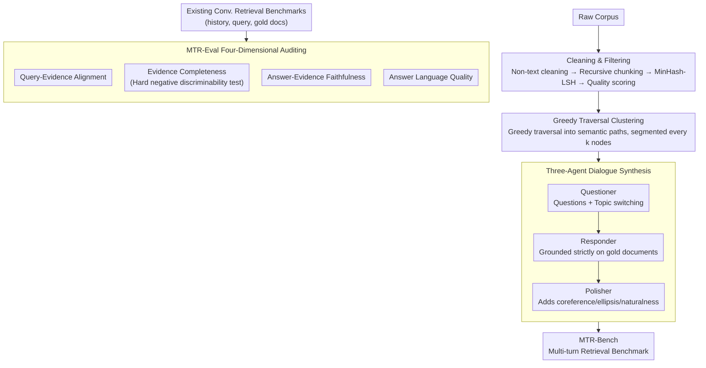

# MTR-Suite: A Framework for Evaluating and Synthesizing Conversational Retrieval Benchmarks

**Conference**: ACL 2026  
**arXiv**: [2605.20729](https://arxiv.org/abs/2605.20729)  
**Code**: https://github.com/rangehow/mtr-suite  
**Area**: Information Retrieval / Conversational Retrieval  
**Keywords**: Conversational Retrieval, RAG Evaluation, Synthetic Benchmarks, LLM-as-a-Judge, Greedy Traversal Clustering  

## TL;DR
MTR-Suite proposes a complete framework spanning from benchmark auditing and conversational data synthesis to retrieval evaluation. It utilizes MTR-Eval to diagnose annotation quality and MTR-Pipeline to generate MTR-Bench—a high-difficulty multi-turn retrieval benchmark—at approximately 1/400 of the cost of manual labor.

## Background & Motivation
**Background**: The factual upper bound of RAG is largely determined by the retrieval module. If the retriever fails to find the correct evidence, even the strongest generator cannot provide a reliable answer. As production systems transition into multi-turn conversational scenarios, conversational retrieval benchmarks have become increasingly critical.

**Limitations of Prior Work**: Human-annotated benchmarks are constrained by cognitive boundaries. Annotators typically only see local documents and find it difficult to determine whether other documents in the corpus could also answer the query, leading to annotation sparsity and false negatives. Although automated synthesis methods are cost-effective, many rely on static heuristics (e.g., rewriting Wikipedia section headers into questions), resulting in unnatural dialogues and unstable alignment between queries and gold documents.

**Key Challenge**: High-quality conversational retrieval benchmarks require a global perspective, natural language interaction, multi-turn contextual interference, and low-cost scalability. Human annotation is high-quality but expensive and local; rule-based automation is cheap but rigid and may inherit local-perspective issues.

**Goal**: To build a unified framework that can both audit the quality of query-evidence/answer-evidence in existing benchmarks and automatically synthesize multi-turn retrieval data that closely mirrors production RAG, using this data to evaluate the actual shortcomings of modern retrievers.

**Key Insight**: The paper decomposes the system into three parts: MTR-Eval for evaluating benchmark quality, MTR-Pipeline for automated synthesis, and MTR-Bench, a general-domain benchmark generated by the pipeline. The core mechanism involves LLM ensemble auditing, knowledge base cleaning, greedy traversal clustering, and three-agent dialogue generation.

**Core Idea**: Shift from local heuristics to global-aware automated annotation. Synthesis queries should not only consider a single document but also verify the uniqueness, completeness, and credibility of evidence through global candidates and hard negatives.

## Method
The methodology of MTR-Suite can be understood as "first auditing what constitutes a good benchmark, then synthesizing a benchmark according to those standards." MTR-Eval utilizes LLM-as-a-Judge to assess four categories of quality issues in existing data. MTR-Pipeline employs high-quality document snippets, semantic path clustering, and multi-agent generation to create natural multi-turn conversations. Finally, MTR-Bench stress-tests retrievers using more complex topic switching, verbose answers, and up-to-date knowledge bases.

### Overall Architecture
MTR-Eval takes a conversational retrieval benchmark as input, where each turn consists of a conversation history $H_i$, a current query $q_i$, and a gold document set $G_i$. The system evaluates whether the gold documents truly support the query, whether better evidence was missed, whether the answer is faithful to the evidence, and the linguistic quality of the answer itself.

MTR-Pipeline starts from a raw corpus, performing non-text cleaning, recursive chunking, and MinHash-LSH deduplication, followed by filtering high information density snippets using an NVIDIA quality classifier and FineWeb-EDU scorer. Subsequently, Greedy Traversal Clustering constructs continuous semantic paths in the embedding space and segments them by a fixed cluster size. Finally, three agents generate the dialogue: the Questioner simulates user questions and topic switches, the Responder generates strictly grounded answers, and the Polisher adds coreference, ellipsis, and natural expressions.

### Key Designs

**1. MTR-Eval Four-Dimensional Auditing: Quantifying benchmark annotation quality before evaluating model scores**

Achieving high recall on benchmarks with sparse annotations or high noise is meaningless—it might indicate the data is too simple or the gold annotations themselves are incomplete. MTR-Eval employs LLM-as-a-Judge to audit existing data across four dimensions: Query-Evidence Alignment checks if the gold document actually answers the query; Evidence Completeness performs discriminability testing using a hard negative pool to see if more suitable evidence was missed; Answer-Evidence Faithfulness checks if the answer is truly supported by the evidence; and Answer Quality evaluates linguistic quality separately. By auditing the benchmark first, model scores become interpretable.

**2. Greedy Traversal Clustering: Paving a semantically continuous but non-repetitive path for multi-turn dialogue**

To make synthetic dialogues progress along themes like a real user, it is necessary to organize a sequence of semantically related, non-overlapping documents. K-means / DBSCAN results in uncontrollable cluster sizes, and threshold-based neighborhood methods often lead to overlapping clusters. The paper uses greedy traversal: starting from a random point, it selects the nearest unvisited neighbor at each step to form a semantic path, then slices the path into clusters of size $k$. Each document is visited only once, and cluster size is fully controllable, simulating a user's browsing trajectory through links or topics.

**3. Three-Agent Dialogue Synthesis: Ensuring synthetic data is both grounded and human-like**

Generating dialogue with a single agent often results in rigidity or failure to maintain grounding. MTR-Pipeline splits the task among three specialized agents: the Questioner generates queries and simulates topic switches based on document clusters and history; the Responder answers strictly based on the specified gold document (ensuring strict grounding); and the Polisher rewrites the entire dialogue to include coreference, ellipsis, natural topic transitions, and production-style verbose answers. By managing these aspects separately, naturalness, evidence alignment, and controllability are achieved simultaneously. The Polisher's role is particularly significant: without it, the accuracy of humans identifying "machine-generated questions" increases from 62% to 79%.

### A Full Example: How a dialogue is synthesized
Suppose the corpus has undergone non-text cleaning, recursive chunking, and MinHash-LSH deduplication, with high-quality snippets filtered by an NVIDIA quality classifier and FineWeb-EDU scorer. Greedy Traversal Clustering starts from a point and connects a path through 8 semantically adjacent documents, segmented by cluster size. During generation, the Questioner examines the current cluster to pose the first question and switches to an adjacent topic after a few turns (averaging 8 turns and 5.6 topics per dialogue). The Responder uses only the designated gold document for the answer, ensuring every turn's answer is traceable. Finally, the Polisher rewrites the Q&A to include coreference and ellipsis to sound like a human, extending answers to production-level lengths. The entire dialogue, along with the gold document set for each turn, is saved—the cost per dialogue is approximately \$0.005, which is roughly 1/400 compared to \$1.50–\$2.00 for crowdsourced benchmarks like Doc2Dial.

### Loss & Training
This paper primarily focuses on benchmark synthesis and evaluation and does not train retrieval models. MTR-Eval uses a multi-LLM ensemble with pointwise scoring to mitigate self-preference bias and position bias. In Discriminability Testing, document order is randomized to prevent position-based cheating. The generation cost of MTR-Pipeline is estimated at \$0.005 per dialogue, compared to \$1.50–\$2.00 for crowdsourced benchmarks like Doc2Dial.

## Key Experimental Results

### Main Results
MTR-Bench is constructed based on a Wikipedia 2025-01 dump to prevent models from relying directly on old knowledge memorization. The table below shows the data scale.

| Split | # Turns | # Conversations | Tokens / Question | Tokens / Answer | Turns / Conversation | Topics / Conversation |
|-------|---------|-----------------|-------------------|-----------------|----------------------|----------------------|
| Dev | 31,896 | 3,987 | 15.32 | 87.67 | 8 | 5.59 |
| Test / MTR-Bench | 8,000 | 1,000 | 15.35 | 86.90 | 8 | 5.70 |
| Overall | 39,896 | 4,987 | 15.33 | 87.52 | 8 | 5.61 |

### Ablation Study
| Setting | Comp. | Q-E | A-E | Qual. | BGE R@5 | BGE R@20 |
|------|-------|-----|-----|-------|---------|----------|
| MTR-FINANCE | 4.50 | 4.54 | 4.70 | 4.91 | 0.37 | 0.50 |
| w/o Filter | 4.67 | 4.72 | 4.82 | 4.90 | 0.45 | 0.56 |

### Key Findings
- In main retrieval experiments, existing retrievers often achieve 90+ Recall@20 on legacy benchmarks but show a significant drop on MTR-Bench; the paper reports that the average Recall@20 of prior benchmarks is 43.54 points higher than MTR-Bench.
- Expanding the retrieval window on MTR-Bench yields limited gains: legacy benchmarks show an average improvement of 15.06 points from R@5 to R@20, whereas MTR-Bench improves by only 8.68 points, suggesting gold evidence is harder to retrieve into the candidate pool.
- Representative results show gte-modernbert-base achieves R@5 / R@20 of 50.29 / 59.31 on MTR-Bench, gte-Qwen2-7B achieves 39.75 / 53.23, and Dragon-ChatQA achieves 43.84 / 50.96.
- Extended Recall@k shows that even at $k=1000$, full recall is not reached: bge-large-en-v1.5 is 47.0, ChatQA-Context is 67.4, and gte-Qwen2-7B-instruct is 82.2.
- Oracle query rewriting yields a 20%-40% R@5 improvement, indicating that the difficulty stems primarily from dialogue complexity—coreference, ellipsis, topic switching, and verbose history—rather than the 2025 knowledge base being inherently unsearchable.

## Highlights & Insights
- The core contribution of MTR-Suite is not just "another benchmark" but the systematization of benchmark quality auditing. This explains why some datasets have high recall: it could be model strength, or simply that the data is too easy or noisy.
- Greedy Traversal Clustering is an engineered yet effective design that simultaneously addresses cluster size, repetitive sampling, and natural topic flow.
- The ablation of the Polisher is compelling: without it, human accuracy in identifying machine-generated questions rose from 62% to 79%, proving that naturalistic rewriting effectively reduces synthetic traces.
- The higher recall in the "w/o Filter" setting suggests that a benchmark isn't necessarily better because it's easier to retrieve; high-quality benchmarks should provide both reliable annotations and sufficient discriminability.

## Limitations & Future Work
- MTR-Bench specifically focuses on the retrieval component rather than end-to-end generation; this maintains diagnostic clarity but does not directly measure final answer quality.
- E2E metrics like EM and BLEU conflict with the long-answer style of real RAG; the paper opts to avoid them, but future work needs E2E evaluation capable of handling long answers, evidence chains, and factuality.
- Wikipedia is relatively clean as a primary corpus; while the paper includes internal financial validation, proprietary domains, low-resource languages, and noisy knowledge bases still require more public experimentation.
- Synthetic data relies on LLM safety alignment and prompt constraints; long-term auditing for generation bias, hallucination, and potentially sensitive content remains necessary.

## Related Work & Insights
- **vs QuAC / CoQA / Doc2Dial**: These manual or semi-manual datasets laid the foundation for multi-turn QA but suffer from human local perspective and cost issues; MTR-Suite scales through global auditing and automated generation.
- **vs CORAL**: CORAL relies on Wikipedia structural heuristics for synthesis, which can produce rigid dialogues; MTR-Pipeline uses multi-agent systems and semantic trajectories for more natural query flow.
- **vs TREC CAsT / QReCC**: These highlight conversational retrieval, but their sparse annotations and history formats may not match production RAG; MTR-Bench explicitly incorporates verbose answers and hard topic switches.
- **Insight**: Enterprise RAG systems can use MTR-Pipeline as a continuous regression testing tool, automatically generating new benchmarks after knowledge base updates to ensure the retriever keeps pace with data evolution.

## Rating
- Novelty: ⭐⭐⭐⭐☆ The combination of MTR-Eval + MTR-Pipeline + MTR-Bench is comprehensive, particularly the benchmark auditing perspective.
- Experimental Thoroughness: ⭐⭐⭐⭐☆ Includes main evaluations, industrial financial domain validation, filtering and Polisher ablations, and extended recall analysis.
- Writing Quality: ⭐⭐⭐⭐☆ Clear system structure; data design and experimental conclusions are tightly coupled.
- Value: ⭐⭐⭐⭐⭐ Highly practical for RAG retriever evaluation, automated benchmark synthesis, and regression testing for enterprise retrieval systems.

<!-- RELATED:START -->

## Related Papers

- [\[ACL 2026\] Code-Switching Information Retrieval: Benchmarks, Analysis, and the Limits of Current Retrievers](code-switching_information_retrieval_benchmarks_analysis_and_the_limits_of_curre.md)
- [\[AAAI 2026\] ConvMix: A Mixed-Criteria Data Augmentation Framework for Conversational Dense Retrieval](../../AAAI2026/information_retrieval/convmix_a_mixed-criteria_data_augmentation_framework_for_conversational_dense_re.md)
- [\[ACL 2026\] ChatR1: Reinforcement Learning for Conversational Reasoning and Retrieval Augmented Question Answering](chatr1_reinforcement_learning_for_conversational_reasoning_and_retrieval_augment.md)
- [\[ACL 2026\] RARE: Redundancy-Aware Retrieval Evaluation Framework for High-Similarity Corpora](rare_redundancy-aware_retrieval_evaluation_framework_for_high-similarity_corpora.md)
- [\[ACL 2026\] Agentic Conversational Search with Contextualized Reasoning via Reinforcement Learning](agentic_conversational_search_with_contextualized_reasoning_via_reinforcement_le.md)

<!-- RELATED:END -->
