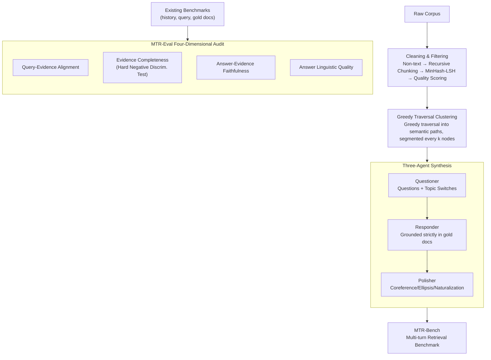

# MTR-Suite: A Framework for Evaluating and Synthesizing Conversational Retrieval Benchmarks

**Conference**: ACL 2026  
**arXiv**: [2605.20729](https://arxiv.org/abs/2605.20729)  
**Code**: https://github.com/rangehow/mtr-suite  
**Area**: Information Retrieval / Conversational Retrieval  
**Keywords**: Conversational Retrieval, RAG Evaluation, Synthetic Benchmarks, LLM-as-a-Judge, Greedy Traversal Clustering  

## TL;DR
MTR-Suite proposes a comprehensive framework spanning benchmark auditing, conversational data synthesis, and retrieval evaluation. It utilizes MTR-Eval to diagnose annotation quality and MTR-Pipeline to generate MTR-Bench—a challenging multi-turn retrieval benchmark—at approximately 1/400 of the cost of manual labor.

## Background & Motivation
**Background**: The factual upper bound of RAG is largely determined by the retrieval module. If the retriever fails to find the correct evidence, even the strongest generator cannot provide a reliable answer. As production systems enter multi-turn conversational scenarios, conversational retrieval benchmarks are becoming increasingly critical.

**Limitations of Prior Work**: Manual benchmark annotation is constrained by cognitive boundaries. Annotators typically only view local documents, making it difficult to know if other documents in the corpus could also answer the query, which leads to annotation sparsity and false negatives. While automated synthesis methods are cost-effective, many rely on static heuristics (e.g., rewriting Wikipedia section headers into questions), resulting in unnatural dialogues and unstable alignment between queries and gold documents.

**Key Challenge**: High-quality conversational retrieval benchmarks require a global perspective, natural language interaction, multi-turn contextual interference, and low-cost scalability. Manual annotation is high-quality but expensive and localized; rule-based automation is cheap but rigid and prone to inheriting "local view" issues.

**Goal**: To construct a unified framework capable of auditing the query-evidence/answer-evidence quality of existing benchmarks while automatically synthesizing multi-turn retrieval data that closely mirrors production RAG environments, subsequently evaluating the true shortcomings of modern retrievers.

**Key Insight**: The paper decomposes the system into three components: MTR-Eval for auditing benchmark quality; MTR-Pipeline for automated synthesis; and MTR-Bench, a general-domain benchmark generated using the pipeline. Core methods include LLM ensemble auditing, knowledge base cleaning, greedy traversal clustering, and three-agent dialogue generation.

**Core Idea**: Transition from local heuristics to global-aware automated annotation, ensuring that synthetic queries are not just based on a single document but are checked for uniqueness, completeness, and credibility against global candidates and hard negatives.

## Method
The methodology of MTR-Suite can be summarized as "auditing what constitutes a good benchmark first, then synthesizing benchmarks according to those standards." MTR-Eval evaluates four categories of quality issues in existing data via LLM-as-a-Judge. MTR-Pipeline utilizes high-quality document snippets, semantic path clustering, and multi-agent generation to produce natural multi-turn dialogues. Finally, MTR-Bench stress-tests retrievers using complex topic switching, verbose answers, and recent knowledge bases.

### Overall Architecture
MTR-Eval takes a conversational retrieval benchmark as input, where each turn consists of a conversation history $H_i$, a current query $q_i$, and a gold document set $G_i$. The system assesses whether the gold documents truly support the query, whether better evidence was missed, if the answer is faithful to the evidence, and the linguistic quality of the answer.

MTR-Pipeline starts from a raw corpus, performing non-text cleaning, recursive chunking, and MinHash-LSH deduplication, followed by filtering high-information snippets using an NVIDIA quality classifier and FineWeb-EDU scorer. Subsequently, Greedy Traversal Clustering constructs continuous semantic paths in the embedding space, segmented by a fixed cluster size. Finally, three agents generate the dialogue: the Questioner simulates user inquiries and topic switches; the Responder generates strictly grounded answers; and the Polisher adds coreference, ellipsis, and natural expressions.

### Key Designs

**1. MTR-Eval Four-Dimensional Audit: Quantifying Label Quality Before Model Scoring**  
Achieving high recall on benchmarks with sparse or noisy labels is meaningless; it might reflect a simple dataset rather than model capability. MTR-Eval uses LLM-as-a-Judge to audit data across four dimensions: **Query-Evidence Alignment** (does the gold document actually answer the query?), **Evidence Completeness** (discriminability testing via hard negative pools to see if better evidence was missed), **Answer-Evidence Faithfulness** (is the answer supported by evidence?), and **Answer Quality** (linguistic fluency). By auditing the benchmark itself, model scores become interpretable.

**2. Greedy Traversal Clustering: Paving a Semantically Continuous, Non-Overlapping Path**  
To ensure synthetic dialogues simulate real users browsing topics progressively, the system must organize a sequence of semantically related, non-duplicate documents. While K-means or DBSCAN have uncontrollable cluster sizes and threshold-based methods often cause overlapping clusters, this paper uses **Greedy Traversal**: starting from a random point, each step selects the nearest unvisited neighbor to form a semantic path, which is then sliced into clusters of size $k$. This ensures each document is visited once and cluster size is strictly controlled, mimicking a user's browsing trajectory through links or topics.

**3. Three-Agent Dialogue Synthesis: Balancing Grounding and Human-like Interaction**  
Single-agent generation often results in either rigid or ungrounded dialogue. MTR-Pipeline splits the task among three specialized agents: the **Questioner** generates queries and simulates topic switches based on document clusters and history; the **Responder** answers strictly based on the assigned gold documents (ensuring strict grounding); and the **Polisher** rewrites the entire dialogue to include coreference, ellipsis, natural transitions, and production-style verbose answers. The Polisher is crucial: removing it increases the human accuracy of identifying "machine-generated questions" from 62% to 79%.

### A Complete Example: How a Dialogue is Synthesized
Suppose a corpus has undergone cleaning, chunking, and quality filtering. Greedy Traversal Clustering starts from a seed and connects 8 semantically adjacent documents, slicing them into segments. During generation, the Questioner poses the first question based on the current cluster, switching topics after a few turns (averaging 8 turns across roughly 5.6 topics per dialogue). The Responder answers using only the designated gold documents to ensure traceability. Finally, the Polisher rewrites the exchange to sound like a human with coreferences. Each dialogue costs approximately \$0.005, which is roughly 1/400 of the cost of crowdsourced benchmarks like Doc2Dial (\$1.50–\$2.00).

### Loss & Training
This paper primarily focuses on benchmark synthesis and evaluation and does not involve training retrieval models. MTR-Eval utilizes a multi-LLM ensemble with pointwise scoring to mitigate self-preference and position bias. In Discriminability Testing, document order is randomized to prevent position-based "cheating."

## Key Experimental Results

### Main Results
MTR-Bench is constructed using the Wikipedia 2025-01 dump to prevent models from relying on old memorized knowledge. The table below shows the data scale:

| Split | # Turns | # Conversations | Tokens / Question | Tokens / Answer | Turns / Conversation | Topics / Conversation |
|-------|---------|-----------------|-------------------|-----------------|----------------------|----------------------|
| Dev | 31,896 | 3,987 | 15.32 | 87.67 | 8 | 5.59 |
| Test / MTR-Bench | 8,000 | 1,000 | 15.35 | 86.90 | 8 | 5.70 |
| Overall | 39,896 | 4,987 | 15.33 | 87.52 | 8 | 5.61 |

### Ablation Study

| Setting | Comp. | Q-E | A-E | Qual. | BGE R@5 | BGE R@20 |
|------|-------|-----|-----|-------|---------|----------|
| MTR-FINANCE | 4.50 | 4.54 | 4.70 | 4.91 | 0.37 | 0.50 |
| w/o Filter | 4.67 | 4.72 | 4.82 | 4.90 | 0.45 | 0.56 |

### Key Findings
- In main retrieval experiments, existing retrievers often achieve 90+ Recall@20 on legacy benchmarks but show a significant performance drop on MTR-Bench. The average Recall@20 on prior benchmarks is 43.54 points higher than on MTR-Bench.
- Expanding the retrieval window provides limited gains on MTR-Bench: while legacy benchmarks see an average gain of 15.06 points from R@5 to R@20, MTR-Bench only improves by 8.68 points, indicating gold evidence is harder to retrieve even in larger candidate sets.
- Representative results: `gte-modernbert-base` scores 50.29 / 59.31 (R@5 / R@20) on MTR-Bench; `gte-Qwen2-7B` scores 39.75 / 53.23; `Dragon-ChatQA` scores 43.84 / 50.96.
- Extended Recall@k shows that even at $k=1000$, full recall is not achieved: `bge-large-en-v1.5` hits 47.0, `ChatQA-Context` hits 67.4, and `gte-Qwen2-7B-instruct` hits 82.2.
- Oracle query rewriting yields a 20%-40% R@5 improvement, suggesting that the difficulty stems from linguistic complexity (coreference, ellipsis, topic switching) rather than the 2025 knowledge base being inherently unsearchable.

## Highlights & Insights
- The core contribution of MTR-Suite is not just "another benchmark" but the systematization of benchmark quality auditing. This explains whether high recall is due to model strength, dataset simplicity, or noisy labels.
- Greedy Traversal Clustering is an engineered yet effective design that simultaneously solves cluster size, duplicate sampling, and natural topic flow.
- The Polisher ablation is compelling: without it, human detection of machine-generated questions jumps from 62% to 79%, proving that naturalistic rewriting successfully masks synthetic artifacts.
- The "w/o Filter" results show higher recall but a "easier" benchmark, suggesting that a high-quality evaluation set should provide reliable labels alongside sufficient discriminative difficulty.

## Limitations & Future Work
- MTR-Bench explicitly focuses on the retrieval component rather than end-to-end generation; while this ensures diagnostic clarity, it does not directly measure the final answer quality.
- E2E metrics like EM or BLEU conflict with the long-form answer style of modern RAG; the paper avoids them, but future work needs metrics capable of handling long answers and complex evidence chains.
- Wikipedia is relatively clean. Although the paper validates on internal financial data, specialized domains, low-resource languages, and noisy knowledge bases require more public experimentation.
- Synthetic data remains dependent on LLM safety alignment and prompt constraints, requiring ongoing audits for generation bias or hallucinations.

## Related Work & Insights
- **vs. QuAC / CoQA / Doc2Dial**: These manual datasets laid the foundation for multi-turn QA but suffer from local-view bias and high costs. MTR-Suite scales this via global auditing and automation.
- **vs. CORAL**: CORAL relies on Wikipedia-structured heuristics, leading to rigid dialogues. MTR-Pipeline uses multi-agent generation and semantic trajectories for more natural query flow.
- **vs. TREC CAsT / QReCC**: These emphasize conversational retrieval but may feature sparse annotations or history formats that do not match production RAG. MTR-Bench explicitly incorporates verbose answers and hard topic switches.
- **Inspiration**: Enterprise RAG systems can utilize MTR-Pipeline for continuous regression testing, auto-generating benchmarks after knowledge base updates to ensure the retriever adapts to data evolution.

## Rating
- Novelty: ⭐⭐⭐⭐☆ The combination of MTR-Eval, MTR-Pipeline, and MTR-Bench is comprehensive, particularly the audit perspective.
- Experimental Thoroughness: ⭐⭐⭐⭐☆ Includes main evaluations, industrial domain validation, filter/Polisher ablations, and extended recall analysis.
- Writing Quality: ⭐⭐⭐⭐☆ Clear structure with strong alignment between design choices and experimental conclusions.
- Value: ⭐⭐⭐⭐⭐ Highly practical for RAG retriever evaluation, automated synthesis, and enterprise regression testing.

<!-- RELATED:START -->

## Related Papers

- [\[AAAI 2026\] ConvMix: A Mixed-Criteria Data Augmentation Framework for Conversational Dense Retrieval](../../AAAI2026/information_retrieval/convmix_a_mixed-criteria_data_augmentation_framework_for_conversational_dense_re.md)
- [\[ACL 2026\] Code-Switching Information Retrieval: Benchmarks, Analysis, and the Limits of Current Retrievers](code-switching_information_retrieval_benchmarks_analysis_and_the_limits_of_curre.md)
- [\[ACL 2026\] ChatR1: Reinforcement Learning for Conversational Reasoning and Retrieval Augmented Question Answering](chatr1_reinforcement_learning_for_conversational_reasoning_and_retrieval_augment.md)
- [\[ACL 2026\] RARE: Redundancy-Aware Retrieval Evaluation Framework for High-Similarity Corpora](rare_redundancy-aware_retrieval_evaluation_framework_for_high-similarity_corpora.md)
- [\[ACL 2026\] Agentic Conversational Search with Contextualized Reasoning via Reinforcement Learning](agentic_conversational_search_with_contextualized_reasoning_via_reinforcement_le.md)

<!-- RELATED:END -->
