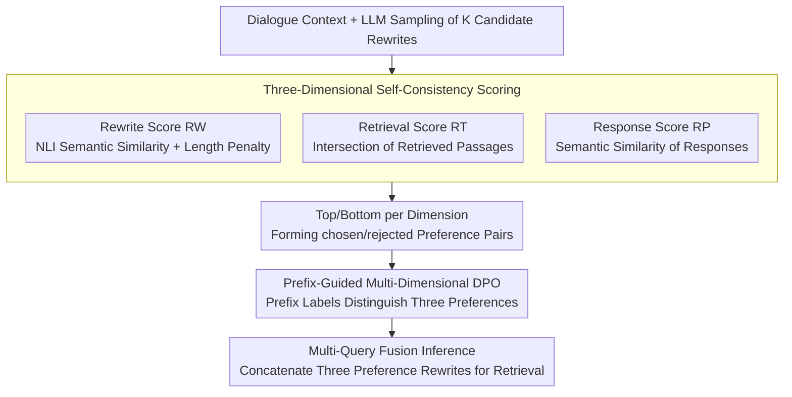

# Multi-Faceted Self-Consistent Preference Alignment for Query Rewriting in Conversational Search

**Conference**: ACL 2026 Findings  
**arXiv**: [2604.06771](https://arxiv.org/abs/2604.06771)  
**Code**: None  
**Area**: Information Retrieval  
**Keywords**: Conversational Query Rewriting, Preference Alignment, Self-Consistency Scoring, Multi-Dimensional DPO, Conversational Search

## TL;DR

This paper proposes MSPA-CQR, which constructs self-consistent preference data from three dimensions—rewriting, retrieval, and response—and trains the query rewriting model using prefix-guided multi-dimensional DPO. It significantly outperforms existing methods in both in-distribution and out-of-distribution scenarios.

## Background & Motivation

**Background**: In Conversational Question Answering (CQA), user queries are often ambiguous (e.g., unclear references, omitted keywords). Conversational Query Rewriting (CQR) is required to transform these vague queries into complete, self-contained versions to assist downstream retrieval. Early methods relied on human-annotated rewrites as training targets, but such labels are expensive and often optimize only for readability rather than directly aiding retrieval.

**Limitations of Prior Work**: Recent studies have introduced retrieval signals as feedback, but two issues remain: (1) only retrieval-dimensional preferences are considered, ignoring feedback from rewrite and response quality; (2) construction of preference data depends on human-annotated gold passages, preventing scalability to unannotated data.

**Key Challenge**: A high-quality rewritten query should simultaneously satisfy three requirements: the rewrite itself must be self-contained; the retrieval process should include key information while avoiding redundancy; and the corresponding response must be reasonable and accurate. Differences exist across these three dimensions (Kendall-Tau correlation is only 0.36-0.58), and alignment on a single dimension cannot account for the others.

**Goal**: (1) Construct multi-dimensional preference data without relying on human annotations; (2) design an optimization method capable of learning preferences from rewriting, retrieval, and response dimensions simultaneously.

**Key Insight**: Inspired by self-consistency strategies, if multiple rewriting results are semantically highly consistent, these rewrites are more reliable. The authors designed three different self-consistency scoring methods based on this to measure rewrite quality.

**Core Idea**: Use LLMs to sample multiple candidate rewrites and score/rank them from three perspectives: rewrite semantic consistency, retrieval result intersection, and response semantic consistency. After constructing multi-dimensional preference pairs, the model is trained via prefix-guided MDPO to generate optimal rewrites under different preference labels.

## Method

### Overall Architecture

MSPA-CQR addresses the need for conversational rewrites to be self-contained, retrieval-friendly, and response-oriented. Since ranking preferences across these dimensions differ significantly (Kendall-Tau as low as 0.36), single-dimension alignment leads to interference. Unlike prior methods, MSPA-CQR does not rely on gold passages. The process consists of two stages: first, sampling $K$ candidate rewrites for each conversation using an LLM and performing self-consistency scoring across the three dimensions to select chosen/rejected pairs; second, training the model via prefix-guided multi-dimensional DPO to enable it to generate optimal rewrites for each preference tag. During inference, three preference-oriented rewrites are generated and concatenated for the retrieval system.

### Key Designs

**1. Three-Dimensional Self-Consistency Scoring: Replacing Human Annotation with Sampling Consistency**

To construct preference data without gold passages, the authors leverage the idea that highly consistent rewrites are more reliable. For $K$ candidate rewrites $\{rq_i\}$, the rewrite score $RW_i$ is calculated using an NLI model to measure average semantic similarity against other candidates with a length penalty to ensure self-containment. The retrieval score $RT_i$ measures the average intersection size of retrieved passages, evaluating the capture of key information. The response score $RP_i$ uses NLI to calculate the average semantic similarity between generated responses to measure answer-orientation. Each dimension selects the highest and lowest scoring rewrites as chosen and rejected samples. These scores characterize quality from different angles without human labeling, making them applicable to any unannotated dialogue data.

**2. Prefix-Guided Multi-Dimensional DPO: Distinguishing Preferences in One Model**

Given the significant ranking differences between dimensions (minimum Kendall-Tau of 0.36), mixing them in training would cause interference, yet training three separate models is computationally expensive. MSPA-CQR defines a prefix label set $V = \{[\text{REWRITE}], [\text{RETRIEVAL}], [\text{RESPONSE}]\}$ prefixed to the input. The training objective follows the standard DPO format $\mathcal{L}_{MDPO} = -\mathbb{E}[\log \sigma(\hat{r}_\theta(pr,x,rq^+) - \hat{r}_\theta(pr,x,rq^-))]$, using the prefix $pr$ to distinguish dimensions. This allows a single model to adapt to three preferences efficiently.

**3. Multi-Query Fusion Inference: Concatenating Preferences for Comprehensive Retrieval**

Different preference-oriented rewrites emphasize different aspects: self-containment completes references, retrieval-orientation highlights keywords, and response-orientation aligns with answers. MSPA-CQR generates three rewritten queries using the three preference prefixes and concatenates them into a single long query. This functions similarly to query expansion, covering all three requirements effectively.

## Key Experimental Results

### Main Results

| Dataset | Retriever | Metric | Ours | Prev. SOTA (RETPO) | Gain |
|--------|--------|------|----------|------------------|------|
| TopiOCQA | BM25 | MRR | 30.6 | 28.3 | +2.3 |
| TopiOCQA | BM25 | R@100 | 75.2 | 73.1 | +2.1 |
| QReCC | BM25 | MRR | 57.4 | 50.0 | +7.4 |
| QReCC | BM25 | R@100 | 95.2 | 89.5 | +5.7 |
| TopiOCQA | ANCE | MRR | 41.4 | 30.0 | +11.4 |
| QReCC | ANCE | R@10 | 72.3 | 66.7 | +5.6 |

### Ablation Study

| Configuration | TopiOCQA MRR | QReCC MRR | Description |
|------|-------------|-----------|------|
| Full MSPA-CQR | 30.6 | 57.4 | Complete model |
| w/o Retrieval Pref | Decrease | Decrease | Removed retrieval preference |
| w/o Response Pref | Decrease | Decrease | Removed response preference |
| w/o Rewrite Pref | Decrease | Decrease | Removed rewrite preference |
| Single Pref (Ret. only) | ~28.3 | ~50.0 | Degenerates to RETPO-like |

### Key Findings

- There are significant differences between preference dimensions: the Kendall-Tau between rewrite and retrieval on TopiOCQA is only 0.36, indicating that a single preference cannot represent multi-dimensional alignment.
- MSPA-CQR performs robustly in OOD (Out-Of-Distribution) cross-dataset scenarios, proving that multi-dimensional alignment improves generalization.
- Improvement is more pronounced in dense retrieval (ANCE) scenarios (MRR gain of 11.4), suggesting multi-dimensional rewriting is highly beneficial for semantic matching.

## Highlights & Insights

- **Self-Consistency Scoring replaces human labels**: Leveraging the consistency of multiple samplings to measure rewrite quality avoids dependency on gold passages, allowing the method to scale to any unannotated data.
- **Prefix-controlled multi-preference learning**: Using simple prefix labels enables a single model to distinguish three preferences, which is more efficient than three independent models and allows flexible combination during inference.
- **Triple-query fusion retrieval**: Generating and concatenating three preference-oriented rewrites acts effectively as query expansion, capturing comprehensive search requirements.

## Limitations & Future Work

- Generating and concatenating three rewritten queries increases query length and retrieval latency.
- Evaluation was limited to English datasets (TopiOCQA, QReCC); multilingual scenarios remain unexplored.
- The cost of LLM sampling for candidate rewrites is high, making computational overhead during the preference data construction phase non-negligible.
- Dynamic weighting of the three preference dimensions, rather than simple concatenation, could be explored.

## Related Work & Insights

- **vs RETPO**: RETPO uses only retrieval preferences for DPO alignment and relies on gold passages. MSPA-CQR extends to three dimensions and uses self-consistency instead of human labels.
- **vs IterCQR**: IterCQR uses reinforcement learning with retrieval signals, but the signal is singular. MSPA-CQR provides richer training signals through multi-dimensional feedback.
- **vs AdaCQR**: AdaCQR is based on T5 for adaptive rewriting, whereas MSPA-CQR utilizes LLaMA-2-7B and achieves stronger generalization through preference alignment.

## Rating

- Novelty: ⭐⭐⭐⭐ The concept of three-dimensional self-consistent preference alignment is novel, though the core techniques (DPO + prefix control) are established.
- Experimental Thoroughness: ⭐⭐⭐⭐ Covers two major datasets, sparse/dense retrieval, and OOD evaluation, though ablation details could be more exhaustive.
- Writing Quality: ⭐⭐⭐⭐ Clear motivation and comprehensive method descriptions.
- Value: ⭐⭐⭐⭐ Actual progress in the CQR field; the self-consistency scoring approach is transferable to other preference alignment scenarios.

<!-- RELATED:START -->

## Related Papers

- [\[ACL 2026\] Agentic Conversational Search with Contextualized Reasoning via Reinforcement Learning](agentic_conversational_search_with_contextualized_reasoning_via_reinforcement_le.md)
- [\[ACL 2026\] Enhancing Multilingual RAG Systems with Debiased Language Preference-Guided Query Fusion](enhancing_multilingual_rag_systems_with_debiased_language_preference-guided_quer.md)
- [\[AAAI 2026\] ReFeed: Retrieval Feedback-Guided Dataset Construction for Style-Aware Query Rewriting](../../AAAI2026/information_retrieval/refeed_retrieval_feedback-guided_dataset_construction_for_style-aware_query_rewr.md)
- [\[ICML 2026\] ReSeek: A Self-Correcting Framework for Search Agents with Instructive Rewards](../../ICML2026/information_retrieval/reseek_a_self-correcting_framework_for_search_agents_with_instructive_rewards.md)
- [\[ACL 2025\] GainRAG: Preference Alignment in Retrieval-Augmented Generation through Gain Signal Synthesis](../../ACL2025/information_retrieval/gainrag_preference_alignment.md)

<!-- RELATED:END -->
