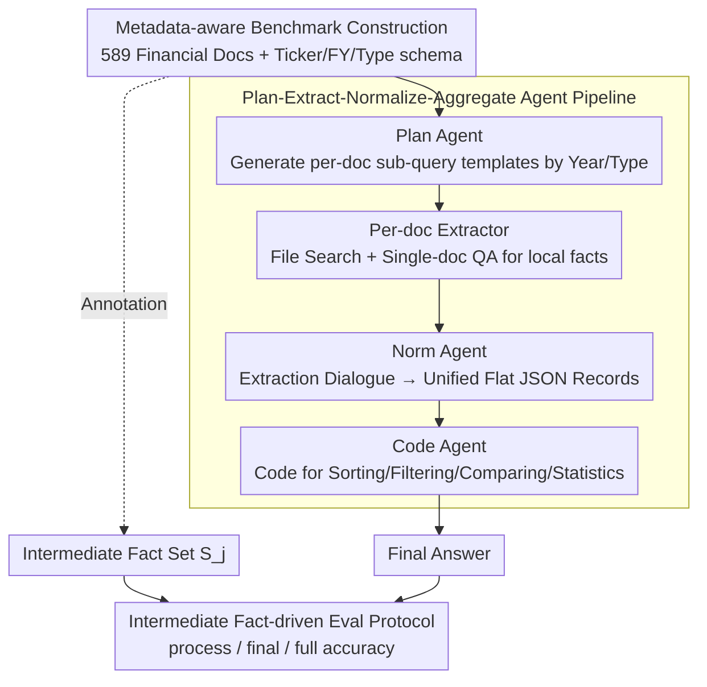

# Navigating Large-Scale Document Collections: MuDABench for Multi-Document Analytical QA

**Conference**: ACL2026 Findings  
**arXiv**: [2604.22239](https://arxiv.org/abs/2604.22239)  
**Code**: https://github.com/Zhanli-Li/MuDABench  
**Area**: Information Retrieval / Multi-Document QA / Document Intelligence  
**Keywords**: Multi-Document Analytical QA, RAG Evaluation, Financial Documents, Metadata Planning, Agent Workflow

## TL;DR
This paper introduces MuDABench, shifting multi-document QA from "finding relevant snippets" to "extraction, aggregation, and quantitative analysis over large-scale semi-structured collections." It demonstrates that vanilla RAG struggle even with increased recall, while metadata-aware multi-agent workflows significantly improve results but still trail human experts.

## Background & Motivation
**Background**: In current corporate knowledge bases, web QA, and document systems, the dominant paradigm is RAG: segmenting documents into chunks, retrieving relevant snippets from a flat corpus pool, and generating answers within a single context window. Existing datasets like HotpotQA, 2WikiMultiHopQA, MuSiQue, and FanOutQA follow this multi-hop setting, while long-context benchmarks focus on architectural capacity to fit larger inputs.

**Limitations of Prior Work**: Real-world multi-doc analysis is often not about "finding evidence sentences" but "treating a document collection as a semi-structured database." For example, if regulators want to know which companies changed accounting firms in 2024, they must filter reports by company and year, extract specific fields per document, align 2023 vs 2024 records, and aggregate the list. Missing one report, misreading a table, or confusing years leads to incorrect conclusions.

**Key Challenge**: Existing benchmarks mostly involve a few web pages, focusing on cross-entity reasoning. Financial benchmarks like FinanceBench focus on single-doc QA, and FinAgentBench emphasizes retrieval positioning. Systems research (e.g., Aryn, DocETL) discusses multi-step pipelines but lacks public large-scale benchmarks. Current evaluations fail to place the full chain of "large collections + explicit metadata + single-doc extraction + cross-doc aggregation + numerical analysis" onto model systems.

**Goal**: The authors aim to define a task closer to institutional analysis: given a collection with metadata and a natural language query, the system must identify relevant documents, extract facts, structure them, perform operations (sorting, comparison, variance, growth rates), and provide the final answer.

**Key Insight**: Utilize the correspondence between public financial disclosures and authoritative financial databases for distant supervision. Databases provide verifiable ground truth metrics, while PDF disclosures provide noise, long contexts, tables, and cross-year history. Experts then translate structured metrics into natural language intermediate facts and question templates.

**Core Idea**: Construct a multi-doc analytical QA benchmark using "financial collections + metadata + intermediate facts," and replace flat RAG with a "Plan-Extract-Normalize-Aggregate" Agent workflow.

## Method
MuDABench serves as both a benchmark and a reference solution. The dataset emphasizes organizing disclosures into evaluable tasks, while the method demonstrates why vanilla RAG is insufficient and how a structured multi-agent pipeline operates.

### Overall Architecture

MuDABench characterizes tasks ignored by current benchmarks: analyzing large collections of metadata-tagged documents as semi-structured databases. The system must narrow the scope by entity/year/type, extract facts per document, align structures, and execute calculations. Input consists of question $Q_j$, document collection $D_j$, and metadata $M_j$, with annotated intermediate facts $S_j$. Evaluation $X = \{(Q_j, D_j, M_j, S_j)\}$ checks both the final answer and locates the specific failure point in the extraction chain.

### Key Designs

**1. Metadata-aware Construction: Collections as Databases, Not Text Chunks**

Real doc-sets naturally have metadata; ignoring this causes RAG to blindly retrieve from massive pools. MuDABench collects 589 docs (>80,000 pages) from cninfo and SEC (A-share/US firms), including annual reports, ESG reports, and announcements. Each doc is bound to Ticker, Fiscal Year, and Type. Questions involve an average of 14.8 PDFs and 149.7 pages. Queries like "top 3 companies by revenue growth 2022–2023" require filtering by schema before extraction can begin.

**2. Intermediate Fact-driven Protocol: Verifying the Extraction Chain**

In multi-doc analysis, final answers might be correct by chance despite faulty extraction. Using distant supervision, MuDABench maps database metrics to natural language intermediate facts $S_j$. Evaluation includes: for RAG, LLM-as-judge checks coverage of gold supporting facts using double-check logic; for workflows, metric cells in the aligned table are used as evaluation units. Reporting process, final-answer, and full accuracy distinguishes between retrieval, extraction, and calculation failures.

**3. Plan-Extract-Normalize-Aggregate Pipeline: Structured Flow for Super-context Sets**

Processing dozens of documents at once leads to entity/year confusion. The reference workflow splits the task: the **Plan Agent** uses the schema to generate per-doc templates; the **Document-Level Extractor** instantiates templates via single-doc QA; the **Norm Agent** defines a flat JSON schema from few-shot examples to unify dialogues; and the **Code Agent** generates executable Python to perform analysis on the structured data. This separation makes numerical analysis scalable and controllable.

### Loss & Training
The study proposes a benchmark and workflow rather than training a new model. Baselines utilize OpenAI File Search with GPT-4o. In the workflow, Planning and Code generation use DeepSeek-R1-0528, Normalization uses DeepSeek-Chat-V3-0324, and Single-doc QA relies on OpenAI File Search. Temperatures are set to 0 for reproducibility.

## Key Experimental Results

### Main Results
Table 1 summarizes MuDABench results across Simple and Complex questions (process / final / full accuracy). Vanilla RAG fails even when increasing chunks to $2.5|D|$. The workflow achieves significantly higher process coverage but still trails human experts on complex queries.

| System Configuration | Simple Process | Simple Final | Simple Full | Complex Process | Complex Final | Complex Full |
|----------|-------------|-------------|-------------|--------------|--------------|--------------|
| GPT-4o RAG, chunk = $1|D|$ | 0.1572 | 0.0663 | 0.0241 | 0.1459 | 0.0482 | 0.0181 |
| GPT-4o RAG, chunk = $2|D|$ | 0.1793 | 0.1265 | 0.0422 | 0.2212 | 0.0361 | 0.0181 |
| GPT-4o RAG + metadata, chunk = $2.5|D|$ | 0.2514 | 0.1325 | 0.0542 | 0.2522 | 0.0422 | 0.0120 |
| WF + GPT-4o, chunk = 1 | 0.4179 | 0.0667 | 0.0000 | 0.4021 | 0.0667 | 0.0095 |
| WF + GPT-4.1 mini, chunk = 3 | 0.5803 | 0.2430 | 0.0654 | 0.5338 | 0.0865 | 0.0673 |
| WF + GPT-4.1 mini, chunk = 5 | 0.5888 | 0.2243 | 0.0748 | 0.5749 | 0.1619 | 0.1143 |
| Noise WF + GPT-4.1 mini, chunk = 5 | 0.5961 | 0.1636 | 0.0727 | 0.5680 | 0.1238 | 0.0762 |
| Human Performance | 0.8940 | 0.8334 | 0.7334 | 0.8120 | 0.7334 | 0.6667 |

Two conclusions emerge: 1) Increasing recall helps process accuracy but doesn't stabilize final answers; e.g., Complex process accuracy for GPT-4o RAG doubles, but final accuracy remains $<5\%$. 2) The workflow is better suited for these tasks, with WF + GPT-4.1 mini achieving ~3x the accuracy of RAG, though still far below humans (0.7334).

### Ablation Study
The study uses chunk budgets, metadata, noise, and step-level diagnostics rather than traditional architectural ablations. Table 2 shows that long documents and scanned announcements significantly impact extraction difficulty.

| Doc Category | Avg. Length | Chunk=1 Simple | Chunk=1 Complex | Chunk=3 Simple | Chunk=3 Complex | Chunk=5 Simple | Chunk=5 Complex |
|----------|----------|----------------|-----------------|----------------|-----------------|----------------|-----------------|
| A-share Annual (CN) | 499k tokens | 0.4696 | 0.4555 | 0.6537 | 0.6674 | 0.6447 | 0.6570 |
| A-share ESG (CN) | 72k tokens | 0.3998 | 0.3898 | 0.6067 | 0.4813 | 0.5865 | 0.4992 |
| A-share Announc. (CN) | 144k tokens | 0.3903 | 0.3786 | 0.5222 | 0.4976 | 0.5542 | 0.5575 |
| US-stock Annual (EN) | 120k tokens | 0.4472 | 0.3955 | 0.3167 | 0.5374 | 0.4643 | 0.7375 |

Step-level error analysis (Table 3) reveals the bottleneck: Planning and Coding are relatively stable, but **Extraction** is extremely fragile, especially for complex queries.

| Step | Simple Indep. Acc | Complex Indep. Acc | Avg | Conditional Acc (given prior) | Note |
|------|-------------------|--------------------|------|------------------------------|------|
| Planning | 86.7% | 93.3% | 90.0% | 90.0% | Functional, but lacks financial common sense |
| Extraction | 40.0% | 20.0% | 30.0% | 25.9% | Major bottleneck; only 14.3% conditional accuracy on complex |
| Normalization | 100.0% | 100.0% | 100.0% | 100.0% | Reliable if extraction is correct |
| Code | 93.3% | 93.3% | 93.3% | 85.7% | Minor logic or JSON path errors |

### Key Findings
- RAG failures go beyond insufficient recall. Increased recall improves process coverage but can degrade final answers, indicating LLM difficulty in synthesizing fragmented evidence.
- Metadata is necessary but not sufficient. It provides coarse structure, but without explicit per-doc planning, models still conflate different entities or years.
- The Workflow's value lies in converting the task into "table construction + code analysis," avoiding conflation in single context windows.
- Extraction is the primary bottleneck. With only 30% average independent accuracy for extraction, downstream aggregation is often doomed despite correct normalization or code.
- Noise documents drag down performance, particularly on final answers, interfering with aggregation logic.

## Highlights & Insights
- MuDABench shifts multi-doc QA from "multi-hop" to "collection analysis," mimicking professional workflows of filtering, sorting, and statistical aggregation.
- Intermediate facts are crucial. By exposing necessary facts, the benchmark enables diagnosing whether failures occur during retrieval, extraction, normalization, or calculation.
- Metadata is a structural entry point rather than prompt decoration. Systems should use it to generate query plans rather than just treating it as auxiliary text.
- Separation of extraction and computation is a transferable paradigm for scientific, legal, or policy auditing where verifiable aggregation is required.
- Long context $\neq$ large-scale analysis. Even with massive windows, systems must solve entity alignment, field granularity, and computational execution.

## Limitations & Future Work
- **Domain limitation**: Currently restricted to finance due to the availability of structured databases for distant supervision.
- **Cost vs. Scale**: The evaluation cost is high despite the potential of distant supervision to scale. The 332 questions act more as a high-difficulty diagnostic set.
- **LLM-as-judge**: There is inherent uncertainty in judging atomic facts with different expressions or numerical tolerances.
- **Workflow dependencies**: Reliance on commercial PDF parsers and LLMs (GPT-4o, DeepSeek) creates reproducibility hurdles.
- **Structuring of documents**: Future work needs more robust structural parsing and grounding to prevent models from confusing fields or years during extraction.

## Related Work & Insights
- **vs HotpotQA / FanOutQA**: Shifts from cross-webpage hops to multi-PDF collection analysis.
- **vs LongBench / RULER**: Moves beyond fitting inputs in windows to iterative extraction/aggregation across super-contextual sets.
- **vs FinanceBench / FinAgentBench**: Expands financial QA from single-doc or retrieval tasks to multi-entity/multi-year quantitative analysis.
- **Insights**: A practical document analysis system should function as a database query engine: schema-aware planning, grounded extraction, structured output, and executable verification.

## Rating
- Novelty: ⭐⭐⭐⭐☆ Systematically defines analytical QA on semi-structured collections; reference workflow is a logical assembly of existing modules.
- Experimental Thoroughness: ⭐⭐⭐⭐☆ Comprehensive diagnostics on recall budgets, metadata, and step-level errors; limited by sample size and closed-source dependencies for reproducibility.
- Writing Quality: ⭐⭐⭐⭐☆ Clear motivation and analysis; provides a solid understanding of why RAG fails.
- Value: ⭐⭐⭐⭐⭐ Vital for document intelligence, institutional knowledge bases, and Agentic RAG; highlights the need for process-level evaluation.

<!-- RELATED:START -->

## Related Papers

- [\[ACL 2026\] How Large Language Models Balance Internal Knowledge with User and Document Assertions](how_large_language_models_balance_internal_knowledge_with_user_and_document_asse.md)
- [\[ICLR 2026\] Long-Document QA with Chain-of-Structured-Thought and Fine-Tuned SLMs](../../ICLR2026/information_retrieval/long-document_qa_with_chain-of-structured-thought_and_fine-tuned_slms.md)
- [\[ACL 2026\] UnIte: Uncertainty-based Iterative Document Sampling for Domain Adaptation in Information Retrieval](unite_uncertainty-based_iterative_document_sampling_for_domain_adaptation_in_inf.md)
- [\[ACL 2026\] MAB-DQA: Addressing Query Aspect Importance in Document Question Answering with Multi-Armed Bandits](mab-dqa_addressing_query_aspect_importance_in_document_question_answering_with_m.md)
- [\[ACL 2026\] When Retrieval is Ineffective in Biomedical RAG: A Large-Scale Empirical Study](when_retrieval_doesnt_help_a_large-scale_study_of_biomedical_rag.md)

<!-- RELATED:END -->
