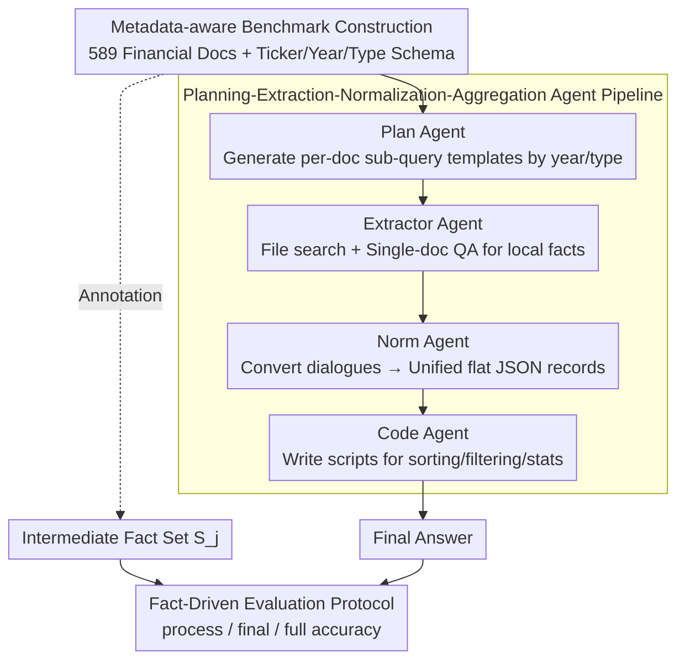

# Navigating Large-Scale Document Collections: MuDABench for Multi-Document Analytical QA

**Conference**: ACL2026 Findings  
**arXiv**: [2604.22239](https://arxiv.org/abs/2604.22239)  
**Code**: https://github.com/Zhanli-Li/MuDABench  
**Area**: Information Retrieval / Multi-Document QA / Document Intelligence  
**Keywords**: Multi-document analytical QA, RAG evaluation, financial documents, metadata planning, Agent workflow

## TL;DR
This paper introduces MuDABench, advancing multi-document QA from "retrieving relevant snippets" to "extraction, aggregation, and quantitative analysis across large-scale semi-structured document collections." It demonstrates that standard RAG struggles with such tasks even with increased recall, while metadata-aware multi-Agent workflows significantly improve results but still lag far behind human experts.

## Background & Motivation
**Background**: In current corporate knowledge bases, web QA, and document QA systems, the dominant paradigm is typically RAG: documents are partitioned into chunks, relevant chunks are recalled from a roughly flat corpus pool, and an LLM generates an answer within a context window. Multi-hop QA datasets like HotpotQA, 2WikiMultiHopQA, MuSiQue, and FanOutQA follow this setting, while long-context benchmarks focus more on whether models can fit longer inputs into their windows.

**Limitations of Prior Work**: Real-world multi-document analysis tasks are often not about "finding evidence sentences" but "treating a document collection as a semi-structured database for analysis." For example, regulatory bodies wanting to know which companies changed accounting firms in 2024 need to filter reports by company and year, extract firm names from each document, align 2023 and 2024 records, and aggregate the list of changed companies. Missing a single report, misreading a table, or confusing years leads to incorrect conclusions.

**Key Challenge**: Existing multi-document QA benchmarks mostly consist of a few web pages or short documents, primarily testing cross-entity multi-hop reasoning. Financial benchmarks like FinanceBench focus more on single-document QA, while FinAgentBench emphasizes retrieval localization. Systems work like Aryn or DocETL discuss multi-step workflows but lack large-scale public benchmarks. Consequently, current evaluations fail to pressure model systems with the complete chain of "large document volume + explicit metadata + single-doc extraction + cross-doc aggregation + numerical analysis."

**Goal**: The authors aim to define a task closer to real-world institutional document analysis: given a financial document collection with metadata and a natural language analysis question, the system must identify relevant documents, extract necessary facts from each, structure these facts, and perform aggregation calculations (sorting, comparison, variance, growth rates) to provide an answer.

**Key Insight**: MuDABench leverages the correspondence between public financial disclosures and authoritative financial databases for distant supervision. Structured databases provide verifiable metric values, while PDF disclosures offer real noise, long documents, tables, and cross-year contexts. Experts then translate structured metrics into natural language intermediate facts and question templates.

**Core Idea**: Construct a multi-document analytical QA benchmark using "financial document collections + metadata + intermediate fact annotations" and replace flat RAG with an Agent workflow consisting of "planning, document-wise extraction, JSON normalization, and code aggregation."

## Method
MuDABench serves as both a benchmark and a reference solution. The dataset portion emphasizes organizing real financial disclosures into evaluable multi-document analysis tasks, while the methodology demonstrates why standard RAG is insufficient and how a structured multi-Agent pipeline operates.

### Overall Architecture

MuDABench aims to characterize tasks ignored by existing benchmarks: treating large collections of metadata-tagged financial documents as semi-structured databases. The system must first narrow the scope by company, year, and document type, then extract facts per document, align them structurally, and perform calculations like sorting, comparison, variance, or growth rates. The evaluation input includes a question $Q_j$, document collection $D_j$, and metadata collection $M_j$, supplemented by annotated intermediate facts $S_j$. The dataset is formalized as $X = \{(Q_j, D_j, M_j, S_j)\}$, allowing both final answer verification and pinpointing failures in the extraction chain. The reference system is a metadata-aware multi-Agent pipeline that decomposes complex analysis into planning → extraction → normalization → code aggregation, replacing one-shot flat RAG queries.

### Key Designs

**1. Metadata-aware Benchmark Construction: Treating Collections as Databases**

Real-world document libraries naturally possess metadata; ignoring this structure forces RAG to recall blindly from vast pools. MuDABench collects 589 documents (over 80,000 pages) from sources like cninfo and the SEC, covering A-share and US-listed companies' annual reports, ESG reports, and announcements. Each document is bound to three metadata types: ticker, fiscal year, and document type. Each question relates to an average of 14.8 PDFs (149.7 pages), with document sets ranging from 5 to 38 PDFs. Questions include single-year statistics and complex queries requiring cross-year filtering and calculation (e.g., "Top 3 companies by revenue growth 2022–2023"). By explicitly including "entity, year, and disclosure type" in the evaluation environment, systems are forced to use the schema to narrow the analysis space before performing extraction and aggregation.

**2. Intermediate Fact-Driven Evaluation: Reliability Beyond the Final Answer**

In multi-document analysis, a final answer might appear correct due to lucky numerical guessing or lenient judging, even if the extraction was wrong. MuDABench uses distant supervision to translate structured metrics from authoritative databases into natural language intermediate fact sets $S_j$. Two protocols are designed: for standard RAG, LLM-as-judge determines how many gold supporting facts are covered, using a double-check judge to estimate error rates for a conservative coverage score. For the workflow, the metric cells of the source table are used as evaluation units to calculate the ratio of correctly extracted cells. The system reports process accuracy, final-answer accuracy, and full accuracy (requiring both to be correct), enabling researchers to distinguish between "retrieval failure," "extraction error," and "aggregation error."

**3. Plan-Extract-Normalize-Aggregate Pipeline: Structured Processing for Collections**

Complex questions often require identical extractions across dozens or hundreds of documents. Expecting an LLM to read everything at once is unrealistic and leads to entity/year confusion. The reference workflow splits the task into four modules: the **Plan Agent** reads the question and schema to generate year- and type-restricted sub-query templates; the **Document-Level Extractor** instantiates these templates for specific documents using file search and single-doc QA; the **Norm Agent** defines a flat JSON schema from few-shot examples and batch-converts extraction dialogues into records; finally, the **Code Agent** writes executable code based on the schema and JSON paths to perform sorting, filtering, and statistics. Separating extraction from calculation makes numerical analysis controllable and scalable, avoiding confusion inherent in one-shot long-context reasoning.

### Loss & Training
This paper does not propose a new model requiring training but rather a benchmark, evaluation protocol, and inference workflow. The RAG baseline uses OpenAI File Search with GPT-4o. In the Agent workflow, planning and code generation use DeepSeek-R1-0528, normalization uses DeepSeek-Chat-V3-0324, and single-doc QA relies on OpenAI File Search. All LLM calls use a temperature of 0 to minimize randomness.

## Key Experimental Results

### Main Results
Table 1 summarizes the results of MuDABench. Each triplet represents process / final / full accuracy for Simple and Complex questions. Standard RAG accuracy remains low even when increasing chunk recall to $2.5|D|$. While the workflow's process coverage is significantly higher, its final answer accuracy on complex questions still lags far behind human experts.

| System Config | Simple Proc | Simple Final | Simple Full | Complex Proc | Complex Final | Complex Full |
| :--- | :--- | :--- | :--- | :--- | :--- | :--- |
| GPT-4o RAG, chunk = $1|D|$ | 0.1572 | 0.0663 | 0.0241 | 0.1459 | 0.0482 | 0.0181 |
| GPT-4o RAG, chunk = $2|D|$ | 0.1793 | 0.1265 | 0.0422 | 0.2212 | 0.0361 | 0.0181 |
| GPT-4o RAG + metadata, chunk = $2.5|D|$ | 0.2514 | 0.1325 | 0.0542 | 0.2522 | 0.0422 | 0.0120 |
| WF + GPT-4o, chunk = 1 | 0.4179 | 0.0667 | 0.0000 | 0.4021 | 0.0667 | 0.0095 |
| WF + GPT-4.1 mini, chunk = 3 | 0.5803 | 0.2430 | 0.0654 | 0.5338 | 0.0865 | 0.0673 |
| WF + GPT-4.1 mini, chunk = 5 | 0.5888 | 0.2243 | 0.0748 | 0.5749 | 0.1619 | 0.1143 |
| Noise WF + GPT-4.1 mini, chunk = 5 | 0.5961 | 0.1636 | 0.0727 | 0.5680 | 0.1238 | 0.0762 |
| Human Performance | 0.8940 | 0.8334 | 0.7334 | 0.8120 | 0.7334 | 0.6667 |

Two key conclusions emerge. First, increasing recall mainly improves process accuracy rather than final answer stability; for instance, GPT-4o RAG improves Complex process from 0.1459 to 0.2623 by moving from $1|D|$ to $2.5|D|$, but final accuracy stays stuck at 0.0482. Second, the workflow is far better suited for these tasks: WF + GPT-4.1 mini at chunk = 5 achieves 0.1619 on Complex final, over 3x higher than standard RAG, yet remains far below the human performance of 0.7334.

### Ablation Study
Rather than removing modules A/B, the ablation focuses on chunk budgets, metadata, noise documents, and step-level diagnostics. Table 2 shows how document categories and chunk counts affect process accuracy, indicating that long docs, scanned announcements, and Chinese/English bilingualism impact extraction difficulty differently.

| Doc Category | Avg Length | Chunk=1 Simple | Chunk=1 Complex | Chunk=3 Simple | Chunk=3 Complex | Chunk=5 Simple | Chunk=5 Complex |
| :--- | :--- | :--- | :--- | :--- | :--- | :--- | :--- |
| A-share Annual (CN) | 499k tokens | 0.4696 | 0.4555 | 0.6537 | 0.6674 | 0.6447 | 0.6570 |
| A-share ESG (CN) | 72k tokens | 0.3998 | 0.3898 | 0.6067 | 0.4813 | 0.5865 | 0.4992 |
| A-share Announce (CN) | 144k tokens | 0.3903 | 0.3786 | 0.5222 | 0.4976 | 0.5542 | 0.5575 |
| US-stock Annual (EN) | 120k tokens | 0.4472 | 0.3955 | 0.3167 | 0.5374 | 0.4643 | 0.7375 |

Table 3 provides a step-level error analysis on 30 random samples, revealing why end-to-end accuracy remains low. Planning and code stages are relatively controlled, and normalization was flawless in the samples, but the extraction stage is extremely fragile, especially for complex questions.

| Step | Simple Indep. Acc | Complex Indep. Acc | Average | Avg Acc (Cond. on Prev) | Note |
| :--- | :--- | :--- | :--- | :--- | :--- |
| Planning | 86.7% | 93.3% | 90.0% | 90.0% | Most sub-queries are rational, but lack of financial common sense causes errors. |
| Extraction | 40.0% | 20.0% | 30.0% | 25.9% | Primary bottleneck; complex tasks drop to 14.3% even if plan is correct. |
| Normalization | 100.0% | 100.0% | 100.0% | 100.0% | Flat JSON alignment is easy if extraction is correct. |
| Code | 93.3% | 93.3% | 93.3% | 85.7% | Engineering errors like wrong JSON paths still exist. |

### Key Findings
- The core problem with standard RAG is not simply "insufficient recall." As chunk counts increase, process coverage improves, but final accuracy often stagnates or drops, suggesting LLMs struggle to transform fragmented evidence into stable cross-document statistics.
- Metadata is helpful but insufficient. Putting metadata in the prompt provides structure, but without explicit planning and per-document execution, models still conflate different companies, years, and types.
- The greatest gain from the Agent workflow comes from reframing the task as "table construction + programmatic analysis," preventing complex analysis from relying on volatile long-context reasoning.
- The primary bottleneck is single-document extraction, not calculation. Errors in extraction (Avg 30% acc) cascade; if key cells are wrong, normalized JSON and perfect code cannot fix the result.
- Noise documents significantly hinder final answers. Noise WF doesn't always perform worse in process accuracy, but Simple final drops from 0.2243 to 0.1636, indicating irrelevant documents interfere with downstream aggregation.

## Highlights & Insights
- MuDABench's primary contribution is shifting the multi-document QA challenge from "multi-hop reasoning" to "collection analysis," which mirrors real professional knowledge work: collecting local facts followed by filtering, sorting, and statistical calculation.
- Intermediate fact annotation is highly valuable. Many datasets only provide final answers, making systemic errors undiagnosable. By exposing the required fact set, researchers can isolate whether failures occur in retrieval, extraction, normalization, or calculation.
- Metadata is not just prompt decoration; it is a structural entry point for planning. Document collections follow natural schemas (tickers, years, types). Effective systems should use these schemas to generate query plans rather than treating metadata as supplementary text.
- Using code for final aggregation is a portable insight. For other tasks (e.g., scientific table extraction, legal case statistics), organizing document-level evidence into flat records before running verifiable code is a robust strategy.
- The paper serves as a reminder: long context does not equal large-scale document analysis capability. Even with massive windows, systems must solve entity/year alignment, field granularity, table parsing, and computational executability.

## Limitations & Future Work
- Domain specificity: MuDABench currently focuses on finance due to the density of verifiable facts in financial databases. Future work should determine if legal, medical, or scientific domains can support similar intermediate fact construction.
- Scalability vs. Cost: Distant supervision allows for more samples, but evaluation is expensive. Adding samples might not yield significantly new error patterns; the current 332 questions serve as a high-difficulty diagnostic set.
- LLM-as-judge uncertainties: While double-checking improves reliability, financial facts involve granularity, equivalent expressions, and numerical tolerances, meaning process accuracy is not an absolute ground truth.
- Dependency on closed-source services: The reference workflow relies on OpenAI File Search and high-end models, creating barriers for reproduction and system control.
- Single-document extraction remains an "hard problem": Long PDFs, complex tables, and the simultaneous appearance of "Current vs. Prior Fiscal Year" cause models to mislabel years or fields. Improved structure parsing and field grounding are needed.
- Code Agent robustness: Minor errors in field names or JSON paths cause program failure. Future iterations could include schema validators, type checking, and unit-test-style execution feedback.

## Related Work & Insights
- **vs HotpotQA / 2WikiMultiHopQA / MuSiQue / FanOutQA**: These focus on multi-hop reasoning across a few web pages; MuDABench emphasizes collection analysis across dozens of long PDFs.
- **vs LongBench / RULER / LongDocURL / Loong**: These test whether models can process long inputs. MuDABench requires systems to perform repeated extraction and aggregation on collections exceeding most context windows.
- **vs FinanceBench**: Primarily targets single-doc QA; MuDABench extends finance to multi-company, multi-year analysis.
- **vs FinAgentBench**: Focuses on agentic retrieval for document localization; MuDABench goes further by requiring batch extraction, structuralization, and quantitative analysis.
- **vs DocETL / Aryn**: These propose multi-step processing workflows; MuDABench provides the missing large-scale public evaluation for such systems.
- **Inspiration for future systems**: A practical document analysis system should behave like a database query executor, not just a conversational RAG. It requires schema-aware planning, grounded extraction, strict structural output, and executable code with verification.

## Rating
- Novelty: ⭐⭐⭐⭐☆ Definitively defines analytical QA on large-scale semi-structured collections. The benchmark perspective is clear, though the workflow combines existing modules.
- Experimental Thoroughness: ⭐⭐⭐⭐☆ Covers chunk budgets, metadata, noise, and step-level diagnostics. Diagnostic value is high, though scale is limited by cost.
- Writing Quality: ⭐⭐⭐⭐☆ Motivations and error analyses are direct and easy to follow.
- Value: ⭐⭐⭐⭐⭐ Highly significant for document intelligence, corporate knowledge bases, and agentic RAG. Specifically valuable for moving evaluation beyond end-to-end answers.

<!-- RELATED:START -->

## Related Papers

- [\[ACL 2026\] How Large Language Models Balance Internal Knowledge with User and Document Assertions](how_large_language_models_balance_internal_knowledge_with_user_and_document_asse.md)
- [\[ACL 2026\] Prune-then-Merge: Towards Efficient Multi-Vector Visual Document Retrieval](sculpting_the_vector_space_towards_efficient_multi-vector_visual_document_retrie.md)
- [\[ACL 2026\] UnIte: Uncertainty-based Iterative Document Sampling for Domain Adaptation in Information Retrieval](unite_uncertainty-based_iterative_document_sampling_for_domain_adaptation_in_inf.md)
- [\[ACL 2026\] MAB-DQA: Addressing Query Aspect Importance in Document Question Answering with Multi-Armed Bandits](mab-dqa_addressing_query_aspect_importance_in_document_question_answering_with_m.md)
- [\[ACL 2026\] A Picture is Worth a Thousand Words? An Empirical Study of Aggregation Strategies for Visual Financial Document Retrieval](a_picture_is_worth_a_thousand_words_an_empirical_study_of_aggregation_strategies.md)

<!-- RELATED:END -->
