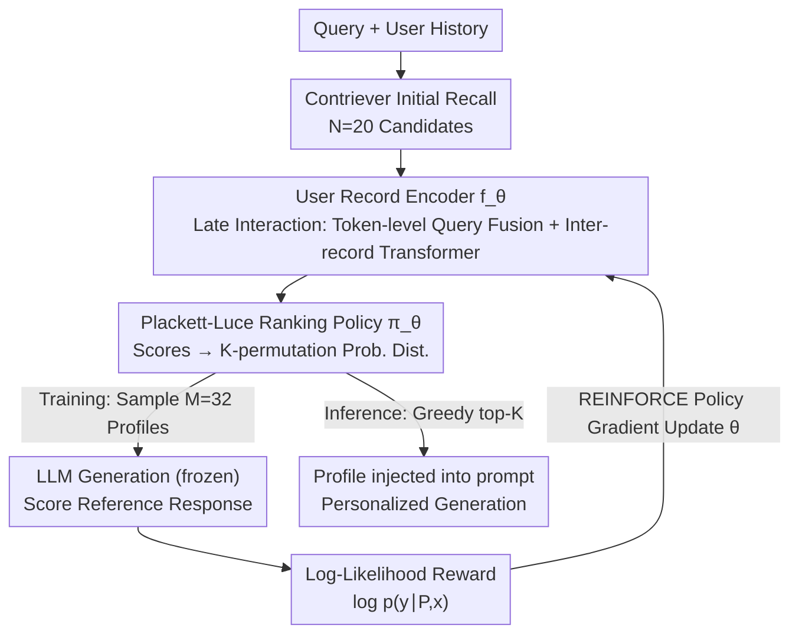

# Optimizing User Profiles via Contextual Bandits for Retrieval-Augmented LLM Personalization

**Conference**: ACL 2026  
**arXiv**: [2601.12078](https://arxiv.org/abs/2601.12078)  
**Code**: [GitHub](https://github.com/LinfengDu/PURPLE)  
**Area**: Reinforcement Learning  
**Keywords**: User profile optimization, Contextual Bandits, RAG Personalization, Plackett-Luce Ranking, Policy Gradient

## TL;DR

The PURPLE framework is proposed, modeling the user profile construction in retrieval-augmented LLM personalization as a contextual bandit problem. It captures dependencies between records via a Plackett-Luce ranking model and directly optimizes retrieval to match generation quality using the LLM's log-likelihood of reference responses as the reward signal.

## Background & Motivation

- **Background**: LLM personalization is a prominent research direction. RLHF-based parameter fine-tuning is computationally expensive and unsuitable for large-scale real-time personalization. Retrieval-augmented personalization, which injects user history into prompts to guide LLM responses, is lightweight, transparent, and deployable.
- **Limitations of Prior Work**: Existing methods select historical records for user profiles based on semantic relevance, but relevance is not a reliable proxy for utility. A record might be semantically similar to a query but harm generation quality due to redundancy or information conflict. For example, a user searching for a "relaxing Friday night movie" might retrieve suspenseful films containing the keyword "Friday night" rather than comedies reflecting the "relaxing" intent.
- **Key Challenge**: (1) The utility of an individual record depends on the context of other records—compositional utility is non-additive, making greedy top-k selection suboptimal; (2) While existing listwise rerankers can model dependencies, they remain limited by relevance-oriented supervisory signals.
- **Goal**: Design a reranking mechanism that directly optimizes downstream generation quality while remaining sensitive to interactions between records.
- **Key Insight**: relevance $\neq$ utility; utilize the LLM's log-likelihood of reference responses as a semantically rich reward signal to train a policy network that accounts for record dependencies.
- **Core Idea**: Treat user profile construction as a sequence-sensitive combinatorial selection problem, optimized directly via a contextual bandit framework using policy gradients.

## Method

### Overall Architecture

PURPLE is a reranking module layered atop initial retrieval. First, Contriever recalls $N=20$ candidate historical records for a query. These are passed to a user record encoder that assigns a propensity score to each record. Unlike greedy top-k, it does not treat records as independent entities but models "which $K$ records to select and in what order" as a combinatorial selection problem. During training, the Plackett-Luce model transforms scores into a probability distribution over ordered profiles, sampling profiles to perform policy gradient updates based on LLM generation quality. During inference, the top-$K$ records with the highest scores are concatenated into a profile and injected into the prompt. The input consists of the query and candidate records, middle stage involves sequence-sensitive profile sampling, and the output is the optimized personalized generation context.

### Key Designs

**1. User Record Encoder $f_\theta$: Modeling Inter-record Dependencies via Late Interaction**

Jointly processing all candidate records at the token level in a single encoder would exceed context windows. PURPLE employs late interaction: it uses a pre-trained Contriever to obtain token embeddings for each record, applies cross-attention between each record's tokens and the query to get "query-fused" representations, and pools these into fixed-size record embeddings. Finally, a Transformer encoder without positional encodings allows records to attend to one another. This preserves fine-grained token-level query-record interaction while modeling record-record dependencies within controllable computation. Ablations show that removing this Transformer layer causes the most significant performance drop, identifying profile-level holistic modeling as the primary source of gain.

**2. Plackett-Luce Ranking Policy $\pi_\theta$: Turning Scoring into Sequence-Sensitive Profile Sampling**

Since record utility depends on co-occurring records, simply "selecting a set" is insufficient; "selection order" must be explicitly modeled. Propensity scores $f_\theta(h_i; C) \in [0,1]$ from the encoder are expanded by the PL model into a $K$-permutation probability $\pi_\theta(P|C) = \prod_{k=1}^{K} f_\theta(p_k)/[S - \sum_{j<k} f_\theta(p_j)]$, involving sampling one record at a time without replacement based on normalized scores. Different permutations correspond to different probabilities, allowing the policy to distinguish order. Sampling from this distribution during training (and using greedy top-$K$ during inference) is efficient and differentiable for policy gradients.

**3. Log-Likelihood Reward: Replacing Relevance with Generation Likelihood as Training Signal**

Relevance is not an effective proxy for utility, so the reward targets downstream generation quality: $R(\text{LLM}(P\Vert x), y) = \log p_\phi(y|P,x) = \sum_j \log p_\phi(y_j|P,x,y_{<j})$, representing the token-level log-likelihood of the frozen LLM on the reference response. Compared to coarse discrete metrics like Accuracy/ROUGE, continuous log-likelihood distinguishes between "feasible" and "optimal" profiles, providing finer gradients for ranking. The authors further prove that using this reward is equivalent to maximizing the ELBO of the RAG marginalization formula, providing theoretical grounding for this heuristic.

### Loss & Training

Training utilizes the REINFORCE policy gradient $\nabla_\theta J(\theta) = \mathbb{E}[\nabla_\theta \log \pi_\theta(P|C) \cdot R(\text{LLM}(P\Vert x), y)]$. For each sample, $M=32$ profiles are sampled from the PL distribution, with z-score normalization applied to rewards to reduce variance and stabilize training. The LLM remains frozen throughout, with only the record encoder parameters $\theta$ being updated. The candidate pool is fixed at $N=20$, and the profile size is $K=5$.

## Key Experimental Results

### Main Results (LaMP Benchmark, 6 Tasks)

| Method | Citation Acc/F1 | Movie Acc/F1 | Rating MAE/RMSE | News RG1/RGL/MT | Scholar RG1 | Tweet RG1 |
|---|---|---|---|---|---|---|
| **Phi-4-Mini (3.84B)** |
| Contriever | 64.6/64.5 | 36.0/31.1 | 0.424/0.830 | 14.6/13.1/12.2 | 39.7 | 38.6 |
| ICR (Llama-3-8B) | 65.2/65.0 | 34.1/29.8 | 0.424/0.830 | 15.0/13.4/12.5 | 39.5 | 38.6 |
| **Ours (PURPLE)** | **66.0/65.6** | **38.6/34.2** | **0.419/0.808** | **15.1/13.5/12.6** | **40.0** | 39.0 |
| **Llama-3-8B (8.03B)** |
| Contriever | 58.5/58.1 | 47.2/39.1 | 0.314/0.631 | 17.2/15.6/15.1 | 41.1 | 32.1 |
| ICR (Llama-3-8B) | 58.4/57.3 | 48.0/39.3 | 0.312/0.631 | 17.1/15.4/14.9 | 41.3 | 31.8 |
| **Ours (PURPLE)** | 59.2/**58.8** | **49.6/41.6** | **0.307/0.624** | **17.6/15.9/15.3** | 41.4 | **32.5** |

PURPLE consistently outperforms all baselines across 3 LLM scales (3.84B/8B/70B) and 9 tasks.

### Ablation Study (Phi-4-Mini)

| Variant | Citation Acc | Movie Acc | Rating MAE | News RG1 |
|---|---|---|---|---|
| PURPLE (Full) | 66.2 | 38.2 | 0.405 | 15.2 |
| w/o Cross-Attention | 64.8 | 35.1 | 0.440 | 14.8 |
| w/o Inter-record Dependency | 61.3 | 35.0 | 0.449 | 14.5 |
| w/ Metric Reward Substitute | 64.8 | 38.0 | 0.433 | 15.0 |

Removing inter-record dependency modeling (Transformer encoder) leads to the largest performance degradation, validating the necessity of profile-level holistic optimization.

### Key Findings

- **Relevance $\neq$ Utility**: PURPLE's propensity scores provide more effective ranking signals than raw relevance, even when using models significantly smaller than RankGPT.
- **Sequence Sensitivity Matters**: The record order selected by PURPLE is most frequently ranked as optimal among 120 permutations, indicating its scores capture relative dependencies between records.
- **Log-likelihood Reward is Universal**: Even for regression tasks (Rating), the log-likelihood reward outperforms task-specific metric rewards.
- **Human Evaluation Lead by 14.4%**: In blind tests on the Tweet task, evaluators preferred PURPLE's generated results 57.2% vs. 42.8%.
- **Optimal Profile Size $K=5$**: Increasing $K$ to 10 or 15 leads to slight decreases, supporting the utility non-monotonicity hypothesis.

## Highlights & Insights

- **Elegant Problem Modeling**: Translating user profile construction into a contextual bandit combinatorial selection problem allows the Plackett-Luce model to handle sequence sensitivity and compositional dependencies naturally.
- **Deep Theoretical Connection**: Proving that the log-likelihood reward corresponds to maximizing the ELBO of the RAG marginalization formula elevates it from an experimental heuristic to a theoretically grounded method.
- **High Practical Value**: PURPLE requires no LLM fine-tuning, uses a lightweight encoder, and requires only one forward pass at inference time, balancing effectiveness and efficiency.
- **Core Insight on relevance vs utility**: This distinction is applicable not only to personalization but also offers inspiration for all RAG scenarios.

## Limitations & Future Work

- Dependency on high-quality reference responses to calculate log-likelihood rewards; in deployment, explicit supervision may be sparse or unavailable (e.g., only implicit feedback).
- Currently, policies are trained independently for each task; cross-task/cross-domain generalization has not been verified.
- Candidate pool size is fixed at 20; effectiveness and efficiency under larger pools require verification.
- Future work could explore training under weak supervision/implicit feedback, multi-task unified policies, and deeper integration with RAG pipelines.

## Related Work & Insights

- **REPLUG (Shi et al., 2024)**: Marginalizes over multiple retrieved records but processes each independently, failing to model dependencies.
- **IC-RALM (Ram et al., 2023)**: Periodically triggers retrieval and replaces context during decoding, also processing records independently.
- **RankGPT (Sun et al., 2023)**: A zero-shot LLM reranker with high inference costs and an objective focused on relevance rather than utility.
- **ICR (Chen et al., 2025)**: Efficient zero-shot reranking via attention mechanisms, yet still relevance-oriented.
- **LaMP / LongLaMP (Salemi et al., 2024; Kumar et al., 2024)**: Personalization benchmarks covering classification, regression, and generation tasks.
- Insight: Shifting retrieval optimization in RAG from relevance-oriented to utility-oriented is a direction deserving broader exploration.

## Rating

- Novelty: ⭐⭐⭐⭐⭐ The combination of Contextual Bandits + Plackett-Luce + Log-likelihood reward is elegant; the insight on relevance vs. utility is profound.
- Experimental Thoroughness: ⭐⭐⭐⭐⭐ Covers 9 tasks, 3 LLM scales, multiple baselines, ablations, human evaluation, and sensitivity analysis.
- Writing Quality: ⭐⭐⭐⭐⭐ The movie recommendation example for motivation is intuitive; the method derivation is clear and theoretically grounded.
- Value: ⭐⭐⭐⭐⭐ Proposes a new paradigm for retrieval-augmented personalization with broad impact on the RAG community.

<!-- RELATED:START -->

## Related Papers

- [\[ACL 2026\] AuthorityBench: Benchmarking LLM Authority Perception for Reliable Retrieval-Augmented Generation](authoritybench_benchmarking_llm_authority_perception_for_reliable_retrieval-augm.md)
- [\[ICLR 2026\] BrowseNet: Graph-Based Associative Memory for Contextual Information Retrieval](../../ICLR2026/information_retrieval/browsenet_graph-based_associative_memory_for_contextual_information_retrieval.md)
- [\[ACL 2026\] MAB-DQA: Addressing Query Aspect Importance in Document Question Answering with Multi-Armed Bandits](mab-dqa_addressing_query_aspect_importance_in_document_question_answering_with_m.md)
- [\[ICLR 2026\] Retro*: Optimizing LLMs for Reasoning-Intensive Document Retrieval](../../ICLR2026/information_retrieval/retro_optimizing_llms_for_reasoning-intensive_document_retrieval.md)
- [\[AAAI 2026\] Exposing the Cracks: Vulnerabilities of Retrieval-Augmented LLM-Based Machine Translation](../../AAAI2026/information_retrieval/exposing_the_cracks_vulnerabilities_of_retrieval-augmented_llm-based_machine_tra.md)

<!-- RELATED:END -->
