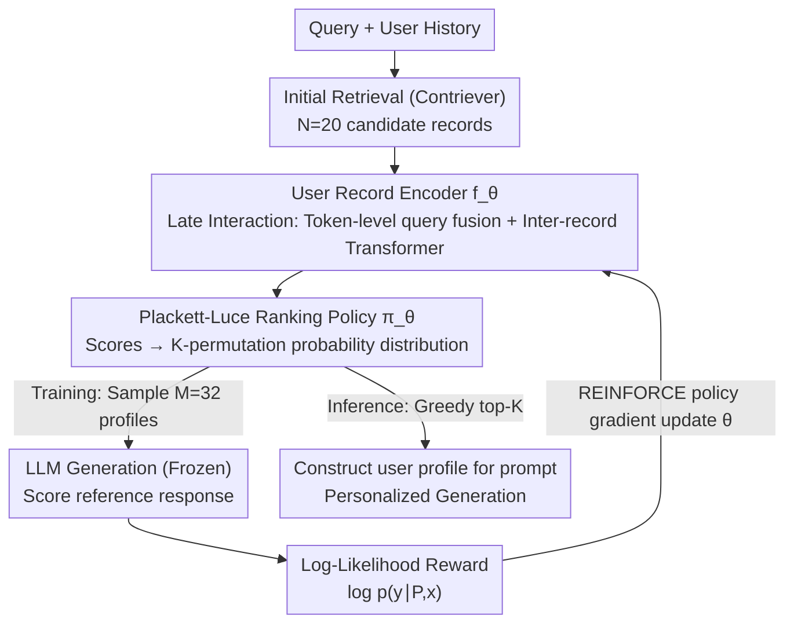

# Optimizing User Profiles via Contextual Bandits for Retrieval-Augmented LLM Personalization

**Conference**: ACL 2026  
**arXiv**: [2601.12078](https://arxiv.org/abs/2601.12078)  
**Code**: [GitHub](https://github.com/LinfengDu/PURPLE)  
**Area**: Reinforcement Learning  
**Keywords**: User profile optimization, contextual bandits, RAG personalization, Plackett-Luce ranking, policy gradient

## TL;DR

The PURPLE framework is proposed to model user profile construction in retrieval-augmented LLM personalization as a contextual bandit problem. It captures inter-record dependencies through a Plackett-Luce ranking model and employs the LLM's log-likelihood on reference responses as a reward signal to directly optimize retrieval for generation quality.

## Background & Motivation

- **Background**: LLM personalization is a prominent research direction. RLHF-based parameter fine-tuning is computationally expensive and unsuitable for large-scale real-time personalization. Retrieval-augmented personalization guides LLM generation by injecting user history into prompts, offering a lightweight, transparent, and deployable solution.
- **Limitations of Prior Work**: Existing methods select historical records based on semantic relevance, but relevance is not a reliable proxy for utility. A record may be semantically similar to a query but harm generation quality due to redundancy or information conflict. For instance, a user searching for a "relaxing Friday night movie" might be served thriller records containing the keywords "Friday night" via keyword matching, rather than comedy records that reflect the "relaxing" intent.
- **Key Challenge**: (1) The utility of an individual record depends on the context of other records—combinatorial utility is non-additive, making greedy top-k selection suboptimal; (2) existing listwise re-rankers can model dependencies but are still limited by relevance-oriented supervision signals.
- **Goal**: Design a re-ranking mechanism that directly optimizes downstream generation quality and is sensitive to interactions between records.
- **Key Insight**: relevance $\neq$ utility; use the LLM's log-likelihood on reference responses as a semantically rich reward signal to train a policy network that accounts for record dependencies.
- **Core Idea**: Relevance $\neq$ utility; use the LLM's log-likelihood on the reference response as a reward to train a policy network that models inter-record interactions.

## Method

### Overall Architecture

PURPLE is a re-ranking module layered atop initial retrieval. First, Contriever retrieves $N=20$ candidate historical records for a query. A user record encoder then assigns a propensity score to each record. Unlike greedy top-k selection, it treats the selection of $K$ records and their order as a combinatorial selection problem. During training, the Plackett-Luce model transforms scores into a probability distribution over ordered profiles; multiple profiles are sampled, and the LLM's generation quality serves as a reward for policy gradient updates. During inference, the top $K$ records with the highest scores are greedily selected to form the profile injected into the prompt.

### Key Designs

**1. User Record Encoder $f_\theta$: Modeling inter-record dependencies via Late Interaction**

Encoding all candidates simultaneously at the token level would exceed context windows. PURPLE adopts late interaction: it uses a pre-trained Contriever to obtain token embeddings for each record, performs cross-attention with the query at the token level to get "query-fused" representations, and pools them into fixed-size embeddings. Finally, a position-less Transformer encoder is used to capture dependencies between records. This approach preserves fine-grained interactions while maintaining manageable computation. Ablation studies show that removing this Transformer layer causes the most significant performance drop.

**2. Plackett-Luce Ranking Policy $\pi_\theta$: Transforming scores into order-sensitive profile sampling**

Since the utility of a record depends on its context, the model must explicitly capture the selection order. Propensity scores $f_\theta(h_i; C)\in[0,1]$ from the encoder are expanded into a $K$-permutation probability: $\pi_\theta(P|C) = \prod_{k=1}^{K} f_\theta(p_k)/[S - \sum_{j<k} f_\theta(p_j)]$. This represents sampling records without replacement based on normalized scores. This makes the selection process differentiable for policy gradients and accounts for order during training while reverting to greedy top-$K$ during inference.

**3. Log-Likelihood Reward: Using generation likelihood instead of relevance**

Relevance is not an accurate proxy for utility, so the reward directly targets downstream generation quality: $R(\text{LLM}(P\Vert x), y) = \log p_\phi(y|P,x) = \sum_j \log p_\phi(y_j|P,x,y_{<j})$. This is the token-level log-likelihood of the reference response from a frozen LLM. Compared to coarse metrics like Accuracy or ROUGE, log-likelihood facilitates better differentiation between "feasible" and "optimal" profiles. Theoretically, using this reward is equivalent to maximizing the ELBO of the RAG marginalization formula.

### Loss & Training

Training utilizes the REINFORCE policy gradient: $\nabla_\theta J(\theta) = \mathbb{E}[\nabla_\theta \log \pi_\theta(P|C) \cdot R(\text{LLM}(P\Vert x), y)]$. For each sample, $M=32$ profiles are sampled from the PL distribution. Rewards are z-score normalized to reduce variance and stabilize training. The LLM remains frozen; only the encoder parameters $\theta$ are updated. $N$ is set to $20$ and $K$ to $5$.

## Key Experimental Results

### Main Results (LaMP Benchmark, 6 Tasks)

| Method | Citation Acc/F1 | Movie Acc/F1 | Rating MAE/RMSE | News RG1/RGL/MT | Scholar RG1 | Tweet RG1 |
|---|---|---|---|---|---|---|
| **Phi-4-Mini (3.84B)** |
| Contriever | 64.6/64.5 | 36.0/31.1 | 0.424/0.830 | 14.6/13.1/12.2 | 39.7 | 38.6 |
| ICR (Llama-3-8B) | 65.2/65.0 | 34.1/29.8 | 0.424/0.830 | 15.0/13.4/12.5 | 39.5 | 38.6 |
| **Ours (PURPLE)** | **66.0/65.6** | **38.6/34.2** | **0.419/0.808** | **15.1/13.5/12.6** | **40.0** | **39.0** |
| **Llama-3-8B (8.03B)** |
| Contriever | 58.5/58.1 | 47.2/39.1 | 0.314/0.631 | 17.2/15.6/15.1 | 41.1 | 32.1 |
| ICR (Llama-3-8B) | 58.4/57.3 | 48.0/39.3 | 0.312/0.631 | 17.1/15.4/14.9 | 41.3 | 31.8 |
| **Ours (PURPLE)** | **59.2/58.8** | **49.6/41.6** | **0.307/0.624** | **17.6/15.9/15.3** | **41.4** | **32.5** |

PURPLE consistently outperforms all baselines across 3 LLM scales and 9 tasks.

### Ablation Study (Phi-4-Mini)

| Variant | Citation Acc | Movie Acc | Rating MAE | News RG1 |
|---|---|---|---|---|
| Ours (PURPLE Full) | 66.2 | 38.2 | 0.405 | 15.2 |
| w/o Cross-Attention | 64.8 | 35.1 | 0.440 | 14.8 |
| w/o inter-record dependency modeling | 61.3 | 35.0 | 0.449 | 14.5 |
| w/ metric reward replacement | 64.8 | 38.0 | 0.433 | 15.0 |

Removing the Transformer encoder for inter-record interaction results in the largest performance drop, confirming the necessity of profile-level optimization.

### Key Findings

- **Relevance $\neq$ Utility**: PURPLE propensity scores provide a more effective ranking signal than raw relevance, even when using smaller models than RankGPT.
- **Order sensitivity is significant**: The record orders chosen by PURPLE were frequently identified as optimal among 120 possible permutations.
- **Log-likelihood is a universal reward**: Log-likelihood outperforms task-specific metrics even in regression objectives (Rating tasks).
- **Human Evaluation**: In blind tests on the Tweet task, evaluators preferred PURPLE's generations in 57.2% of cases compared to 42.8% for baselines.
- **Optimal Profile Size**: $K=5$ proved optimal; increasing to 10 or 15 led to slight performance declines, supporting the non-monotonic utility hypothesis.

## Highlights & Insights

- **Elegant Modeling**: Treats user profile construction as a combinatorial contextual bandit problem, naturally handling order sensitivity and dependencies via the Plackett-Luce model.
- **Theoretical Grounding**: Demonstrates that the log-likelihood reward corresponds to maximizing the ELBO of the RAG marginalization formula.
- **Practical Utility**: Requires no LLM fine-tuning, utilizes a lightweight encoder, and only requires a single forward pass for inference, balancing performance and efficiency.
- **Relevance vs. Utility**: This distinction provides a core insight applicable not just to personalization, but to RAG scenarios in general.

## Limitations & Future Work

- Relies on high-quality reference responses to calculate log-likelihood rewards; supervision may be sparse in real-world deployments.
- Current policies are trained independently per task; cross-task or cross-domain generalization has not been verified.
- The candidate pool is fixed at $N=20$; efficiency and effectiveness with larger pools remain to be tested.
- Future work could explore training under weak supervision/implicit feedback and deeper integration with RAG pipelines.

## Related Work & Insights

- **REPLUG (Shi et al., 2024)**: Marginalizes over retrieved records but treats them independently, failing to model inter-record dependencies.
- **IC-RALM (Ram et al., 2023)**: Periodically triggers retrieval during decoding but treats records in isolation.
- **RankGPT (Sun et al., 2023)**: A zero-shot LLM re-ranker with high inference costs and a focus on relevance rather than utility.
- **ICR (Chen et al., 2025)**: Efficient zero-shot re-ranking using attention mechanisms, but still oriented toward relevance.
- **LaMP / LongLaMP (Salemi et al., 2024; Kumar et al., 2024)**: Standard benchmarks for personalization covering various task types.
- Insight: Shifting RAG retrieval optimization from relevance-oriented to utility-oriented is a direction worth broader exploration.

## Rating

- Novelty: ⭐⭐⭐⭐⭐ Elegant combination of contextual bandits, Plackett-Luce, and log-likelihood rewards.
- Experimental Thoroughness: ⭐⭐⭐⭐⭐ Extensive evaluation across tasks, LLM scales, and human baselines.
- Writing Quality: ⭐⭐⭐⭐⭐ Intuitive motivation with solid theoretical and methodological derivations.
- Value: ⭐⭐⭐⭐⭐ Establishes a new paradigm for retrieval-augmented personalization.

<!-- RELATED:START -->

## Related Papers

- [\[ACL 2026\] AuthorityBench: Benchmarking LLM Authority Perception for Reliable Retrieval-Augmented Generation](authoritybench_benchmarking_llm_authority_perception_for_reliable_retrieval-augm.md)
- [\[ACL 2026\] MAB-DQA: Addressing Query Aspect Importance in Document Question Answering with Multi-Armed Bandits](mab-dqa_addressing_query_aspect_importance_in_document_question_answering_with_m.md)
- [\[AAAI 2026\] Exposing the Cracks: Vulnerabilities of Retrieval-Augmented LLM-Based Machine Translation](../../AAAI2026/information_retrieval/exposing_the_cracks_vulnerabilities_of_retrieval-augmented_llm-based_machine_tra.md)
- [\[ACL 2025\] Parenting: Optimizing Knowledge Selection of Retrieval-Augmented Language Models with Parameter Decoupling and Tailored Tuning](../../ACL2025/information_retrieval/parenting_optimizing_knowledge_selection_of_retrievalaugmented.md)
- [\[ACL 2026\] How Large Language Models Balance Internal Knowledge with User and Document Assertions](how_large_language_models_balance_internal_knowledge_with_user_and_document_asse.md)

<!-- RELATED:END -->
