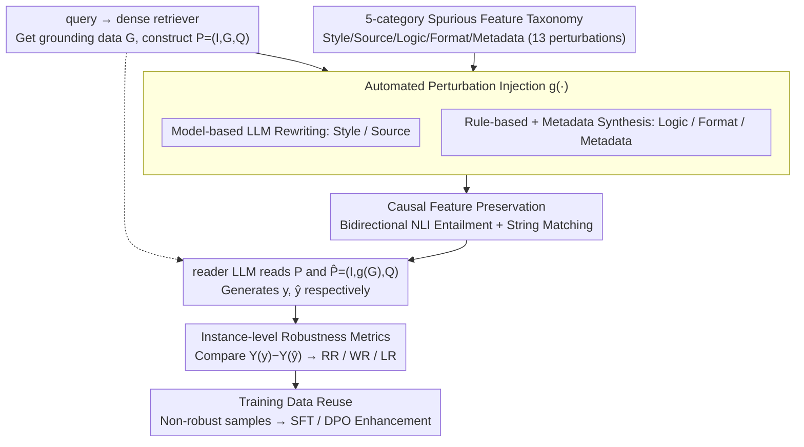

# Quantifying and Improving the Robustness of Retrieval-Augmented Language Models Against Spurious Features in Grounding Data

**Conference**: ACL2026  
**arXiv**: [2503.05587](https://arxiv.org/abs/2503.05587)  
**Code**: https://github.com/maybenotime/RAG-SpuriousFeatures  
**Area**: Information Retrieval / RAG Robustness  
**Keywords**: RAG, Spurious Features, Robustness Evaluation, Perturbation Benchmark, SFT & DPO

## TL;DR
This paper introduces the SURE framework to systematically evaluate the sensitivity of RAG generation to semantically irrelevant spurious features in retrieved documents—such as style, source, logic, format, and metadata. By utilizing synthetic data generated by SURE, it significantly improves RALM robustness through SFT and DPO.

## Background & Motivation
**Background**: RAG mitigates LLM hallucinations by retrieving external documents and has become a standard paradigm for factual QA and knowledge-intensive applications. Existing robustness research primarily focuses on explicit noise, such as retrieving documents that are semantically incorrect, irrelevant, contradictory, or poorly positioned.

**Limitations of Prior Work**: Real-world internet retrieval results contain not only semantic noise but also various semantically irrelevant features that influence model behavior: HTML/Markdown/YAML/JSON formatting, sentence order, source domains, timestamps, stylistic complexity, and traces of LLM rewriting. Existing benchmarks rarely measure the impact of these "spurious features" in RAG scenarios systematically.

**Key Challenge**: When the format or metadata of a golden document changes while the correct answer remains the same, the output of the RAG reader may flip from correct to incorrect. Traditional dataset-level accuracy often only reflects aggregate changes and fails to capture instance-level flips caused by perturbations.

**Goal**: Establish an automated framework capable of injecting spurious features in bulk while maintaining causal semantics to provide instance-level robustness metrics and generate robust training data.

**Key Insight**: The RAG input is decomposed into instructions, grounding data, and a query. By modifying only the surface attributes of the grounding data that are irrelevant to the answer's semantics, the model's output under original versus perturbed inputs can be compared.

**Core Idea**: A "Perturb-Preserve-Evaluate" controlled experimental framework is used to explicitly isolate spurious features from RAG, quantifying model sensitivity and converting non-robust samples into training signals.

## Method
The complete SURE pipeline comprises four parts: a spurious feature taxonomy, perturbation injection, causal feature preservation, and robustness evaluation. Subsequently, the authors construct SURE_Wiki, SIG_Wiki, and SIG_Trivial based on this process and explore mitigation strategies including scaling, Chain-of-Note, reasoning models, SFT, and DPO.

### Overall Architecture
Given a query, the retriever returns documents, and the reader LLM receives a prompt $P=(I,G,Q)$ to generate an answer. SURE defines a perturbation function $g(\cdot)$ that transforms grounding data $G$ into $g(G)$, forming a counterfactual input $\hat{P}=(I,g(G),Q)$. If the answers for $G$ and $g(G)$ are semantically identical but the model's output correctness changes, it indicates the RALM is not robust to that spurious feature. The top-down pipeline consists of: Taxonomy defining features to inject → Automated Perturbation Injection creating counterfactual documents → Causal Feature Preservation filtering "dirty" samples where the answer changed → Reader answering both original and perturbed paths → Instance-level metrics quantifying robustness and recycling non-robust samples for training.

### Key Designs

**1. 5-category Spurious Feature Taxonomy: Systematizing how internet documents vary without changing answers**

Real-world retrieval results are inherently heterogeneous—the same golden document may appear as HTML, be rewritten in a different style, or carry different source domains and timestamps. Uniformity in format and source cannot be guaranteed at deployment. The authors categorize these "surface-variant, semantic-invariant" attributes into five types with 13 perturbations: Style (simple/complex), Source (LLM-generated/self-generated), Logic (reverse/random/LLM-reranked sentence order), Format (JSON/HTML/YAML/Markdown), and Metadata (timestamp pre/post, datasource wiki/twitter). Cataloging these features acknowledges them as real-world deployment risks rather than toy perturbations.

**2. Automated Perturbation Injection: A hybrid model/rule-based pipeline for scalable generation**

Manually rewriting tens of thousands of documents is unfeasible, so the perturbation function $g(\cdot)$ must be automated. SURE implements two paths: Style and Source perturbations, which require stylistic or semantic-level rewriting, are generated by an LLM (Llama-3.1-70B-Instruct) using carefully designed instructions. Logic (reordering) and Format (JSON/HTML/YAML/Markdown) perturbations follow deterministic rules and are generated via heuristic programs. Metadata is synthesized and injected into documents. This hybrid approach covers the entire taxonomy while allowing the perturb-then-evaluate process to produce counterfactual samples at scale, facilitating the creation of SURE_Wiki/SIG datasets.

**3. Causal Feature Preservation: Modifying the surface while preserving answer facts**

If a perturbation accidentally alters the factual answer, it becomes impossible to distinguish whether an error is caused by spurious features or changed content. SURE applies a double-safety mechanism: model-generated perturbations must maintain semantic equivalence, verified by bidirectional NLI entailment (where $G \implies g(G)$ and $g(G) \implies G$). Simultaneously, string matching ensures the ground truth from the golden document remains present after perturbation and that noise documents do not unexpectedly "grow" the correct answer. This ensures the contrastive pair differs only in surface attributes, making the evaluation a controlled experiment.

**4. Instance-level Robustness Metrics and Training Data Reuse: Quantifying flips and recycling samples**

Dataset-level accuracy obscures individual instance instability. SURE adopts instance-level paired evaluation: correctness is judged for both original output $y$ and perturbed output $\hat{y}$ to calculate Win Rate (WR), Lose Rate (LR), and Robustness Rate (RR). This distinguishes whether a spurious feature caused a failure or an accidental correction. Furthermore, these pairs are ideal for training: for each non-robust instance, SURE records the query, correct answer, wrong answer, and the original/perturbed passage pair to form SFT supervision or DPO preference pairs, closing the loop between evaluation and mitigation.

### Loss & Training
The evaluation phase of SURE does not involve training. In the mitigation phase, two strategies are used: SFT pairs both original and perturbed golden passages with the correct answer to stabilize output; DPO treats the correct answer as "preferred" and the incorrect answer as "rejected" for both passage versions. Experiments use Llama-3.1-8B-Instruct as a backbone, trained for 2 epochs on over 30k samples, and evaluated on SIG_Wiki and cross-domain SIG_Trivial.

## Key Experimental Results

### Main Results

| Data / Model | Style RR | Source RR | Logic RR | Format RR | Meta RR | Description |
|-------------|----------|-----------|----------|-----------|---------|-------------|
| SIG_Trivial Mistral-7B | 88.0 | 94.0 | 94.5 | 94.0 | 99.0 | Bing + TrivialQA, String Eval |
| SIG_Trivial Mistral-7B Judge | 90.5 | 91.5 | 92.0 | 93.8 | 96.0 | LLM-as-Judge yields similar results |
| SIG_Trivial Llama-3.1-8B | 87.5 | 93.5 | 93.0 | 90.8 | 97.0 | Open-source reader |
| SIG_Trivial Llama-3.1-8B Judge | 85.0 | 92.0 | 91.0 | 90.8 | 93.3 | Validating string metric reliability |

### Ablation Study

| Method | Style | Source | Logic | Format | Meta | Dataset |
|------|-------|--------|-------|--------|------|--------|
| Llama3.1-8B | 10.0 | 15.5 | 20.0 | 24.0 | 94.0 | SIG_Wiki |
| + SFT | 96.5 | 94.5 | 99.0 | 99.5 | 99.7 | SIG_Wiki |
| + DPO | 96.5 | 96.0 | 96.0 | 98.0 | 98.0 | SIG_Wiki |
| Llama3.1-8B | 87.5 | 93.5 | 93.0 | 90.8 | 97.0 | SIG_Trivial |
| + SFT | 88.5 | 91.5 | 95.0 | 96.3 | 99.0 | SIG_Trivial |
| + DPO | 94.5 | 94.5 | 97.3 | 95.8 | 98.0 | SIG_Trivial |

### Key Findings
- On SURE_Wiki, impact varies significantly across perturbation categories; RR is similar within the same category, but WR/LR can differ, suggesting some spurious features occasionally correct the model.
- For Mistral-7B-Instruct, the Lose Rate for HTML in format perturbations reached 9.30 for Known-Golden, higher than JSON/YAML/Markdown, indicating structural format significantly impacts readers.
- Six SOTA models exhibit specific sensitivities on SIG_Wiki; even GPT-4o only achieves ~89% RR on datasource(twitter).
- Chain-of-Note and DeepSeek-R1 do not reliably solve the problem: DeepSeek-V3 Style RR is 96.5, while DeepSeek-R1 drops to 84.5, showing that stronger reasoning does not equate to robustness against spurious features.
- Attention analysis reveals that Win/Lose samples show larger changes in attention on the answer span compared to Robust samples; Robust $\Delta A$ was $6.52 \times 10^{-5}$, while Lose was $1.15 \times 10^{-4}$ ($p=0.046$, Welch t-test).

## Highlights & Insights
- The systematic introduction of "semantic-invariant surface changes" to RAG evaluation is more representative of real-world search environments than simply adding irrelevant documents.
- Instance-level RR/WR/LR metrics are highly practical: they do not just show accuracy changes but distinguish whether a perturbation helped or hindered the answer.
- The training data reuse design is intuitive. SURE is not just a benchmark but a closed loop that transforms identified non-robust samples into SFT/DPO data.
- The results serve as a reminder: document cleaning, format preservation, and metadata handling in RAG pipelines are not neutral preprocessing steps; they can directly alter model outputs.

## Limitations & Future Work
- The authors acknowledge that the taxonomy cannot exhaust all spurious features; real webpages may contain ads, templates, navigation bars, complex table layouts, and footnotes.
- Current evaluation focuses on QA tasks in English Wikipedia / open web; long contexts, multi-hop reasoning, cross-lingual RAG, and private enterprise documents remain to be verified.
- While efficient, string matching might be inflexible for aliases, paraphrased answers, or numerical formats; LLM-as-Judge was only used for supplementary validation.
- SFT is extremely strong on in-domain SIG_Wiki but occasionally lags behind DPO on SIG_Trivial, indicating potential domain generalization issues in training-based mitigation.
- Training-based mitigation requires full-parameter fine-tuning and A100-level resources; lightweight adapters or inference-time normalization strategies warrant further research.

## Related Work & Insights
- **vs. Explicit Noise RAG benchmarks**: Unlike studies focusing on irrelevant or contradictory documents, this work focuses on spurious features that do not change semantics, acting as an extension of prompt sensitivity to the RAG domain.
- **vs. Prompt format sensitivity**: While prior work proved LLMs are sensitive to prompt formatting, this paper shifts the focus to the grounding data level, discovering that the format of retrieved documents is equally critical.
- **vs. Chain-of-Note**: CoN targets explicit noise by requiring rationales; experiments here show COT-style methods are not necessarily effective against spurious features.
- **vs. DPO/SFT Robust Training**: Rather than general preference optimization, this approach uses paired original/perturbed passages to specifically align consistency across diverse "surface" representations of the same fact.

## Rating
- Novelty: ⭐⭐⭐⭐ Systematizing spurious features in RAG grounding data provides significant value in problem definition.
- Experimental Thoroughness: ⭐⭐⭐⭐⭐ Comprehensive taxonomy, dual benchmarks, multi-model testing, prompting, scaling, training mitigation, and attention analysis.
- Writing Quality: ⭐⭐⭐⭐ Clear framework with dense but informative tables.
- Value: ⭐⭐⭐⭐⭐ Directly applicable to real-world RAG deployment, document preprocessing, and robust training.

<!-- RELATED:START -->

## Related Papers

- [\[ECCV 2024\] Grounding Language Models for Visual Entity Recognition](../../ECCV2024/information_retrieval/grounding_language_models_for_visual_entity_recognition.md)
- [\[ACL 2025\] When Claims Evolve: Evaluating and Enhancing the Robustness of Embedding Models Against Misinformation Edits](../../ACL2025/information_retrieval/when_claims_evolve_evaluating_and_enhancing_the_robustness_of_embedding_models_a.md)
- [\[ACL 2026\] Conjecture and Inquiry: Quantifying Software Performance Requirements via Interactive Retrieval-Augmented Preference Elicitation](conjecture_and_inquiry_quantifying_software_performance_requirements_via_interac.md)
- [\[AAAI 2026\] Do Retrieval Augmented Language Models Know When They Don't Know?](../../AAAI2026/information_retrieval/do_retrieval_augmented_language_models_know_when_they_dont_know.md)
- [\[ACL 2025\] Investigating the Robustness of Retrieval-Augmented Generation at the Query Level](../../ACL2025/information_retrieval/investigating_the_robustness_of_retrieval-augmented_generation_at_the_query_leve.md)

<!-- RELATED:END -->
