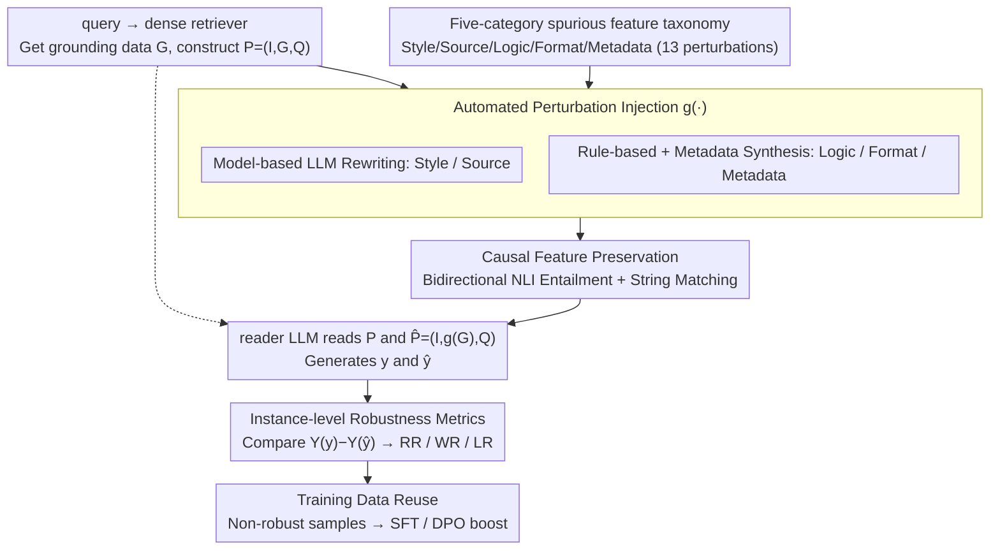

# Quantifying and Improving the Robustness of Retrieval-Augmented Language Models Against Spurious Features in Grounding Data

**Conference**: ACL2026  
**arXiv**: [2503.05587](https://arxiv.org/abs/2503.05587)  
**Code**: https://github.com/maybenotime/RAG-SpuriousFeatures  
**Area**: Information Retrieval / RAG Robustness  
**Keywords**: RAG, Spurious Features, Robustness Evaluation, Perturbation Benchmark, SFT and DPO

## TL;DR
This paper proposes the SURE framework to systematically evaluate the sensitivity of RAG generation to semantically irrelevant spurious features (style, source, logic, format, metadata) in retrieved documents and significantly improves RALM robustness using synthetic data generated by SURE through SFT/DPO.

## Background & Motivation
**Background**: RAG mitigates LLM hallucinations by retrieving external documents and has become a common paradigm for factual QA and knowledge-intensive applications. Existing robustness research focuses heavily on explicit noise, such as retrieving semantically incorrect, irrelevant, contradictory, or poorly positioned documents.

**Limitations of Prior Work**: Real-world internet retrieval results contain not only semantic noise but also a large number of semantically irrelevant features that influence model behavior: HTML/Markdown/YAML/JSON formats, sentence order, source domains, timestamps, stylistic complexity, and LLM rewriting traces. Existing benchmarks rarely systematically measure the impact of these "spurious features" in RAG scenarios.

**Key Challenge**: Changing the format or metadata of the same golden document does not change the correct answer, yet the output of the RAG reader may flip from correct to incorrect. Traditional dataset-level accuracy often only observes aggregate changes and fails to capture instance-level flips after perturbations.

**Goal**: Establish an automated framework capable of injecting spurious features in bulk while maintaining causal semantics to provide instance-level robustness metrics and generate robust training data.

**Key Insight**: RAG input is decomposed into instruction, grounding data, and query. Only the surface attributes of the grounding data that are irrelevant to the answer's semantics are modified, followed by a comparison of model outputs between original and perturbed inputs.

**Core Idea**: Use a "perturb-preserve-evaluate" controlled experimental framework to explicitly isolate spurious features from RAG, quantifying model sensitivity while converting non-robust samples into training signals.

## Method
The complete SURE pipeline includes four components: a taxonomy of spurious features, perturbation injection, causal feature preservation, and robustness evaluation. Subsequently, the authors construct SURE_Wiki, SIG_Wiki, and SIG_Trivial based on this pipeline to explore scaling, Chain-of-Note, reasoning models, SFT, and DPO as mitigation methods.

### Overall Architecture
Given a query, the retriever returns documents, and the reader LLM receives a prompt $P=(I,G,Q)$ to generate an answer. SURE defines a perturbation function $g(\cdot)$ that transforms grounding data $G$ into $g(G)$, forming a counterfactual input $\hat{P}=(I,g(G),Q)$. If the answers for $G$ and $g(G)$ are semantically consistent but the model output correctness changes, the RALM is considered non-robust to that spurious feature. The pipeline follows a top-down approach: the taxonomy defines which spurious features to inject $\rightarrow$ automated perturbation injection creates counterfactual documents $\rightarrow$ causal feature preservation filters out "corrupted" samples where the answer changed $\rightarrow$ the reader answers using both original and perturbed paths $\rightarrow$ instance-level metrics quantify robustness and recycle non-robust samples for mitigation training.

### Key Designs

**1. Spurious feature taxonomy: Systematic cataloging of "how internet documents change without changing answers"**

Real-world retrieval results are naturally heterogeneous—the same golden document might appear as HTML, be rewritten in a different style, or carry different source domains and timestamps. Deployment cannot guarantee uniform formats or styles. The authors categorize these "variable surface, constant semantic" attributes into five categories with 13 perturbations: Style (simple/complex), Source (LLM-generated/self-generated), Logic (reverse/random/LLM-reranked sentence order), Format (JSON/HTML/YAML/Markdown), and Metadata (pre/post timestamps, wiki/twitter source). Listing these features explicitly treats them as real-world deployment risks rather than toy perturbations.

**2. Automated perturbation injection: A dual-track model-based and rule-based pipeline for scalable injection**

Manually rewriting tens of thousands of documents is unfeasible, so the perturbation function $g(\cdot)$ must be automated. SURE implements two tracks: Style and Source perturbations requiring stylistic or semantic-level rewriting are generated by an LLM (Llama-3.1-70B-Instruct) using carefully designed instructions. Logic (reordering) and Format (JSON/HTML/YAML/Markdown) perturbations with deterministic rules are generated via heuristic programs. Metadata is injected by synthesizing timestamps and source domains. The model track handles "semantic rewriting," while the rule track handles "structural transformation."

**3. Causal feature preservation mechanism: Perturbing the surface while protecting the answer-dependent facts**

If a perturbation accidentally alters the factual answer, it becomes impossible to distinguish whether the model failed due to spurious features or changed causal content. SURE applies a double-safety mechanism to $g(\cdot)$: for model-generated perturbations, semantic equivalence is required and verified via bidirectional entailment (NLI), where both $G \rightarrow g(G)$ and $g(G) \rightarrow G$ must be judged as entailment. Simultaneously, string matching confirms that the ground truth from the golden document remains present after perturbation and that noise documents do not unexpectedly "produce" the correct answer.

**4. Instance-level robustness metrics and training data reuse: Quantifying single-item flips and recycling samples**

Dataset-level accuracy obscures individual instabilities where the same question flips from correct to incorrect under perturbation. SURE uses instance-level pairing: it evaluates the correctness of original output $y$ and perturbed output $\hat{y}$ separately to calculate Win Rate (WR), Lose Rate (LR), and Robustness Rate (RR). This distinguishes whether a spurious feature broke the answer or accidentally fixed it. These pairs are naturally suited for training: for each non-robust instance, SURE records the query, correct answer, incorrect answer, original document, and perturbed document to form SFT supervision or DPO preference pairs.

### Loss & Training
The evaluation phase of SURE does not involve training. For the mitigation phase, two strategies are used: SFT pairs both original and perturbed golden passages with the correct answer to train stable output; DPO treats the correct answer as preferred and the incorrect answer as rejected, constructing preference samples with both original and perturbed passages. Experiments use Llama-3.1-8B-Instruct as the backbone, trained on over 30k samples for 2 epochs.

## Key Experimental Results

### Main Results

| Data / Model | Style RR | Source RR | Logic RR | Format RR | Meta RR | Note |
|-------------|----------|-----------|----------|-----------|---------|------|
| SIG_Trivial Mistral-7B | 88.0 | 94.0 | 94.5 | 94.0 | 99.0 | Bing + TrivialQA, String Eval |
| SIG_Trivial Mistral-7B Judge | 90.5 | 91.5 | 92.0 | 93.8 | 96.0 | LLM-as-Judge results close |
| SIG_Trivial Llama-3.1-8B | 87.5 | 93.5 | 93.0 | 90.8 | 97.0 | Open-source reader |
| SIG_Trivial Llama-3.1-8B Judge | 85.0 | 92.0 | 91.0 | 90.8 | 93.3 | Verifies string metric reliability |

### Ablation Study

| Method | Style | Source | Logic | Format | Meta | Dataset |
|------|-------|--------|-------|--------|------|--------|
| Llama3.1-8B | 10.0 | 15.5 | 20.0 | 24.0 | 94.0 | SIG_Wiki |
| + SFT | 96.5 | 94.5 | 99.0 | 99.5 | 99.7 | SIG_Wiki |
| + DPO | 96.5 | 96.0 | 96.0 | 98.0 | 98.0 | SIG_Wiki |
| Llama3.1-8B | 87.5 | 93.5 | 93.0 | 90.8 | 97.0 | SIG_Trivial |
| + SFT | 88.5 | 91.5 | 95.0 | 96.3 | 99.0 | SIG_Trivial |
| + DPO | 94.5 | 94.5 | 97.3 | 95.8 | 98.0 | SIG_Trivial |

### Key Findings
- On SURE_Wiki, impact varies significantly across perturbation categories; RR within the same category is similar, but WR/LR differ significantly, indicating some features occasionally correct the model.
- For Mistral-7B-Instruct, HTML perturbations in the Format category show a Lose Rate of 9.30 for Known-Golden, higher than JSON/YAML/Markdown, indicating structural format significantly impacts readers.
- Six SOTA models exhibit specific sensitivities on SIG_Wiki; even GPT-4o achieves only about 89% RR on datasource(twitter).
- Chain-of-Note and DeepSeek-R1 do not reliably solve the issue: DeepSeek-V3 has a Style RR of 96.5, while DeepSeek-R1 drops to 84.5, suggesting stronger reasoning does not equate to robustness against spurious features.
- Attention analysis shows that Win/Lose samples exhibit larger changes in attention on the answer span compared to Robust samples; Robust $\Delta A = 6.52e-5$, while Lose $\Delta A = 1.15e-4$ (Welch t-test $p=0.046$).

## Highlights & Insights
- The paper systematically introduces "surface changes with constant semantics" into RAG evaluation, which is more representative of real search environments than simple irrelevant documents.
- Instance-level paired metrics (RR/WR/LR) are practical: they distinguish whether perturbations degrade answers or occasionally improve them.
- Training data reuse is naturally designed. SURE is not just a benchmark but a closed loop that converts non-robust samples into SFT/DPO data.
- The results serve as a reminder: document cleaning, format preservation, and metadata handling in RAG pipelines are not neutral; they can directly alter model output.

## Limitations & Future Work
- The taxonomy cannot exhaust all spurious features; real web pages may include ads, templates, navigation bars, complex table layouts, and footnotes.
- Current evaluation focuses on QA tasks and English Wikipedia/open web; long documents, multi-hop reasoning, cross-lingual RAG, and private enterprise documents still need verification.
- String matching is efficient but may lack flexibility for aliases, paraphrased answers, or numerical formats; LLM-as-Judge was only used for supplementary validation.
- SFT is extremely strong on in-domain SIG_Wiki but some metrics are inferior to DPO on SIG_Trivial, indicating domain generalization issues in training-based mitigations.
- Training-based mitigation requires full-parameter fine-tuning and A100-level resources; lightweight adapters or inference-time normalization strategies are worth investigating.

## Related Work & Insights
- **vs Explicit Noise RAG Benchmarks**: Previous work studied irrelevant or contradictory documents; this work focuses on spurious features that do not change semantics, acting as a RAG-specific extension of prompt sensitivity.
- **vs Prompt Format Sensitivity**: Prior work proved LLM sensitivity to prompt formats; this paper extends this to the grounding data level, finding retrieved document formats are equally critical.
- **vs Chain-of-Note**: CoN is designed for explicit noise by having the model write rationales; experiments here show COT-style methods are not necessarily effective against spurious features.
- **vs DPO/SFT Robust Training**: This work uses paired original/perturbed passages for targeted data construction to align consistency across "different surfaces of the same fact."

## Rating
- Novelty: ⭐⭐⭐⭐ Systematizing spurious features in RAG grounding data provides significant value in problem definition.
- Experimental Thoroughness: ⭐⭐⭐⭐⭐ Taxonomy, two benchmarks, multiple models, prompting, scaling, training mitigation, and attention analysis are all comprehensive.
- Writing Quality: ⭐⭐⭐⭐ Clear framework with dense but informative tables.
- Value: ⭐⭐⭐⭐⭐ Direct implications for real-world RAG deployment, document preprocessing, and robust training.

<!-- RELATED:START -->

## Related Papers

- [\[ACL 2025\] When Claims Evolve: Evaluating and Enhancing the Robustness of Embedding Models Against Misinformation Edits](../../ACL2025/information_retrieval/when_claims_evolve_evaluating_and_enhancing_the_robustness_of_embedding_models_a.md)
- [\[ACL 2026\] Conjecture and Inquiry: Quantifying Software Performance Requirements via Interactive Retrieval-Augmented Preference Elicitation](conjecture_and_inquiry_quantifying_software_performance_requirements_via_interac.md)
- [\[AAAI 2026\] Do Retrieval Augmented Language Models Know When They Don't Know?](../../AAAI2026/information_retrieval/do_retrieval_augmented_language_models_know_when_they_dont_know.md)
- [\[ACL 2025\] Investigating the Robustness of Retrieval-Augmented Generation at the Query Level](../../ACL2025/information_retrieval/investigating_the_robustness_of_retrieval-augmented_generation_at_the_query_leve.md)
- [\[ACL 2026\] Why Mean Pooling Works: Quantifying Second-Order Collapse in Text Embeddings](why_mean_pooling_works_quantifying_second-order_collapse_in_text_embeddings.md)

<!-- RELATED:END -->
