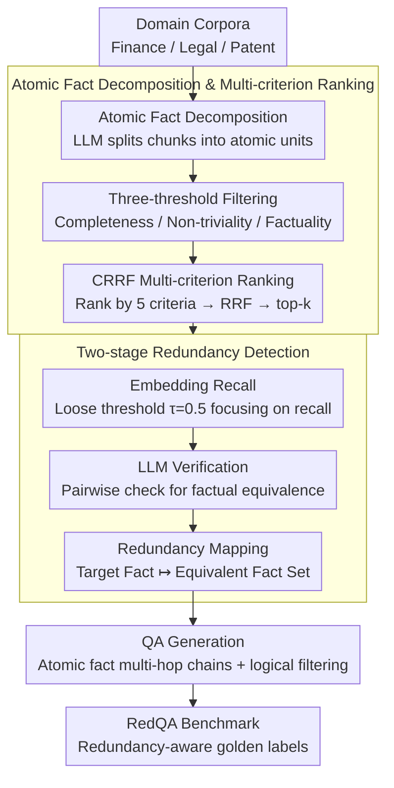

# RARE: Redundancy-Aware Retrieval Evaluation Framework for High-Similarity Corpora

**Conference**: ACL 2026  
**arXiv**: [2604.19047](https://arxiv.org/abs/2604.19047)  
**Code**: None  
**Area**: Information Retrieval/RAG  
**Keywords**: Redundancy-aware retrieval, high-similarity corpora, multi-hop retrieval evaluation, enterprise RAG, atomic fact decomposition

## TL;DR

This paper proposes the RARE framework, which tracks cross-document redundancy by decomposing documents into atomic facts and utilizes CRRF (Criteria-separated Reciprocal Rank Fusion) to stabilize multi-criteria LLM judgments. By constructing the RedQA benchmark on high-redundancy enterprise corpora (Finance, Legal, Patent), the study reveals that mainstream retrievers' PerfRecall@10 drops from 66.4% to 5.0-27.9% in 4-hop high-overlap settings.

## Background & Motivation

**Background**: Existing QA benchmarks (e.g., HotpotQA, NQ, MS MARCO) assume minimal information overlap between documents, where each answer corresponds to a unique golden passage. Current retrieval evaluation schemes perform well on these "low-overlap" corpora, driving the rapid development of dense retrieval technologies.

**Limitations of Prior Work**: (1) Enterprise-grade RAG systems actually operate on corpora like financial annual reports, legal statutes, and patent documents, which are naturally high-redundancy and high-similarity—the same facts recur in slightly different forms across multiple passages; (2) In high-redundancy scenarios, retrievers are unfairly penalized when returning "non-source passages" that contain the correct answer; (3) Superior performance on existing benchmarks overestimates the true robustness of models in enterprise deployments.

**Key Challenge**: The core assumption of existing retrieval evaluations—that each answer has a unique golden passage—does not hold in enterprise corpora. There is a need for a framework that systematically tracks cross-document information redundancy and incorporates it into evaluation labels.

**Goal**: (1) Construct a general framework allowing practitioners to build RAG evaluation benchmarks on their own domain corpora that truly reflect deployment conditions; (2) Quantify the gap between existing benchmarks and enterprise corpora.

**Key Insight**: Decomposing documents into minimal indivisible "atomic fact" units allows for redundancy tracking at an atomic granularity. Atomic facts have lower noise in the embedding space than passage-level representations, narrowing the gap between semantic similarity and factual equivalence, thus making LLM equivalence judgments more reliable.

**Core Idea**: Construct a redundancy-aware golden label set through atomic fact decomposition + two-stage redundancy detection (embedding retrieval + LLM verification), while using CRRF (Criteria Separation + Reciprocal Rank Fusion) to stabilize multi-criteria LLM judgments, addressing quality control issues in data generation.

## Method

### Overall Architecture

RARE is a data construction pipeline that transforms domain document corpora into redundancy-aware multi-hop QA benchmarks. The core mechanism is first reducing the granularity from "passage" to "atomic fact," then tracking cross-document redundancy at this fine-grained level. It consists of three steps: first, effective information selection, where document chunks are split into atomic facts, invalid units are filtered, and facts are ranked by quality; second, systematic redundancy tracking, identifying semantically equivalent facts scattered across different passages at the atomic level; finally, QA generation, where atomic facts are combined into multi-hop reasoning chains and produced as questions after logical filtering. The input consists of domain corpora (Finance/Legal/Patent), and the output is the RedQA benchmark with redundancy-aware golden labels. A retriever is judged correctly if it hits any "non-source passage" as long as it carries the equivalent fact.

### Key Designs

**1. Atomic Fact Decomposition & Multi-criterion Ranking: Breaking passages into trackable, combinable minimal units**

In passages, multiple facts are intertwined, which hinders precise redundancy tracking and multi-hop question assembly. RARE first uses an LLM to decompose each document chunk $C$ into atomic information units $\mathcal{A} = f_{\text{LLM}}(C)$. After filtering via three minimum thresholds (completeness, non-triviality, and factuality), the remaining units are ranked by CRRF across five quality dimensions (validity, completeness, specificity, clarity, and questionability), taking the top-$k$ for subsequent steps. The atomic granularity isolates single claims, reducing the bridge between semantic similarity and factual equivalence—supporting both next-step redundancy judgment and flexible multi-hop module assembly.

**2. Two-stage Redundancy Detection: Embedding Recall + LLM Verification for golden evidence sets**

Relying solely on embedding similarity misidentifies "similar but non-equivalent" facts as redundant, while relying purely on pairwise LLM verification is prohibitively expensive. RARE splits recall and precision into two stages. The first stage uses embedding similarity with a loose threshold $\tau=0.5$ (focused on recall) to pull a candidate redundancy set $\mathcal{C}_\tau(a_t)$, ensuring no equivalent facts are missed. The second stage performs pairwise factual equivalence checks on candidates using LLM judgment $\phi(a_t, a_j)$, finally recording a redundancy mapping $a_t \mapsto \mathcal{R}(a_t)$ for each target atomic fact $a_t$. This mapping serves as the basis for redundancy-aware evaluation: if the answer information appears in any passage within the mapping, it is counted as a retrieval hit.

**3. CRRF: Criteria-separated Reciprocal Rank Fusion for stabilizing multi-criteria LLM judgments**

When an LLM is asked to balance five competing criteria for joint ranking in a single prompt, the output is unstable, and its confidence scores across criteria are poorly calibrated. CRRF takes the opposite approach: it initiates separate LLM calls for each criterion to obtain a per-criterion ranking $\text{rank}_i(x)$, then calculates a comprehensive score using Reciprocal Rank Fusion $s(x) = \sum_{i=1}^{N} \frac{1}{\text{rank}_i(x)}$. This process completely discards the LLM's numerical confidence and relies strictly on ordinal preferences. Criteria separation reduces mutual interference, and ordinal fusion is more reliable than calibrated probabilities—ablations show an 11% improvement for separation over joint prompts and an 18% further improvement for RRF aggregation over score aggregation.

### Loss & Training

RARE is a data construction framework and does not involve end-to-end training. LLMs are used throughout the pipeline in inference mode (GPT-5 Nano for judgment, GPT-5 for question generation), and text-embedding-3-large is used for similarity calculations.

## Key Experimental Results

### Main Results

**Cross-Domain Retrieval Performance (Qwen3-8B)**

| Domain | Coverage@10 | PerfRecall@10 | Redundancy (%) | Similarity (%) |
|------|------------|---------------|----------|----------|
| General-Wiki | 93.58 | 88.66 | 1.4 | 8.8 |
| Patent | 84.05 | 63.12 | 49.7 | 29.0 |
| Finance | 72.92 | 47.44 | 63.2 | 35.1 |
| Legal | 67.16 | 41.49 | 25.1 | 40.7 |

### Ablation Study

**CRRF Strategy Ablation (NDCG@3)**

| Prompting Strategy | Aggregation Method | GPT-5 Nano | GPT-5 |
|---------|---------|-----------|-------|
| Vanilla | Base | 0.352 | 0.341 |
| Combined | RRF | 0.419 | 0.410 |
| Separate | Base | 0.391 | 0.387 |
| **Separate (CRRF)** | **RRF** | **0.463** | **0.467** |

### Key Findings

- Retrieval performance degradation is primarily driven by document similarity rather than redundancy—Legal has the highest similarity (40.7%) but the lowest redundancy (25.1%), yet the worst PerfRecall@10 (41.49%), suggesting the "confusion effect" of similar documents is stronger than the "alternative path effect" of redundancy.
- Performance decays sharply as hop depth increases: Finance plummeted from 90.1% for 1-hop to 8.5% for 4-hop, while General-Wiki maintained 66.4% at 4-hop.
- In CRRF, criteria separation improved performance by 11% over combined prompting (0.419→0.463), and RRF aggregation improved performance by 18% over score aggregation under the separate prompt (0.391→0.463).
- End-to-end RAG experiments indicate that retrieval quality is the dominant lever—accuracy for hit units is significantly higher than for missed units.

## Highlights & Insights

- The atomic fact decomposition approach is highly effective—it not only solves the granularity issue for redundancy tracking but also naturally provides modules for multi-hop question assembly. This "split-then-combine" logic is transferable to any scenario requiring precise content tracking.
- CRRF is a simple yet effective recipe for stabilizing LLM judgments—the idea of criteria separation + rank fusion can be directly applied to any task requiring multi-criteria evaluation (e.g., paper reviewing, data quality assessment).
- The discovery that document similarity is a better predictor of retrieval degradation than redundancy provides important implications for RAG system design—inter-document similarity of the corpus should be evaluated prior to deployment.

## Limitations & Future Work

- Reliance on LLM judgments (GPT-5/GPT-5 Nano) for generation and verification inherits model-specific biases.
- The embedding similarity threshold $\tau=0.5$ is fixed; optimal settings may vary by domain.
- As hop depth increases, some generated questions become list-like—logically valid but lacks naturalness.
- Future work could expand to non-English corpora and more enterprise domains.

## Related Work & Insights

- **vs HotpotQA/NQ**: These assume low overlap between documents and are unsuitable for enterprise-grade RAG evaluation. RARE explicitly models high-overlap scenarios.
- **vs BEIR/MTEB**: Provides standardized retrieval evaluation but relies on static annotations, failing to reflect redundancy dynamics during deployment.
- **vs PoisonedRAG**: Focuses on retrieval poisoning attacks, whereas RARE focuses on evaluation fairness—treating redundancy as a characteristic to be correctly labeled rather than a threat.

## Rating

- Novelty: ⭐⭐⭐⭐ The combination of atomic fact redundancy tracking and CRRF is novel, though individual components have precedents.
- Experimental Thoroughness: ⭐⭐⭐⭐⭐ 4 domains, 9 retrievers + CRRF ablation + human evaluation + end-to-end RAG analysis.
- Writing Quality: ⭐⭐⭐⭐⭐ Clear motivation, modular framework, and rigorous experimental design.
- Value: ⭐⭐⭐⭐⭐ Fills a critical gap in enterprise RAG evaluation; CRRF is widely reusable.

<!-- RELATED:START -->

## Related Papers

- [\[ACL 2026\] Reliable Evaluation Protocol for Low-Precision Retrieval](reliable_evaluation_protocol_for_low-precision_retrieval.md)
- [\[ACL 2026\] Disco-RAG: Discourse-Aware Retrieval-Augmented Generation](disco-rag_discourse-aware_retrieval-augmented_generation.md)
- [\[ACL 2025\] Evaluation of Attribution Bias in Generator-Aware Retrieval-Augmented Large Language Models](../../ACL2025/information_retrieval/evaluation_of_attribution_bias_in_generator-aware_retrieval-augmented_large_lang.md)
- [\[ACL 2025\] When Should Dense Retrievers Be Updated in Evolving Corpora? Detecting Out-of-Distribution Corpora Using GradNormIR](../../ACL2025/information_retrieval/when_should_dense_retrievers_be_updated_in_evolving_corpora_detecting_out-of-dis.md)
- [\[ACL 2026\] MTR-Suite: A Framework for Evaluating and Synthesizing Conversational Retrieval Benchmarks](mtr-suite_a_framework_for_evaluating_and_synthesizing_conversational_retrieval_b.md)

<!-- RELATED:END -->
