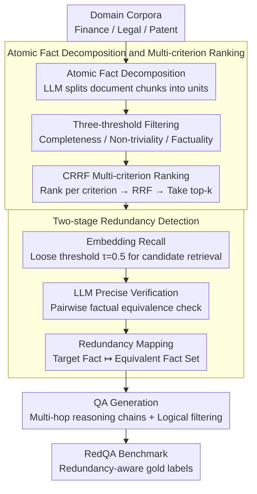

# RARE: Redundancy-Aware Retrieval Evaluation Framework for High-Similarity Corpora

**Conference**: ACL 2026  
**arXiv**: [2604.19047](https://arxiv.org/abs/2604.19047)  
**Code**: None  
**Area**: Information Retrieval/RAG  
**Keywords**: Redundancy-Aware Retrieval, High-Similarity Corpora, Multi-hop Retrieval Evaluation, Enterprise RAG, Atomic Fact Decomposition

## TL;DR

This paper proposes the RARE framework, which tracks cross-document redundancy by decomposing documents into atomic facts. It introduces CRRF (Criterion-separated Reciprocal Rank Fusion) to stabilize multi-criterion LLM judgments. By constructing the RedQA benchmark on high-redundancy enterprise corpora (Finance, Legal, Patents), the study reveals that for 4-hop high-overlap settings, the PerfRecall@10 of mainstream retrievers plummets from 66.4% to a range of 5.0-27.9%.

## Background & Motivation

**Background**: Existing QA benchmarks (e.g., HotpotQA, NQ, MS MARCO) assume minimal information overlap between documents, where each answer corresponds to a unique "gold" passage. Mainstream retrieval evaluation schemes perform well on these "low-overlap" corpora, driving the rapid development of dense retrieval technologies.

**Limitations of Prior Work**: (1) Enterprise-grade RAG systems actually operate on corpora such as financial annual reports, legal statutes, and patent documents, which are naturally high-redundancy and high-similarity—the same fact repeatedly appears in slightly different forms across multiple passages. (2) In high-redundancy scenarios, retrievers are unfairly penalized when returning "non-source passages" that nonetheless contain the correct answer information. (3) Excellent performance on existing benchmarks overestimates the true robustness of models in enterprise deployments.

**Key Challenge**: The core assumption of existing retrieval evaluation—that each answer has a unique gold passage—fails in enterprise corpora. There is a need for a framework that systematically tracks cross-document information redundancy and incorporates this redundancy into evaluation labels.

**Goal**: (1) Build a universal framework that allows practitioners to construct RAG evaluation benchmarks on their own domain corpora that truly reflect deployment conditions. (2) Quantify the gap between existing benchmarks and enterprise corpora.

**Key Insight**: Decomposing documents into minimal, indivisible "atomic fact" units allows for redundancy tracking at an atomic granularity. Atomic facts have lower noise in embedding space than passage-level representations, narrowing the gap between semantic similarity and factual equivalence and making LLM equivalence judgments more reliable.

**Core Idea**: Construct a redundancy-aware gold label set through atomic fact decomposition combined with two-stage redundancy detection (embedding retrieval + LLM verification). Simultaneously, use CRRF (criterion separation + reciprocal rank fusion) to stabilize multi-criterion LLM judgments, addressing quality control issues in data generation.

## Method

### Overall Architecture

RARE is a data construction pipeline that transforms domain document corpora into redundancy-aware multi-hop QA benchmarks. The core mechanism is to first reduce the granularity from "passage" to "atomic fact" and then track cross-document redundancy at this fine-grained level. It consists of three steps: first, effective information selection, where document chunks are split into atomic facts, invalid units are filtered, and facts are ranked by quality; second, systematic redundancy tracking, identifying semantically equivalent facts scattered across different passages at the atomic level; and third, QA generation, where atomic facts are combined into multi-hop reasoning chains and passed through logical filters to produce questions. The input consists of domain corpora (Finance, Legal, Patent), and the output is the RedQA benchmark with redundancy-aware gold labels—a retriever is judged correct if it hits any passage carrying equivalent facts, even if it is not the "original" source.

### Key Designs

**1. Atomic Fact Decomposition and Multi-criterion Ranking: Splitting passages into traceable, combinable minimal units**

In passages, multiple facts are often intertwined, which is neither conducive to precise redundancy tracking nor suitable as building blocks for multi-hop questions. RARE first uses an LLM to decompose each document chunk $C$ into atomic information units $\mathcal{A} = f_{\text{LLM}}(C)$. After passing through three minimum thresholds (completeness, non-triviality, factuality) to remove fragments, the remaining units are ranked by CRRF across five quality dimensions (validity, completeness, specificity, clarity, interrogatability), and the top-$k$ are selected. Atomic granularity isolates single statements, reducing the gap between semantic similarity and factual equivalence—supporting both precise redundancy judgment and providing flexible modules for multi-hop combinations.

**2. Two-stage Redundancy Detection: Embedding recall + LLM verification for gold evidence sets**

Relying solely on embedding similarity may misjudge "similar but non-equivalent" facts as redundant, while relying solely on pairwise LLM verification is too costly. RARE splits the process into recall and precision stages. The first stage uses embedding similarity with a loose threshold $\tau=0.5$ (prioritizing recall) to pull a candidate redundancy set $\mathcal{C}_\tau(a_t)$, ensuring equivalent facts are not missed. The second stage uses LLM judgment $\phi(a_t, a_j)$ for pairwise verification of factual equivalence, ultimately recording a redundancy map $a_t \mapsto \mathcal{R}(a_t)$ for each target atomic fact $a_t$. This map serves as the basis for redundancy-aware evaluation: if answer information appears in any passage within the map, it is counted as a retrieval hit.

**3. CRRF: Criterion-separated Reciprocal Rank Fusion for stable multi-criterion LLM judgment**

Asking an LLM to balance five competing criteria for joint ranking simultaneously often leads to unstable outputs, and cross-criterion confidence scores are inherently poorly calibrated. CRRF takes the opposite approach: it initiates individual LLM calls for each criterion to obtain per-criterion rankings $\text{rank}_i(x)$, and then calculates a comprehensive score using Reciprocal Rank Fusion $s(x) = \sum_{i=1}^{N} \frac{1}{\text{rank}_i(x)}$. This process discards LLM confidence values entirely and relies only on ordinal preferences. Criterion separation reduces mutual interference, and ordinal fusion is more reliable than calibrated probabilities—ablations show that separation improves performance by 11% over joint prompting, and RRF aggregation adds another 18% over score aggregation.

### Loss & Training

RARE is a data construction framework and does not involve end-to-end training. LLMs are used in inference mode throughout the pipeline (GPT-5 Nano for judgment, GPT-5 for question generation), with text-embedding-3-large handling similarity computations.

## Key Experimental Results

### Main Results

**Cross-domain Retrieval Performance (Qwen3-8B)**

| Domain | Coverage@10 | PerfRecall@10 | Redundancy (%) | Similarity (%) |
| :--- | :--- | :--- | :--- | :--- |
| General-Wiki | 93.58 | 88.66 | 1.4 | 8.8 |
| Patent | 84.05 | 63.12 | 49.7 | 29.0 |
| Finance | 72.92 | 47.44 | 63.2 | 35.1 |
| Legal | 67.16 | 41.49 | 25.1 | 40.7 |

### Ablation Study

**Ablation of CRRF Strategies (NDCG@3)**

| Prompting Strategy | Aggregation Method | GPT-5 Nano | GPT-5 |
| :--- | :--- | :--- | :--- |
| Vanilla | Base | 0.352 | 0.341 |
| Combined | RRF | 0.419 | 0.410 |
| Separate | Base | 0.391 | 0.387 |
| **Separate (CRRF)** | **RRF** | **0.463** | **0.467** |

### Key Findings

- Retrieval performance degradation is primarily driven by document similarity rather than redundancy—Legal has the highest similarity (40.7%) but lowest redundancy (25.1%), yet the worst PerfRecall@10 (41.49%), suggesting the "confusion effect" of similar documents is stronger than the "alternative path effect" of redundancy.
- Performance degrades sharply as hop depth increases: Finance drops from 90.1% for 1-hop to 8.5% for 4-hop, while General-Wiki maintains 66.4% at 4-hop.
- In CRRF, criterion separation improves performance by 11% over combined prompting (0.419→0.463), and RRF aggregation improves performance by 18% over score aggregation under separate prompting (0.391→0.463).
- End-to-end RAG experiments show that retrieval quality is the dominant lever—the accuracy of hit units is significantly higher than that of missed units.

## Highlights & Insights

- The approach of atomic fact decomposition is highly ingenious—it not only solves the granularity problem of redundancy tracking but also naturally provides combinable modules for multi-hop questions. This "decompose-then-recompose" logic is transferable to any scenario requiring precise content tracking.
- CRRF is a simple yet effective recipe for stabilizing LLM judgments—the idea of criterion separation + rank fusion can be directly applied to any task requiring multi-criterion LLM evaluation (e.g., paper reviewing, data quality assessment).
- The discovery that document similarity is a better predictor of retrieval degradation than redundancy has important implications for RAG system design—pre-deployment evaluation should prioritize document-to-document similarity in the corpus over redundancy.

## Limitations & Future Work

- Reliance on LLM judgments (GPT-5/GPT-5 Nano) for generation and verification inherits model-specific biases.
- The embedding similarity threshold $\tau=0.5$ is fixed; optimal settings may vary by domain.
- As hop depth increases, some generated questions become list-like—while logically valid, they are less natural.
- Future work could extend to non-English corpora and more enterprise domains.

## Related Work & Insights

- **vs. HotpotQA/NQ**: These assume low overlap between documents and are unsuitable for enterprise-grade RAG evaluation. RARE explicitly models high-overlap scenarios.
- **vs. BEIR/MTEB**: These provide standardized retrieval evaluation but rely on static annotations, failing to reflect redundancy dynamics during deployment.
- **vs. PoisonedRAG**: While focused on retrieval poisoning attacks, RARE focuses on evaluation fairness—viewing redundancy not as a threat but as a characteristic that should be correctly labeled.

## Rating

- Novelty: ⭐⭐⭐⭐ The combination of atomic fact redundancy tracking and CRRF is novel, although individual components have precedents.
- Experimental Thoroughness: ⭐⭐⭐⭐⭐ 4 domains, 9 retrievers, CRRF ablation, manual evaluation, and end-to-end RAG analysis.
- Writing Quality: ⭐⭐⭐⭐⭐ Clear motivation, modular framework, and rigorous experimental design.
- Value: ⭐⭐⭐⭐⭐ Fills a critical gap in enterprise-grade RAG evaluation; CRRF is widely reusable.

<!-- RELATED:START -->

## Related Papers

- [\[ACL 2026\] Reliable Evaluation Protocol for Low-Precision Retrieval](reliable_evaluation_protocol_for_low-precision_retrieval.md)
- [\[ACL 2026\] Disco-RAG: Discourse-Aware Retrieval-Augmented Generation](disco-rag_discourse-aware_retrieval-augmented_generation.md)
- [\[ACL 2026\] MTR-Suite: A Framework for Evaluating and Synthesizing Conversational Retrieval Benchmarks](mtr-suite_a_framework_for_evaluating_and_synthesizing_conversational_retrieval_b.md)
- [\[ACL 2025\] Evaluation of Attribution Bias in Generator-Aware Retrieval-Augmented Large Language Models](../../ACL2025/information_retrieval/evaluation_of_attribution_bias_in_generator-aware_retrieval-augmented_large_lang.md)
- [\[ACL 2026\] From Relevance to Authority: Authority-aware Generative Retrieval in Web Search Engines](from_relevance_to_authority_authority-aware_generative_retrieval_in_web_search_e.md)

<!-- RELATED:END -->
