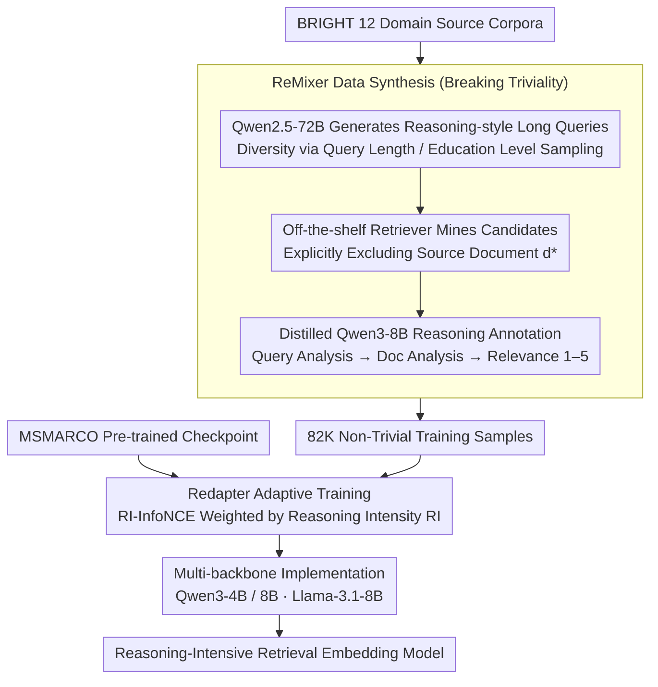

# ReasonEmbed: Enhanced Text Embeddings for Reasoning-Intensive Document Retrieval

**Conference**: ACL 2026  
**arXiv**: [2510.08252](https://arxiv.org/abs/2510.08252)  
**Code**: [https://github.com/VectorSpaceLab/agentic-search/tree/main/ReasonEmbed](https://github.com/VectorSpaceLab/agentic-search/tree/main/ReasonEmbed)  
**Area**: Information Retrieval / Reasoning-Intensive Retrieval  
**Keywords**: Text Embeddings, Reasoning-Intensive Retrieval, Synthetic Data, Adaptive Training, BRIGHT Benchmark

## TL;DR

ReasonEmbed introduces three technical innovations—the ReMixer non-trivial synthetic data method (82K high-quality samples), Redapter adaptive reasoning-intensity weighted training, and multi-backbone implementations—achieving an nDCG@10 of 38.1 on the BRIGHT benchmark, significantly outperforming all existing text embedding models by approximately 10 points.

## Background & Motivation

**Background**: With the rise of LLM-driven AI agents, many scenarios require retrieving information from external documents. Traditional retrieval (BM25, general embedding models) relies on keyword matching or shallow semantic matching, performing poorly on reasoning-intensive retrieval benchmarks like BRIGHT.

**Limitations of Prior Work**: (1) Scarcity of training data—existing retrieval datasets originate from traditional search scenarios, differing significantly from reasoning-intensive retrieval in query formats and domain knowledge; (2) Triviality in synthetic data—existing synthesis methods generate queries with overly direct relationships with documents (similar words, keyword overlap), allowing models to achieve high scores through surface-level matching; (3) Marginal gains from existing methods—pioneering works like ReasonIR bring only limited improvements.

**Key Challenge**: Reasoning-intensive retrieval requires models to understand deep semantic relations between queries and documents (requiring multi-step reasoning to judge relevance), but the triviality of current synthetic data allows models to take shortcuts—learning surface patterns rather than reasoning capabilities.

**Goal**: To address the triviality problem in synthetic data, design a reasoning-intensity-aware training strategy, and construct an efficient embedding model for reasoning-intensive retrieval.

**Key Insight**: The authors identify "triviality" as the core bottleneck—if the positive sample is the source document used to generate the query, both share significant surface cues. By excluding the source document, mining candidates through independent retrieval, and filtering positive samples with reasoning-enhanced annotation, one can build training data that truly requires reasoning for judgment.

**Core Idea**: Eliminate triviality through a three-stage pipeline of "source document exclusion + candidate mining + reasoning annotation," and use reasoning intensity to adaptively adjust sample weights, focusing the model on difficult samples that require deep reasoning.

## Method

### Overall Architecture

ReasonEmbed aims to train text embeddings capable of reasoning-intensive retrieval. The difficulty lies in the "triviality" of existing synthetic data—positive samples are often the source documents used to generate queries, sharing surface cues that allow models to succeed via literal matching without learning reasoning. It revolves around a data-driven pipeline: first, synthesizing 82K non-trivial samples from BRIGHT’s 12 domain corpora using the ReMixer three-stage process (Qwen2.5-72B generates conditional queries, off-the-shelf retrievers mine candidates, and a distilled Qwen3-8B reasoning annotator labels them). Second, Redapter adaptively weights samples by reasoning intensity for continued training on MSMARCO pre-trained checkpoints using the RI-InfoNCE loss. Finally, the method is replicated across multiple LLM backbones to verify universality. The input is the domain corpus, and the output is an embedding model with integrated parameters for "judging relevance through reasoning."

### Key Designs

**1. ReMixer Data Synthesis: Breaking "Triviality" via Source Document Exclusion**

The fundamental flaw of synthetic data lies in the overly direct connection between a query and its source document, which allows models to take shortcuts via surface matching. ReMixer dismantles this shortcut in three stages: first, using Qwen2.5-72B to generate long queries from source documents that require reasoning, while increasing diversity through query length and user education level sampling. A critical step involves explicitly excluding the source document $d_q^*$ during candidate mining, instead using off-the-shelf retrievers to fetch candidates $\mathcal{C}_q \leftarrow \text{Top-k}\{\phi(q,d) \mid D/d_q^*\}$ from the rest of the corpus. Finally, a distilled reasoning LLM performs three-stage annotation (query analysis → document analysis → relevance judgment on a 1–5 scale) to filter positive samples. By excluding the source document, positive samples become documents that are "different in form but essentially relevant," requiring the model to truly reason to discover these relationships—a step that contributes +18.4 points in ablation studies.

**2. Redapter Adaptive Training: Tilting Capacity toward Hard Samples via Reasoning Intensity**

Simple samples saturate quickly, making continued training on them wasteful; the truly valuable samples are those requiring deep reasoning. Redapter quantifies a reasoning intensity for each sample as $\text{RI}_\theta(s) = \min(\mathcal{L}_{q,D} / \mathcal{L}_{q',D}, \kappa)$, where $q'$ is the reasoning-enhanced query—the higher this ratio, the more the retrieval benefits from rewriting the query to be more "reasoning-heavy," indicating the original sample is more dependent on reasoning for correct retrieval. During training, the normalized reasoning intensity serves as the sample weight for the InfoNCE loss, tilting gradients towards difficult samples with high reasoning intensity. This metric can be calculated dynamically during training without additional annotation.

**3. Multi-backbone Implementation: Verifying Gains from Data and Training rather than Specific Models**

To rule out the explanation that "improvements are driven by specific backbones," ReasonEmbed is implemented across three backbones: Qwen3-4B, Qwen3-8B, and Llama-3.1-8B, all initialized from the same MSMARCO pre-trained checkpoint. All three consistently show significant leads (with Llama-3.1-8B reaching 36.2), demonstrating that the actual efficacy comes from the de-trivialized data and the reasoning-intensity-weighted training strategy.

### Loss & Training

Training utilizes the RI-InfoNCE loss $\mathcal{L}_{RI} = \sum_{s \in B} f(\text{RI}_\theta(s), B) \cdot \mathcal{L}_{q,D}$, where $f$ is a batch-wise reasoning intensity normalization function and $\mathcal{L}_{q,D}$ is the standard InfoNCE (comprising 1 positive sample, in-batch negatives, and hard negatives). The annotator is a lightweight model derived by distilling the reasoning trajectories of Qwen3-235B into Qwen3-8B, balancing annotation quality and cost.

## Key Experimental Results

### Main Results (BRIGHT nDCG@10)

| Model | Scale | Avg nDCG@10 |
|-------|-------|-------------|
| BM25 | - | 14.5 |
| OpenAI-3-Large | - | 17.9 |
| gte-Qwen2-7B | 7B | 23.5 |
| ReasonIR-8B | 8B | 24.4 |
| DIVER-Retriever | 4B | 28.9 |
| **ReasonEmbed-Qwen3-4B** | 4B | **37.1** |
| **ReasonEmbed-Qwen3-8B** | 8B | **38.1** |

### Ablation Study

| Configuration | Avg nDCG@10 | Description |
|---------------|-------------|-------------|
| Qwen3-8B Base InfoNCE | 37.1 | Using ReMixer data only |
| Qwen3-8B + Redapter | **38.1** | +1.0 gain from adaptive weighting |
| Qwen3-8B-ms (MSMARCO only) | 18.7 | No synthetic data |

### Key Findings

- ReasonEmbed-Qwen3-4B (37.1) already outperforms all existing models, exceeding the strongest baseline DIVER (28.9) by 8.2 points.
- ReMixer data is the primary contributor—improving performance from 18.7 to 37.1 (+18.4), while Redapter contributes an additional +1.0.
- Consistent and significant leads across all 12 sub-tasks, with the largest gains in StackExchange categories (requiring domain reasoning) and Coding categories (requiring code reasoning).
- The Llama-3.1-8B backbone is equally effective (36.2), proving the method does not rely on a specific model.
- De-trivialization is critical—models trained by directly using source documents as positive samples perform significantly worse than ReMixer.

## Highlights & Insights

- The identification and verification of the "triviality" concept are highly valuable—revealing the fundamental flaw in existing synthetic data methods. The simple operation of "excluding source documents and mining candidates independently" brought massive improvements, indicating that data quality is far more important than quantity.
- The definition of reasoning intensity is clever—quantifying the "helpfulness of reasoning for retrieval" using the loss change ratio after reasoning-based query rewriting, which can be computed dynamically during training without extra labels.
- Distilling a reasoning LLM into a lightweight annotator effectively balances annotation quality and cost.

## Limitations & Future Work

- Evaluation is mainly focused on the BRIGHT benchmark, which might involve over-fitting to its specific characteristics.
- Synthetic data is derived from the 12 source corpora of BRIGHT, resulting in limited domain coverage.
- The contribution of Redapter (+1.0) is relatively small compared to ReMixer (+18.4); the value of the adaptive strategy needs more verification.
- The selection of the reasoning intensity threshold $\kappa$ relies on empirical tuning.

## Related Work & Insights

- **vs ReasonIR**: ReasonIR uses scientific corpora to synthesize long queries and hard negatives but fails to address the triviality problem (24.4). ReasonEmbed completely solves triviality through source document exclusion (38.1), gain of 13.7 points.
- **vs DIVER**: DIVER uses more complex retrieval-augmented generation (28.9) but still suffers from triviality. ReasonEmbed proves that fundamental improvements in data quality are more effective than methodological complexity.

## Rating

- Novelty: ⭐⭐⭐⭐ Identification and resolution of the triviality problem are novel; adaptive reasoning-intensity training is valuable.
- Experimental Thoroughness: ⭐⭐⭐⭐⭐ 12 sub-tasks, multi-backbone, complete ablation; the performance gain is massive.
- Writing Quality: ⭐⭐⭐⭐ Clear structure, precise problem definitions.
- Value: ⭐⭐⭐⭐⭐ Sets a new SOTA on BRIGHT (+10 points), providing significant momentum for reasoning-intensive retrieval.

<!-- RELATED:START -->

## Related Papers

- [\[ACL 2026\] A Survey of Reasoning-Intensive Retrieval: Progress and Challenges](a_survey_of_reasoning-intensive_retrieval_progress_and_challenges.md)
- [\[ICLR 2026\] Retro*: Optimizing LLMs for Reasoning-Intensive Document Retrieval](../../ICLR2026/information_retrieval/retro_optimizing_llms_for_reasoning-intensive_document_retrieval.md)
- [\[ACL 2026\] VisRet: Visualization Improves Knowledge-Intensive Text-to-Image Retrieval](visret_visualization_improves_knowledge-intensive_text-to-image_retrieval.md)
- [\[ACL 2026\] Why Mean Pooling Works: Quantifying Second-Order Collapse in Text Embeddings](why_mean_pooling_works_quantifying_second-order_collapse_in_text_embeddings.md)
- [\[AAAI 2026\] PRIME: Planning and Retrieval-Integrated Memory for Enhanced Reasoning](../../AAAI2026/information_retrieval/prime_planning_and_retrieval-integrated_memory_for_enhanced_reasoning.md)

<!-- RELATED:END -->
