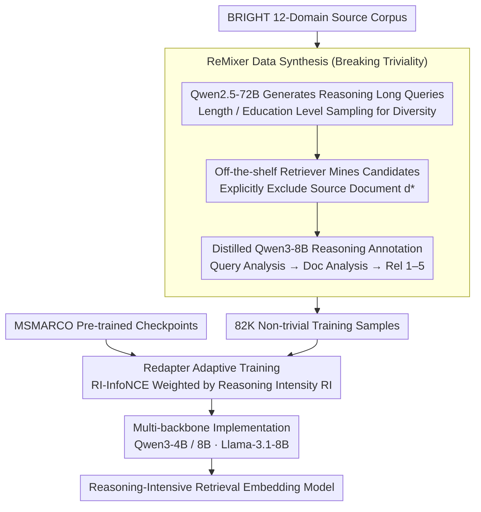

# ReasonEmbed: Enhanced Text Embeddings for Reasoning-Intensive Document Retrieval

**Conference**: ACL 2026  
**arXiv**: [2510.08252](https://arxiv.org/abs/2510.08252)  
**Code**: [https://github.com/VectorSpaceLab/agentic-search/tree/main/ReasonEmbed](https://github.com/VectorSpaceLab/agentic-search/tree/main/ReasonEmbed)  
**Area**: Information Retrieval / Reasoning-Intensive Retrieval  
**Keywords**: Text Embeddings, Reasoning-Intensive Retrieval, Synthetic Data, Adaptive Training, BRIGHT Benchmark

## TL;DR

ReasonEmbed introduces three technical innovations: the ReMixer non-trivial synthetic data method (82K high-quality samples), Redapter adaptive reasoning intensity weighted training, and a multi-backbone implementation. It significantly outperforms all existing text embedding models by approximately 10 points with an nDCG@10 of 38.1 on the BRIGHT benchmark.

## Background & Motivation

**Background**: With the rise of LLM-driven AI agents, many scenarios require retrieving information from external documents. Traditional retrieval (BM25, general embedding models) relies on keyword matching or shallow semantic matching, performing poorly on reasoning-intensive retrieval benchmarks like BRIGHT.

**Limitations of Prior Work**: (1) Scarcity of training data—existing retrieval datasets originate from traditional search scenarios, which differ vastly from reasoning-intensive retrieval in query form and domain knowledge; (2) Triviality in synthetic data—existing synthesis methods generate queries with over-direct relationships to documents (similar words, keyword overlap), allowing models to achieve high scores through surface matching; (3) Marginal gains from existing methods—pioneering work like ReasonIR has only brought incremental improvements.

**Key Challenge**: Reasoning-intensive retrieval requires models to understand deep semantic relationships between queries and documents (multi-step reasoning is needed to judge relevance). However, the triviality of existing synthetic data allows models to take shortcuts, learning surface patterns rather than reasoning capabilities.

**Goal**: To solve the triviality problem in synthetic data, design a reasoning intensity-aware training strategy, and construct high-performance embedding models for reasoning-intensive retrieval.

**Key Insight**: The authors identify "triviality" as the core bottleneck—if the positive sample is the source document used to generate the query, both share significant surface cues. By excluding the source document, mining candidates from independent retrieval, and filtering positives with reasoning-enhanced annotation, training data that truly requires reasoning can be constructed.

**Core Idea**: Utilize a three-stage pipeline of "source document exclusion + candidate mining + reasoning annotation" to eliminate triviality, then adaptively adjust sample weights based on reasoning intensity to focus the model on difficult samples requiring deep reasoning.

## Method

### Overall Architecture

The goal of ReasonEmbed is to train text embeddings capable of reasoning-intensive retrieval. The difficulty lies in the "triviality" of existing synthetic data—positive samples are often the source documents used for query generation, sharing many surface cues that allow models to score high via literal matching without learning to reason. The method addresses this through a data-driven pipeline: first, the ReMixer three-stage process synthesizes 82K non-trivial samples from 12 domain corpora in BRIGHT (Qwen2.5-72B generates conditional queries, off-the-shelf retrievers mine candidates, and a distilled Qwen3-8B reasoning annotator labels them). Then, Redapter adaptively weights samples by reasoning intensity for continual training on MSMARCO pre-trained checkpoints using the RI-InfoNCE loss. Finally, it is replicated across multiple LLM backbones to verify universality. The input is domain corpora, and the output is an embedding model with the capability to identify "relevance requiring reasoning" embedded in its parameters.

### Key Designs

**1. ReMixer Data Synthesis: Breaking "Triviality" via Source Document Exclusion**

The fundamental flaw of synthetic data is the direct connection between a query and its source document, allowing models to take a shortcut via surface matching. ReMixer dismantles this shortcut in three stages: first, Qwen2.5-72B generates long queries requiring reasoning from source documents, with diversity increased through query length and user education level sampling; a critical step is explicitly excluding the source document $d_q^*$ during candidate mining, instead using off-the-shelf retrievers to fetch candidates $\mathcal{C}_q \leftarrow \text{Top-k}\{\phi(q,d) \mid D/d_q^*\}$ from the rest of the corpus; finally, a distilled reasoning LLM performs a three-stage annotation (query analysis → document analysis → relevance judgment, 1–5 scale) to filter positive samples. After excluding the source document, positive samples become documents that are "different in form but essentially related," requiring the model to truly reason to discover the relationship—this was the primary source of the +18.4 point gain in ablation studies.

**2. Redapter Adaptive Training: Tilting Capacity towards Difficult Samples via Reasoning Intensity**

Simple samples saturate quickly, and continuing training on them is wasteful; samples requiring deep reasoning are more valuable. Redapter quantifies a reasoning intensity for each sample as $\text{RI}_\theta(s) = \min(\mathcal{L}_{q,D} / \mathcal{L}_{q',D}, \kappa)$, where $q'$ is the reasoning-enhanced query. A higher ratio indicates that rewriting the query to be more "reasoning-capable" helps retrieval more, meaning the original sample relies heavily on reasoning for correct retrieval. During training, normalized reasoning intensity is used as a weight for the InfoNCE loss, tilting the gradient toward high-intensity difficult samples. This metric does not require additional annotation and can be calculated dynamically during training.

**3. Multi-backbone Implementation: Verifying Gains from Data and Training Rather than a Specific Model**

To rule out the explanation that "improvements are brought by a specific backbone," ReasonEmbed is implemented across three different backbones: Qwen3-4B, Qwen3-8B, and Llama-3.1-8B, all initialized from the same MSMARCO pre-trained checkpoints. All three consistently outperformed baselines significantly (with Llama-3.1-8B reaching 36.2), proving that the de-trivialized data and reasoning intensity-weighted training strategy are the true drivers of performance.

### Loss & Training

Training utilizes the RI-InfoNCE loss: $\mathcal{L}_{RI} = \sum_{s \in B} f(\text{RI}_\theta(s), B) \cdot \mathcal{L}_{q,D}$, where $f$ is the in-batch reasoning intensity normalization function and $\mathcal{L}_{q,D}$ is the standard InfoNCE (including 1 positive sample plus in-batch and hard negatives). The annotator is a lightweight model obtained by distilling reasoning trajectories from Qwen3-235B into Qwen3-8B, balancing annotation quality and cost.

## Key Experimental Results

### Main Results (BRIGHT nDCG@10)

| Model | Scale | Avg nDCG@10 |
|------|------|-------------|
| BM25 | - | 14.5 |
| OpenAI-3-Large | - | 17.9 |
| gte-Qwen2-7B | 7B | 23.5 |
| ReasonIR-8B | 8B | 24.4 |
| DIVER-Retriever | 4B | 28.9 |
| **ReasonEmbed-Qwen3-4B** | 4B | **37.1** |
| **ReasonEmbed-Qwen3-8B** | 8B | **38.1** |

### Ablation Study

| Configuration | Avg nDCG@10 | Description |
|------|-------------|------|
| Qwen3-8B Base InfoNCE | 37.1 | Using ReMixer data only |
| Qwen3-8B + Redapter | **38.1** | +1.0 from adaptive weighting |
| Qwen3-8B-ms (MSMARCO only) | 18.7 | No synthetic data |

### Key Findings

- ReasonEmbed-Qwen3-4B (37.1) already exceeds all existing models, outperforming the strongest baseline DIVER (28.9) by 8.2 points.
- ReMixer data is the primary contributor—improving performance from 18.7 to 37.1 (+18.4), with Redapter providing an additional +1.0.
- Consistent large gains across all 12 sub-tasks, with the greatest improvements in StackExchange (requiring domain reasoning) and Coding (requiring code reasoning).
- The Llama-3.1-8B backbone is equally effective (36.2), proving the method is not model-dependent.
- De-trivialization is core—models trained with the source document as the positive sample performed significantly worse than ReMixer.

## Highlights & Insights

- The proposal and validation of the "triviality" concept are highly valuable—revealing fundamental flaws in existing synthetic data methods. The simple operation of "excluding the source document and independently mining candidates" brought massive improvements, suggesting data quality is far more important than quantity.
- The reasoning intensity definition is clever—quantifying "how much reasoning helps retrieval" using the loss change ratio after query rewriting, which requires no extra labels and can be computed dynamically.
- Distilling a reasoning LLM into a lightweight annotator balances quality and cost effectively.

## Limitations & Future Work

- Evaluation is primarily on the BRIGHT benchmark, which may involve over-fitting to its specific characteristics.
- Synthetic data is derived from the 12 source corpora in BRIGHT, resulting in limited domain coverage.
- The contribution of Redapter (+1.0) is relatively small compared to ReMixer (+18.4); the value of the adaptive strategy requires further validation.
- The selection of the reasoning intensity threshold $\kappa$ is empirical.

## Related Work & Insights

- **vs ReasonIR**: ReasonIR uses scientific corpora to synthesize long queries and hard negatives but fails to address the triviality problem (24.4). ReasonEmbed fundamentally solves triviality via source document exclusion (38.1), an improvement of 13.7 points.
- **vs DIVER**: DIVER uses more complex retrieval-augmented generation (28.9) but still suffers from triviality. ReasonEmbed proves that fundamental improvements in data quality are more effective than methodological complexity.

## Rating

- Novelty: ⭐⭐⭐⭐ Identification of the triviality problem and the solution approach are novel; reasoning intensity adaptive training is valuable.
- Experimental Thoroughness: ⭐⭐⭐⭐⭐ Comprehensive evaluation across 12 sub-tasks, multiple backbones, and full ablation; improvements are massive.
- Writing Quality: ⭐⭐⭐⭐ Clear structure with precise problem definitions.
- Value: ⭐⭐⭐⭐⭐ Sets a new state-of-the-art on BRIGHT (+10 points), providing a significant push for the field of reasoning-intensive retrieval.

<!-- RELATED:START -->

## Related Papers

- [\[ACL 2026\] A Survey of Reasoning-Intensive Retrieval: Progress and Challenges](a_survey_of_reasoning-intensive_retrieval_progress_and_challenges.md)
- [\[ACL 2026\] VisRet: Visualization Improves Knowledge-Intensive Text-to-Image Retrieval](visret_visualization_improves_knowledge-intensive_text-to-image_retrieval.md)
- [\[AAAI 2026\] PRIME: Planning and Retrieval-Integrated Memory for Enhanced Reasoning](../../AAAI2026/information_retrieval/prime_planning_and_retrieval-integrated_memory_for_enhanced_reasoning.md)
- [\[ACL 2026\] Why Mean Pooling Works: Quantifying Second-Order Collapse in Text Embeddings](why_mean_pooling_works_quantifying_second-order_collapse_in_text_embeddings.md)
- [\[ICLR 2026\] RefTool: Reference-Guided Tool Creation for Knowledge-Intensive Reasoning](../../ICLR2026/information_retrieval/reftool_reference-guided_tool_creation_for_knowledge-intensive_reasoning.md)

<!-- RELATED:END -->
