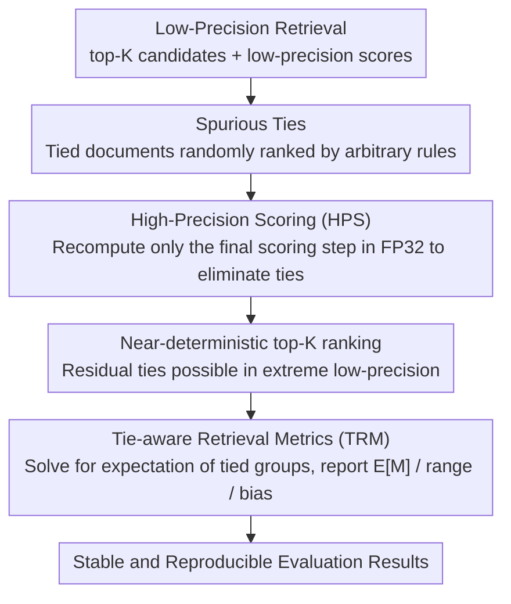

# Reliable Evaluation Protocol for Low-Precision Retrieval

**Conference**: ACL 2026  
**arXiv**: [2508.03306](https://arxiv.org/abs/2508.03306)  
**Code**: None  
**Area**: Others  
**Keywords**: Low-Precision Retrieval, Spurious Ties, Evaluation Protocol, High-Precision Scoring, Tie-aware Metrics

## TL;DR

This paper reveals that low-precision (e.g., binarized/quantized embeddings) retrieval systems produce numerous spurious ties during evaluation due to reduced score granularity, leading to highly unstable results. It proposes two complementary strategies, HPS (High-Precision Scoring) and TRM (Tie-aware Metrics), to ensure more reliable and consistent evaluation for low-precision retrieval.

## Background & Motivation

**Background**: Reducing numerical precision for model parameters and computations (e.g., FP16, INT8, binarization) is a mainstream approach to enhance the efficiency of retrieval systems. Low-precision representations significantly reduce storage requirements and accelerate similarity computations, which is critical in large-scale retrieval scenarios.

**Limitations of Prior Work**: When relevance scores between queries and documents are computed using low-precision values, many distinct documents receive identical scores due to coarse numerical granularity, resulting in "spurious ties." For example, in binarized embeddings, Hamming distance has limited discrete values, causing many documents to share the same distance. The ranking of these tied documents relies on arbitrary tie-breaking rules (e.g., document ID order), leading to high random fluctuations in evaluation metrics such as nDCG and MRR.

**Key Challenge**: While the efficiency gains of low-precision retrieval are real, its retrieval quality cannot be reliably evaluated—the same model can yield significantly different scores depending on the tie-breaking strategy. This makes model comparison and the identification of improvement directions unreliable.

**Goal**: Design an evaluation protocol to obtain stable, reproducible, and meaningful evaluation results under the constraints of low-precision retrieval.

**Key Insight**: The root cause is that "low scoring precision leads to ties." The solution follows two paths: (1) eliminating ties during the scoring phase by improving precision, and (2) perceiving ties and reporting uncertainty during the metric calculation phase.

**Core Idea**: Elevate the final scoring step to high precision (HPS) to eliminate ties with minimal computational overhead, while simultaneously designing tie-aware retrieval metrics (TRM) to report expected values and uncertainty ranges.

## Method

### Overall Architecture

The evaluation protocol addresses the root cause of "random ranking jitter caused by low-precision scoring" by intervening in both scoring and metric calculation. The input consists of top-K candidates and low-precision scores from a retrieval system, and the output is a stable, reproducible evaluation result. The two components are independent but complementary: HPS eliminates ties at a minimal cost during scoring to make rankings deterministic; TRM addresses residual ties at the metric stage by explicitly reporting the range of possible metric values instead of ignoring the ties. The paper analyzes the causes of ties for three mainstream scoring functions—softmax/sigmoid in cross-encoders and pairwise product in dual-encoders—verifying that HPS and TRM are effective across all of them, making the protocol model-agnostic.

### Key Designs

**1. High-Precision Scoring (HPS): Eliminating spurious ties at the root by adding precision only in the final step**

Spurious ties stem from coarse numerical granularity. Scoring functions like softmax, sigmoid, or pairwise products compress logits into narrow ranges; when represented with low-precision floats (e.g., BF16, FP16), the available numerical values are fewer and binning becomes coarser. Consequently, many distinct documents are mapped to identical scores, leaving the ranking dominated by arbitrary tie-breaking rules (like document ID order). HPS allows the entire retrieval process to remain in low precision for efficiency but converts only the final scoring step ($\phi$ in Equation 1) to high precision (FP32) for recomputation. Since evaluation metrics are most sensitive to top positions and the number of top-K documents is limited, this step adds <1% additional computation while nearly eliminating ties within the top-K—a high-return, minimal-intervention design.

**2. Tie-aware Retrieval Metrics (TRM): Quantifying uncertainty honestly rather than ignoring it**

Even with HPS, residual ties may persist in extreme low-precision scenarios. In such cases, reporting a single deterministic value is misleading. TRM considers all possible ranking permutations for each tied document group and reports the expected value $E[M]$, the maximum value $M_{max}$, the minimum value $M_{min}$, and the bias relative to the default ranking $M_{bias} = E[M] - M_{default}$. Implementation-wise, it adopts closed-form formulas by McSherry & Najork to solve in linear time without enumerating all permutations. This transforms the evaluation from a "point estimate potentially with systematic bias" into a "transparent interval estimation": a positive bias indicates the default strategy systematically overestimates the score, while the range quantifies the sensitivity of the conclusion to tie-breaking.

## Key Experimental Results

### Main Results

| Scoring Function | Precision | Tie Rate (w/o HPS) | Tie Rate (w/ HPS) | nDCG@10 CV |
| :--- | :--- | :--- | :--- | :--- |
| Inner Product | INT8 | Medium | ~0% | Significantly Reduced |
| Cosine Similarity | BF16 | Low | ~0% | Reduced to Negligible |
| Hamming Distance | 1-bit | Extremely High (>50%) | Significantly Reduced | Significantly Reduced |
| Inner Product | 4-bit | High | ~0% | Eliminated Jitter |

### Ablation Study

| Configuration | Metric Stability | Description |
| :--- | :--- | :--- |
| Original Low-Precision Eval | High Variation | Large metric differences across random seeds |
| HPS Only | High Stability | Deterministic ranking after tie elimination |
| TRM Only | Medium | Reports range but does not eliminate cause |
| HPS + TRM | Optimal | Most ties eliminated + honest reporting of residual uncertainty |

### Key Findings

- Ties in Hamming distance (1-bit embeddings) are most severe—over 50% of top-100 candidates may be tied with others, causing nDCG@10 fluctuations of over 15%.
- HPS demonstrates significant efficacy with minimal overhead: rescoring only the top-1000 candidates eliminates almost all ties.
- TRM reveals that default tie-breaking strategies (sorting by document ID) often introduce systematic bias, causing reported metrics to be over- or under-estimated.
- Above conclusions were consistently validated across multiple models on two retrieval datasets (MS MARCO and BEIR).

## Highlights & Insights

- **Simple yet previously overlooked problem**: Papers on low-precision retrieval rarely discuss the impact of ties on evaluation, yet this issue can render experimental conclusions completely unreliable. The core contribution is bringing community awareness to this problem.
- **High cost-benefit ratio of HPS**: Solving a severe problem with almost zero-cost modifications exemplifies an elegant "minimal intervention" design.
- **The "honest reporting" philosophy of TRM** can be extended to other evaluation scenarios involving uncertainty, such as position bias in recommendation systems or metric fluctuations due to random sampling in generative tasks.

## Limitations & Future Work

- The paper primarily focuses on ties during retrieval evaluation; however, similar issues may exist during the training phase of Learning to Rank (LTR), which is not explored here.
- HPS requires access to original high-precision embeddings or the ability to recompute them; it cannot be used if only quantized embeddings are available.
- The analytical computation of TRM may become computationally complex under extreme tie conditions (e.g., hundreds of documents with the same score).
- Future research could investigate how different quantization schemes affect ties to guide the design of better quantization strategies.

## Related Work & Insights

- **vs. Standard Retrieval Evaluation**: Standard evaluations (e.g., TREC eval) assume continuous scores and ignore ties; this protocol serves as a necessary supplement.
- **vs. Embedding Quantization Research**: Existing research focuses on the precision-efficiency trade-off but neglects the reliability of the evaluation itself. This paper suggests that quantization research requires more cautious evaluation protocols.
- **vs. Tie-handling in LTR**: A small body of work in the LTR field has discussed ties, but none have provided a systematic solution specifically for low-precision scenarios.

## Rating

- Novelty: ⭐⭐⭐⭐ The problem definition is clear and novel; though the technical approach is simple, the insights are valuable.
- Experimental Thoroughness: ⭐⭐⭐⭐ Systematically designed experiments across multiple scoring functions, precisions, and datasets.
- Writing Quality: ⭐⭐⭐⭐⭐ Clear problem articulation and elegant solutions.
- Value: ⭐⭐⭐⭐ Provides essential evaluation infrastructure for the low-precision retrieval community.

<!-- RELATED:START -->

## Related Papers

- [\[ACL 2026\] AuthorityBench: Benchmarking LLM Authority Perception for Reliable Retrieval-Augmented Generation](authoritybench_benchmarking_llm_authority_perception_for_reliable_retrieval-augm.md)
- [\[ACL 2026\] RARE: Redundancy-Aware Retrieval Evaluation Framework for High-Similarity Corpora](rare_redundancy-aware_retrieval_evaluation_framework_for_high-similarity_corpora.md)
- [\[NeurIPS 2025\] Retrieval-Augmented Generation for Reliable Interpretation of Radio Regulations](../../NeurIPS2025/information_retrieval/retrieval-augmented_generation_for_reliable_interpretation_of_radio_regulations.md)
- [\[ACL 2025\] Unanswerability Evaluation for Retrieval Augmented Generation](../../ACL2025/information_retrieval/unanswerability_evaluation_for_retrieval_augmented_generation.md)
- [\[ACL 2025\] LDIR: Low-Dimensional Dense and Interpretable Text Embeddings with Relative Representations](../../ACL2025/information_retrieval/ldir_low-dimensional_dense_and_interpretable_text_embeddings_with_relative_repre.md)

<!-- RELATED:END -->
