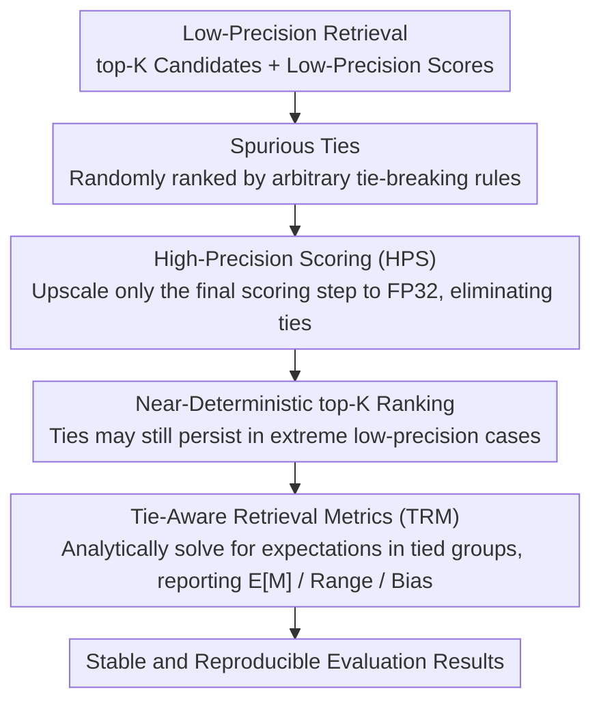

# Reliable Evaluation Protocol for Low-Precision Retrieval

**Conference**: ACL 2026  
**arXiv**: [2508.03306](https://arxiv.org/abs/2508.03306)  
**Code**: None  
**Area**: Others  
**Keywords**: Low-Precision Retrieval, Spurious Ties, Evaluation Protocol, High-Precision Scoring, Tie-Aware Metrics

## TL;DR

Reveals that low-precision (e.g., binary/quantized embedding) retrieval systems generate massive "spurious ties" during evaluation due to reduced score granularity, leading to highly unstable results. Proposes two complementary strategies: HPS (High-Precision Scoring) and TRM (Tie-Aware Metrics), making low-precision retrieval evaluation more reliable and consistent.

## Background & Motivation

**Background**: Reducing numerical precision of model parameters and computations (e.g., FP16, INT8, binarization) is a mainstream method for improving retrieval system efficiency. Low-precision representations can significantly reduce storage and accelerate similarity calculations, which is crucial in large-scale retrieval scenarios.

**Limitations of Prior Work**: When calculating relevance scores between queries and documents using low-precision values, the coarse granularity causes many originally distinct documents to receive identical scores, creating "spurious ties." For instance, in binarized embeddings, Hamming distance has a limited set of discrete values, resulting in many documents having the exact same distance. The ranking of these tied documents depends on arbitrary tie-breaking rules (e.g., document ID order), causing highly random fluctuations in evaluation metrics such as nDCG and MRR.

**Key Challenge**: While the efficiency gains of low-precision retrieval are genuine, its retrieval quality cannot be reliably evaluated—the same model can produce widely different evaluation scores under different tie-breaking strategies. This makes model comparison and the determination of improvement directions unreliable.

**Goal**: Design an evaluation protocol to obtain stable, reproducible, and meaningful evaluation results under the constraints of low-precision retrieval.

**Key Insight**: The root cause is "ties caused by low scoring precision." Solving this naturally leads to two paths: (1) increase precision during the scoring phase to eliminate ties; (2) account for ties during the metric calculation phase and report uncertainty.

**Core Idea**: Elevate the final scoring step to high precision (HPS) to eliminate ties at low computational cost, while designing tie-aware retrieval metrics (TRM) to report expected values and uncertainty ranges.

## Method

### Overall Architecture

This evaluation protocol targets the root cause—"spurious ties from low-precision scoring lead to random ranking jitter"—by intervening in both the scoring and metric calculation phases. The input consists of top-K candidates and their low-precision scores returned by the retrieval system, and the output is stable, reproducible evaluation results. The two components are independent but complementary: HPS eliminates ties with minimal cost at the scoring stage, while TRM directly addresses residual ties at the metric stage by reporting the range of possible metric values.

### Key Designs

**1. High-Precision Scoring (HPS): Eliminating spurious ties at the root by adding precision only in the final step**

Spurious ties stem from coarse numerical granularity. Scoring functions like softmax, sigmoid, and pairwise products compress logits into narrow intervals; when represented in low-precision floating point (e.g., BF16, FP16), the number of representable values decreases, leading to many documents being mapped to the exact same score. HPS allows the entire retrieval process to remain low-precision for efficiency but upscales only the final scoring step ($\phi$ in Equation 1) to high precision (FP32) for re-calculation, leaving forward propagation unchanged. Since metrics are most sensitive to top positions and the number of top-K documents is limited, this step incurs <1% extra computation while almost entirely eliminating ties within the top-K.

**2. Tie-Aware Retrieval Metrics (TRM): Quantifying uncertainty rather than ignoring it**

Even with HPS, ties may persist in extreme low-precision scenarios. Reporting a single deterministic value in such cases is misleading. TRM considers all possible ranking permutations for each tied document group and reports the expected value $E[M]$, maximum value $M_{max}$, minimum value $M_{min}$, and the bias relative to the default ranking $M_{bias} = E[M] - M_{default}$. Implementation follows the closed-form formulas of McSherry & Najork to solve in linear time without enumerating all permutations. This transforms the evaluation from a potentially biased point estimate into an honest interval estimate.

## Key Experimental Results

### Main Results

| Scoring Function | Precision | Tie Rate (w/o HPS) | Tie Rate (w/ HPS) | nDCG@10 CV |
|------------------|-----------|--------------------|-------------------|------------|
| Dot Product      | INT8      | Medium             | ~0%               | Significantly Reduced |
| Cosine Similarity| BF16      | Low                | ~0%               | Negligible |
| Hamming Distance | 1-bit     | Extremely High (>50%) | Significantly Reduced | Significantly Reduced |
| Dot Product      | 4-bit     | High               | ~0%               | Eliminated Fluctuation |

### Ablation Study

| Configuration | Metric Stability | Description |
|---------------|------------------|-------------|
| Original Low-Precision Eval | High Variance | Large metric differences across random seeds |
| Only HPS      | High Stability   | Deterministic ranking after tie elimination |
| Only TRM      | Medium           | Reports ranges without eliminating the root cause |
| HPS + TRM     | Optimal          | Eliminates most ties + honestly reports residual uncertainty |

### Key Findings

- Hamming distance (1-bit embeddings) suffers most severely; over 50% of candidates in the top-100 may be tied, causing nDCG@10 fluctuations of up to 15%+.
- HPS has minimal computational overhead but significant impact: re-scoring only the top-1000 candidates eliminates nearly all ties.
- TRM reveals that default tie-breaking strategies (like sorting by docID) often introduce systematic bias, leading to over- or under-reported metrics.
- Findings are consistently validated across multiple models on two retrieval datasets (MS MARCO, BEIR).

## Highlights & Insights

- **Simple problem, previously overlooked**: Papers on low-precision retrieval rarely discuss the impact of ties on evaluation, yet this issue can render experimental conclusions completely unreliable.
- **High cost-benefit ratio of HPS**: Effectively solving a severe problem with "minimal intervention" is an elegant design philosophy.
- **Transferred uncertainty concept**: The "honest reporting" philosophy of TRM can be applied to other uncertain evaluation scenarios, such as position bias in recommendation systems or indicator fluctuations caused by random sampling in generation tasks.

## Limitations & Future Work

- The paper focuses on the retrieval evaluation phase; similar tie issues may exist during the training phase of learning-to-rank models.
- HPS requires access to original high-precision embeddings or the ability to re-calculate them.
- Analytical calculations for TRM may become computationally complex in cases of extreme ties involving hundreds of documents.
- Future research could investigate how different quantization schemes affect ties to guide the design of better quantization strategies.

## Related Work & Insights

- **vs. Standard Retrieval Evaluation**: Standard evaluations (e.g., TREC eval) assume continuous scores; this protocol is a necessary complement for low-precision scenarios.
- **vs. Embedding Quantization Research**: Existing research focuses on the precision-efficiency trade-off but ignores evaluation reliability. This work reminds researchers to be more cautious during evaluation.
- **vs. Tie-handling in Learning to Rank (LTR)**: A few works in LTR discuss ties, but none provide a systematic solution specifically for low-precision scenarios.

## Rating

- Novelty: ⭐⭐⭐⭐ 
- Experimental Thoroughness: ⭐⭐⭐⭐ 
- Writing Quality: ⭐⭐⭐⭐⭐ 
- Value: ⭐⭐⭐⭐ 

<!-- RELATED:START -->

## Related Papers

- [\[ACL 2026\] AuthorityBench: Benchmarking LLM Authority Perception for Reliable Retrieval-Augmented Generation](authoritybench_benchmarking_llm_authority_perception_for_reliable_retrieval-augm.md)
- [\[ACL 2026\] RARE: Redundancy-Aware Retrieval Evaluation Framework for High-Similarity Corpora](rare_redundancy-aware_retrieval_evaluation_framework_for_high-similarity_corpora.md)
- [\[ICML 2026\] LARE: Low-Attention Region Encoding for Text–Image Retrieval](../../ICML2026/information_retrieval/lare_low-attention_region_encoding_for_text-image_retrieval.md)
- [\[ACL 2025\] Unanswerability Evaluation for Retrieval Augmented Generation](../../ACL2025/information_retrieval/unanswerability_evaluation_for_retrieval_augmented_generation.md)
- [\[ACL 2026\] FLARE: Task-Agnostic Embedding Model Evaluation via Normalizing Flows](flare_task-agnostic_embedding_model_evaluation_through_a_normalization_process.md)

<!-- RELATED:END -->
