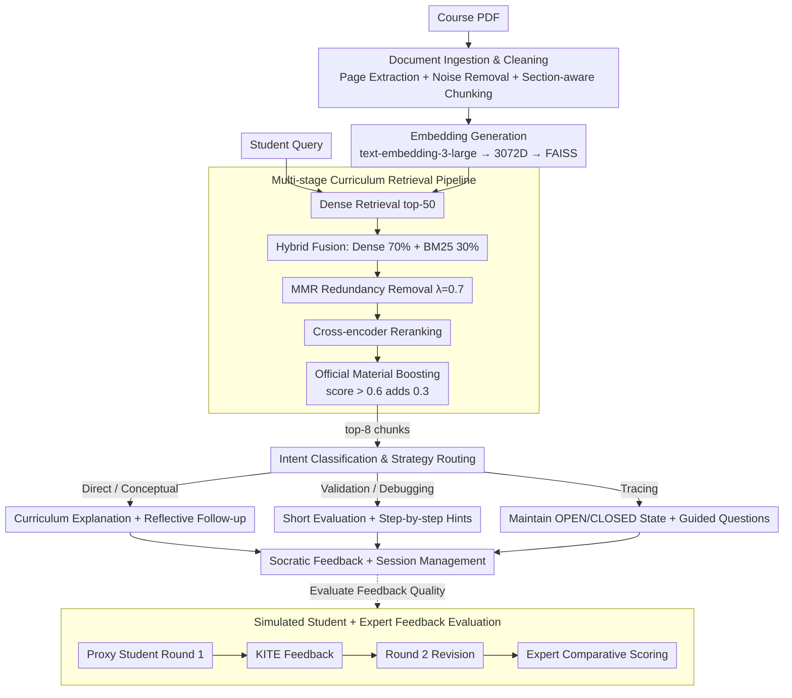

# Retrieval-Augmented Tutoring for Algorithm Tracing and Problem-Solving in AI Education

**Conference**: ACL2026  
**arXiv**: [2605.12988](https://arxiv.org/abs/2605.12988)  
**Code**: No public code  
**Area**: Information Retrieval / AI Education / Intelligent Tutoring Systems  
**Keywords**: RAG tutoring, algorithm learning, Socratic scaffolding, intent classification, simulated student evaluation

## TL;DR
This paper proposes KITE, a curriculum material RAG tutoring system for algorithm tracing and problem-solving. Through intent-aware Socratic feedback and multi-stage retrieval, it demonstrates superior grounding and pedagogical scaffolding effects across automated metrics, simulated students, and expert reviews.

## Background & Motivation
**Background**: Students widely use Large Language Models (LLMs) such as ChatGPT to obtain explanations, feedback, and problem-solving assistance. RAG provides a natural solution for educational scenarios by grounding responses in course slides, textbooks, and historical materials, thereby reducing erroneous explanations that deviate from the course context.

**Limitations of Prior Work**: Being course-grounded does not equate to pedagogical effectiveness. Even if a RAG system retrieves relevant content, it might provide complete answers immediately, allowing students to bypass the reasoning process they are intended to practice. Furthermore, existing systems often fail to distinguish between different help-seeking needs, such as "conceptual inquiry," "debugging," or "algorithm trace verification."

**Key Challenge**: Educational assistants must accurately cite course materials while supporting learning in an appropriate manner. Algorithm courses, in particular, require students to perform traces, debugging, and procedural applications independently. Therefore, the system should not merely provide FAQ-style answers but must offer tiered hints, guided questions, and error localization.

**Goal**: The authors aim to construct KITE, combining RAG retrieval with pedagogical intent-aware response generation. Additionally, they propose an evaluation framework that measures both the groundedness of non-procedural responses and the effectiveness of feedback in assisting reasoning revision through simulated students and expert reviews.

**Key Insight**: The paper transitions educational RAG from an "answer-giving QA tool" to a "tutor that adjusts support based on student intent." It prioritizes response strategies over simple retrieval hit rates.

**Core Idea**: Reliable content is ensured through multi-stage course material retrieval. Intent classification then determines whether the response should be a direct explanation, a conceptual follow-up, a validation, debugging assistance, or an algorithm trace guide, thereby merging RAG grounding with Socratic scaffolding.

## Method

### Overall Architecture
KITE consists of five stages: document ingestion and cleaning, embedding generation, multi-stage retrieval, intent-aware generation, and session management. The system extracts course PDFs page-by-page, removes noise like headers and footers, and utilizes section-aware chunking into approximately 500-character chunks with 100-character overlaps. Each chunk is encoded into a 3072-dimensional vector using `text-embedding-3-large` and stored in FAISS. When a student asks a question, the system first uses dense retrieval to find the top-50 candidates, then combines BM25, MMR, cross-encoder reranking, and course source boosting to inject the top-8 chunks into the GPT-5 prompt. On the generation side, the system identifies student intent before selecting a corresponding tutoring strategy. Alongside the runtime pipeline, the paper introduces an evaluation pipeline using simulated students and expert reviews to specifically measure whether feedback facilitates the revision of student reasoning.

### Key Designs

**1. Multi-stage Curriculum Retrieval Pipeline: Finding Semantically Relevant, Term-Precise, and Non-redundant Evidence in Course Materials**

Algorithm problems are filled with specific terminology, variable names, pseudocode, and step names. Pure dense retrieval often misses literal matches, while pure BM25 may miss semantically equivalent expressions. KITE breaks retrieval into five layers: it starts with dense bi-encoder retrieval for the top-50; then performs hybrid fusion (setting dense similarity at 70% and BM25 at 30%) to balance semantics and algorithmic terms; follows this with MMR ($\lambda=0.7$) to remove redundant chunks; then reranks using a cross-encoder (`ms-marco-MiniLM-L-6-v2`); and finally applies source-based boosting—adding 0.3 to chunks from official materials with a reranking score above 0.6. This filtering ensures the top-8 chunks injected into the prompt maximize groundedness while suppressing irrelevant context noise.

**2. Intent Classification and Tutoring Strategy Routing: Determining Student Needs Before Deciding Hint Granularity**

The primary risk in educational scenarios is not an incorrect answer, but an "excessively direct" one. KITE classifies queries into five categories using keywords and pattern matching: Direct Question, Conceptual Question, Algorithm Validation, Debugging, and Algorithm Tracing, along with an answer evaluation mode. It then switches strategies based on the category: direct/conceptual questions are explained using curriculum materials (with conceptual questions receiving additional follow-ups); algorithm validation provides short evaluations confirming correct parts followed by guided questions; debugging uses step-by-step hints for self-correction; and tracing maintains states like OPEN/CLOSED, current nodes, paths, and costs according to course rules. The same retrieved evidence is wrapped in different levels of scaffolding via intent routing rather than consistently leaking the answer.

**3. Simulated Student + Expert Feedback Evaluation: Measuring if Feedback "Improves Student Answers" Rather Than Similarity to Reference Answers**

For procedural tasks, a good tutor should not be evaluated by how closely the output matches a reference answer, but by how well it prompts the learner to correct their reasoning. KITE implements a proxy student pipeline where `Meta-Llama-3.1-70B-Instruct` acts as a student to provide an initial answer. KITE provides feedback, and the student model revises its answer in a second round. Experts then compare Round 1, KITE feedback, and Round 2 to determine if the revision represents an actual improvement, scoring across dimensions like mistake remediation, scaffolding, guidance, coherence, and tone. This two-round comparison captures the behavioral signal that feedback drove a successful revision.

### A Complete Example: How KITE Processes an Algorithm Tracing Problem

Suppose a student uploads a handwritten trace of an A* search and asks, "Is this step correct?" The system first performs dense retrieval in FAISS to get the top-50 candidates. During the hybrid phase, because the query contains terms like "OPEN list" and "$f = g + h$", the 30% BM25 weight elevates pages defining the algorithm. MMR removes duplicate pseudocode segments. After cross-encoder reranking, the official slides explaining A* expansion rules are boosted by 0.3 because their score exceeds 0.6. Intent classification labels the query as Algorithm Tracing. Consequently, the generation side does not provide the full trace but maintains the OPEN/CLOSED lists and $f=g+h$ costs, identifying that the student failed to update a $g$ value at a specific step and providing a guided question for correction. During evaluation, if the proxy student's Round 1 trace was partially correct and the Round 2 trace became correct after feedback, it is categorized as a "Partially Correct → Correct" improvement.

### Loss & Training
KITE is a system integration rather than a newly trained model. The retrieval side uses `text-embedding-3-large`, FAISS, BM25, MMR, and a MiniLM cross-encoder. The generation side utilizes GPT-5 with top-8 retrieved chunks. Automated evaluation uses `gpt-4o-mini` as the RAGAs judge, with `text-embedding-3-small` for embedding similarity.

## Key Experimental Results

### Main Results
Evaluation data is derived from a university Introduction to AI course, totaling 109 questions with instructor-verified reference answers: 42 algorithmic, 51 procedural, and 16 direct-retrieval questions. RAGAs was applied to 58 non-procedural questions.

| RAGAs Metric | Mean | Std. Dev. | Explanation |
|------------|------|-----------|------|
| Faithfulness | 0.8486 | 0.2103 | Most responses are supported by retrieved context |
| Answer Relevance | 0.7558 | 0.2032 | Responses align well with the original question |
| Context Relevance | 0.9352 | 0.1905 | Retrieved context is highly relevant |
| Answer Similarity | 0.7586 | 0.0923 | Semantically close and stable compared to instructor answers |
| Factual Correctness | 0.4483 | 0.2477 | Low claim-level metric, affected by reference phrasing |
| Answer Correctness | 0.6363 | 0.1810 | Synthesis of factual correctness and similarity |

Expert reviews covered 44 simulated student interaction triples with high inter-annotator agreement (Cohen’s $\kappa=0.88$, raw agreement 98.15%).

| Expert Evaluation Dimension | Yes | No | N/A | Conclusion |
|--------------|-----|----|-----|------|
| Mistake Remediation: Identifying | 63.63% | 6.82% | 29.55% | N/A often implies Round 1 was already correct |
| Mistake Remediation: Acknowledging | 63.63% | 6.82% | 29.55% | Correctly identifies and acknowledges errors |
| Scaffolding | 93.18% | 6.82% | 0% | Strong scaffolding support |
| Guidance | 93.18% | 6.82% | 0% | Clear guidance for next steps |
| Coherence: Naturalness | 93.18% | 6.82% | 0% | Natural dialogue |
| Tone: Encouraging | 93.18% | 6.82% | 0% | Highly supportive tone |

### Ablation Study
While traditional module ablation was not performed, the Round 1 → Round 2 transition of the simulated students serves as a behavioral analysis of KITE feedback. In 27 interactions where Round 1 was not correct, 24 showed improvement after KITE feedback, representing a gain of 88.89%.

| Answer State Transition | Count | Percentage | Interpretation |
|--------------|-------|------|------|
| Incorrect → Correct | 1 | 2.27% | Small percentage of complete correction |
| Incorrect → Partially Correct | 3 | 6.82% | Progress from incorrect to partial accuracy |
| Already Correct | 17 | 38.64% | Correct in first round, no remediation needed |
| Partially Correct → Correct | 14 | 31.82% | Most common improvement type |
| Partially Correct → Part. Corr. (Improved) | 6 | 13.63% | Quality improved despite remaining errors |
| N/A | 3 | 6.82% | Unsuitable for transition judgment |

### Key Findings
- KITE exhibits strong retrieval grounding: Context Relevance of 0.9352 and Faithfulness of 0.8486 indicate that the multi-stage retrieval effectively provides curriculum evidence.
- While Factual Correctness is only 0.4483, Answer Similarity is 0.7586; the authors suggest RAGAs claim-level overlap is poorly suited for pedagogical paraphrasing and supplementary explanations.
- Experts found 93.18% of feedback possessed good scaffolding, guidance, coherence, and tone, indicating Ours is capable of appropriate pedagogical expression beyond mere retrieval.
- Simulated students improved in 88.89% of initially incorrect interactions, with "Partially Correct → Correct" (31.82%) showing feedback effectively bridges reasoning gaps.

## Highlights & Insights
- The transition from evaluating "answer correctness" to "improvement in student answers" is a significant highlight, aligning better with the goals of tutoring systems.
- The intent taxonomy in KITE is simple yet practical, covering Direct, Conceptual, Validation, Debugging, and Tracing needs in algorithm courses.
- The retrieval pipeline parameters (Dense 70%, BM25 30%, MMR $\lambda=0.7$, Official boost 0.3) provide valuable engineering references for reproducing educational RAG.
- Simulated student evaluation serves as a low-cost safety screening before classroom deployment to identify if feedback leaks answers or fails to drive revision.

## Limitations & Future Work
- RAGAs Factual Correctness relies on claim decomposition and single reference answers, potentially underrating pedagogically sound responses; future work should include multiple instructor references.
- Simulated students using `Meta-Llama-3.1-70B-Instruct` do not fully represent the misconception patterns or motivation of real human students.
- The expert review sample size is small (44 interactions). While consistent, it does not yet prove long-term learning gains in real classrooms.
- KITE currently targets algorithm learning; transferring it to math proofs, medical education, or programming assignments will require re-evaluating intent classification and feedback strategies.
- Without factual pre/post-tests or long-term usage analysis, "learning effectiveness" must be cautiously interpreted as improvement in proxy student revision quality.

## Related Work & Insights
- **vs MoodleBot / Edison**: These systems focus on grounded Q&A and human-in-the-loop evaluation; KITE differentiates student intent to provide specific scaffolded feedback for procedural tasks.
- **vs AutoTutor**: AutoTutor emphasizes conversational hints and collaborative revision but does not center on course material RAG; KITE merges Socratic tutoring with course-specific retrieval.
- **vs KG-RAG / LPITutor**: These improve educational QA via knowledge graphs or prompting; KITE focuses on trace, debug, and validation tasks specific to algorithmic reasoning.
- **Insight**: Benchmarks for educational RAG should incorporate "facilitation of secondary revision" as a core metric beyond simple answer accuracy.

## Rating
- Novelty: ⭐⭐⭐⭐☆ Combines existing components effectively with intent-aware tutoring and simulated student evaluation.
- Experimental Thoroughness: ⭐⭐⭐☆☆ Multi-faceted evaluation (automated, expert, simulation) is strong, but lacks real student longitudinal data.
- Writing Quality: ⭐⭐⭐⭐☆ Clear system design and honest discussion of limitations.
- Value: ⭐⭐⭐⭐☆ Strong practical reference for educational RAG and AI teaching assistants.

<!-- RELATED:START -->

## Related Papers

- [\[NeurIPS 2025\] Is PRM Necessary? Problem-Solving RL Implicitly Induces PRM Capability in LLMs](../../NeurIPS2025/information_retrieval/is_prm_necessary_problem-solving_rl_implicitly_induces_prm_capability_in_llms.md)
- [\[ICML 2026\] Position: Reliable AI Needs to Externalize Implicit Knowledge: A Human-AI Collaboration Perspective](../../ICML2026/information_retrieval/reliable_ai_needs_to_externalize_implicit_knowledge_a_human-ai_collaboration_per.md)
- [\[ACL 2026\] Utility-Oriented Visual Evidence Selection for Multimodal Retrieval-Augmented Generation](utility-oriented_visual_evidence_selection_for_multimodal_retrieval-augmented_ge.md)
- [\[ACL 2026\] S2G-RAG: Structured Sufficiency and Gap Judging for Iterative Retrieval-Augmented QA](s2g-rag_structured_sufficiency_and_gap_judging_for_iterative_retrieval-augmented.md)
- [\[ACL 2026\] MM-BizRAG: Rethinking Multimodal Retrieval-Augmented Generation for General Purpose Enterprise Q&A](mm-bizrag_rethinking_multimodal_retrieval-augmented_generation_for_general_purpo.md)

<!-- RELATED:END -->
