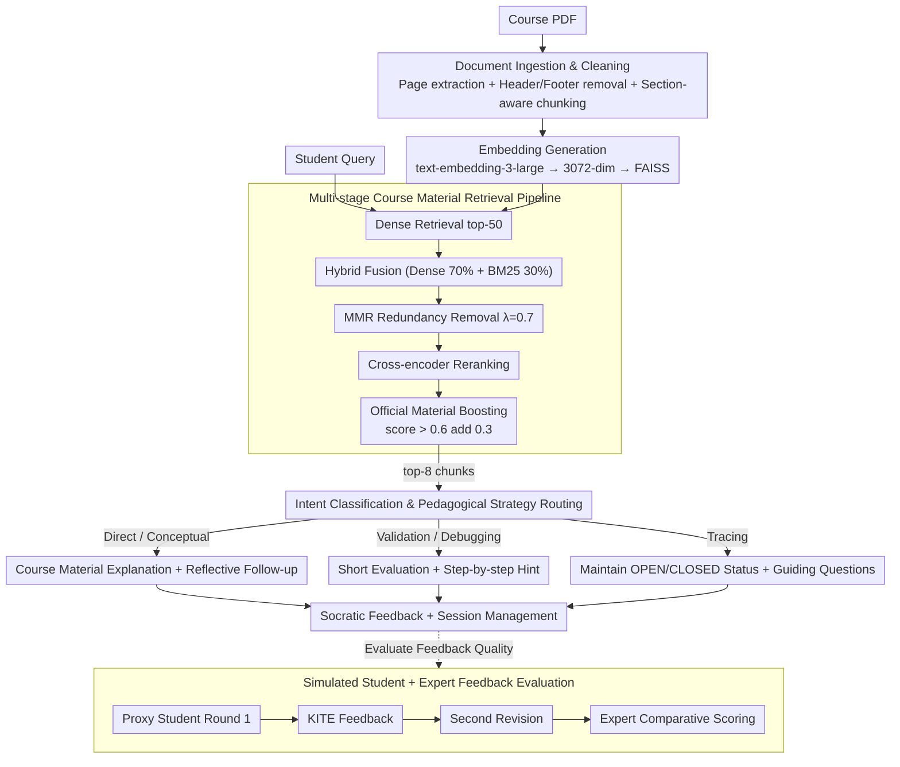

# Retrieval-Augmented Tutoring for Algorithm Tracing and Problem-Solving in AI Education

**Conference**: ACL2026  
**arXiv**: [2605.12988](https://arxiv.org/abs/2605.12988)  
**Code**: No public code  
**Area**: Information Retrieval / AI Education / Intelligent Tutoring Systems  
**Keywords**: RAG tutoring, algorithm learning, Socratic scaffolding, intent classification, simulated student evaluation

## TL;DR
Ours proposes KITE, a RAG tutoring system for course materials oriented towards algorithm tracing and problem-solving. Through intent-aware Socratic feedback and multi-stage retrieval, it demonstrates superior grounding and pedagogical scaffolding effects across automated metrics, simulated students, and expert reviews.

## Background & Motivation
**Background**: Students widely use LLMs like ChatGPT for explanations, feedback, and problem-solving help. RAG provides a natural solution for educational scenarios: grounding answers in course slides, textbooks, and historical materials to reduce erroneous explanations detached from the course context.

**Limitations of Prior Work**: Course-grounded does not equate to pedagogical effectiveness. Even if a RAG system retrieves relevant content, it might directly provide the full answer, allowing students to bypass the reasoning process they should practice; it may also fail to distinguish between different help needs like "conceptual inquiry," "debugging," or "algorithm trace verification."

**Key Challenge**: Educational assistants must accurately cite course materials while supporting learning in an appropriate manner. Algorithm courses specifically require students to complete traces, debugging, and procedure applications themselves. Thus, the system cannot function merely as an FAQ tool but must provide tiered hints, guiding questions, and error localization.

**Goal**: KITE is constructed to combine RAG retrieval with pedagogical intent-aware response generation. An evaluation framework is also proposed to measure both the groundedness of non-procedural answers and the efficacy of feedback in assisting reasoning correction using simulated students and expert reviews.

**Key Insight**: The paper transforms educational RAG from an "answer-providing QA tool" into a "tutor that adjusts support based on student intent." It prioritizes response strategies over simple retrieval hit rates.

**Core Idea**: Reliable content is guaranteed through multi-stage course material retrieval, while intent classification determines whether the response should be direct explanation, conceptual follow-up, verification, debugging, or algorithm tracing, thereby merging RAG grounding with Socratic scaffolding.

## Method

### Overall Architecture
KITE consists of five stages: document ingestion and cleaning, embedding generation, multi-stage retrieval, intent-aware generation, and session management. The system extracts course PDFs by page and removes noise such as headers and footers, then performs section-aware chunking into ~500 character chunks with 100-character overlap. Each chunk is encoded into a 3072-dimensional vector using text-embedding-3-large and stored in FAISS. Upon a student query, the system performs dense retrieval for the top-50, combines it with BM25, MMR, cross-encoder reranking, and course source boosting, finally injecting the top-8 chunks into a GPT-5 prompt. The generation side first identifies student intent before selecting the corresponding tutoring strategy. Aside from the runtime pipeline, a matching evaluation pipeline using simulated students and expert reviews is proposed to measure whether feedback facilitates reasoning revision.

### Key Designs

**1. Multi-stage Course Material Retrieval Pipeline: Finding evidence in course materials that is semantically relevant, terminologically precise, and non-redundant**

Algorithm problems are filled with terminology, variable names, pseudocode, and step names. Pure dense retrieval often misses literal matches, while pure BM25 may miss semantically equivalent expressions; a single retriever struggle to balance both. KITE decomposes retrieval into five tightening steps: first, use a dense bi-encoder to recall the top-50; next, perform hybrid fusion with dense similarity weighted at 70% and BM25 at 30% to account for both semantics and algorithmic terms; then use MMR ($\lambda=0.7$) to remove redundant chunks; subsequently rerank using cross-encoder/ms-marco-MiniLM-L-6-v2; finally, apply source-based boosting to official material—chunks with a reranking score > 0.6 receive an additional 0.3 points to prioritize authoritative sources. The top-8 chunks are sampled after filtering to inject into the prompt, enhancing groundedness while suppressing irrelevant context noise.

**2. Intent Classification & Pedagogical Strategy Routing: Determining student help needs before deciding on hint intensity**

The true risk in educational scenarios is not an incorrect answer, but "answering too directly"—providing a full solution even with correctly retrieved content causes students to skip reasoning. KITE classifies queries via keywords and pattern-matching into five categories: Direct Question, Conceptual Question, Algorithm Validation, Debugging, and Algorithm Tracing, plus an answer evaluation mode. Strategy switching follows the category: Direct/Conceptual questions yield explanations grounded in course materials, with conceptual questions adding reflective follow-ups; algorithm validation provides short evaluations confirming the correct parts plus guided questions; debugging uses step-by-step hints for self-checking; tracing maintains states like OPEN/CLOSED, current nodes, paths, and costs according to course rules. The same retrieved evidence is wrapped into different levels of scaffolding via intent routing instead of leaking the answer uniformly.

**3. Simulated Student + Expert Feedback Evaluation: Measuring whether feedback "improves student answers" rather than similarity to reference answers**

A good tutor for procedural tasks should not be measured by "output similarity to reference answers," as the goal is to promote learner reasoning revision. KITE establishes a proxy student pipeline: for procedural and tracing problems, Meta-Llama-3.1-70B-Instruct acts as a student to answer independently; KITE provides feedback, and the student model revises the answer for a second round. Experts then compare Round 1, KITE feedback, and Round 2 to judge if the revision truly improved, scoring across dimensions like mistake remediation, scaffolding, guidance, coherence, and tone. This two-round comparison allows the evaluation to capture "feedback-driven secondary performance" as a behavioral signal, offering a low-cost safety screening before classroom deployment.

### A Full Example: Walking through an Algorithm Tracing Problem with KITE

Assume a student uploads a handwritten trace of an A* search and asks, "Is this step correct?" The system first performs dense retrieval in FAISS for this problem, extracting top-50 candidates from all course chunks. During the hybrid stage, because the query contains terms like "OPEN list" or "$f = g + h$," the 30% BM25 weight boosts the corresponding algorithm definition pages. MMR removes near-duplicate pseudocode snippets. After cross-encoder reranking, the official slides explaining A* node expansion rules are boosted by an additional 0.3 points because the score exceeded 0.6, making them the primary content in the top-8. Intent classification identifies the query as Algorithm Tracing; thus, the generation side does not provide a full trace but instead maintains the OPEN/CLOSED lists and $f=g+h$ costs according to course rules, noting that the student missed a $g$-value update for a specific node and uses a guiding question to prompt a student correction. During evaluation, the proxy student's Round 1 trace is partially correct; upon receiving this feedback, the Round 2 trace fixes the missing cost and becomes correct—aligning with the most common Partially Correct → Correct improvement type seen in experiments.

### Loss & Training
KITE itself is a system integration rather than a newly trained model. The retrieval side uses text-embedding-3-large, FAISS, BM25, MMR, and MiniLM cross-encoder; the generation side uses GPT-5 with top-8 retrieved chunks injected into the prompt. Automated evaluation uses gpt-4o-mini as a RAGAs judge, with embedding similarity measured via text-embedding-3-small.

## Key Experimental Results

### Main Results
Evaluation data is derived from a university Introduction to AI course, totaling 109 questions with instructor-verified reference answers, including 42 algorithmic questions, 51 procedural questions, and 16 direct-retrieval questions. RAGAs is used for the 58 non-procedural questions.

| RAGAs Metric | Mean | Std. Dev. | Interpretation |
|------------|------|-----------|------|
| Faithfulness | 0.8486 | 0.2103 | Most answers can be supported by retrieved context |
| Answer Relevance | 0.7558 | 0.2032 | Responses show good relevance to the original question |
| Context Relevance | 0.9352 | 0.1905 | Retrieved context is highly relevant |
| Answer Similarity | 0.7586 | 0.0923 | Semantic proximity to instructor answers remains stable |
| Factual Correctness | 0.4483 | 0.2477 | Low claim-level metric, affected by ref answer phrasing |
| Answer Correctness | 0.6363 | 0.1810 | Synthesis of factual correctness and similarity |

Expert reviews covered 44 simulated student interaction triples with high annotation consistency, Cohen’s $\kappa=0.88$, raw agreement at 98.15%.

| Expert Evaluation Dimension | Yes | No | N/A | Conclusion |
|--------------|-----|----|-----|------|
| Mistake Remediation: Identifying | 63.63% | 6.82% | 29.55% | N/A mostly due to correct Round 1 |
| Mistake Remediation: Acknowledging | 63.63% | 6.82% | 29.55% | Identifies and acknowledges errors when applicable |
| Scaffolding | 93.18% | 6.82% | 0% | Strong scaffolding support |
| Guidance | 93.18% | 6.82% | 0% | Clear guidance for next steps |
| Coherence: Naturalness | 93.18% | 6.82% | 0% | Natural dialogue |
| Tone: Encouraging | 93.18% | 6.82% | 0% | Supportive tone |

### Ablation Study
Ours does not perform traditional module ablation, but the Round 1 → Round 2 transfer of simulated students acts as a behavioral analysis of KITE feedback effectiveness. Out of 27 interactions where Round 1 was not correct, 24 improved after KITE feedback, an improvement rate of 88.89%.

| Answer Status Transition | Count | Percentage | Interpretation |
|--------------|-------|------|------|
| Incorrect → Correct | 1 | 2.27% | Small amount of total correction |
| Incorrect → Partially Correct | 3 | 6.82% | Progressed from incorrect to partially correct |
| Already Correct | 17 | 38.64% | Correct at Round 1, no correction needed |
| Partially Correct → Correct | 14 | 31.82% | Most common improvement type |
| Partially Correct → Partially Correct with Improvement | 6 | 13.63% | Quality improved but not yet fully correct |
| N/A | 3 | 6.82% | Not suitable for transfer judgment |

### Key Findings
- KITE shows strong retrieval grounding: Context Relevance 0.9352 and Faithfulness 0.8486, proving multi-stage retrieval provides course-relevant evidence for responses.
- Factual Correctness is only 0.4483, while Answer Similarity is 0.7586; authors suggest RAGAs claim-level overlap is unfriendly to pedagogical paraphrasing and supplementary explanations.
- Experts determined 93.18% of feedback possessed good scaffolding, guidance, coherence, and tone, showing KITE is capable of articulating content in a pedagogically appropriate manner beyond simple retrieval.
- Simulated students improved in 88.89% of non-correct interactions; specifically, Partially Correct → Correct accounted for 31.82%, indicating feedback helps fill reasoning gaps.

## Highlights & Insights
- The highlight of the paper is expanding educational RAG evaluation from "is the answer right" to "does feedback help students improve," aligning better with tutoring goals.
- KITE’s intent taxonomy is simple yet practical. Direct, Conceptual, Validation, Debugging, and Tracing cover the majority of help requests in algorithm courses.
- The multi-stage retrieval pipeline parameters are highly engineered: 70% dense, 30% BM25, MMR $\lambda=0.7$, and a 0.3 boost for official materials with score > 0.6. These details are valuable for replicating educational RAG.
- Simulated student evaluation is not final evidence but serves as an effective safety screen before classroom deployment to detect if feedback over-leaks answers or fails to drive revisions.

## Limitations & Future Work
- RAGAs Factual Correctness relies on claim decomposition and a single reference answer, which may undervalue semantically correct pedagogical responses using different phrasing; future work should include multiple instructor reference answers and human factuality labels.
- Simulated students only use Meta-Llama-3.1-70B-Instruct, which may not represent the misconception patterns, motivations, and learning transfers of real students.
- The expert review sample size of 44 interactions is small; although consistency is high, it is insufficient to prove longitudinal learning gains in real classrooms.
- KITE is currently scoped to intra-course algorithm learning; intent classification and feedback strategies may need reconfiguration when migrating to mathematical proofs, programming assignments, or medical education.
- The study lacks pre/post-tests with real students, so "learning effect" can only be cautiously interpreted as improvement in simulated revision quality.

## Related Work & Insights
- **vs MoodleBot / Edison**: These systems focus on course-grounded Q&A and TA-in-the-loop evaluation; KITE further distinguishes student intent and provides scaffolded feedback for procedural/tracing tasks.
- **vs AutoTutor**: AutoTutor emphasizes conversational prompting and collaborative revision but does not center on course material RAG grounding; KITE integrates Socratic tutoring with course-specific retrieval.
- **vs KG-RAG / LPITutor**: These use knowledge graphs or prompt strategies to improve educational QA; KITE focuses specifically on traces, debugging, and validation in algorithmic reasoning.
- **Insights**: Benchmarks for educational RAG systems should incorporate "improvement in second attempts" as a core metric rather than focusing solely on answer correctness.

## Rating
- Novelty: ⭐⭐⭐⭐☆ Integration of existing techniques with intent-aware tutoring and simulated student evaluation is well-executed.
- Experimental Thoroughness: ⭐⭐⭐☆☆ Automated metrics, expert review, and simulated students are used, but lacks real student trials and traditional module ablation.
- Writing Quality: ⭐⭐⭐⭐☆ System design and evaluation processes are clearly articulated; limitation discussions are honest.
- Value: ⭐⭐⭐⭐☆ High practical reference value for educational RAG, course TA systems, and algorithm learning feedback design.

<!-- RELATED:START -->

## Related Papers

- [\[NeurIPS 2025\] Is PRM Necessary? Problem-Solving RL Implicitly Induces PRM Capability in LLMs](../../NeurIPS2025/information_retrieval/is_prm_necessary_problem-solving_rl_implicitly_induces_prm_capability_in_llms.md)
- [\[ICLR 2026\] CFT-RAG: An Entity Tree Based Retrieval Augmented Generation Algorithm With Cuckoo Filter](../../ICLR2026/information_retrieval/cft-rag_an_entity_tree_based_retrieval_augmented_generation_algorithm_with_cucko.md)
- [\[ICML 2026\] Position: Reliable AI Needs to Externalize Implicit Knowledge: A Human-AI Collaboration Perspective](../../ICML2026/information_retrieval/reliable_ai_needs_to_externalize_implicit_knowledge_a_human-ai_collaboration_per.md)
- [\[ACL 2026\] S2G-RAG: Structured Sufficiency and Gap Judging for Iterative Retrieval-Augmented QA](s2g-rag_structured_sufficiency_and_gap_judging_for_iterative_retrieval-augmented.md)
- [\[ACL 2026\] Beyond Chunks and Graphs: Retrieval-Augmented Generation through Triplet-Driven Thinking](beyond_chunks_and_graphs_retrieval-augmented_generation_through_triplet-driven_t.md)

<!-- RELATED:END -->
