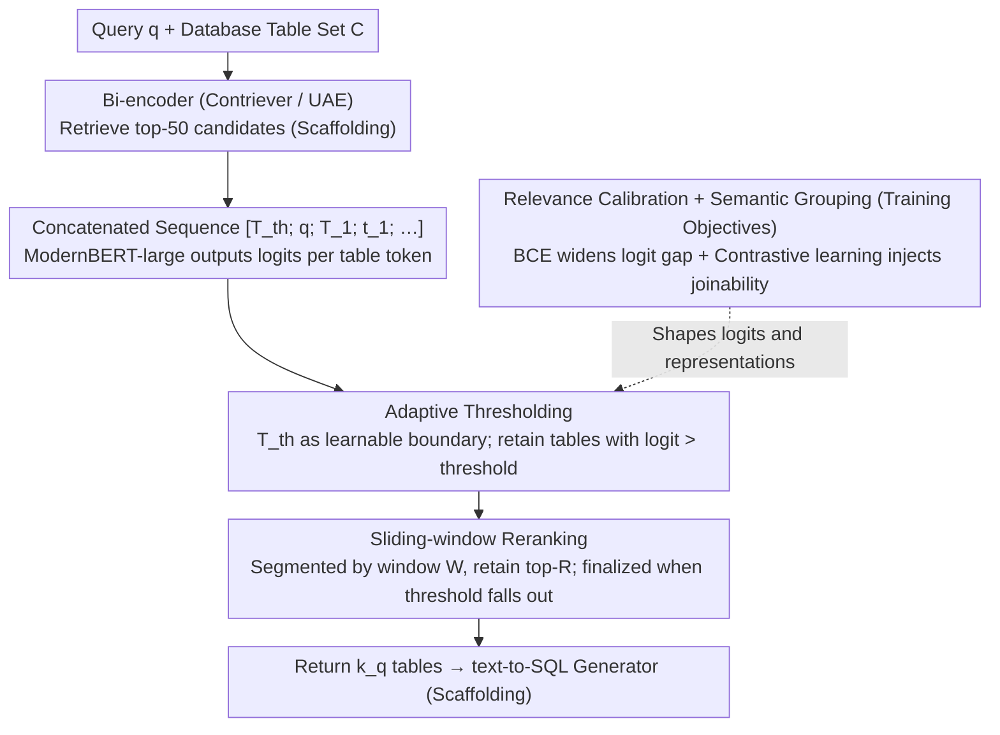

# Retrieve Only Relevant Tables Whether Few or Many: Adaptive Table Retrieval Method

**Conference**: ACL2026 Findings  
**arXiv**: [2605.18766](https://arxiv.org/abs/2605.18766)  
**Code**: The paper states that code and data are provided (the cache does not contain a specific URL)  
**Area**: Information Retrieval / Table Retrieval / Text-to-SQL  
**Keywords**: adaptive retrieval, table retrieval, text-to-SQL, thresholding, sliding-window reranking

## TL;DR
This paper proposes Adaptive Table Retrieval (ATR), which replaces fixed top-k table retrieval with a query-adaptive threshold. By combining relevance calibration, inter-table semantic grouping, and sliding-window reranking, it simultaneously improves retrieval recall, text-to-SQL execution accuracy, and inference efficiency on Spider, BIRD, and Spider 2.0.

## Background & Motivation
**Background**: In text-to-SQL and structured RAG, systems typically retrieve a number of relevant tables from a large database before passing them to an LLM to generate SQL. Mainstream table retrievers calculate query-table similarity and then retrieve a fixed top-k.

**Limitations of Prior Work**: Fixed top-k ignores the variation in the number of tables required by different queries. Simple queries may only need one or two tables, where retrieving too many introduces noise and token costs; complex enterprise-level queries may require dozens or even hundreds of tables, where retrieving too few misses necessary evidence. The paper notes that in Spider 2.0, the number of ground-truth tables for a single query ranges from 1 to 366, making it difficult for a fixed $k$ to balance both scenarios.

**Key Challenge**: Table retrieval errors take two opposite forms: under-retrieval misses tables required for the SQL, while over-retrieval places irrelevant schemas into the generator's context, interfering with SQL generation. Fixed top-k delegates this trade-off to a global hyperparameter rather than letting each query decide how many tables it needs.

**Goal**: The authors aim to design an adaptive table retriever that does not rely on iterative LLM interactions, allowing it to dynamically determine the number of returned tables while maintaining scalability and low latency on large-scale databases.

**Key Insight**: ATR transforms the decision of "how many tables to return" into a learnable thresholding problem: each table has a relevance logit, and an adaptive threshold token is introduced. All tables with logits higher than the threshold are retrieved.

**Core Idea**: Use a threshold token to learn a query-specific retrieval boundary, ensuring relevant tables exceed the threshold and irrelevant ones fall below it. This is supported by joinability-aware table representation learning and sliding-window reranking for large-scale schemas.

## Method

### Overall Architecture
The core problem ATR solves is "how many tables should actually be retrieved"—fixed top-k over-retrieves for simple queries and under-retrieves for complex ones. It delegates this quantity decision to the model itself: given a natural language query $q$ and a set of candidate tables $C$, ModernBERT-large is used as an encoder. The input sequence is formed by concatenating the query, a threshold token, and multiple table schema representations: $[T_{th}; q; T_1; t_1; ...; T_n; t_n]$, where each table is preceded by a table token $T_i$. The threshold boundary is carried by the threshold token $T_{th}$. The model outputs a logit for each table token and the threshold token. During inference, only tables with logits higher than the threshold logit are retained, allowing the number of returned tables $k_q$ to change automatically with the query. To support large database schemas, the implementation first uses a bi-encoder (Contriever or UAE) to obtain the top-50 candidates, followed by reranking. To bypass encoder length limits and the quadratic cost of self-attention, reranking is performed in sections using a sliding window. Ultimately, all tables ranked above the threshold constitute the retrieval result.

### Key Designs
**1. Adaptive Thresholding: Turning "how many tables" from a manual hyperparameter into a learned decision boundary**

Fixed $k$ can only make a single global compromise between recall and noise, failing to account for differences between queries. ATR inserts a threshold token $T_{th}$ into the input as a learnable boundary: during training, the logits of relevant table tokens are pushed above $T_{th}$, while logits of irrelevant ones are pushed below. The loss consists of two terms: $L_1$ increases the probability of relevant tables relative to the threshold, and $L_2$ suppresses irrelevant tables below the threshold, combined as $L_{AT}=\alpha L_1+\beta L_2$. This allows the model to automatically determine the boundary based on query difficulty and schema relevance. In scenarios like Spider 2.0, where ground-truth tables range from 1 to 366, it neither misses tables nor injects noise.

**2. Relevance Calibration and Semantic Grouping: Learning relevance and inter-table structure simultaneously to retrieve coherent sets**

Text-to-SQL often requires a set of tables that can be joined with each other, rather than several independent tables. Simply looking at query-table similarity can result in structurally incoherent retrieval. ATR adds two auxiliary objectives: relevance calibration uses BCE to widen the logit gap between relevant and irrelevant tables for cleaner threshold discrimination; semantic grouping uses a contrastive loss to pull joinable table embeddings closer and push non-joinable ones apart, injecting joinability signals into the representation. The total objective is $L_{ATR}=L_{AT}+\lambda L_{RC}+\gamma L_{SG}$. Ablation studies show that recall drops most significantly when both terms are removed, confirming their contribution to structurally coherent retrieval.

**3. Sliding-window Reranking: Segmented reranking to prevent memory overflow in large schemas**

Enterprise schemas often contain hundreds of tables. Encoding all candidates at once would trigger both encoder length limits and the quadratic complexity of self-attention. ATR uses a window size $W$ and a retention number $R$. It encodes only the tables within the window and the threshold token at each step, merges the top-$R$ with the next segment of candidates, and continues. Once the threshold's rank falls below the retention boundary, the tables ranked before it are finalized. This breaks one large rerank into multiple controllable small reranks, reducing average peak VRAM from 340.57 MB to 66.52 MB (−80.5%) on Spider 2.0 without sacrificing retrieval quality.

### Loss & Training
ATR is trained only on the Spider and BIRD training sets and does not use Spider 2.0 training data; thus, Spider 2.0 serves as an important out-of-domain test. The retrieval side reports precision, recall, complete recall, and F1. For downstream text-to-SQL, retrieved tables are passed to generators like Llama-3.1-8B/70B-Instruct, Qwen2.5-Coder-7B/32B-Instruct, and Gemma-3-4B/27B-IT, evaluated by execution accuracy. Baselines include fixed top-k or LLM rerankers such as Contriever, UAE, JAR, RankZephyr, and Murre.

## Key Experimental Results

### Main Results

| Dataset | Method | Precision | Recall | Complete Recall | F1 |
|---------|--------|-----------|--------|-----------------|----|
| Spider | JAR w/ UAE, k=3 | 48.4 | 96.5 | 94.1 | 62.3 |
| Spider | ATR w/ Contriever | 69.6 | 99.5 | 99.2 | 78.3 |
| Spider | ATR w/ UAE | 69.3 | 99.6 | 99.4 | 78.1 |
| BIRD | JAR w/ Contriever, k=3 | 54.4 | 87.4 | 76.3 | 65.0 |
| BIRD | ATR w/ Contriever | 54.0 | 98.2 | 96.0 | 65.8 |
| BIRD | ATR w/ UAE | 52.8 | 98.6 | 97.1 | 65.1 |
| Spider 2.0 | Murre, k=10 | 14.8 | 61.9 | 48.5 | 21.5 |
| Spider 2.0 | ATR w/ Contriever | 21.9 | 72.4 | 64.4 | 27.8 |
| Spider 2.0 | ATR w/ UAE | 19.9 | 75.4 | 68.7 | 26.7 |

### Ablation Study

| Configuration | Spider R / CR | BIRD R / CR | Spider 2.0 R / CR | Description |
|---------------|---------------|-------------|-------------------|-------------|
| ATR | 99.5 / 99.2 | 98.2 / 96.0 | 72.4 / 64.4 | Full model |
| w/o BCE relevance calibration | 99.0 / 98.7 | 97.5 / 95.8 | 68.2 / 60.8 | Weakened query-table discrimination |
| w/o contrastive semantic grouping | 99.0 / 98.4 | 97.4 / 95.2 | 69.1 / 60.1 | Missing inter-table joinability signal |
| w/o both | 96.4 / 94.4 | 91.8 / 85.7 | 67.7 / 58.2 | Largest drop when both auxiliary objectives are removed |

### Key Findings
- In retrieval, ATR achieves an F1 of 78.3/78.1 on Spider, significantly higher than fixed top-k baselines. On Spider 2.0, complete recall reaches 64.4/68.7, indicating that the adaptive mechanism is more useful in scenarios where the number of required tables varies greatly.
- In text-to-SQL, when using Qwen2.5-Coder-32B, ATR improves execution accuracy by 3.7 and 1.7 points on Spider and BIRD compared to JAR; with the 7B model, the improvement increases to 5.2 and 2.5 points.
- Regarding efficiency, ATR is faster than adaptive document retrieval methods: on Spider/BIRD, the Acc./Time is 71.5/2.2s and 53.3/3.8s, whereas Adaptive-RAG is 62.8/6.3s and 50.7/13.2s.
- Sliding-window memory profiling shows that on Spider 2.0, average peak VRAM decreases from 340.57 MB to 66.52 MB (-80.5%), and the maximum peak decreases from 1027.88 MB to 284.44 MB (-72.3%).

## Highlights & Insights
- The adaptive threshold is the most direct and effective design in this paper. It transforms "how many tables to retrieve" from a manual hyperparameter into a model output, which is particularly suitable for enterprise scenarios with a wide range of required tables like Spider 2.0.
- The paper does not only pursue recall but also demonstrates the damage of over-retrieval to SQL execution accuracy: irrelevant tables add incorrect joins, wrong column grounding, and long-context noise to the generator.
- Semantic grouping incorporates inter-table joinability into representation learning, reminding us that structured RAG should not only perform query-document similarity but also learn the structural relationships between pieces of evidence.

## Limitations & Future Work
- The authors acknowledge that ATR currently targets structured tabular data and has not been extended to adaptive retrieval for text, images, or mixed data types.
- Training relies only on Spider and BIRD. Although there are out-of-domain results on Spider 2.0, real enterprise database schemas may be larger, noisier, and subject to more complex permissions and business constraints.
- ATR still relies on the initial top-50 candidates from the bi-encoder. If the first stage misses critical tables, the subsequent adaptive threshold cannot recover them.
- Future work could investigate cross-modal adaptive retrieval, end-to-end joint training of the first-stage retriever and ATR reranker, and linking threshold decisions with the uncertainty of the SQL generator.

## Related Work & Insights
- **vs Contriever / UAE**: These bi-encoder methods use fixed top-k based on query-table similarity, which is efficient but cannot adapt to different table counts; ATR performs adaptive reranking on their top-50 candidates.
- **vs JAR**: JAR also considers inter-table joinability but remains constrained by fixed $k$; ATR further learns a threshold boundary to dynamically determine the size of the retained set.
- **vs FLARE / Adaptive-RAG / Iter-RetGen**: These adaptive document retrieval methods often trigger retrieval via generator iterations, leading to high latency; ATR does not require LLM interaction and performs dynamic table retrieval directly using an encoder.
- **Insight**: For structured RAG, the "quantity of evidence" itself is a variable that the model should predict; fixed top-k is more of an engineering default than a sound task assumption.

## Rating
- Novelty: ⭐⭐⭐⭐☆ The adaptive threshold idea is not complex, but its application to table retrieval combined with joinability and sliding windows is very practical.
- Experimental Thoroughness: ⭐⭐⭐⭐⭐ Covers retrieval, downstream SQL, adaptive baselines, ablations, hyperparameters, VRAM, and multiple generators in the appendix.
- Writing Quality: ⭐⭐⭐⭐☆ Motivations and diagrams are clear; main tables are large but contain complete information.
- Value: ⭐⭐⭐⭐⭐ High direct engineering value for text-to-SQL, enterprise database QA, and structured RAG.

<!-- RELATED:START -->

## Related Papers

- [\[ICLR 2026\] Beyond Text-Only: Towards Multimodal Table Retrieval in Open-World](../../ICLR2026/information_retrieval/beyond_text-only_towards_multimodal_table_retrieval_in_open-world.md)
- [\[ACL 2026\] CORAL: Adaptive Retrieval Loop for Culturally-Aligned Multilingual RAG](coral_adaptive_retrieval_loop_for_culturally-aligned_multilingual_rag.md)
- [\[ACL 2026\] REZE: Representation Regularization for Domain-adaptive Text Embedding Pre-finetuning](reze_representation_regularization_for_domain-adaptive_text_embedding_pre-finetu.md)
- [\[CVPR 2025\] COBRA: COmBinatorial Retrieval Augmentation for Few-Shot Adaptation](../../CVPR2025/information_retrieval/cobra_combinatorial_retrieval_augmentation_for_few-shot_adaptation.md)
- [\[CVPR 2025\] Few-Shot Recognition via Stage-Wise Retrieval-Augmented Finetuning](../../CVPR2025/information_retrieval/few-shot_recognition_via_stage-wise_retrieval-augmented_finetuning.md)

<!-- RELATED:END -->
