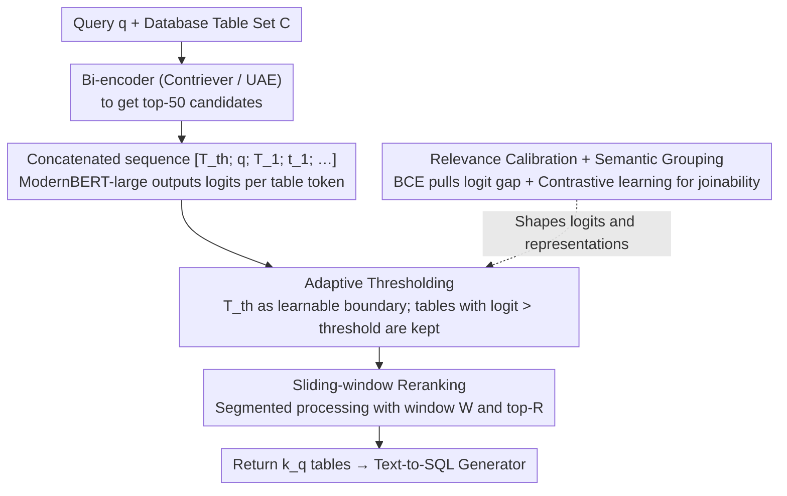

# Retrieve Only Relevant Tables Whether Few or Many: Adaptive Table Retrieval Method

**Conference**: ACL2026 Findings  
**arXiv**: [2605.18766](https://arxiv.org/abs/2605.18766)  
**Code**: The paper states that code and data are provided (URL not specified in the snippet)  
**Area**: Information Retrieval / Table Retrieval / Text-to-SQL  
**Keywords**: adaptive retrieval, table retrieval, text-to-SQL, thresholding, sliding-window reranking

## TL;DR
This paper proposes Adaptive Table Retrieval (ATR), which replaces fixed top-k table retrieval with a query-adaptive threshold. By combining relevance calibration, inter-table semantic grouping, and sliding-window reranking, ATR simultaneously improves retrieval recall, text-to-SQL execution accuracy, and inference efficiency across Spider, BIRD, and Spider 2.0.

## Background & Motivation
**Background**: In text-to-SQL and structured RAG, systems typically retrieve a set of relevant tables from a large database before passing them to an LLM to generate SQL. Mainstream table retrievers calculate query-table similarity and select a fixed top-k number of tables.

**Limitations of Prior Work**: Fixed top-k ignores the variance in the number of tables required by different queries. Simple queries may only need one or two tables; retrieving too many introduces noise and increases token costs. Complex enterprise queries may require dozens or even hundreds of tables; retrieving too few leads to missing necessary evidence. The paper notes that in Spider 2.0, the number of ground-truth tables per query ranges from 1 to 366, making a fixed $k$ difficult to balance.

**Key Challenge**: Table retrieval errors take two opposing forms: under-retrieval misses tables required for SQL, while over-retrieval places irrelevant schemas into the generator's context, interfering with SQL generation. Fixed top-k leaves this trade-off to a global hyperparameter rather than allowing each query to determine its own requirements.

**Goal**: The authors aim to design an adaptive table retriever that does not rely on iterative LLM interactions, allowing it to dynamically decide the number of returned tables while maintaining scalability and low latency on large-scale databases.

**Key Insight**: ATR transforms "how many tables to return" into a learnable threshold decision problem. Each table is assigned a relevance logit, and an adaptive threshold token is introduced; all tables with logits higher than the threshold are retrieved.

**Core Idea**: Use a threshold token to learn a query-specific retrieval boundary, ensuring relevant tables exceed the threshold while irrelevant ones fall below it. This is supported by joinability-aware table representation learning and sliding-window reranking for large-scale schemas.

## Method

### Overall Architecture
The core problem ATR solves is "exactly how many tables should be retrieved"—fixed top-k leads to over-retrieval for simple queries and under-retrieval for complex ones. It delegates this decision to the model itself. Given a natural language query $q$ and a set of candidate tables $C$, ModernBERT-large is used as the encoder. The query, a threshold token, and multiple table schema representations are concatenated into a sequence $[T_{th}; q; T_1; t_1; ...; T_n; t_n]$, where each table is preceded by a table token $T_i$ and the threshold boundary is carried by the threshold token $T_{th}$. The model outputs a logit for each table token and the threshold token. During inference, only tables with logits higher than the threshold logit are retained, allowing the number of returned tables $k_q$ to vary automatically. For large databases, a bi-encoder (Contriever or UAE) first retrieves top-50 candidates for reranking. To bypass encoder length limits and the quadratic cost of self-attention, reranking is performed using a sliding window.

### Key Designs
**1. Adaptive Thresholding: Transforming table quantity from a hyperparameter to a learnable decision boundary**

Fixed $k$ can only provide a global compromise between recall and noise. ATR inserts a threshold token $T_{th}$ into the input as a learnable boundary: during training, the model is taught to keep relevant table logits above $T_{th}$ and irrelevant ones below it. The loss consists of two terms: $L_1$ increases the probability of relevant tables relative to the threshold, and $L_2$ pushes irrelevant tables below the threshold, combined as $L_{AT}=\alpha L_1+\beta L_2$. This allows the model to decide the boundary based on query difficulty and schema relevance.

**2. Relevance Calibration and Semantic Grouping: Learning relevance and inter-table structures simultaneously**

Text-to-SQL often requires a group of joinable tables rather than independent tables. ATR adds two auxiliary objectives: Relevance Calibration uses BCE to widen the logit gap between relevant and irrelevant tables for cleaner thresholding; Semantic Grouping uses a contrastive loss to pull joinable table embeddings closer and push non-joinable ones apart, injecting joinability signals. The total objective is $L_{ATR}=L_{AT}+\lambda L_{RC}+\gamma L_{SG}$.

**3. Sliding-window Reranking: Segmented reranking to handle large schemas within VRAM limits**

Enterprise schemas can have hundreds of tables, exceeding encoder limits. ATR uses a window size $W$ and a retention count $R$. It encodes tables within the window alongside the threshold token, retains the top-$R$ results, and merges them with the next segment. Once the threshold's rank falls below the retention boundary, the tables ranked before it are finalized. This reduces average peak VRAM on Spider 2.0 from 340.57 MB to 66.52 MB (−80.5%).

### Loss & Training
ATR is trained only on Spider and BIRD training sets, making Spider 2.0 an important out-of-domain test. Retrieval is evaluated via precision, recall, complete recall, and F1. Downstream text-to-SQL performance is evaluated using execution accuracy with generators like Llama-3.1, Qwen2.5-Coder, and Gemma-3. Baselines include Contriever, UAE, JAR, RankZephyr, and Murre.

## Key Experimental Results

### Main Results

| Dataset | Method | Precision | Recall | Complete Recall | F1 |
|--------|------|-----------|--------|-----------------|----|
| Spider | JAR w/ UAE, k=3 | 48.4 | 96.5 | 94.1 | 62.3 |
| Spider | ATR w/ Contriever | 69.6 | 99.5 | 99.2 | 78.3 |
| Spider | ATR w/ UAE | 69.3 | 99.6 | 99.4 | 78.1 |
| BIRD | JAR w/ Contriever, k=3 | 54.4 | 87.4 | 76.3 | 65.0 |
| BIRD | ATR w/ Contriever | 54.0 | 98.2 | 96.0 | 65.8 |
| BIRD | ATR w/ UAE | 52.8 | 98.6 | 97.1 | 65.1 |
| Spider 2.0 | Murre, k=10 | 14.8 | 61.9 | 48.5 | 21.5 |
| Spider 2.0 | ATR w/ Contriever | 21.9 | 72.4 | 64.4 | 27.8 |
| Spider 2.0 | ATR w/ UAE | 19.9 | 75.4 | 68.7 | 26.7 |

### Ablation Study

| Configuration | Spider R / CR | BIRD R / CR | Spider 2.0 R / CR | Description |
|------|---------------|-------------|-------------------|------|
| ATR | 99.5 / 99.2 | 98.2 / 96.0 | 72.4 / 64.4 | Full model |
| w/o BCE relevance calibration | 99.0 / 98.7 | 97.5 / 95.8 | 68.2 / 60.8 | Weakened query-table discrimination |
| w/o contrastive semantic grouping | 99.0 / 98.4 | 97.4 / 95.2 | 69.1 / 60.1 | Missing joinability signals |
| w/o both | 96.4 / 94.4 | 91.8 / 85.7 | 67.7 / 58.2 | Significant drop without auxiliary goals |

### Key Findings
- On retrieval, ATR reaches an F1 of 78.3 on Spider, significantly higher than fixed top-k baselines. Its high complete recall on Spider 2.0 demonstrates that the adaptive mechanism is effective for varying quantities of required tables.
- On text-to-SQL, ATR improves execution accuracy by 3.7 and 1.7 points on Spider and BIRD using Qwen2.5-Coder-32B; gains increase to 5.2 and 2.5 points with 7B models.
- Efficiency-wise, ATR is faster than adaptive document retrieval methods like Adaptive-RAG.
- Memory profiling shows an 80.5% reduction in average peak VRAM on Spider 2.0 due to sliding-window reranking.

## Highlights & Insights
- Adaptive thresholding is the most effective design, making the number of retrieved tables a model output. This is particularly suited for enterprise scenarios like Spider 2.0.
- The paper highlights that over-retrieval harms SQL execution accuracy by introducing noise such as incorrect joins and column grounding errors.
- Semantic grouping incorporates inter-table joinability, suggesting that structured RAG should focus on the structural relationships between evidence rather than just query-document similarity.

## Limitations & Future Work
- ATR is currently limited to structured table data and has not been extended to multimodal or hybrid retrieval.
- Training relies on Spider and BIRD; real enterprise schemas may be larger, messier, and subject to complex constraints.
- The system still depends on initial bi-encoder candidates; if the first stage misses a table, the adaptive threshold cannot recover it.
- Future directions include cross-modal adaptive retrieval and end-to-end joint training of the first-stage retriever and the reranker.

## Related Work & Insights
- **vs Contriever / UAE**: These methods use fixed top-k, failing to adapt to changing table needs; ATR performs adaptive reranking on their candidates.
- **vs JAR**: JAR considers joinability but remains constrained by fixed $k$; ATR adds the learnable threshold boundary.
- **vs FLARE / Adaptive-RAG**: These methods often trigger retrieval via iterative LLM generations, leading to high latency; ATR performs dynamic retrieval directly using the encoder.
- **Insight**: For structured RAG, the "quantity of evidence" should be a predicted variable rather than an engineering default.

## Rating
- Novelty: ⭐⭐⭐⭐☆
- Experimental Thoroughness: ⭐⭐⭐⭐⭐
- Writing Quality: ⭐⭐⭐⭐☆
- Value: ⭐⭐⭐⭐⭐

<!-- RELATED:START -->

## Related Papers

- [\[ACL 2026\] CORAL: Adaptive Retrieval Loop for Culturally-Aligned Multilingual RAG](coral_adaptive_retrieval_loop_for_culturally-aligned_multilingual_rag.md)
- [\[CVPR 2025\] COBRA: COmBinatorial Retrieval Augmentation for Few-Shot Adaptation](../../CVPR2025/information_retrieval/cobra_combinatorial_retrieval_augmentation_for_few-shot_adaptation.md)
- [\[CVPR 2025\] Few-Shot Recognition via Stage-Wise Retrieval-Augmented Finetuning](../../CVPR2025/information_retrieval/few-shot_recognition_via_stage-wise_retrieval-augmented_finetuning.md)
- [\[ACL 2026\] REZE: Representation Regularization for Domain-adaptive Text Embedding Pre-finetuning](reze_representation_regularization_for_domain-adaptive_text_embedding_pre-finetu.md)
- [\[AAAI 2026\] N2N-GQA: Noise-to-Narrative for Graph-Based Table-Text Question Answering Using LLMs](../../AAAI2026/information_retrieval/n2n-gqa_noise-to-narrative_for_graph-based_table-text_question_answering_using_l.md)

<!-- RELATED:END -->
